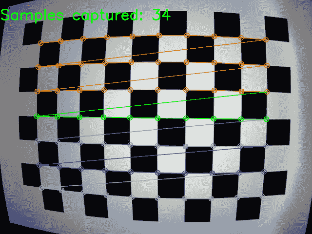
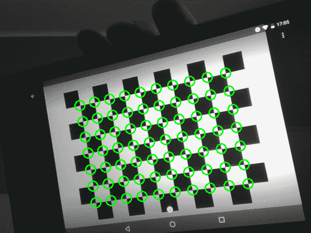
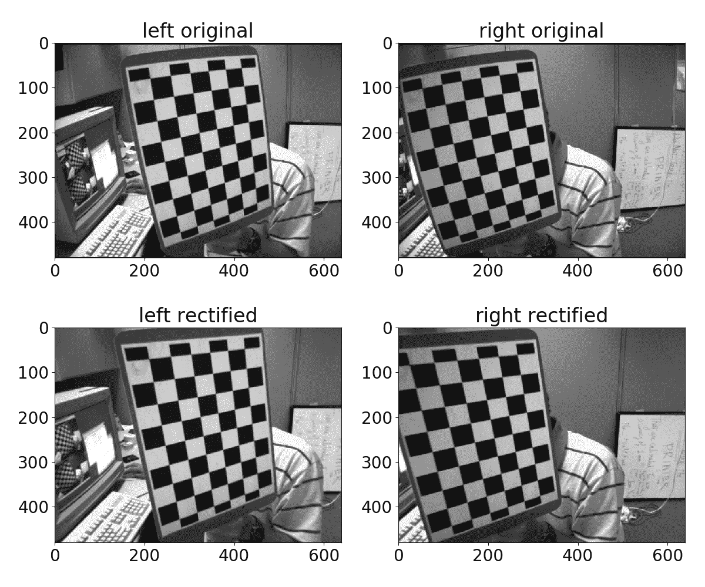
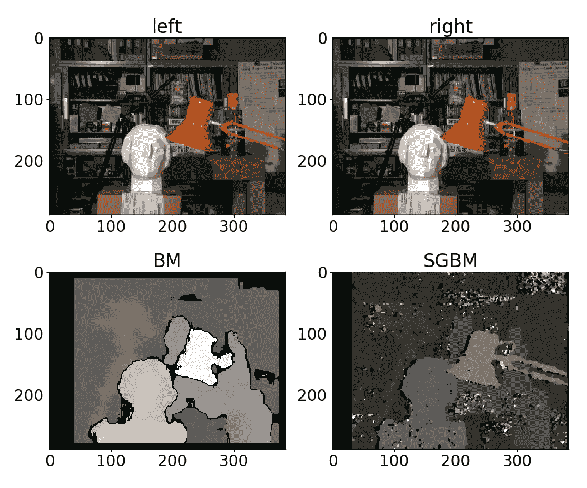

# 多视图几何

本章涵盖以下食谱：

*   针孔相机型号校准
*   鱼眼镜头型号校准
*   立体相机校准-外在性估计
*   失真点和不失真点
*   消除图像中的镜头失真效果
*   通过三角测量从两个观测值还原 3D 点
*   通过 PnP 算法找到相对的相机对象姿态
*   通过立体校正对齐两个视图
*   对极几何-计算基本和基本矩阵
*   基本矩阵分解为旋转和平移
*   估计立体图像的视差图
*   特例 2 视图几何-估计单应变换
*   平面场景-将单应性分解为旋转和平移
*   旋转相机 CAS-从单应性估计相机旋转

# 介绍

将 3D 场景投影到 2D 图像上（换句话说，使用照相机）可以消除有关场景对象离摄影师的距离的信息。 但是在某些情况下，可以还原 3D 信息。 这不仅需要了解有关对象或摄像机配置的信息，还需要具有摄像机的固有参数。 本章介绍了从相机校准到 3D 对象位置重建和深度图检索的所有 2D 图像获取 3D 信息的必要步骤。

# 针孔相机模型校准

针孔相机模型以及其他模型都是最简单的数学模型，但它可以应用于许多实际的摄影设备。 此配方告诉您如何校准相机，例如，找到其固有参数和失真系数。

# 准备

在继续此食谱之前，您需要安装 OpenCV（3.3 版或更高版本）Python API 包。

# 怎么做

您需要完成以下步骤：

1.  导入必要的模块：

```py
import cv2
import numpy as np
```

2.  从相机捕获帧，检测每个帧上的棋盘图案，并累积帧和角，直到我们有足够多的样本：

```py
cap = cv2.VideoCapture(0)

pattern_size = (10, 7)

samples = []

while True:
    ret, frame = cap.read()
    if not ret:
        break

    res, corners = cv2.findChessboardCorners(frame, pattern_size)

    img_show = np.copy(frame)
    cv2.drawChessboardCorners(img_show, pattern_size, corners, res)
    cv2.putText(img_show, 'Samples captured: %d' % len(samples), (0, 
    40), 
                cv2.FONT_HERSHEY_SIMPLEX, 1.0, (0, 255, 0), 2)
    cv2.imshow('chessboard', img_show)

    wait_time = 0 if res else 30
    k = cv2.waitKey(wait_time)

    if k == ord('s') and res:
        samples.append((cv2.cvtColor(frame, cv2.COLOR_BGR2GRAY), 
        corners))
    elif k == 27:
        break

cap.release()
cv2.destroyAllWindows()
```

3.  使用`cv2.cornerSubPix`细化所有检测到的角点：

```py
criteria = (cv2.TERM_CRITERIA_EPS + cv2.TERM_CRITERIA_MAX_ITER, 30, 1e-3)

for i in range(len(samples)):
    img, corners = samples[i]
    corners = cv2.cornerSubPix(img, corners, (10, 10), (-1,-1), criteria)
```

4.  通过将所有精确的角点传递到`cv2.calibrateCamera`来找到相机的固有参数：

```py
pattern_points = np.zeros((np.prod(pattern_size), 3), np.float32)
pattern_points[:, :2] = np.indices(pattern_size).T.reshape(-1, 2)

images, corners = zip(*samples)

pattern_points = [pattern_points]*len(corners)

rms, camera_matrix, dist_coefs, rvecs, tvecs = \
    cv2.calibrateCamera(pattern_points, corners, images[0].shape, 
    None, None)

np.save('camera_mat.npy', camera_matrix)
np.save('dist_coefs.npy', dist_coefs)
```

# 这个怎么运作

相机校准旨在找到两组固有参数：相机矩阵和失真系数。 相机矩阵确定 3D 点的坐标如何映射到图像中的无量纲像素坐标，但是实际的图像镜头也会使图像变形，因此直线会转变为曲线。 失真系数使您可以消除这种扭曲。

整个相机校准过程可以分为三个阶段：

*   收集大量数据，例如图像和检测到的棋盘图案
*   提炼棋盘边角坐标
*   优化相机参数以使其与观察到的变形和投影相匹配

为了收集用于相机校准的数据，您需要检测特定大小的棋盘图案，并累积成对的图像和找到的角点的坐标。 从第 4 章，“对象检测和机器学习”的“检测棋盘和圆网格图案”，`cv2.findChessboardCorners`中可以知道，实现了棋盘角检测。 有关更多信息，请参见第 4 章“对象检测和机器学习”。 值得一提的是，棋盘上的角是由两个黑色正方形形成的角，在`cv2.findChessboardCorners`中传递的图案大小应与真实棋盘图案中的图案大小相同。 样品的数量及其沿视场的分布也非常重要。 在实际情况下，50 到 100 个样本就足够了。*

下一步是细化角的坐标。 由于`cv2.findChessboardCorners`不能给出非常准确的结果，因此需要此阶段，因此我们需要找到实际的角位置。 `cv2.cornerSubPix`以子像素精度为角坐标提供精度。 它接受以下参数：

*   灰度图像
*   检测到的角的粗坐标
*   细化区域的大小以找到更准确的角点位置
*   细化区域中心的区域大小，可以忽略
*   停止提炼过程的标准

角的粗坐标是`cv2.findChessboardCorners`返回的坐标。 细化区域应较小，但应包括角点的实际位置； 否则，返回粗角。 要忽略的区域的大小应小于细化区域，并且可以通过传递`(-1, -1)`作为其值来禁用。 停止条件可以是以下类型之一`cv2.TERM_CRITERIA_EPS`或`cv2.TERM_CRITERIA_MAX_ITER`或两者的组合。 `cv2.TERM_CRITERIA_EPS`确定前一个和下一个角点位置的差异。 如果实际差异小于定义的差异，则将停止该过程。 `cv2.TERM_CRITERIA_MAX_ITER`确定最大迭代次数。 `cv2.cornerSubPix`返回相同数量的带有精确坐标的角。

一旦我们确定了角点的位置，就可以找到相机的参数了。 `cv2.calibrateCamera`解决了这个问题。 您需要向此函数传递一些参数，这些参数列出如下：

*   所有样本的对象点坐标
*   所有样品的角点坐标
*   （宽度，高度）格式的图像形状
*   两个数组保存平移和旋转向量（可以设置为 None）
*   标志和停止条件（均具有默认值）

对象点是棋盘坐标系中棋盘角的 3D 坐标。 因为我们对每个帧使用相同的模式，所以角的 3D 坐标是相同的，并且因为我们使用等距分布的角，所以 3D 坐标也等距分布在平面上（所有点的`z = 0`）。 角点之间的实际距离无关紧要，因为摄影机会消除 z 坐标（物体距摄影机的距离），因此它可以是较小但更近的图案，也可以是较大但更远的图案-图像相同。 `cv2.calibrateCamera`返回五个值：所有样本的平均重投影误差，相机矩阵，失真系数，旋转和所有样本的平移向量。 重投影误差是图像中某个角与该角的 3D 点的投影之间的差。 理想情况下，角点的投影及其在图像中的原始位置应相同，但由于噪声而存在差异。 该差异以像素为单位。 该差异越小，校准效果越好。 相机矩阵的形状为`3x3`。 失真系数的数量取决于标记，默认情况下等于 5。

执行此代码后，您将看到以下图片：


# 鱼眼镜头模型校准

如果您的相机具有宽广的视角，并因此导致强烈的变形，则需要使用鱼眼镜头型号。 OpenCV 提供了与鱼眼镜头模型一起使用的功能。 让我们回顾一下如何在 OpenCV 中校准此类摄像机。

# 准备

在继续此食谱之前，您需要安装 OpenCV 版本 3.3（或更高版本）Python API 包。

# 怎么做

您需要完成以下步骤：

1.  导入必要的模块：

```py
import cv2
import numpy as np
```

2.  从相机捕获帧，检测每个帧上的棋盘图案，并累积帧和角，直到我们有足够多的样本：

```py
cap = cv2.VideoCapture(0)

pattern_size = (10, 7)

samples = []

while True:
    ret, frame = cap.read()
    if not ret:
        break

    res, corners = cv2.findChessboardCorners(frame, pattern_size)

    img_show = np.copy(frame)
    cv2.drawChessboardCorners(img_show, pattern_size, corners, res)
    cv2.putText(img_show, 'Samples captured: %d' % len(samples), (0, 40), 
                cv2.FONT_HERSHEY_SIMPLEX, 1.0, (0, 255, 0), 2)
    cv2.imshow('chessboard', img_show)

    wait_time = 0 if res else 30
    k = cv2.waitKey(wait_time)

    if k == ord('s') and res:
        samples.append((cv2.cvtColor(frame, cv2.COLOR_BGR2GRAY), corners))
    elif k == 27:
        break

cap.release()
cv2.destroyAllWindows()
```

3.  使用`cv2.cornerSubPix`细化所有检测到的角点：

```py
criteria = (cv2.TERM_CRITERIA_EPS + cv2.TERM_CRITERIA_MAX_ITER, 30, 1e-3)

for i in range(len(samples)):
    img, corners = samples[i]
    corners = cv2.cornerSubPix(img, corners, (10, 10), (-1,-1), criteria)
```

4.  导入必要的模块，打开输入图像，然后复制它：

```py
pattern_points = np.zeros((1, np.prod(pattern_size), 3), np.float32)
pattern_points[0, :, :2] = np.indices(pattern_size).T.reshape(-1, 2)

images, corners = zip(*samples)

pattern_points = [pattern_points]*len(corners)

print(len(pattern_points), pattern_points[0].shape, pattern_points[0].dtype)
print(len(corners), corners[0].shape, corners[0].dtype)

rms, camera_matrix, dis t_coefs, rvecs, tvecs = \
    cv2.fisheye.calibrate(pattern_points, corners, images[0].shape, None, None)

np.save('camera_mat.npy', camera_matrix)
np.save('dist_coefs.npy', dist_coefs)
```

# 这个怎么运作

鱼眼相机和针孔相机的相机校准程序基本相同，因此强烈建议使用“针孔相机模型校准”配方，因为针孔相机盒的所有主要步骤和建议都适用于鱼眼镜头

让我们回顾一下主要区别。 要校准鱼眼模型相机，您需要使用`cv2.fisheye.calibrate`功能。 它接受与`cv2.calibrateCamera`相同的参数，但是此函数仅支持其自己的标志值。 幸运的是，此参数具有默认值。

执行此代码的结果是，您将看到类似于以下图像：



# 立体相机校准 - 外在性估计

在本食谱中，您将学习如何校准立体对，即使用校准图案的照片估算两个摄像机之间的相对旋转和平移。 在处理立体相机时，将使用此功能-您需要知道装备参数才能重建有关场景的 3D 信息。

# 准备

在继续此食谱之前，您需要安装 OpenCV 版本 3.3（或更高版本）Python API 包。

# 怎么做

您需要完成以下步骤：

1.  导入必要的模块：

```py
import cv2
import glob
import numpy as np
```

2.  设置图案大小并准备带有图像的列表：

```py
PATTERN_SIZE = (9, 6)
left_imgs = list(sorted(glob.glob('../data/stereo/case1/left*.png')))
right_imgs = list(sorted(glob.glob('../data/stereo/case1/right*.png')))
assert len(left_imgs) == len(right_imgs)
```

3.  找到棋盘点：

```py
criteria = (cv2.TERM_CRITERIA_EPS + cv2.TERM_CRITERIA_MAX_ITER, 30, 1e-3)
left_pts, right_pts = [], []
img_size = None

for left_img_path, right_img_path in zip(left_imgs, right_imgs):
    left_img = cv2.imread(left_img_path, cv2.IMREAD_GRAYSCALE)
    right_img = cv2.imread(right_img_path, cv2.IMREAD_GRAYSCALE)
    if img_size is None:
        img_size = (left_img.shape[1], left_img.shape[0])

    res_left, corners_left = cv2.findChessboardCorners(left_img, PATTERN_SIZE)
    res_right, corners_right = cv2.findChessboardCorners(right_img, PATTERN_SIZE)

    corners_left = cv2.cornerSubPix(left_img, corners_left, (10, 10), (-1,-1),
                                    criteria)
    corners_right = cv2.cornerSubPix(right_img, corners_right, (10, 10), (-1,-1), 
                                     criteria)

    left_pts.append(corners_left)
    right_pts.append(corners_right)
```

4.  准备校准图案点：

```py
pattern_points = np.zeros((np.prod(PATTERN_SIZE), 3), np.float32)
pattern_points[:, :2] = np.indices(PATTERN_SIZE).T.reshape(-1, 2)
pattern_points = [pattern_points] * len(left_imgs)
```

5.  估计立体对参数：

```py
err, Kl, Dl, Kr, Dr, R, T, E, F = cv2.stereoCalibrate(
    pattern_points, left_pts, right_pts, None, None, None, None, img_size, flags=0)
```

6.  报告校准结果：

```py
print('Left camera:')
print(Kl)
print('Left camera distortion:')
print(Dl)
print('Right camera:')
print(Kr)
print('Right camera distortion:')
print(Dr)
print('Rotation matrix:')
print(R)
print('Translation:')
print(T)
```

# 这个怎么运作

要使用 OpenCV 校准立体对，必须同时从两台摄像机捕获校准模式的几张照片。 在我们的案例中，我们使用了`9x6`的棋盘。 我们使用`cv2.findChessboardCorners`功能找到板的角，将用于相机参数估计。 我们还需要在其本地坐标系中的校准图案点。 由于我们知道模式的大小及其形状，因此可以显式构造点列表`pattern_points`。 请注意，此处使用的单位将用于两个摄像机之间的转换向量。

校准本身在`cv2.stereoCalibrate`功能中执行。 作为输入，它需要一个图像点列表和一个图案点列表。 您还可以为校准参数指定初始猜测，并指定要优化的参数以及要保持不变的参数。 该函数以像素，第一相机参数，第一相机失真系数，第二相机参数，第二相机失真系数，相机之间的旋转和平移以及基本矩阵和基本矩阵的形式返回校准误差。

以下是预期的输出：

```py
Left camera:
[[ 534.36681752    0\.          341.45684657]
 [   0\.          534.29616718  235.72519106]
 [   0\.            0\.            1\.        ]]
Left camera distortion:
[[ -2.79470900e-01   4.71876981e-02   1.39511507e-03  -1.64158448e-04
    7.01729203e-02]]
Right camera:
[[ 537.88729748    0\.          327.29925115]
 [   0\.          537.43063947  250.10021993]
 [   0\.            0\.            1\.        ]]
Right camera distortion:
[[-0.28990693  0.12537789 -0.00040656  0.00053461 -0.03844589]]
Rotation matrix:
[[ 0.99998995  0.00355598  0.00273003]
 [-0.00354058  0.99997791 -0.00562461]
 [-0.00274997  0.00561489  0.99998046]]
Translation:
[[-3.33161159]
 [ 0.03706722]
 [-0.00420814]]
```

# 失真点和非失真点

相机镜头会产生图像失真。 校准过程旨在查找这些变形的参数，以及将 3D 点投影到图像平面上的参数。 此配方告诉您如何应用相机矩阵和失真系数以获取未失真的图像点并将其失真。

# 准备

在继续此食谱之前，您需要安装 OpenCV 版本 3.3（或更高版本）Python API 包。

# 怎么做

您需要完成以下步骤：

1.  导入必要的模块：

```py
import cv2
import numpy as np
```

2.  加载相机的相机矩阵和失真系数：

```py
camera_matrix = np.load('../data/pinhole_calib/camera_mat.npy')
dist_coefs = np.load('../data/pinhole_calib/dist_coefs.npy')
```

3.  打开相机拍摄的国际象棋棋盘的照片，然后找到并优化角点：

```py
img = cv2.imread('../data/pinhole_calib/img_00.png')
pattern_size = (10, 7)
res, corners = cv2.findChessboardCorners(img, pattern_size)
criteria = (cv2.TERM_CRITERIA_EPS + cv2.TERM_CRITERIA_MAX_ITER, 30, 1e-3)
corners = cv2.cornerSubPix(cv2.cvtColor(img, cv2.COLOR_BGR2GRAY), 
                           corners, (10, 10), (-1,-1), criteria)
```

4.  取消扭曲角的坐标并将其转换为 3D 点：

```py
h_corners = cv2.undistortPoints(corners, camera_matrix, dist_coefs)
h_corners = np.c_[h_corners.squeeze(), np.ones(len(h_corners))]
```

5.  将角点的 3D 坐标投影到图像上而不应用失真：

```py
img_pts, _ = cv2.projectPoints(h_corners, (0, 0, 0), (0, 0, 0), camera_matrix, None)

for c in corners:
    cv2.circle(img, tuple(c[0]), 10, (0, 255, 0), 2)

for c in img_pts.squeeze().astype(np.float32):
    cv2.circle(img, tuple(c), 5, (0, 0, 255), 2)

cv2.imshow('undistorted corners', img)
cv2.waitKey()
cv2.destroyAllWindows()
```

6.  将角点的 3D 坐标投影到图像上并应用镜头变形：

```py
img_pts, _ = cv2.projectPoints(h_corners, (0, 0, 0), (0, 0, 0), camera_matrix, dist_coefs)

for c in img_pts.squeeze().astype(np.float32):
    cv2.circle(img, tuple(c), 2, (255, 255, 0), 2)

cv2.imshow('reprojected corners', img)
cv2.waitKey()
cv2.destroyAllWindows()
```

# 这个怎么运作

`cv2.undistortPoints`查找图像中各点的同类坐标。 此功能消除了镜头变形并投影了点，使其处于无量纲坐标。 该函数接受以下参数：图像中的 2D 点数组，`3x3`相机矩阵，一组失真系数，用于存储结果的对象以及在立体视觉中使用的校正和投影矩阵，并且现在无所谓。 最后三个参数是可选的。 `cv2.undistortPoints`返回未失真和未投影点的集合。

`cv2.undistortPoints`返回的点是*理想的*-它们的坐标是无量纲的，并且不会因镜头而失真。 如果需要将它们投影回去，则需要将它们转换为 3D 点。 为此，我们只需要向每个点添加第三个`Z`坐标即可。 由于这些点的坐标是同质的，因此`Z`等于 1。

当我们拥有 3D 点并将其投影到图像上时，`cv2.projectPoints`开始起作用。 在一般情况下，此函数在某个坐标系中获取点的 3D 坐标，对其进行旋转和平移以获取相机坐标系中的坐标，然后应用相机矩阵和变形系数以找到这些点在图像平面上的投影 。

`cv2.>projectPoints`的参数包括：某些局部坐标系中的 3D 点数组，从局部坐标系到相机坐标系的转换的旋转和平移向量，`3x3`相机矩阵，失真系数数组，用于存储结果点的对象，用于存储 Jacobian 值的对象以及宽高比的值。 同样，最后三个参数是可选的，可以省略。 此函数返回 3D 点和 Jacobian 值的投影坐标和变形坐标。 如果要获取没有透镜变形的点的位置，则可以将`None`传递为变形系数数组的值。

执行此代码的结果是，您将看到类似于以下图像：


图中的绿色圆圈是棋盘角的原始位置。 红色的是角的投影坐标，但没有镜头失真。 浅蓝色点是变形后的投影坐标-它们正好在绿色圆圈的中心。 另外，您可能会注意到，绿色和浅蓝色的圆圈不是在直线上，而是红色的圆圈。 这是镜头变形的影响。 您也许还可以注意到，对于远离图像中心的角，红色和浅蓝色圆圈坐标之间的差异非常明显，尽管靠近图像中心的圆圈几乎相同。 这是由于镜头变形的程度而发生的，这取决于该点距镜头中心的距离。

# 消除图像中的镜头失真效果

如果需要从整个图像中消除镜头畸变的影响，则需要使用密集的重映射。 本质上，不失真算法以补偿镜头效果的方式扭曲和压缩图像，但是压缩会导致出现空白区域。 此配方告诉您如何使图像不失真并从未失真的图像中删除空白区域。

# 准备

在继续此食谱之前，您需要安装 OpenCV 版本 3.3（或更高版本）Python API 包。

# 怎么做

您需要完成以下步骤：

1.  导入必要的模块：

```py
import cv2
import numpy as np
```

2.  加载同一相机拍摄的相机矩阵和畸变系数以及照片：

```py
camera_matrix = np.load('../data/pinhole_calib/camera_mat.npy')
dist_coefs = np.load('../data/pinhole_calib/dist_coefs.npy')
img = cv2.imread('../data/pinhole_calib/img_00.png')
```

3.  使用`cv2.undistort`取消扭曲图像-图像中将出现空白区域：

```py
ud_img = cv2.undistort(img, camera_matrix, dist_coefs)

cv2.imshow('undistorted image', ud_img)
cv2.waitKey(0)

cv2.destroyAllWindows()
```

4.  通过计算最佳相机矩阵并将其应用以获得没有黑色区域的未经失真的图像来消除空白区域：

```py
opt_cam_mat, valid_roi = cv2.getOptimalNewCameraMatrix(camera_matrix, dist_coefs, img.shape[:2][::-1], 0)

ud_img = cv2.undistort(img, camera_matrix, dist_coefs, None, opt_cam_mat)

cv2.imshow('undistorted image', ud_img)
cv2.waitKey(0)

cv2.destroyAllWindows()
```

# 这个怎么运作

`cv2.undistort`消除图像中的镜头失真。 它采用以下参数：要失真的图像，相机矩阵，失真系数数组，存储未失真图像的对象以及最佳相机矩阵。 最后两个参数是可选的。 该函数返回未失真的图像。 如果错过了`cv2.undistort`的最后一个参数，则生成的图像将包含空白区域（黑色）。 最佳摄影机矩阵参数可让您获得没有这些伪影的图像，但是我们需要一种计算此最佳摄影机矩阵的方法，OpenCV 会为其提供服务。

`cv2.getOptimalNewCameraMatrix`创建最佳相机矩阵，以消除未失真图像上的黑色区域。 它需要相机矩阵，失真系数，（宽度，高度）格式的原始图像大小，alpha 因子，所得图像大小（同样的（宽度，高度）格式），以及设置摄像机的主要相机点在输出图像的中心的布尔标志。 最后两个参数是可选的。 alpha 因子是`[0. 1]`范围内的两倍，它表示删除空白区域的程度：0 表示完全删除，因此损失了一部分图像像素，而 1 表示保留了所有图像像素。 以及空白区域。 如果未设置输出图像尺寸，则将其设置为与输入图像的尺寸相同。

从配方启动代码后，您将看到类似于以下内容的图像：


如您所见，上面的图像在边框附近有黑色区域，下面的图像则没有。

# 通过三角测量从两个观测值来还原 3D 点

在本食谱中，您将学习如何在两个视图中给定观察值来重建 3D 点坐标。 这是许多更高级别的 3D 重建算法和 SLAM 系统的基础。

# 准备

在继续此食谱之前，您需要安装 OpenCV 版本 3.3（或更高版本）Python API 包。

# 怎么做

您需要完成以下步骤：

1.  导入必要的模块。

```py
import cv2
import numpy as np
```

2.  生成测试相机的投影矩阵：

```py
P1 = np.eye(3, 4, dtype=np.float32)
P2 = np.eye(3, 4, dtype=np.float32)
P2[0, 3] = -1
```

3.  生成测试点：

```py
N = 5
points3d = np.empty((4, N), np.float32)
points3d[:3, :] = np.random.randn(3, N)
points3d[3, :] = 1
```

4.  将 3D 点投影到两个视图中并添加噪点：

```py
points1 = P1 @ points3d
points1 = points1[:2, :] / points1[2, :]
points1[:2, :] += np.random.randn(2, N) * 1e-2

points2 = P2 @ points3d
points2 = points2[:2, :] / points2[2, :]
points2[:2, :] += np.random.randn(2, N) * 1e-2
```

5.  从嘈杂的观察中重建点：

```py
points3d_reconstr = cv2.triangulatePoints(P1, P2, points1, points2)
points3d_reconstr /= points3d_reconstr[3, :]
```

6.  打印结果：

```py
print('Original points')
print(points3d[:3].T)
print('Reconstructed points')
print(points3d_reconstr[:3].T)
```

# 这个怎么运作

我们在 3D 空间中生成随机点，并将其投影到两个测试视图中。 然后，我们向这些观测值添加噪声，并使用 OpenCV 函数`cv2.triangulatePoints`重建 3D 点。 作为输入，该功能从两个摄像机和每个视图的摄像机投影矩阵（从世界坐标系到视图坐标系的投影映射）获取观测值。 它返回世界坐标系中的重建点。

以下是可能的结果：

```py
Original points
[[ 0.48245686 -2.05779004  1.3458606 ]
 [-0.18333936 -1.00662899 -0.46047512]
 [-0.51193094 -0.54561883  0.20674749]
 [ 1.05258393 -1.55241323  0.60368073]
 [ 1.80103588 -0.83367926 -0.59293056]]
Reconstructed points
[[ 0.47777811 -2.05873108  1.3407315 ]
 [-0.17389734 -0.99433696 -0.45361272]
 [-0.51100874 -0.54552656  0.20692034]
 [ 1.05780101 -1.54776227  0.60341281]
 [ 1.81407869 -0.83914387 -0.59897166]]
```

# 通过 PnP 算法找到相对的相机对象姿态

相机会删除与要拍摄的物体有多远的信息。 它可能是一个很小但很近的物体，也可能是一个很大而又很远的物体（图像可能是相同的），但是通过知道物体的几何尺寸，我们可以计算出物体到相机的距离。 通常，我们对对象几何形状的了解是对象局部坐标系中某些 3D 点集的位置。 通常，我们不仅要知道相机和物体的局部坐标系之间的距离，而且要知道物体的方位。 使用 OpenCV 可以成功完成此任务。 如果我们知道对象的 3D 点及其在图像上的相应 2D 投影的配置，那么本食谱将向您展示如何找到对象的 6 自由度（自由度）位置。

# 准备

在继续此食谱之前，您需要安装 OpenCV 版本 3.3（或更高版本）Python API 包。

# 怎么做

您需要完成以下步骤：

1.  导入必要的模块：

```py
import cv2
import numpy as np
```

2.  加载相机矩阵，失真系数和相机拍摄的对象的照片：

```py
camera_matrix = np.load('../data/pinhole_calib/camera_mat.npy')
dist_coefs = np.load('../data/pinhole_calib/dist_coefs.npy')
img = cv2.imread('../data/pinhole_calib/img_00.png')
```

3.  检测图像中的对象点，在本例中为棋盘角：

```py
pattern_size = (10, 7)
res, corners = cv2.findChessboardCorners(img, pattern_size)
criteria = (cv2.TERM_CRITERIA_EPS + cv2.TERM_CRITERIA_MAX_ITER, 30, 1e-3)
corners = cv2.cornerSubPix(cv2.cvtColor(img, cv2.COLOR_BGR2GRAY), 
                           corners, (10, 10), (-1,-1), criteria)
```

4.  创建 3D 对象点的配置：

```py
pattern_points = np.zeros((np.prod(pattern_size), 3), np.float32)
pattern_points[:, :2] = np.indices(pattern_size).T.reshape(-1, 2)
```

5.  使用`cv2.solvePnP`查找对象的位置和方向：

```py
ret, rvec, tvec = cv2.solvePnP(pattern_points, corners, camera_matrix, dist_coefs, 
                               None, None, False, cv2.SOLVEPNP_ITERATIVE)
```

6.  通过应用找到的旋转和平移，将对象的点投影回图像。 绘制投影点：

```py
img_points, _ = cv2.projectPoints(pattern_points, rvec, tvec, camera_matrix, dist_coefs)

for c in img_points.squeeze():
    cv2.circle(img, tuple(c), 10, (0, 255, 0), 2)

cv2.imshow('points', img)
cv2.waitKey()

cv2.destroyAllWindows()
```

# 这个怎么运作

`cv2.solvePnP`能够通过对象在本地坐标系中的 3D 点及其在图像上的 2D 投影找到对象的平移和旋转。 它接受一组 3D 点，一组 2D 点，一个`3x3`相机矩阵，畸变系数，初始旋转和平移向量（可选），是否使用初始位置和方向的标记以及问题求解器的类型 。 前两个参数应包含相同数量的点。 求解器的类型可以是许多类型之一：`cv2.SOLVEPNP_ITERATIVE`，`cv2.SOLVEPNP_EPNP`和`cv2.SOLVEPNP_DLS`等。

默认情况下，使用`cv2.SOLVEPNP_ITERATIVE`，在很多情况下它都能获得不错的结果。 `cv2.solvePnP`返回三个值：成功标志，旋转向量和平移向量。 成功标志表示问题已正确解决。 平移向量的单位与对象的 3D 局部点相同。 旋转向量以 Rodrigues 形式返回：向量的方向表示对象绕其旋转的轴，向量的范数表示旋转角度。

从配方启动代码后，它将显示类似于以下内容的图像：



# 通过立体校正对齐两个视图

在本食谱中，您将学习如何校正具有已知参数的使用立体摄像机拍摄的两个图像，使得对于`(x[l], y[l])`，右图中相应的对极线是`y[r] = y[l]`，反之亦然。 这极大地简化了特征匹配和密集的立体估计算法。

# 准备

在继续此食谱之前，您需要安装 OpenCV 版本 3.3（或更高版本）Python API 包。

# 怎么做

您需要完成以下步骤：

1.  导入必要的模块：

```py
import cv2
import numpy as np
import matplotlib.pyplot as plt
```

2.  加载立体相机校准参数：

```py
data = np.load('../data/stereo/case1/stereo.npy').item()
Kl, Dl, Kr, Dr, R, T, img_size = data['Kl'], data['Dl'], data['Kr'], data['Dr'], \
                                 data['R'], data['T'], data['img_size']
```

3.  加载左右测试图像：

```py
left_img = cv2.imread('../data/stereo/case1/left14.png')
right_img = cv2.imread('../data/stereo/case1/right14.png')
```

4.  估计立体整流参数：

```py
R1, R2, P1, P2, Q, validRoi1, validRoi2 = cv2.stereoRectify(Kl, Dl, Kr, Dr, 
                                                            img_size, R, T)
```

5.  准备立体整流变换图：

```py
xmap1, ymap1 = cv2.initUndistortRectifyMap(Kl, Dl, R1, Kl, img_size, cv2.CV_32FC1)
xmap2, ymap2 = cv2.initUndistortRectifyMap(Kr, Dr, R2, Kr, img_size, cv2.CV_32FC1)
```

6.  纠正图像：

```py
left_img_rectified = cv2.remap(left_img, xmap1, ymap1, cv2.INTER_LINEAR)
right_img_rectified = cv2.remap(right_img, xmap2, ymap2, cv2.INTER_LINEAR)
```

7.  可视化结果：

```py
plt.figure(0, figsize=(12,10))
plt.subplot(221)
plt.title('left original')
plt.imshow(left_img, cmap='gray')
plt.subplot(222)
plt.title('right original')
plt.imshow(right_img, cmap='gray')
plt.subplot(223)
plt.title('left rectified')
plt.imshow(left_img_rectified, cmap='gray')
plt.subplot(224)
plt.title('right rectified')
plt.imshow(right_img_rectified, cmap='gray')
plt.tight_layout()
plt.show()
```

# 这个怎么运作

我们加载先前从文件中估算的立体装备参数。 校正过程本身估计这种相机变换，以使两个单独的图像平面之后变为同一平面。 这极大地简化了极线几何约束，并使所有其他与立体相关的算法的工作变得更加容易。

使用`cv2.stereoRectify`函数估计校正变换参数-它获取立体装备参数并返回校正参数：第一摄像机旋转，第二摄像机旋转，第一摄像机投影矩阵，第二摄像机投影矩阵，视差-深度映射矩阵，所有像素均有效的第一相机 ROI 和所有像素均有效的第二相机 ROI。

我们只使用前两个参数。 第一和第二摄像机旋转用于使用`cv2.initUndistortRectifyMap`函数构建每像素图的校正变换。 一次计算地图后，即可将其用于使用立体装备捕获的任何图像。

预期结果如下所示：



# 对极几何-计算基本和基本矩阵

在本食谱中，您将学习如何计算基本矩阵和基本矩阵，即其中包含对极几何约束的矩阵。 这些矩阵可用于重建立体装备的外部参数以及其他两视图视觉算法。

# 准备

在继续此食谱之前，您需要安装 OpenCV 版本 3.3（或更高版本）Python API 包。

# 怎么做

您需要完成以下步骤：

1.  导入必要的模块：

```py
import cv2
import numpy as np
```

2.  加载左/右图像点对应关系和各个相机校准参数：

```py
data = np.load('../data/stereo/case1/stereo.npy').item()
Kl, Kr, Dl, Dr, left_pts, right_pts, E_from_stereo, F_from_stereo = \
    data['Kl'], data['Kr'], data['Dl'], data['Dr'], \
    data['left_pts'], data['right_pts'], data['E'], data['F']
```

3.  将左右点列表堆叠到数组中：

```py
left_pts = np.vstack(left_pts)
right_pts = np.vstack(right_pts)
```

4.  消除镜头变形：

```py
left_pts = cv2.undistortPoints(left_pts, Kl, Dl, P=Kl)
right_pts = cv2.undistortPoints(right_pts, Kr, Dr, P=Kr)
```

5.  估计基本矩阵：

```py
F, mask = cv2.findFundamentalMat(left_pts, right_pts, cv2.FM_LMEDS)
```

6.  估计基本矩阵：

```py
E = Kr.T @ F @ Kl
```

7.  打印结果：

```py
print('Fundamental matrix:')
print(F)
print('Essential matrix:')
print(E)
```

# 这个怎么运作

我们使用`cv2.findFundamentalMat`函数从左右图像点对应关系估计基本矩阵。 此函数支持几种不同的基本矩阵参数估计算法，例如`cv2.FM_7POINT`（7 点算法），`cv2.FM_8POINT`（8 点算法），`cv2.FM_LMEDS`（最低中值方法）和`cv2.FM_RANSAC`（ 基于 RANSAC 的方法）。 两个可选参数指定基于 RANSAC 的估计算法的错误阈值，以及用于中位数最小和基于 RANSAC 的方法的置信度。

以下是预期结果：

```py
Fundamental matrix:
[[  1.60938825e-08  -2.23906409e-06  -2.53850603e-04]
 [  2.97226703e-06  -2.38236386e-07  -7.70276666e-02]
 [ -2.55190056e-04   7.69760820e-02   1.00000000e+00]]
Essential matrix:
[[  4.62585055e-03  -6.43487140e-01  -4.17486092e-01]
 [  8.53590806e-01  -6.84088948e-02  -4.08817705e+01]
 [  2.63679084e-01   4.07046349e+01  -2.20825664e-01]]
```

# 将基本矩阵分解为旋转和平移

在本食谱中，您将学习如何将基本矩阵分解为两个假设，这些假设关于立体装备中两个摄像机之间的相对旋转和平移向量。 估计立体装备参数时使用此功能。

# 准备

在继续此食谱之前，您需要安装 OpenCV 版本 3.3（或更高版本）Python API 包。

# 怎么做

您需要完成以下步骤：

1.  导入必要的模块：

```py
import cv2
import numpy as np
```

2.  加载预先计算的基本矩阵：

```py
data = np.load('../data/stereo/case1/stereo.npy').item()
E = data['E']
```

3.  将基本矩阵分解为两个可能的旋转和平移：

```py
R1, R2, T = cv2.decomposeEssentialMat(E)
```

4.  打印结果：

```py
print('Rotation 1:')
print(R1)
print('Rotation 2:')
print(R2)
print('Translation:')
print(T)
```

# 这个怎么运作

我们使用 OpenCV `cv2.decomposeEssentialMat`函数，该函数将基本矩阵作为输入，并返回两个候选摄像机之间的旋转和一个转换向量候选。 请注意，由于翻译向量只能恢复到一定规模，因此以标准化形式（单位长度）返回。

以下是预期结果：

```py
Rotation 1:
[[ 0.99981105 -0.01867927  0.00538031]
 [-0.01870903 -0.99980965  0.00553437]
 [ 0.00527591 -0.00563399 -0.99997021]]
Rotation 2:
[[ 0.99998995  0.00355598  0.00273003]
 [-0.00354058  0.99997791 -0.00562461]
 [-0.00274997  0.00561489  0.99998046]]
Translation:
[[ 0.99993732]
 [-0.01112522]
 [ 0.00126302]]
```

# 估计立体图像的视差图

在本食谱中，您将学习如何从两个校正后的图像中计算视差图。 此功能在许多需要恢复场景深度信息的计算机视觉应用程序中很有用，例如，高级驾驶员辅助应用程序中的避免碰撞。

# 准备

在继续此食谱之前，您需要安装 OpenCV 版本 3.3（或更高版本）Python API 包。

# 怎么做

您需要完成以下步骤：

1.  导入必要的模块：

```py
import cv2
import numpy as np
```

2.  加载左右校正图像：

```py
left_img = cv2.imread('../data/stereo/left.png')
right_img = cv2.imread('../data/stereo/right.png')
```

3.  使用立体块匹配算法计​​算视差图：

```py
stereo_bm = cv2.StereoBM_create(32)
dispmap_bm = stereo_bm.compute(cv2.cvtColor(left_img, cv2.COLOR_BGR2GRAY), 
                               cv2.cvtColor(right_img, cv2.COLOR_BGR2GRAY))
```

4.  使用立体半全局块匹配算法计​​算视差图：

```py
stereo_sgbm = cv2.StereoSGBM_create(0, 32)
dispmap_sgbm = stereo_sgbm.compute(left_img, right_img)
```

5.  可视化结果：

```py
plt.figure(figsize=(12,10))
plt.subplot(221)
plt.title('left')
plt.imshow(left_img[:,:,[2,1,0]])
plt.subplot(222)
plt.title('right')
plt.imshow(right_img[:,:,[2,1,0]])
plt.subplot(223)
plt.title('BM')
plt.imshow(dispmap_bm, cmap='gray')
plt.subplot(224)
plt.title('SGBM')
plt.imshow(dispmap_sgbm, cmap='gray')
plt.show()
```

# 这个怎么运作

我们使用两种不同的算法进行视差图计算-块匹配和半全局块匹配。 在使用`cv2.StereoBM_create`或`cv2.StereoSGBM_create`（在其中指定最大可能视差）实例化地图估计对象之后，我们调用`compute`方法，该方法将获取两张图像并返回视差图。

请注意，有必要将经过校正的图像作为`compute`方法的输入。 返回的视差图将包含每个像素的视差值，例如，对应于场景中同一点的左右图像点之间的像素水平偏移。 然后可以使用该偏移量还原 3D 中的实际点。

创建视差估算器时，您可以指定一些特定于所使用算法的参数。 有关更详细的描述，[您可以参考 OpenCV 的文档](https://docs.opencv.org/master/d9/d0c/group__calib3d.html)。

OpenCV 中还有一个名为`cudastereo`的模块，该模块是通过 CUDA 支持构建的，该模块提供了更优化的立体算法。 您还可以在 OpenCV Contrib 存储库中检出`stereo`模块，该模块还包含一些其他算法。

预期结果如下所示：



# 特例 2 - 视图几何 - 估计单应变换

如果需要将点从一个平面投影到另一个平面，可以通过应用单应性矩阵来实现。 如果知道平面的对应变换，则可以使用此矩阵将点从一个平面投影到另一平面。 OpenCV 具有查找单应性矩阵的功能，此食谱向您展示如何使用和应用它。

# 准备

在继续此食谱之前，您需要安装 OpenCV 版本 3.3（或更高版本）Python API 包。

# 怎么做

您需要完成以下步骤：

1.  导入必要的模块：

```py
import cv2
import numpy as np
```

2.  加载相机矩阵，失真系数和相机拍摄的两帧：

```py
camera_matrix = np.load('../data/pinhole_calib/camera_mat.npy')
dist_coefs = np.load('../data/pinhole_calib/dist_coefs.npy')
img_0 = cv2.imread('../data/pinhole_calib/img_00.png')
img_1 = cv2.imread('../data/pinhole_calib/img_10.png')
```

3.  取消扭曲框架：

```py
img_0 = cv2.undistort(img_0, camera_matrix, dist_coefs)
img_1 = cv2.undistort(img_1, camera_matrix, dist_coefs)
```

4.  在两个图像上找到棋盘角：

```py
pattern_size = (10, 7)
res_0, corners_0 = cv2.findChessboardCorners(img_0, pattern_size)
res_1, corners_1 = cv2.findChessboardCorners(img_1, pattern_size)

criteria = (cv2.TERM_CRITERIA_EPS + cv2.TERM_CRITERIA_MAX_ITER, 30, 1e-3)
corners_0 = cv2.cornerSubPix(cv2.cvtColor(img_0, cv2.COLOR_BGR2GRAY), 
                           corners_0, (10, 10), (-1,-1), criteria)
corners_1 = cv2.cornerSubPix(cv2.cvtColor(img_1, cv2.COLOR_BGR2GRAY), 
                           corners_1, (10, 10), (-1,-1), criteria)
```

5.  在两个图像的点之间找到单应性：

```py
H, mask = cv2.findHomography(corners_0, corners_1)
```

6.  应用找到的单应性矩阵将点从第一张图像投影到第二张图像：

```py
center_0 = np.mean(corners_0.squeeze(), 0)
center_0 = np.r_[center_0, 1]
center_1 = H @ center_0
center_1 = (center_1 / center_1[2]).astype(np.float32)

img_0 = cv2.circle(img_0, tuple(center_0[:2]), 10, (0, 255, 0), 3)
img_1 = cv2.circle(img_1, tuple(center_1[:2]), 10, (0, 0, 255), 3)
```

7.  使用找到的单应性矩阵变换第一张图像并显示结果：

```py
img_0_warped = cv2.warpPerspective(img_0, H, img_0.shape[:2][::-1])

cv2.imshow('homography', np.hstack((img_0, img_1, img_0_warped)))
cv2.waitKey()
cv2.destroyAllWindows()
```

# 这个怎么运作

为了能够将一个点从一个平面投影到另一个平面，首先需要计算单应矩阵。 可以使用`cv2.findHomography`执行。 此函数接受以下参数：

*   来自源（第一）平面的一组点
*   来自目标（第二个）平面的一组点
*   查找单应性的方法
*   过滤异常值的阈值
*   离群值的输出遮罩
*   最大迭代次数
*   置信度

除前两个参数外，所有参数均使用默认值。 方法参数描述应使用哪种算法计算单应性。 默认情况下，所有点都被使用，但是如果您的数据倾向于包含相当数量的离群值（噪声或误选点很大的点），则最好使用以下方法之一：`cv2.RANSAC`，`cv2.LMEDS`， 或`cv2.RHO`。 这些方法可以正确滤除异常值。 过滤离群值的阈值是以像素为单位的距离，该距离确定点的类型：离群值或离群值。 遮罩是一个对象，用于存储每个点的内部/外部类的值。 最大迭代次数和置信度确定了解决方案的正确性。 `cv2.findHomography`返回找到的单应性矩阵和点的掩码值。 还值得一提的是，您需要检查结果矩阵是否不是空对象，因为无法找到所有点集的解决方案。

找到单应性矩阵后，可以将其传递给`cv2.warpPerspective`并将其应用于图像投影。 也可以通过用单应性矩阵乘以点来投影点（请参见代码）。

最后，执行代码后，您将看到类似于以下图像：


# 平面场景 - 将单应性分解为旋转和平移

单应性矩阵可以分解为两个平面对象视图之间的相对平移和旋转向量。 此食谱向您展示如何在 OpenCV 中进行操作。

# 准备

在继续此食谱之前，您需要安装 OpenCV 版本 3.3（或更高版本）Python API 包。

# 怎么做

您需要完成以下步骤：

1.  导入必要的模块：

```py
import cv2
import numpy as np
```

2.  加载相机矩阵，畸变系数和同一平面对象（棋盘图案）的两张照片。 然后，取消扭曲照片：

```py
camera_matrix = np.load('../data/pinhole_calib/camera_mat.npy')
dist_coefs = np.load('../data/pinhole_calib/dist_coefs.npy')
img_0 = cv2.imread('../data/pinhole_calib/img_00.png')
img_0 = cv2.undistort(img_0, camera_matrix, dist_coefs)
img_1 = cv2.imread('../data/pinhole_calib/img_10.png')
img_1 = cv2.undistort(img_1, camera_matrix, dist_coefs)
```

3.  在两个图像中找到图案的角点：

```py
pattern_size = (10, 7)
res_0, corners_0 = cv2.findChessboardCorners(img_0, pattern_size)
res_1, corners_1 = cv2.findChessboardCorners(img_1, pattern_size)

criteria = (cv2.TERM_CRITERIA_EPS + cv2.TERM_CRITERIA_MAX_ITER, 30, 1e-3)
corners_0 = cv2.cornerSubPix(cv2.cvtColor(img_0, cv2.COLOR_BGR2GRAY), 
                           corners_0, (10, 10), (-1,-1), criteria)
corners_1 = cv2.cornerSubPix(cv2.cvtColor(img_1, cv2.COLOR_BGR2GRAY), 
                           corners_1, (10, 10), (-1,-1), criteria)
```

4.  找到从第一帧到第二帧的单应变换矩阵：

```py
H, mask = cv2.findHomography(corners_0, corners_1)
```

5.  找到我们估计的单应矩阵的可能平移和旋转：

```py
ret, rmats, tvecs, normals = cv2.decomposeHomographyMat(H, camera_matrix)
```

# 这个怎么运作

`cv2.decomposeHomographyMat`将单应性矩阵分解为旋转和平移。 由于解决方案不是唯一的，因此该函数最多返回四组可能的平移，旋转和法向向量集。 `cv2.decomposeHomographyMat`接受`3x3`单应矩阵和 3x3 摄影机矩阵作为参数。 返回值为：找到的解的数量，`3x3`旋转矩阵的列表，平移向量的列表和法线向量的列表。 每个返回的列表包含与找到的解决方案数量一样多的元素。

# 旋转相机案例 - 从单应性估计相机旋转

在本食谱中，您将学习如何从仅相对于其光学中心进行旋转运动的摄像机捕获的两个视图之间的单应变换中提取旋转。 例如，如果您需要估计两个视图之间的旋转，这非常有用，并且假设与场景点的距离相比平移可以忽略不计。 在风景照片拼接中通常就是这种情况。

# 准备

在继续此食谱之前，您需要安装 OpenCV 版本 3.3（或更高版本）Python API 包。

# 怎么做

您需要完成以下步骤：

1.  导入必要的模块：

```py
import cv2
import numpy as np
```

2.  加载预先计算的单应性和相机参数：

```py
data = np.load('../data/rotational_homography.npy').item()
H, K = data['H'], data['K']
```

3.  从单应性变换中考虑摄像机参数：

```py
H_ = np.linalg.inv(K) @ H @ K
```

4.  计算近似旋转矩阵：

```py
w, u, vt = cv2.SVDecomp(H_)
R = u @ vt
if cv2.determinant(R) < 0:
    R *= 1
```

5.  将旋转矩阵转换为旋转向量：

```py
rvec = cv2.Rodrigues(R)[0]
```

6.  打印结果：

```py
print('Rotation vector:')
print(rvec)
```

# 这个怎么运作

如果相机仅绕其光学中心旋转，则单应性变换的形式非常简单-它基本上是一个旋转矩阵，但由于单应性在图像像素空间中起作用，因此乘以了相机矩阵参数。 第一步，我们从单应性矩阵中剔除相机参数。 此后，它必须是旋转矩阵（按比例缩放）。 由于单应性参数中可能存在噪声，因此所得矩阵可能不是适当的旋转矩阵，例如行列式等于 1 的正交矩阵。 这就是为什么我们使用奇异值分解构造最接近（在 Frobenius 范数中）旋转矩阵的原因。

下面显示了预期的结果：

```py
Rotation vector:
[[ 0.12439561]
 [ 0.22688715]
 [ 0.32641321]]
```