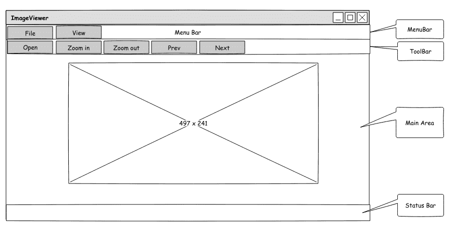
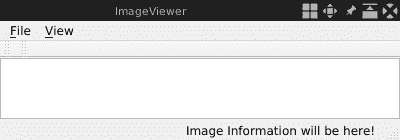
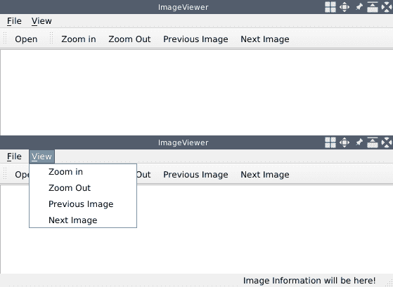
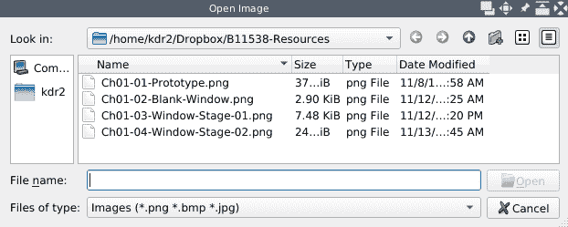
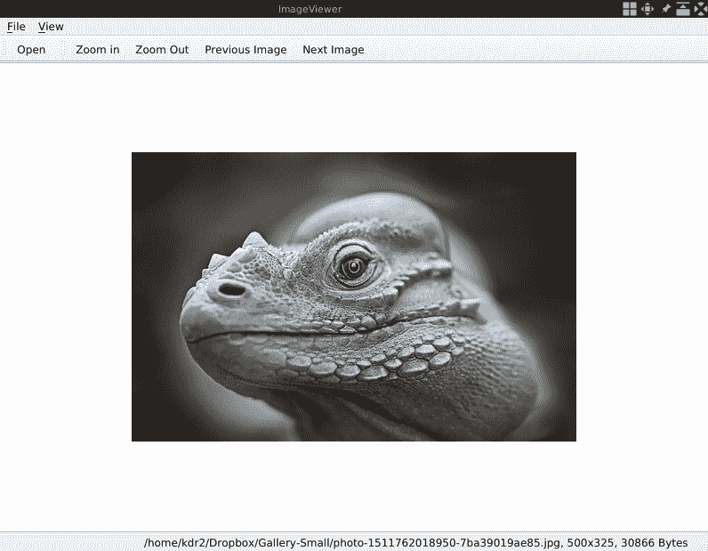

# 构建图像查看器

计算机视觉是使计算机能够对数字图像和视频有较高了解的技术，而不仅仅是将它们视为字节或像素。 它广泛用于场景重建，事件检测，视频跟踪，对象识别，3D 姿态估计，运动估计和图像恢复。

OpenCV（开源计算机视觉）是一个实现几乎所有计算机视觉方法和算法的库。 Qt 是一个跨平台的应用程序框架和窗口小部件工具箱，用于创建具有图形用户界面的应用程序，这些用户界面可以在所有主要的台式机平台，大多数嵌入式平台甚至移动平台上运行。

在许多受益于计算机视觉技术的行业中，这两个功能强大的库被许多开发人员一起使用，以创建具有可靠 GUI 的专业软件。 在本书中，我们将演示如何使用 Qt 5 和 OpenCV 4 构建这些类型的功能应用程序，它们具有友好的图形用户界面以及与计算机视觉技术相关的多种功能。

在第一章中，我们将从构建一个简单的 GUI 应用程序开始，以使用 Qt 5 进行图像查看。

本章将涵盖以下主题：

*   设计用户界面
*   使用 Qt 读取和显示图像
*   放大和缩小图像
*   以任何受支持的格式保存图像副本
*   响应 Qt 应用程序中的热键

# 技术要求

确保至少安装了 Qt 版本 5 并具有 C ++和 Qt 编程的一些基本知识。 还需要兼容的 C ++编译器，即 Linux 上的 GCC 5 或更高版本，macOS 上的 Clang 7.0 或更高版本，以及 Microsoft Windows 的 MSVC 2015 或更高版本。

由于必须具备一些相关的基础知识，因此本书不包括 Qt 安装和编译器环境设置。 有很多书籍，在线文档或教程（例如，*使用 C ++和 Qt5 进行 GUI 编程， *Lee Zhi Eng* 的*以及官方的 Qt 库文档）可以帮助您 逐步讲解这些基本配置过程； 用户可以根据需要自行参考。

具备所有这些先决条件后，让我们开始开发第一个应用程序-简单的图像查看器。

[本章的所有代码都可以在我们的代码库中找到](https://github.com/PacktPublishing/Qt-5-and-OpenCV-4-Computer-Vision-Projects/tree/master/Chapter-01)。

[观看以下视频，查看运行中的代码](http://bit.ly/2KoYWFx)

# 设计用户界面

构建应用程序的第一部分是定义应用程序将要执行的操作。 在本章中，我们将开发一个图像查看器应用程序。 它应具有的功能如下：

*   从硬盘打开图像
*   放大/缩小
*   查看同一文件夹中的上一张或下一张图像
*   将当前图像的副本以其他格式另存为另一个文件（具有不同的路径或文件名）

我们可以遵循许多图像查看器应用程序，例如 Linux 上的 gThumb 和 macOS 上的 Preview 应用程序。 但是，我们的应用程序比进行一些预先计划的应用程序要简单。 这涉及使用铅笔绘制应用程序原型的线框。

Pencil 是功能性的原型制作工具。 有了它，您可以轻松创建模型。 它是开源且独立于平台的软件。 铅笔的最新版本现在是基于电子的应用程序。 它可以在 Windows，Linux 和 macOS 上良好运行。 您可以从[这里](https://pencil.evolus.vn/)免费下载。

以下是显示我们的应用程序原型的线框：



如上图所示，我们在主窗口中有四个区域：**菜单栏**，**工具栏**，**主区域**和**状态栏**。

菜单栏上有两个菜单选项-**文件**和**视图**菜单。 每个菜单将具有其自己的一组操作。 **文件**菜单包含以下三个操作，如下所示：

*   **打开**：此选项从硬盘打开图像。
*   **另存为**：此选项以任何受支持的格式将当前图像的副本另存为另一个文件（具有不同的路径或文件名）。
*   **退出**：此选项退出应用程序。

**视图**菜单包含四个操作，如下所示：

*   **放大**：此选项放大图像。
*   **缩小**：此选项缩小图像。
*   **上一个**：此选项可打开当前文件夹中的上一个图像。
*   **下一个**：此选项可打开当前文件夹中的下一张图像。

工具栏由几个按钮组成，也可以在菜单选项中找到。 我们将它们放在工具栏上，为用户提供触发这些操作的快捷方式。 因此，有必要包括所有经常使用的操作，包括以下内容：

*   打开
*   放大
*   缩小
*   上一张图片
*   下一张图片

主区域用于显示由应用程序打开的图像。

状态栏用于显示与我们正在查看的图像有关的一些信息，例如其路径，尺寸及其大小（以字节为单位）。

[您可以在 GitHub 上的代码存储库中找到此设计的源文件](https://github.com/PacktPublishing/Qt-5-and-OpenCV-4-Computer-Vision-Projects)。 该文件仅位于存储库的根目录中，名为`WireFrames.epgz`。 不要忘记应该使用 Pencil 应用程序将其打开。

# 从头开始项目

在本节中，我们将从头开始构建图像查看器应用程序。 您所使用的**集成开发环境**（**IDE**）或编辑器均不做任何假设。 我们将只关注代码本身以及如何在终端中使用`qmake`来构建应用程序。

首先，让我们为我们的项目创建一个名为`ImageViewer`的新目录。 我使用 Linux 并在终端中执行此操作，如下所示：

```cpp
$ pwd
/home/kdr2/Work/Books/Qt5-And-OpenCV4-Computer-Vision-Projects/Chapter-01
$ mkdir ImageViewer
$
```

然后，我们在该目录中创建一个名为`main.cpp`的 C ++源文件，其内容如下：

```cpp
    #include <QApplication>
    #include <QMainWindow>

    int main(int argc, char *argv[])
    {
        QApplication app(argc, argv);
        QMainWindow window;
        window.setWindowTitle("ImageViewer");
        window.show();
        return app.exec();
    }
```

该文件将成为我们应用程序的网关。 在此文件中，我们首先包括 Qt 库提供的基于 GUI 的 Qt 应用程序的专用头文件。 然后，我们定义主要功能，就像大多数 C ++应用程序一样。 在 main 函数中，我们定义了`QApplication`类的实例，该实例表示我们的图像查看器应用程序正在运行，并且定义了`QMainWindow`的实例，它将作为主 UI 窗口，并且我们在上文中进行了设计 部分。 创建`QMainWindow`实例后，我们调用它的一些方法：`setWindowTitle`设置窗口的标题，`show`允许窗口出现。 最后，我们调用应用程序实例的`exec`方法以进入 Qt 应用程序的主事件循环。 这将使应用程序等待，直到调用`exit()`，然后返回设置为`exit()`的值。

一旦`main.cpp`文件保存在我们的项目目录中，我们在终端中进入该目录并运行`qmake -project`来生成 Qt 项目文件，如下所示：

```cpp
 $ cd ImageViewer/
 $ ls
 main.cpp
 $ qmake -project
 $ ls
 ImageViewer.pro main.cpp
 $
```

如您所见，将生成一个名为`ImageViewer.pro`的文件。 该文件包含
Qt 项目的许多指令和配置，`qmake`稍后将使用此
`ImageViewer.pro`文件生成生成文件。 让我们检查该项目文件。 在我们省略以`#`开头的所有注释行之后，以下片段中列出了其内容，如下所示：

```cpp
    TEMPLATE = app
    TARGET = ImageViewer
    INCLUDEPATH += .

    DEFINES += QT_DEPRECATED_WARNINGS

    SOURCES += main.cpp
```

让我们逐行处理。

第一行`TEMPLATE = app`指定`app`作为生成项目时要使用的模板。 此处允许使用许多其他值，例如`lib`和`subdirs`。 我们正在构建一个可以直接运行的应用程序，因此`app`值对我们来说是合适的。 使用其他值超出了本章的范围。 您可以自己参考[上的 qmake 手册，以进行探索。](http://doc.qt.io/qt-5/qmake-manual.html)

第二行`TARGET = ImageViewer`指定应用程序可执行文件的名称。 因此，一旦构建项目，我们将获得一个名为`ImageViewer`的可执行文件。

其余各行为编译器定义了几个选项，例如 include 路径，宏定义和输入源文件。 您可以根据这些行中的变量名称轻松确定哪个行在做什么。

现在，让我们构建项目，运行`qmake -makefile`生成生成文件，然后运行`make`生成项目，即，将源代码编译为目标可执行文件：

```cpp
    $ qmake -makefile
 $ ls
 ImageViewer.pro main.cpp Makefile
 $ make
 g++ -c -pipe -O2 -Wall -W -D_REENTRANT -fPIC -DQT_DEPRECATED_WARNINGS -DQT_NO_DEBUG -DQT_GUI_LIB -DQT_CORE_LIB -I. -I. -isystem /usr/include/x86_64-linux-gnu/qt5 -isystem /usr/include/x86_64-linux-gnu/qt5/QtGui -isystem /usr/include/x86_64-linux-gnu/qt5/QtCore -I. -isystem /usr/include/libdrm -I/usr/lib/x86_64-linux-gnu/qt5/mkspecs/linux-g++
 -o main.o main.cpp
 main.cpp:1:10: fatal error: QApplication: No such file or directory
 #include <QApplication>
 ^~~~~~~~~~~~~~
 compilation terminated.
 make: *** [Makefile:395: main.o] Error 1
 $
```

糟糕！ 我们遇到了一个大错误。 这是因为从 Qt 版本 5 开始，所有本机 GUI 功能都已从核心模块移至单独的模块，即小部件模块。 通过将行`greaterThan(QT_MAJOR_VERSION, 4): QT += widgets`添加到项目文件中，我们应该告诉 qmake 我们的应用程序依赖于该模块。 进行此修改后，`ImageViewer.pro`的内容如下所示：

```cpp
    TEMPLATE = app
    TARGET = ImageViewer
    greaterThan(QT_MAJOR_VERSION, 4): QT += widgets

    INCLUDEPATH += .

    DEFINES += QT_DEPRECATED_WARNINGS

    SOURCES += main.cpp
```

现在，让我们通过在终端中发出`qmake -makefile`和`make`命令来再次构建应用程序，如下所示：

```cpp
 $ qmake -makefile
 $ make
 g++ -c -pipe -O2 -Wall -W -D_REENTRANT -fPIC -DQT_DEPRECATED_WARNINGS -DQT_NO_DEBUG -DQT_WIDGETS_LIB -DQT_GUI_LIB -DQT_CORE_LIB -I. -I. -isystem /usr/include/x86_64-linux-gnu/qt5 -isystem /usr/include/x86_64-linux-gnu/qt5/QtWidgets -isystem /usr/include/x86_64-linux-gnu/qt5/QtGui -isystem /usr/include/x86_64-linux-gnu/qt5/QtCore -I. -isystem /usr/include/libdrm -I/usr/lib/x86_64-linux-gnu/qt5/mkspecs/linux-g++ -o main.o main.cpp
 g++ -Wl,-O1 -o ImageViewer main.o -lQt5Widgets -lQt5Gui -lQt5Core -lGL -lpthread
 $ ls
 ImageViewer ImageViewer.pro main.cpp main.o Makefile
 $
```

万岁！ 最后，我们在项目目录中获得了可执行文件`ImageViewer`。 现在，让我们执行它，看看窗口是什么样的：


如我们所见，这只是一个空白窗口。 我们将在下一部分*中根据我们设计的线框实现完整的用户界面。*

尽管我们没有提到任何 IDE 或编辑器，而是使用 qmake 在终端中构建了该应用程序，但是您可以使用任何您熟悉的 IDE，例如 Qt Creator。 特别是在 Windows 上，终端（cmd 或 MinGW）的性能不如 Linux 和 macOS 上的终端，因此请随时使用 IDE。

# 设置完整的用户界面

让我们继续开发。 在上一节中，我们建立了一个空白窗口，现在我们将菜单栏，工具栏，图像显示组件和状态栏添加到窗口中。

首先，我们将自己定义一个名为`MainWindow`的类，而不是使用`QMainWindow`类，该类扩展了`QMainWindow`类。 让我们在`mainwindow.h`中查看其声明：

```cpp
    class MainWindow : public QMainWindow
    {
        Q_OBJECT

    public:
        explicit MainWindow(QWidget *parent = nullptr);
        ~MainWindow();

    private:
        void initUI();

    private:
        QMenu *fileMenu;
        QMenu *viewMenu;

        QToolBar *fileToolBar;
        QToolBar *viewToolBar;

        QGraphicsScene *imageScene;
        QGraphicsView *imageView;

        QStatusBar *mainStatusBar;
        QLabel *mainStatusLabel;
    };
```

一切都很简单。 `Q_OBJECT`是 Qt 库提供的关键宏。 如果我们要声明一个具有自定义信号和插槽的类，或者使用 Qt 元对象系统中的任何其他功能，则必须在该类声明中或更确切地说在私有声明中并入这个关键宏。 就像我们刚才所做的那样。 `initUI`方法初始化在私有部分中声明的所有窗口小部件。 `imageScene`和`imageView`小部件将放置在窗口的主要区域中以显示图像。 其他小部件的类型和名称是不言自明的，因此为了使本章简洁，我将不对它们进行过多说明。

为了使本章简洁明了，在介绍该文件时，我没有将每个源文件完整地包含在文本中。 例如，在大多数情况下，文件开头的`#include ...`方向被忽略。 您可以在 GitHub 上的代码存储库中引用源文件以检查详细信息（如果需要）。

另一个关键方面是`mainwindow.cpp`中`initUI`方法的实现，如下所示：

```cpp
    void MainWindow::initUI()
    {
        this->resize(800, 600);
        // setup menubar
        fileMenu = menuBar()->addMenu("&File");
        viewMenu = menuBar()->addMenu("&View");

        // setup toolbar
        fileToolBar = addToolBar("File");
        viewToolBar = addToolBar("View");

        // main area for image display
        imageScene = new QGraphicsScene(this);
        imageView = new QGraphicsView(imageScene);
        setCentralWidget(imageView);

        // setup status bar
        mainStatusBar = statusBar();
        mainStatusLabel = new QLabel(mainStatusBar);
        mainStatusBar->addPermanentWidget(mainStatusLabel);
        mainStatusLabel->setText("Image Information will be here!");
    }
```

如您所见，在此阶段，我们并未为菜单和工具栏创建所有项目和按钮； 我们只是设置了主要骨架。 在前面的代码中，`imageScene`变量是`QGraphicsSence`实例。 这样的实例是 2D 图形项目的容器。 根据其设计，它仅管理图形项目，而没有视觉外观。 为了可视化它，我们应该使用它创建`QGraphicsView`类的实例，这就是`imageView`变量在那里的原因。 在我们的应用程序中，我们使用这两个类来显示图像。

在实现`MainWindow`类的所有方法之后，该编译源代码了。 在执行此操作之前，需要对`ImageViewer.pro`项目文件进行许多更改，如下所示：

1.  我们只是编写了一个新的源文件，它应该被 qmake 所知道：

```cpp
     # in ImageViewer.pro
     SOURCES += main.cpp mainwindow.cpp
```

2.  头文件`mainwindow.h`具有一个特殊的宏`Q_OBJECT`，它指示它具有标准 C ++预处理器无法处理的内容。 该头文件应由 Qt 提供的名为`moc`，**元对象编译器**的预处理器正确处理，以生成包含某些与 Qt 元对象系统相关的代码的 C ++源文件。 因此，我们应该通过将以下行添加到`ImageViewer.pro`来告诉 qmake 检查该头文件：

```cpp
     HEADERS += mainwindow.h
```

好。 现在，所有步骤都已完成，让我们再次运行`qmake -makefile`和`make`，然后运行新的可执行文件。 您应该看到以下窗口：



好吧，到目前为止一切都很好。 现在，让我们继续添加应该在菜单中显示的项目。 在 Qt 中，菜单中的每个项目都由`QAction`的实例表示。 在这里，我们以打开一个新图像为例进行操作。 首先，我们声明一个指向`QAction`实例的指针作为`MainWindow`类的私有成员：

```cpp
    QAction *openAction;
```

然后，在`initUI`方法的主体中，通过调用`new`运算符将操作创建为主窗口的子窗口小部件，并将其添加到“文件”菜单中，如下所示：

```cpp
    openAction = new QAction("&Open", this);
    fileMenu->addAction(openAction);
```

您可能会注意到，我们通过调用`new`运算符创建了许多 Qt 对象，但从未删除它们。 很好，因为所有这些对象都是`QObject`的实例或其子类。 `QObject`的实例被组织在 Qt 库中的一个或多个对象树中。 当将`QObject`创建为另一个对象的子对象时，该对象将自动添加到其父对象的`children()`列表中。 父对象将获得子对象的所有权。 并且，当处置父对象时，其子对象将自动在其析构函数中删除。 在我们的应用程序中，我们将`QObject`的大多数实例创建为主窗口对象的子代，因此不需要删除它们。

幸运的是，工具栏上的按钮也可以用`QAction`表示，因此我们可以将`openAction`直接添加到文件工具栏：

```cpp
    fileToolBar->addAction(openAction);
```

如前所述，我们要创建七个动作：打开，另存为，退出，放大，缩小，上一张图像和下一张图像。 可以按照添加打开操作的相同方式添加所有内容。 另外，鉴于添加这些动作需要很多代码行，因此我们可以对代码进行一些重构—创建一个名为`createActions`的新私有方法，将该动作的所有代码插入该方法，然后调用它 在`initUI`中。

现在，重构后，所有操作都在单独的方法`createActions`中创建。 让我们编译源代码，看看窗口现在是什么样子：



大！ 该窗口看起来就像我们设计的线框一样，现在我们可以通过单击菜单栏上的项目来展开菜单！

# 实施动作功能

在上一节中，我们向菜单和工具栏添加了一些操作。 但是，如果单击这些操作，则什么也不会发生。 那是因为我们还没有为他们编写任何处理程序。 Qt 使用信号和插槽连接机制来建立事件及其处理程序之间的关系。 当用户对窗口小部件执行操作时，将发出该窗口小部件的信号。 然后，Qt 将确定​​是否有与该信号相连的插槽。 如果找到该插槽，则将调用该插槽。 在本节中，我们将为在上一节中创建的动作创建插槽，并将动作信号分别连接到这些插槽。 另外，我们将为常用操作设置一些热键。

# 退出动作

以退出动作为例。 如果用户从“文件”菜单中单击它，则将发出名为`triggered`的信号。 因此，让我们将该信号连接到`MainWindow`类的成员函数`createActions`中的应用程序实例的插槽中：

```cpp
     connect(exitAction, SIGNAL(triggered(bool)), QApplication::instance(), SLOT(quit()));
```

`connect`方法采用四个参数：信号发送器，信号，接收器和插槽。 一旦建立连接，发送方的信号一发出，接收方的插槽就会被调用。 在这里，我们将 Exit 操作的`triggered`信号与应用程序实例的`quit`插槽连接，以使我们能够在单击 Exit 操作时退出。

现在，要编译并运行，请从“文件”菜单中单击“退出”项。 如果一切顺利，该应用程序将按我们期望的那样退出。

# 打开图像

Qt 提供了`QApplication`的`quit`插槽，但是如果要在单击打开操作时打开图像，我们应该使用哪个插槽？ 在这种情况下，这种自定义任务没有内置的插槽。 我们应该自己写一个插槽。

要编写插槽，首先我们应该在类`MainWindow`的主体中声明一个函数，并将其放在插槽部分中。 由于其他类未使用此函数，因此将其放在专用插槽部分中，如下所示：

```cpp
     private slots:
         void openImage();
```

然后，为该插槽（也是成员函数）提供一个简单的测试定义：

```cpp
     void MainWindow::openImage()
     {
         qDebug() << "slot openImage is called.";
     }
```

现在，我们将打开动作的`triggered`信号连接到`createActions`方法主体中主窗口的`openImage`插槽：

```cpp
     connect(openAction, SIGNAL(triggered(bool)), this, SLOT(openImage()));
```

现在，让我们再次编译并运行它。 单击“文件”菜单中的“打开”项，或单击工具栏上的“打开”按钮，`slot openImage is called.`消息将打印在终端中。

我们现在有一个测试位置，可以很好地与打开动作配合使用。 让我们更改其主体，如下面的代码所示，以实现从磁盘打开映像的功能：

```cpp
         QFileDialog dialog(this);
         dialog.setWindowTitle("Open Image");
         dialog.setFileMode(QFileDialog::ExistingFile);
         dialog.setNameFilter(tr("Images (*.png *.bmp *.jpg)"));
         QStringList filePaths;
         if (dialog.exec()) {
             filePaths = dialog.selectedFiles();
             showImage(filePaths.at(0));
         }
```

让我们逐行浏览此代码块。 在第一行中，我们创建`QFileDialog`的实例，其名称为`dialog`。 然后，我们设置对话框的许多属性。 此对话框用于从磁盘本地选择一个图像文件，因此我们将其标题设置为“打开图像”，并将其文件模式设置为`QFileDialog::ExistingFile`，以确保它只能选择一个现有文件，而不能选择许多文件或文件。 不存在的文件。 名称过滤器图像（* .png * .bmp * .jpg）确保只能选择具有提到的扩展名（即`.png`，`.bmp`和`.jpg`）的文件。 完成这些设置后，我们调用`dialog`的`exec`方法将其打开。 如下所示：



如果用户选择一个文件并单击“打开”按钮，则`dialog.exec`将返回一个非零值。 然后，我们调用`dialog.selectedFiles`来获取被选为`QStringList`实例的文件的路径。 在这里，只允许一个选择。 因此，结果列表中只有一个元素：我们要打开的图像的路径。 因此，我们用唯一的元素调用`MainWindow`类的`showImage`方法来显示图像。 如果用户单击“取消”按钮，则`exec`方法将返回零值，我们可以忽略该分支，因为这意味着用户已放弃打开图像。

`showImage`方法是我们刚刚添加到`MainWindow`类的另一个私有成员函数。 它的实现如下：

```cpp
     void MainWindow::showImage(QString path)
     {
         imageScene->clear();
         imageView->resetMatrix();
         QPixmap image(path);
         imageScene->addPixmap(image);
         imageScene->update();
         imageView->setSceneRect(image.rect());
         QString status = QString("%1, %2x%3, %4 Bytes").arg(path).arg(image.width())
             .arg(image.height()).arg(QFile(path).size());
         mainStatusLabel->setText(status);
     }
```

在显示图像的过程中，我们将图像添加到`imageScene`，然后更新场景。 之后，场景通过`imageView`可视化。 鉴于在打开并显示另一幅图像时应用程序可能已经打开了一幅图像，我们应该删除旧图像，并在显示新图像之前重置视图的任何变换（例如，缩放或旋转）。 这项工作在前两行中完成。 此后，我们使用选定的文件路径构造`QPixmap`的新实例，然后将其添加到场景中并更新场景。 接下来，我们在`imageView`上调用`setSceneRect`来告诉它场景的新范围-它与图像的大小相同。

至此，我们已经在主要区域的中心以原始尺寸显示了目标图像。 最后要做的是在状态栏上显示与图像有关的信息。 我们构造一个包含其路径，尺寸和大小（以字节为单位）的字符串，然后将其设置为`mainStatusLabel`的文本，该文本已添加到状态栏中。

让我们看看该图像在打开时如何显示：



不错！ 该应用程序现在看起来像一个真正的图像查看器，因此让我们继续实现其所有预期功能。

# 放大和缩小

好。 我们已经成功显示了图像。 现在，让我们扩展一下。 在这里，我们以放大为例。 根据上述操作的经验，我们应该对如何执行操作有一个清晰的认识。 首先，我们声明一个专用插槽`zoomIn`，并提供其实现，如以下代码所示：

```cpp
     void MainWindow::zoomIn()
     {
         imageView->scale(1.2, 1.2);
     }
```

容易吧？ 只需使用宽度的缩放比例和高度的缩放比例调用`imageView`的`scale`方法。 然后，在`MainWindow`类的`createActions`方法中，将`zoomInAction`的`triggered`信号连接到此插槽：

```cpp
     connect(zoomInAction, SIGNAL(triggered(bool)), this, SLOT(zoomIn()));
```

编译并运行该应用程序，使用它打开一个图像，然后单击工具栏上的“放大”按钮。 您会发现，每次单击时图像会放大到其当前大小的 120％。

缩小仅需要以小于`1.0`的速率缩放`imageView`。 请尝试自己实施。 如果发现困难，[可以参考我们在 GitHub 上的代码存储库](https://github.com/PacktPublishing/Qt-5-and-OpenCV-4-Computer-Vision-Projects/tree/master/Chapter-01)。

通过我们的应用程序，我们现在可以打开图像并将其缩放以进行查看。 接下来，我们将实现`saveAsAction`操作的功能。

# 保存副本

让我们回顾一下`MainWindow`的`showImage`方法。 在该方法中，我们从图像创建了`QPixmap`的实例，然后通过调用`imageScene->addPixmap`将其添加到`imageScene`中。 我们没有从该函数中保留任何图像处理程序； 因此，现在我们没有方便的方法来在新插槽中获取`QPixmap`实例，我们将为`saveAsAction`实现该实例。

为了解决这个问题，我们在`MainWindow`中添加了一个新的私有成员字段`QGraphicsPixmapItem *currentImage`来保存`imageScene->addPixmap`的返回值，并在`MainWindow`的构造函数中使用`nullptr`对其进行初始化。 然后，我们在`MainWindow::showImage`主体中找到代码行：

```cpp
   imageScene->addPixmap(image);
```

为了保存返回的值，我们将这一行替换为以下一行：

```cpp
   currentImage = imageScene->addPixmap(image);
```

现在，我们准备为`saveAsAction`创建一个新插槽。 专用插槽部分中的声明很简单，如下所示：

```cpp
       void saveAs();
```

定义也很简单：

```cpp
     void MainWindow::saveAs()
     {
         if (currentImage == nullptr) {
             QMessageBox::information(this, "Information", "Nothing to save.");
             return;
         }
         QFileDialog dialog(this);
         dialog.setWindowTitle("Save Image As ...");
         dialog.setFileMode(QFileDialog::AnyFile);
         dialog.setAcceptMode(QFileDialog::AcceptSave);
         dialog.setNameFilter(tr("Images (*.png *.bmp *.jpg)"));
         QStringList fileNames;
         if (dialog.exec()) {
             fileNames = dialog.selectedFiles();
             if(QRegExp(".+\\.(png|bmp|jpg)").exactMatch(fileNames.at(0))) {
                 currentImage->pixmap().save(fileNames.at(0));
             } else {
                 QMessageBox::information(this, "Information", "Save error: bad format or filename.");
             }
         }
     }
```

首先，我们检查`currentImage`是否为`nullptr`。 如果为 true，则表示我们尚未打开任何图像。 因此，我们打开`QMessageBox`告诉用户没有任何可保存的内容。 否则，我们将创建一个`QFileDialog`，为其设置相关属性，然后通过调用其`exec`方法将其打开。 如果用户为对话框提供文件名，然后单击对话框上的打开按钮，我们将获得其中仅包含一个元素的文件路径列表，作为我们的`QFileDialog`的最后用法。 然后，我们使用 regexp 匹配检查文件路径是否以我们支持的扩展名结尾。 如果一切顺利，我们将从`currentImage->pixmap()`获取当前图像的`QPixmap`实例，并将其保存到指定的路径。 插槽准备就绪后，我们将其连接到`createActions`中的信号：

```cpp
   connect(saveAsAction, SIGNAL(triggered(bool)), this, SLOT(saveAs()));
```

要测试此功能，我们可以在“另存图像为...”文件对话框中提供一个以`.jpg`结尾的文件名，以打开 PNG 图像并将其另存为 JPG 图像。 然后，使用另一个图像查看应用程序打开刚刚保存的新 JPG 图像，以检查图像是否已正确保存。

# 浏览文件夹

现在，我们已经完成了与单个图像有关的所有操作，让我们进一步浏览一下当前图像所在目录（即`prevAction`和`nextAction`）中的所有图像。

要知道上一个或下一个图像是什么构成的，我们应该注意以下两点：

*   当前是哪个
*   我们计算它们的顺序

因此，首先我们向`MainWindow`类添加一个新的成员字段`QString currentImagePath`，以保存当前图像的路径。 然后，在`showImage`中显示图像时，通过向该方法添加以下行来保存图像的路径：

```cpp
     currentImagePath = path;
```

然后，我们决定根据图像的名称按字母顺序对图像进行计数。 有了这两条信息，我们现在可以确定哪个是上一个图像或下一个图像。 让我们看看如何为`prevAction`定义广告位：

```cpp
     void MainWindow::prevImage()
     {
         QFileInfo current(currentImagePath);
         QDir dir = current.absoluteDir();
         QStringList nameFilters;
         nameFilters << "*.png" << "*.bmp" << "*.jpg";
         QStringList fileNames = dir.entryList(nameFilters, QDir::Files, QDir::Name);
         int idx = fileNames.indexOf(QRegExp(QRegExp::escape(current.fileName())));
         if(idx > 0) {
             showImage(dir.absoluteFilePath(fileNames.at(idx - 1)));
         } else {
             QMessageBox::information(this, "Information", "Current image is the first one.");
         }
     }
```

首先，我们获得当前图像所在的目录作为`QDir`的实例，然后列出带有名称过滤器的目录，以确保仅返回 PNG，BMP 和 JPG 文件。 在列出目录时，我们使用`QDir::Name`作为第三个参数，以确保返回的列表按文件名按字母顺序排序。 由于我们正在查看的当前图像也在此目录中，因此其文件名必须在文件名列表中。 我们通过使用由`QRegExp::escape`生成的 regexp 调用列表中的`indexOf`来找到其索引，以便它可以完全匹配其文件名。 如果索引为零，则表示当前图像是该目录中的第一张。 弹出一个消息框，向用户提供此信息。 否则，我们将显示文件名位于`index - 1`位置的图像以完成操作。

在测试`prevAction`是否有效之前，请不要忘记在`createActions`方法的主体中添加以下行来连接信号和插槽：

```cpp
   connect(prevAction, SIGNAL(triggered(bool)), this, SLOT(prevImage()));
```

好吧，这并不太难，所以您可以自己尝试`nextAction`的工作，或者只是在 GitHub 上的代码存储库中阅读其代码。

# 响应热键

至此，几乎所有功能都按照我们的预期实现了。 现在，让我们为常用操作添加一些热键，以使我们的应用程序更易于使用。

您可能已经注意到，在创建动作时，有时会在其文本中添加一个奇怪的`&`，例如`&File`和`E&xit`。 实际上，这是在 Qt 中设置快捷方式的一种方式。 在某些 Qt 小部件中，在字符前面使用`&`将自动为该字符创建助记符（快捷方式）。 因此，在我们的应用程序中，如果按 *Alt* + *F* ，将触发“文件”菜单，并且在“文件”菜单展开时，我们可以看到对其的“退出”操作。 此时，您按 *Alt* + *X* ，将触发 Exit 操作，以使应用程序退出。

现在，让我们为最常用的操作提供一些单键快捷方式，以使其更方便快捷地使用它们，如下所示：

*   加号（ *+* ）或等于（ *=* ）用于放大
*   减号（*-*）或下划线（ *_* ）用于缩小
*   向上或向左查看上一张图像
*   下或右查看下一张图像

为实现此目的，我们在`MainWindow`类中添加了一个名为`setupShortcuts`的新私有方法，并按如下方式实现它：

```cpp
     void MainWindow::setupShortcuts()
     {
         QList<QKeySequence> shortcuts;
         shortcuts << Qt::Key_Plus << Qt::Key_Equal;
         zoomInAction->setShortcuts(shortcuts);

         shortcuts.clear();
         shortcuts << Qt::Key_Minus << Qt::Key_Underscore;
         zoomOutAction->setShortcuts(shortcuts);

         shortcuts.clear();
         shortcuts << Qt::Key_Up << Qt::Key_Left;
         prevAction->setShortcuts(shortcuts);

         shortcuts.clear();
         shortcuts << Qt::Key_Down << Qt::Key_Right;
         nextAction->setShortcuts(shortcuts);
     }
```

为了支持一个动作的多个快捷键，例如用于放大的`+`和`=`，对于每个动作，我们将`QKeySequence`的空白`QList`设为空，然后将每个快捷键序列添加到列表中。 在 Qt 中，`QKeySequence`封装了快捷方式使用的键序列。 因为`QKeySequence`具有带有`int`参数的非显式构造函数，所以我们可以将`Qt::Key`值直接添加到列表中，并将它们隐式转换为`QKeySequence`的实例。 填充列表后，我们对每个带有填充列表的操作调用`setShortcuts`方法，这样设置快捷方式将更加容易。

在`createActions`方法主体的末尾添加`setupShortcuts()`方法调用，然后编译并运行； 现在您可以在应用程序中测试快捷方式，它们应该可以正常工作。

# 概要

在本章中，我们使用 Qt 从头构建了一个用于查看图像的桌面应用程序。 我们学习了如何设计用户界面，从头开始创建 Qt 项目，构建用户界面，打开和显示图像，响应热键以及保存图像副本。

在下一章中，我们将向应用程序添加更多操作，以允许用户使用 OpenCV 提供的功能来编辑图像。 另外，我们将使用 Qt 插件机制以更灵活的方式添加这些编辑操作。

# 问题

尝试以下问题，以测试您对本章的了解：

1.  我们使用一个消息框来告诉用户，当他们试图查看第一个图像之前的上一个图像或最后一个图像之后的下一个图像时，他们已经在查看第一个或最后一个图像。 但是还有另一种处理这种情况的方法-当用户查看第一张图像时禁用`prevAction`，而当用户查看最后一张图像时禁用`nextAction`。 如何实施？
2.  我们的菜单项或工具按钮仅包含文本。 我们如何向他们添加图标图像？
3.  我们使用`QGraphicsView.scale`放大或缩小图像视图，但是如何旋转图像视图？
4.  `moc`有什么作用？ `SIGNAL`和`SLOT`宏执行什么动作？