# 像专业人士一样编辑图像

在第 1 章，“构建图像查看器”中，我们构建了一个简单的应用程序，用于从头开始使用 Qt 进行图像查看。 使用该应用程序，我们可以从本地磁盘查看图像，放大或缩小视图，以及在打开目录中导航。 在本章中，我们将继续该应用程序并添加一些功能，以允许用户编辑打开的图像。 为了实现这个目标，我们将使用本书开头提到的 OpenCV 库。 为了使应用程序可扩展，我们将使用 Qt 的插件机制将这些编辑功能中的大多数开发为插件。

本章将涵盖以下主题：

*   在 Qt 和 OpenCV 之间转换图像
*   通过 Qt 的插件机制扩展应用程序
*   使用 OpenCV 提供的图像处理算法修改图像

# 技术要求

要求用户正确运行我们在上一章中构建的`ImageViewer`应用程序。 本章中的开发将基于该应用程序。

此外，还必须具备一些 OpenCV 的基本知识。 我们将使用最新版本的 OpenCV，即 4.0 版，该版本于 2018 年 12 月编写本书时发布。 由于新版本尚未包含在许多操作员系统（例如 Debian，Ubuntu 或 Fedora）的软件存储库中，因此我们将从源头构建它。 请不要担心，我们将在本章稍后简要介绍安装说明。

[本章的所有代码都可以在本书的 GitHub 存储库中找到](https://github.com/PacktPublishing/Qt-5-and-OpenCV-4-Computer-Vision-Projects/tree/master/Chapter-02)。

[观看以下视频，查看运行中的代码](http://bit.ly/2FhYLro)

# ImageEditor 应用程序

在本章中，我们将构建一个可用于编辑图像的应用程序，因此将其命名为`ImageEditor`。 要使用 GUI 应用程序编辑图像，第一步是使用该应用程序打开和查看图像，这是我们在上一章中所做的。 因此，在添加图像编辑功能之前，我决定制作一个`ImageViewer`应用程序的副本并将其重命名为`ImageEditor`。

让我们从复制源开始：

```cpp
 $ mkdir Chapter-02
 $ cp -r Chapter-01/ImageViewer/ Chapter-02/ImageEditor
 $ ls Chapter-02
 ImageEditor
 $ cd Chapter-02/ImageEditor
 $ make clean
 $ rm -f ImageViewer
```

使用这些命令，我​​们将`Chapter-01`目录下的`ImageViewer`目录复制到`Chapter-02/ImageEditor`。 然后，我们可以进入该目录，运行`make clean`来清理在编译过程中生成的所有中间文件，并使用`rm -f ImageViewer`删除旧的目标可执行文件。

现在我们有一个清理的项目，让我们重命名一些项目：

*   在复制过程中，项目目录使用新的项目名称`ImageEditor`命名，因此我们无需在此处做任何事情。
*   Qt 项目文件`ImageViewer.pro`应该重命名为`ImageEditor.pro`。 您可以在文件管理器或终端中执行此操作。
*   在`ImageEditor.pro`文件中，我们应该通过将`TARGET = ImageViewer`行更改为`TARGET = ImageEditor`将`TARGET`重命名为`ImageEditor`。
*   在源文件`main.cpp`中，我们应该通过将`window.setWindowTitle("ImageViewer");`行更改为`window.setWindowTitle("ImageEditor");`来更改窗口标题。

现在，所有内容都已重命名，让我们编译并运行新的`ImageEditor`应用程序，该应用程序已从`ImageViewer`复制：

```cpp
 $ qmake -makefile
 $ make
 g++ -c -pipe ...
 # output truncated
 # ...
 $ ls
 ImageEditor ImageEditor.pro main.cpp main.o mainwindow.cpp mainwindow.h
 mainwindow.o Makefile moc_mainwindow.cpp moc_mainwindow.o moc_predefs.h
 $ export LD_LIBRARY_PATH=/home/kdr2/programs/opencv/lib/
 $ ./ImageEditor
```

您将看到该窗口与`ImageViewer`的窗口完全相同，但是它具有不同的窗口标题`ImageEditor`。 无论如何，我们已经设置了编辑器应用程序，即使它现在没有图像编辑功能。 我们将在下一章中添加一个简单的编辑功能。

# 使用 OpenCV 模糊图像

在上一节中，我们设置了编辑器应用程序。 在本节中，我们将添加一个简单的图像编辑功能-一个操作（在菜单和工具栏上）以使图像模糊。

我们将分两步执行此操作：

1.  首先，我们将设置 UI 并添加操作，然后将操作连接到虚拟插槽。
2.  然后，我们将重写虚拟插槽以使图像模糊，这将涉及到 OpenCV 库。

# 添加模糊动作

我们将在本章中添加的大多数操作将用于编辑图像，因此我们应将其归类到新的菜单和工具栏中。 首先，我们将在`mainwindow.h`头文件的私有部分中声明三个成员，即编辑菜单，编辑工具栏和模糊动作：

```cpp
         QMenu *editMenu;
         QToolBar *editToolBar;
         QAction *blurAction;
```

然后，我们将分别在`MainWindow::initUI`和`MainWindow::createActions`方法中创建它们，如下所示：

在`MainWindow::initUI`中，执行如下：

```cpp
         editMenu = menuBar()->addMenu("&Edit");
         editToolBar = addToolBar("Edit");
```

在`MainWindow::createActions`中，执行如下：

```cpp
         blurAction = new QAction("Blur", this);
         editMenu->addAction(blurAction);
         editToolBar->addAction(blurAction);
```

到现在为止，我们都有一个编辑菜单和一个编辑工具栏，它们两个都带有模糊操作。 但是，如果用户单击工具栏上的模糊按钮或编辑菜单下的模糊项目，则不会发生任何事情。 这是因为我们尚未将插槽连接到该操作。 让我们现在为该动作添加一个插槽。 首先，我们将在`mainwindow.h`的 private slot 部分中声明一个插槽，如下所示：

```cpp
         // for editting
         void blurImage();
```

然后，我们将在`mainwindow.cpp`中为其提供一个虚拟实现：

```cpp
     void MainWindow::blurImage()
     {
         qDebug() << "Blurring the image!";
     }
```

现在插槽已经准备好了，是时候在`mainwindow::createActions`方法的末尾将模糊操作的`triggered`信号与此插槽连接了：

```cpp
         connect(blurAction, SIGNAL(triggered(bool)), this, SLOT(blurImage()));
```

编译并运行应用程序时，您将看到菜单，工具栏和操作。 如果通过单击触发操作，您将看到消息`Blurring the image!`正在打印。

窗口和打印的消息如下所示：


UI 部分现已准备就绪，这意味着我们可以集中精力在以下部分的插槽中，通过使用 OpenCV 来模糊图像。

# 从源代码构建和安装 OpenCV

在上一节中，我们为模糊操作安装了一个虚拟插槽，该插槽什么都不做，只显示一条简单消息。 现在，我们将重写该插槽的实现以进行真正的模糊处理。

如前几节所述，我们将使用 OpenCV 库（更确切地说是它的最新版本（4.0））来编辑图像。 因此，在开始编写代码之前，我们将安装最新版本的 OpenCV 库并将其包含在我们的项目中。

OpenCV 是一组库，工具和模块，包含构建计算机视觉应用程序所需的类和功能。 [可以在其官方网站的发布页面上找到其发布文件](https://opencv.org/releases.html)。 我们需要知道的另一件事是，OpenCV 使用了一种称为 CMake 的现代构建工具来构建其构建系统。 这意味着我们必须在操作系统上安装 CMake 才能从源代码构建 OpenCV，并且至少需要 CMake 3.12 版本，因此请确保正确设置了 CMake 版本。

在软件工程界，如何构建项目（尤其是大型项目）是一个复杂的话题。 在软件工程的开发过程中，发明了许多工具来应对与该主题有关的各种情况。 从`make`到 Autotools，从 SCons 到 CMake，从 Ninja 到 bazel，这里有太多要讨论的话题。 但是，到目前为止，在我们的书中只介绍了其中的两个：`qmake`是 Qt 团队开发的，专门用于构建 Qt 项目。 CMake 是当今许多项目（包括 OpenCV）广泛采用的另一种方法。

在我们的书中，我们将尽力使这些工具的使用简单明了。

OpenCV 发行页面如下所示：

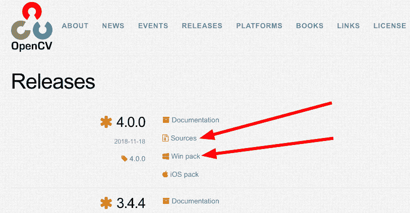

我们可以单击 Sources 链接将其源的 ZIP 软件包下载到本地磁盘，然后将其解压缩。 我们将在终端中使用 CMake 来构建 OpenCV，因此，我们将打开一个终端并将其工作目录更改为未压缩源的目录。 另外，OpenCV 不允许您直接在其源代码树的根目录中进行构建，因此我们应该创建一个单独的目录来进行构建。

以下是我们在终端中用于构建 OpenCV 的说明：

```cpp
 $ cd ~/opencv-4.0.0 # path to the unzipped source
 $ mkdir release # create the separate dir
 $ cd release
 $ cmake -D CMAKE_BUILD_TYPE=RELEASE -D CMAKE_INSTALL_PREFIX=$HOME/programs/opencv ..
 # ... output of cmake ...
 # rm ../CMakeCache.txt if it tells you are not in a separate dir
 $ make
 # ... output of make ...
 $ make install
```

`cmake ...`行读取已解压缩源的根目录中的`CMakeLists.txt`文件，并生成一个 makefile。 使用`-D`传递给`cmake`命令的`CMAKE_BUILD_TYPE`变量指定我们以`RELEASE`模式构建 OpenCV。 同样，`CMAKE_INSTALL_PREFIX`变量指定将 OpenCV 库安装到的路径。 在这里，我将 OpenCV 安装到`$HOME/programs/opencv`，即`/home/kdr2/programs/opencv` －如果需要，可以更改`CMAKE_INSTALL_PREFIX`的值以更改目标目录。 `cmake`命令成功结束后，将生成一个名为`Makefile`的文件。 使用 makefile，现在我们可以运行`make`和`make install`来编译和安装该库。

如果上述所有说明均操作正确，则将正确安装您的 OpenCV 版本。 您可以通过浏览安装目录进行检查：

```cpp
 $ ls ~/programs/opencv/
 bin include lib share
 $ ls ~/programs/opencv/bin/
 opencv_annotation opencv_interactive-calibration opencv_version
 opencv_visualisation setup_vars_opencv4.sh
 $ ls -l ~/programs/opencv/lib/
 # ...
 lrwxrwxrwx 1 kdr2 kdr2 21 Nov 20 13:28 libopencv_core.so -> libopencv_core.so.4.0
 lrwxrwxrwx 1 kdr2 kdr2 23 Nov 20 13:28 libopencv_core.so.4.0 -> libopencv_core.so.4.0.0
 -rw-r--r-- 1 kdr2 kdr2 4519888 Nov 20 12:34 libopencv_core.so.4.0.0
 # ...
 lrwxrwxrwx 1 kdr2 kdr2 24 Nov 20 13:28 libopencv_imgproc.so -> libopencv_imgproc.so.4.0
 lrwxrwxrwx 1 kdr2 kdr2 26 Nov 20 13:28 libopencv_imgproc.so.4.0 -> libopencv_imgproc.so.4.0.0
 -rw-r--r-- 1 kdr2 kdr2 4714608 Nov 20 12:37 libopencv_imgproc.so.4.0.0
 # ... output truncated
```

OpenCV 是一个模块化库。 它由两种类型的模块组成-主模块和附加模块。

从源代码构建时，默认情况下，主要模块包含在 OpenCV 中，它们包含所有 OpenCV 核心功能，以及用于图像处理任务，过滤，转换和更多功能的模块。

额外的模块包括默认情况下未包含在 OpenCV 库中的所有 OpenCV 功能，并且它们大多包含其他与计算机视觉相关的功能。

如果在检查 OpenCV 是否正确安装时回顾一下 OpenCV 安装路径下`lib`目录的内容，则会发现许多以`libopencv_*.so*`模式命名的文件。 通常，每个文件都对应一个 OpenCV 模块。 例如，`libopencv_imgproc.so`文件是`imgproc`模块，该模块用于图像处理任务。

现在我们已经安装了 OpenCV 库，是时候将其包含在我们的 Qt 项目中了。 让我们打开 Qt 项目文件`ImageEditor.pro`，并在其中添加以下几行：

```cpp
     unix: !mac {
         INCLUDEPATH += /home/kdr2/programs/opencv/include/opencv4
         LIBS += -L/home/kdr2/programs/opencv/lib -lopencv_core -l opencv_imgproc
     }
```

`unix: !mac`指令的意思是在除 MacOS 之外的任何类似 UNIX 的系统上使用其旁边方括号中的配置。 我使用此指令是因为我正在使用 Debian GNU / Linux。 括号内的指令是在以下行中导入 OpenCV 库的关键部分：

*   第一行通过更新`INCLUDEPATH`的值来告诉编译器我们将在代码中使用的 OpenCV 头文件在哪里。
*   第二行告诉链接器我们的应用程序应该链接到哪个 OpenCV 模块（共享对象），以及在哪里找到它们。 更具体地说，`-lopencv_core -l opencv_imgproc`表示我们应将应用程序与`libopencv_core.so`和`libopencv_imgproc.so`链接，而`-L...`则意味着链接器应在`/home/kdr2/programs/opencv/lib`目录下找到这些 lib 文件（共享对象）。

在 MacOS 或 Windows 上，OpenCV 以另一种方式构建和链接，但不在模块的每个库文件中。 在这种情况下，所有模块都链接到一个名为`opencv_world`的库。 我们可以将`-DBUILD_opencv_world=on`传递给 CMake 在 Linux 上达到相同的效果：

```cpp
 # on mac
 $ ls -l
 -rwxr-xr-x 1 cheftin staff 25454204 Dec 3 13:47 libopencv_world.4.0.0.dylib
 lrwxr-xr-x 1 cheftin staff 27 Dec 3 13:36 libopencv_world.4.0.dylib -> libopencv_world.4.0.0.dylib
 lrwxr-xr-x 1 cheftin staff 25 Dec 3 13:36 libopencv_world.dylib -> libopencv_world.4.0.dylib

 # on Linux with -D BUILD_opencv_world=on
 $ ls -l
 lrwxrwxrwx 1 kdr2 kdr2 22 Nov 29 22:55 libopencv_world.so -> libopencv_world.so.4.0
 lrwxrwxrwx 1 kdr2 kdr2 24 Nov 29 22:55 libopencv_world.so.4.0 -> libopencv_world.so.4.0.0
 -rw-r--r-- 1 kdr2 kdr2 57295464 Nov 29 22:09 libopencv_world.so.4.0.0
```

以这种方式构建 OpenCV 可以简化我们在编译源代码时的链接器选项-我们不需要像`-lopencv_core -lopencv_imgproc`那样为链接器提供模块列表。 告诉链接器链接到`opencv_world`就足够了。 对于 MacOS 和 Windows，我们可以将以下代码放入`ImageEditor.pro`：

```cpp
     unix: mac {
         INCLUDEPATH += /path/to/opencv/include/opencv4
         LIBS += -L/path/to/opencv/lib -lopencv_world
     }

     win32 {
         INCLUDEPATH += c:/path/to/opencv/include/opencv4
         LIBS += -lc:/path/to/opencv/lib/opencv_world
     }
```

尽管这种方法比较容易，但是本书仍然使用单独的模块，使您可以深入了解我们正在学习和使用的 OpenCV 模块。

`qmake`为您提供了另一种配置第三方库的方法，即通过`pkg-config`，它是用于维护库的元信息的工具。 不幸的是，根据[这个页面4](https://github.com/opencv/opencv/issues/13154)的说法，OpenCV 从 4.0 版开始不再支持`pkg-config`。 这意味着我们需要使用更直接，更灵活的方法在 Qt 项目中配置 OpenCV，而不是使用`pkg-config`方法。

# 影像模糊

最后，我们已经安装并配置了 OpenCV 库。 现在，让我们尝试使用它来模糊连接到我们的模糊操作的插槽中的图像。

首先，我们将以下行添加到`mainwindow.cpp`文件的开头，以便我们可以包含 OpenCV 头文件：

```cpp
     #include "opencv2/opencv.hpp"
```

现在准备工作已经完成，因此让我们集中讨论 slot 方法的实现。 像打算在单个打开的映像上运行的任何插槽一样，在执行任何操作之前，我们需要检查当前是否有打开的映像：

```cpp
         if (currentImage == nullptr) {
             QMessageBox::information(this, "Information", "No image to edit.");
             return;
         }
```

如您所见，如果没有打开的图像，我们将提示一个消息框并立即从函数返回。

在确定当前在应用程序中有打开的图像之后，我们知道可以将打开的图像作为`QPixmap`的实例。 但是，如何使用 OpenCV 来使图像`QPixmap`形式的图像模糊？ 答案是，我们不能。 在使用 OpenCV 对图像进行任何操作之前，我们必须使图像具有 OpenCV 如何保存图像的形式，这通常是`Mat`类的实例。 OpenCV 中的`Mat`类表示**矩阵**-实际上，任何图像都是具有给定宽度，高度，通道数和深度的矩阵。 在 Qt 中，我们有一个类似的类`QImage`，它用于保存图像的矩阵数据。 这意味着我们有了一个如何使用 OpenCV 模糊`QPixmap`的想法-我们需要将`QPixmap`转换为`QImage`，使用`QImage`构造`Mat`，模糊`Mat`，然后转换 `Mat`分别返回到`QImage`和`QPixmap`。

在转换方面，我们必须做很多工作。 让我们通过以下几行代码来讨论：

```cpp
         QPixmap pixmap = currentImage->pixmap();
         QImage image = pixmap.toImage();
```

此代码段非常简单。 我们获取当前图像的数据作为`QPixmap`的实例，然后通过调用其`toImage`方法将其转换为`QImage`实例。

下一步是将`QImage`转换为`Mat`，但是这里有些复杂。 我们正在打开的图像可以是任何格式-它可以是单色图像，灰度图像或深度不同的彩色图像。 要模糊它，我们必须知道它的格式，因此尽管它是原始格式，我们仍将其转换为具有 8 位深度和三个通道的常规格式。 这由 Qt 中的`QImage::Format_RGB888`和 OpenCV 中的`CV_8UC3`表示。 现在让我们看看如何进行转换并构造`Mat`对象：

```cpp
         image = image.convertToFormat(QImage::Format_RGB888);
         cv::Mat mat = cv::Mat(
             image.height(),
             image.width(),
             CV_8UC3,
             image.bits(),
             image.bytesPerLine());
```

最后，这是一段可编辑的代码。 现在我们有了`Mat`对象，让我们对其进行模糊处理：

```cpp
         cv::Mat tmp;
         cv::blur(mat, tmp, cv::Size(8, 8));
         mat = tmp;
```

OpenCV 在其`imgproc`模块中提供`blur`功能。 它使用带有内核的归一化框滤镜来模糊图像。 第一个参数是我们要模糊的图像，而第二个参数是我们要放置模糊的图像的位置。 我们使用临时矩阵存储模糊的图像，并在模糊结束后将其分配回原始图像。 第三个参数是内核的大小。 在这里，内核用于告诉 OpenCV 如何通过将其与不同数量的相邻像素组合来更改任何给定像素的值。

现在，我们已经将模糊图像作为`Mat`的实例，我们必须将其转换回`QPixmap`的实例，并在场景和视图中进行显示：

```cpp
         QImage image_blurred(
             mat.data,
             mat.cols,
             mat.rows,
             mat.step,
             QImage::Format_RGB888);
         pixmap = QPixmap::fromImage(image_blurred);
         imageScene->clear();
         imageView->resetMatrix();
         currentImage = imageScene->addPixmap(pixmap);
         imageScene->update();
         imageView->setSceneRect(pixmap.rect());
```

对我们来说，前面代码的新部分是从`mat`对象构造`QImage`对象`image_blurred`，然后使用`QPixmap::fromImage`静态方法将`QImage`对象转换为`QPixmap`。 尽管这是新的，但很明显。 这段代码的其余部分对我们来说并不陌生，它与我们在`MainWindow`类的`showImage`方法中使用的代码相同。

现在我们已经显示了模糊的图像，我们可以更新状态栏上的消息以告诉用户他们正在查看的该图像是已编辑的图像，而不是他们打开的原始图像：

```cpp
         QString status = QString("(editted image), %1x%2")
             .arg(pixmap.width()).arg(pixmap.height());
         mainStatusLabel->setText(status);
```

至此，我们已经完成了`MainWindow::blurImage`方法。 让我们通过在终端中发出`qmake -makefile`和`make`命令来重建项目，然后运行新的可执行文件。

如果像我一样，在非`/usr`或`/usr/local`的路径中安装 OpenCV，则在运行可执行文件时可能会遇到问题：

```cpp
 $ ./ImageEditor
 ./ImageEditor: error while loading shared libraries: libopencv_core.so.4.0: cannot open shared object file: No such file or directory
```

这是因为我们的 OpenCV 库不在系统的库搜索路径中。 通过在 Linux 上设置`LD_LIBRARY_PATH`环境变量，在 MacOS 上设置`DYLD_LIBRARY_PATH`，我们可以将其路径添加到库搜索路径：

```cpp
 $ export LD_LIBRARY_PATH=/home/kdr2/programs/opencv/lib/
 $ ./ImageEditor
```

使用我们的应用打开图像时，将获得以下输出：


单击工具栏上的“模糊”按钮后，其显示如下：


我们可以看到我们的图像已成功模糊。

# QPixmap，QImage 和 Mat

在上一节中，我们添加了一项新功能来模糊在 ImageEditor 应用程序中打开的图像。 在模糊图像的同时，我们将图像从`QPixmap`转换为`QImage`并转换为`Mat`，然后在使用 OpenCV 对其进行模糊处理之后将其向后转换。 在那里，我们做了工作，但对这些课程没有多说。 让我们现在谈论它们。

# QPixmap

`QPixmap`是 Qt 库提供的一个类，打算在需要在屏幕上显示图像时使用。 这正是我们在项目中使用它的方式—我们读取图像作为其实例，并将该实例添加到`QGraphicsSence`中以显示它。

有很多方法可以创建`QPixmap`的实例。 就像我们在第 1 章，“构建图像查看器”以及本章前面的部分中所做的一样，我们可以使用图像文件的路径实例化它：

```cpp
      QPixmap map("/path/to/image.png");
```

另外，我们可以实例化一个空的`QPixmap`，然后将数据加载到其中：

```cpp
      QPixmap map;
      map.load("/path/to/image.png");
```

对于实例中包含图像的实例，我们可以通过调用其`save`方法将其保存到文件中，就像我们在“另存为”操作的插槽中所做的那样：

```cpp
      map.save("/path/to/output.png");
```

最后，我们可以通过调用`toImage`方法将`QPixmap`方法转换为`QImage`方法：

```cpp
      //...
      QImage image = map.toImage();
```

# QImage

尽管`QPixmap`主要用于以 Qt 显示图像，但`QImage`是针对 I/O 以及直接像素访问和操纵而设计和优化的。 通过此类，我们可以获得有关图像的信息，例如图像的大小，是否具有 alpha 通道，是否为灰度图像以及其中任何像素的颜色。

`QImage`设计用于直接像素访问和操纵，并且它提供进行图像处理的功能，例如像素操纵和变换。 毕竟，Qt 库不是专门用于图像处理的库，因此它在此域中提供的功能不能满足本章的要求。 因此，在将`QImage`对象转换为`Mat`对象后，我们将使用 OpenCV 进行图像处理。

然后，问题是，如何在`QImage`，`QPixmap`和`Mat`这三种数据类型之间转换？ 在上一节中，我们讨论了如何将`QPixmap`转换为`QImage`，但现在让我们看一下如何将其转换回：

```cpp
      QPixmap pixmap = QPixmap::fromImage(image);
```

如您所见，这是一个简单的过程-您只需使用`QImage`对象作为唯一参数来调用`QPixmap`类的`fromImage`静态方法。

如果您对`QImage`其他功能的详细信息感兴趣，可以在[这个页面](https://doc.qt.io/qt-5/qimage.html)上参考其文档。 在下一节中，我们将讨论如何将`QImage`转换为`Mat`，反之亦然。

# 餐饮

`Mat`类是 OpenCV 库中最重要的类之一，其名称是**矩阵**的简称。 在计算机视觉领域，正如我们前面提到的，任何图像都是具有给定宽度，高度，通道数量和深度的矩阵。 因此，OpenCV 使用`Mat`类表示图像。 实际上，`Mat`类是一个 n 维数组，可用于存储具有任何给定数据类型的单个或多个数据通道，并且它包含许多以多种方式创建，修改或操纵它的成员和方法。 。

`Mat`类具有许多构造函数。 例如，我们可以创建一个实例，该实例的宽度（列）为`800`，高度（行）为`600`，其中三个通道包含 8 位无符号 int 值，如下所示：

```cpp
      Mat mat(600, 800, CV_8UC3);
```

此构造函数的第三个参数是该矩阵的`type`； OpenCV 预定义了许多可用于它的值。 这些预定义的值在名称中都有一个模式，以便我们在看到名称时可以知道矩阵的类型，或者可以在确定矩阵的性质时猜测应该使用的名称。

此模式称为`CV_<depth><type>C<channels>`：

*   `<depth>`可以用`8`，`16`，`32`或`64`代替，它们表示用于在像素中存储每个元素的位数
*   对于无符号整数，有符号整数和浮点值，需要分别用`U`，`S`或`F`替换`<type>`
*   `<channel>`应该是通道数

因此，在我们的代码中，`CV_8UC3`表示声明的图像的深度为`8`，其像素的每个元素都存储在 8 位无符号 int 中，并且具有三个通道。 换句话说，每个像素中具有 3 个元素，`CV_8UC3`占据 24 位（`depth * channels`）。

我们还可以在构建图像时为其填充一些数据。 例如，我们可以用恒定的颜色填充它，如下所示：

```cpp
      int R = 40, G = 50, B = 60;
      Mat mat(600, 800, CV_8UC3, Scalar(B, G, R));
```

在前面的代码中，我们创建了与上一个示例中相同的图像，但是使用第四个参数指定的恒定颜色`RGB(40, 50, 60)`填充了该图像。

重要的是要注意，OpenCV 中默认的颜色顺序是 BGR，而不是 RGB，这意味着`B`和`R`值互换了。 因此，我们在代码中将恒定颜色表示为`Scalar(B, G, R)`而不是`Scalar(R, G, B)`。 如果我们使用 OpenCV 读取图像，但使用另一个对颜色使用不同顺序的库来处理图像，则反之亦然，尤其是当我们的处理方法分别处理图像的每个通道时，这一点很重要。

那就是在我们的应用程序中发生的事情-我们使用 Qt 加载图像并将其转换为 OpenCV `Mat`数据结构，然后对其进行处理并将其转换回`QImage`。 但是，如您所见，在使图像模糊时，我们没有交换红色和蓝色通道来求助于颜色顺序。 这是因为`blur`功能在通道上对称运行； 通道之间没有干扰，因此在这种情况下颜色顺序并不重要。 如果执行以下操作，则可以省略通道交换：

*   我们将`QImage`转换为`Mat`，然后处理`Mat`并将其转换回`QImage`
*   我们在`Mat`上执行的处理期间内的所有操作在通道上都是对称的； 也就是说，通道之间没有干扰
*   在处理期间我们不会显示图像； 我们仅在将它们转换回`QImage`后向他们显示

在这种情况下，我们可以简单地忽略颜色顺序的问题。 这将应用于我们稍后将编写的大多数插件。 但是，在某些情况下，您不能只是简单地忽略它。 例如，如果您使用 OpenCV 读取图像，将其转换为`QImage`的实例，然后在 Qt 中显示，则以下代码将显示其红色和蓝色通道已交换的图像：

```cpp
      cv::Mat mat = cv::imread("/path/to/an/image.png");
      QImage image(
          mat.data,
          mat.cols,
          mat.rows,
          mat.step,
          QImage::Format_RGB888
      );
```

在将其转换为`QImage`之前，应先交换 R 和 B 通道：

```cpp
      cv::Mat mat = cv::imread("/path/to/an/image.png");
      cv::cvtColor(mat, mat, cv::COLOR_BGR2RGB);
      QImage image(
          mat.data,
          mat.cols,
          mat.rows,
          mat.step,
          QImage::Format_RGB888
      );
```

请记住，如果我们使用的过程不能使用 OpenCV 对称地处理颜色通道，则在执行该操作之前，必须确保颜色顺序为 BGR。

现在我们已经讨论了颜色的顺序，我们将回到创建`Mat`对象的主题。 我们刚刚了解到，可以在创建`Mat`对象时用恒定的颜色填充它，但是，在我们的应用程序中，我们应该创建一个`Mat`对象，该对象与给定`QImage`对象的图像相同。 让我们回头看看我们是如何做到的：

```cpp
      // image is the give QImage object
      cv::Mat mat = cv::Mat(
          image.height(),
          image.width(),
          CV_8UC3,
          image.bits(),
          image.bytesPerLine()
      );
```

除了我们已经讨论的前三个参数外，我们还传递由`QImage`对象持有并由其`bits`方法返回的数据指针作为第四个参数。 我们还传递了另一个额外的参数，即图像每行的字节数，以使 OpenCV 知道如何处理图像填充字节，以及如何以有效的方式将其存储在内存中。

如前所述，`Mat`类的构造函数太多了，在此不多讨论。 我们甚至可以创建尺寸更大的`Mat`对象。 您可以参考[这里](https://docs.opencv.org/4.0.0/d3/d63/classcv_1_1Mat.html)上的文档以获取其构造函数的完整列表。 在本章中，我们将不多讨论它们。

现在我们已经掌握了如何在 Qt 和 OpenCV 之间转换图像对象的知识，接下来的几节将继续介绍如何使用 OpenCV 编辑图像。

# 使用 Qt 的插件机制添加功能

在上一节中，我们向我们的应用程序添加了一个名为**编辑**的新菜单和工具栏，并向它们两个添加了操作以使打开的图像模糊。 让我们回顾一下添加此功能的过程。

首先，我们添加了菜单和工具栏，然后添加了动作。 添加动作后，我们将新的插槽连接到该动作。 在该插槽中，我们将打开的图像作为`QPixmap`的实例，并将其转换为`QImage`对象，然后转换为`Mat`对象。 关键的编辑工作从这里开始-我们使用 OpenCV 修改`Mat`实例以完成编辑工作。 然后，我们将`Mat`分别转换回`QImage`和`QPixmap`，以显示编辑后的图像。

现在，如果我们想向我们的应用程序添加另一个编辑功能，我们应该怎么做？ 当然，只重复前面添加模糊动作的过程就可以了，但是效率不高。 如果我们想象我们只是以添加模糊动作的相同方式向应用程序添加了另一个编辑动作，我们会发现大多数工作或代码都是相同的。 我们正在重复自己。 这不仅是一种不良的发展模式，而且是无聊的工作。

要解决此问题，我们应该仔细地进行重复的过程，将其分为多个步骤，然后找出哪些步骤完全相同，哪些步骤有所不同。

这样，我们可以找出添加其他编辑功能的关键点：

*   对于不同的编辑功能，操作的名称是不同的。
*   `Mat`实例上的操作因不同的编辑功能而有所不同。

除前两个之外，其他所有步骤或逻辑在添加不同的编辑动作的过程中都是相同的。 也就是说，当我们要添加新的编辑功能时，我们只需要做两件事。 首先，我们将其命名，然后找出一种使用 OpenCV 对`Mat`实例进行编辑操作的方法。 一旦清除了这两件事，就可以确定新的编辑功能。 接下来，我们需要将新功能集成到应用程序中。

那么，我们如何将其集成到应用程序中呢？ 我们将使用 Qt 的插件机制来执行此操作，并且每个编辑功能都将是一个插件。

# 插件界面

Qt 插件机制是使 Qt 应用程序更可扩展的强大方法。 如前所述，我们将使用这种机制来抽象一种可以轻松添加新编辑功能的方式。 完成后，在添加新的编辑功能时，只需要注意编辑功能的名称和`Mat`实例上的操作即可。

第一步是找出一个接口，以便在应用程序和插件之间提供通用协议，以便我们可以加载和调用插件，而不管插件是如何实现的。 在 C++ 中，接口是具有纯虚拟成员函数的类。 对于我们的插件，我们需要处理`Mat`的动作名称和操作，因此我们在`editor_plugin_interface.h`中声明我们的接口，如下所示：

```cpp
     #ifndef EDITOR_PLUGIN_INTERFACE_H
     #define EDITOR_PLUGIN_INTERFACE_H

     #include <QObject>
     #include <QString>
     #include "opencv2/opencv.hpp"

     class EditorPluginInterface
     {
     public:
         virtual ~EditorPluginInterface() {};
         virtual QString name() = 0;
         virtual void edit(const cv::Mat &input, cv::Mat &output) = 0;
     };

     #define EDIT_PLUGIN_INTERFACE_IID "com.kdr2.editorplugininterface"
     Q_DECLARE_INTERFACE(EditorPluginInterface, EDIT_PLUGIN_INTERFACE_IID);

     #endif
```

我们使用`ifndef` / `define`习惯用语（前两行和最后一行）来确保此头文件一次包含在源文件中。 在前两行之后，我们包括 Qt 和 OpenCV 提供的一些头文件，以介绍相关的数据结构。 然后，我们声明一个名为`EditorPluginInterface`的类，这是我们的接口类。 在该类中，除了虚拟的空析构函数之外，我们还可以看到两个纯虚拟成员函数：`name`和`edit`函数。 `name`函数返回`QString`，这将是编辑操作的名称。 `edit`功能将`Mat`的两个引用用作其输入和输出功能，并用于编辑操作。 每个插件都是该接口的子类，这两个函数的实现将确定操作名称和编辑操作。

在类声明之后，我们定义一个名为`com.kdr2.editorplugininterface`的唯一标识符字符串作为接口的 ID。 该 ID 在应用程序范围内必须是唯一的，也就是说，如果编写其他接口，则必须为它们使用不同的 ID。 然后，我们使用`Q_DECLARE_INTERFACE`宏将接口的类​​名与定义的唯一标识符相关联，以便 Qt 的插件系统可以在加载之前识别此接口的插件。

至此，已经确定了用于编辑功能的界面。 现在，让我们编写一个插件来实现此接口。

# 用 ErodePlugin 腐蚀图像

要编写 Qt 插件，我们应该从头开始一个新的 Qt 项目。 在先前的编辑功能中，我们只是通过从 OpenCV 调用`blur`函数来使图像模糊。 考虑到我们的主要目的是介绍 Qt 库的插件机制，我们仍将使用 OpenCV 库中的一个简单函数进行简单的编辑以使这一部分更加清楚。 在这里，我们将从 OpenCV 库中调用`erode`函数，以侵蚀图像中的对象。

让我们命名插件`ErodePlugin`并从头开始创建项目：

```cpp
 $ ls
 ImageEditor
 $ mkdir ErodePlugin
 $ ls
 ErodePlugin ImageEditor
 $ cd ErodePlugin
 $ touch erode_plugin.h erode_plugin.cpp
 $ qmake -project
 $ ls
 erode_plugin.h erode_plugin.cpp ErodePlugin.pro
```

首先，在终端中，将目录更改为`ImageEditor`项目的父目录，创建一个名为`ErodePlugin`的新目录，然后输入该目录。 然后，我们创建两个空的源文件`erode_plugin.h`和`erode_pluigin.cpp`。 稍后我们将在这两个文件中编写源代码。 现在，我们在终端中运行`qmake -project`，这将返回一个名为`ErodePlugin.pro`的 Qt 项目文件。 由于此项目是 Qt 插件项目，因此其项目文件具有许多不同的设置。 现在让我们看一下：

```cpp
     TEMPLATE = lib
     TARGET = ErodePlugin
     COPNFIG += plugin
     INCLUDEPATH += . ../ImageEditor
```

在项目文件的开头，我们使用`lib`而不是`app`作为其`TEMPLATE`设置的值。 `TARGET`设置没有什么不同，我们只使用项目名称作为其值。 我们还添加了特殊行`CONFIG += plugin`来告诉`qmake`该项目是 Qt 插件项目。 最后，在上一个代码块的最后一行中，我们将`ImageEditor`项目的根目录添加为该项目包含路径的一项，以便编译器可以找到接口头文件`editor_plugin_interface.h`， 在编译插件时已将其放在上一节的`ImageEditor`项目中。

在此插件中，我们还需要 OpenCV 来实现我们的编辑功能，因此，我们需要像在 Qt 插件项目的设置中一样，添加 OpenCV 库的信息-更准确地说是库路径，并包括库的路径。 在`ImageEditor`项目中：

```cpp
     unix: !mac {
         INCLUDEPATH += /home/kdr2/programs/opencv/include/opencv4
         LIBS += -L/home/kdr2/programs/opencv/lib -lopencv_core -l opencv_imgproc
     }

     unix: mac {
         INCLUDEPATH += /path/to/opencv/include/opencv4
         LIBS += -L/path/to/opencv/lib -lopencv_world
     }

     win32 {
         INCLUDEPATH += c:/path/to/opencv/include/opencv4
         LIBS += -lc:/path/to/opencv/lib/opencv_world
     }
```

在项目文件的末尾，我们将头文件和 C++ 源文件添加到项目中：

```cpp
     HEADERS += erode_plugin.h
     SOURCES += erode_plugin.cpp
```

现在，我们插件的项目文件已经完成，让我们开始编写我们的插件。 就像我们设计的那样，为新的编辑功能编写插件只是为了提供我们在上一节中抽象的`EditorPluginInterface`接口的实现。 因此，我们在`erode_plugin.h`中声明了该接口的子类：

```cpp
     #include <QObject>
     #include <QtPlugin>

     #include "editor_plugin_interface.h"

     class ErodePlugin: public QObject, public EditorPluginInterface
     {
         Q_OBJECT
         Q_PLUGIN_METADATA(IID EDIT_PLUGIN_INTERFACE_IID);
         Q_INTERFACES(EditorPluginInterface);
     public:
         QString name();
         void edit(const cv::Mat &input, cv::Mat &output);
     };
```

如您所见，在包含必要的头文件之后，我们声明一个名为`ErodePlugin`的类，该类继承自`QObject`和`EditorPluginInterface`。 后者是我们在上一节`editor_plugin_interface.h`中定义的接口。 在这里，我们将插件实现作为`QOBject`的子类，因为这是 Qt 元对象系统和插件机制的要求。 在类的主体中，我们使用 Qt 库定义的一些宏添加更多信息：

```cpp
         Q_OBJECT
         Q_PLUGIN_METADATA(IID EDIT_PLUGIN_INTERFACE_IID);
         Q_INTERFACES(EditorPluginInterface);
```

在上一章中，我们介绍了`Q_OBJECT`宏； 它与 Qt 元对象系统有关。 `Q_PLUGIN_METADATA(IID EDIT_PLUGIN_INTERFACE_IID)`行声明了此插件的元数据，在这里我们声明了在`editor_plugin_interface.h`中定义为其`IID`元数据的插件接口的唯一标识符。 然后，我们使用`Q_INTERFACES(EditorPluginInterface)`行告诉 Qt 此类正在尝试实现的是`EditorPluginInterface`接口。 有了前面的信息，Qt 插件系统就知道了有关该项目的所有信息：

*   这是一个 Qt 插件项目，因此该项目的目标将是一个库文件。
*   该插件是`EditorPluginInterface`的实例，其`IID`是`EDIT_PLUGIN_INTERFACE_IID`，因此 Qt 应用程序可以告诉它并加载此插件。

现在，我们可以专注于如何实现接口。 首先，我们在接口中声明两个纯粹的重要功能：

```cpp
     public:
         QString name();
         void edit(const cv::Mat &input, cv::Mat &output);
```

然后，我们在`erode_plugin.cpp`文件中实现它们。 对于`name`函数，这很简单-我们只需返回`QString`，`Erode`作为插件的名称（以及编辑操作的名称）即可：

```cpp
     QString ErodePlugin::name()
     {
         return "Erode";
     }
```

对于`edit`函数，我们如下实现：

```cpp
     void ErodePlugin::edit(const cv::Mat &input, cv::Mat &output)
     {
         erode(input, output, cv::Mat());
     }
```

这也很简单-我们只调用 OpenCV 库提供的`erode`函数。 该功能的作用称为图像腐蚀。 它是数学形态学领域中的两个基本运算符之一。 侵蚀是缩小图像前景或 1 值对象的过程。 它可以平滑对象边界并去除半岛，手指和小物体。 在下一部分中将插件加载到应用程序中后，我们将看到此效果。

好。 我们插件项目的大部分工作都已完成，因此让我们对其进行编译。 编译方式与普通 Qt 应用程序的编译方式相同：

```cpp
 $ qmake -makefile
 $ make
 g++ -c -pipe -O2 ...
 # output trucated
 ln -s libErodePlugin.so.1.0.0 libErodePlugin.so
 ln -s libErodePlugin.so.1.0.0 libErodePlugin.so.1
 ln -s libErodePlugin.so.1.0.0 libErodePlugin.so.1.0
 $ ls -l *.so*
 lrwxrwxrwx 1 kdr2 kdr2 23 Dec 12 16:24 libErodePlugin.so -> libErodePlugin.so.1.0.0
 lrwxrwxrwx 1 kdr2 kdr2 23 Dec 12 16:24 libErodePlugin.so.1 -> libErodePlugin.so.1.0.0
 lrwxrwxrwx 1 kdr2 kdr2 23 Dec 12 16:24 libErodePlugin.so.1.0 -> libErodePlugin.so.1.0.0
 -rwxr-xr-x 1 kdr2 kdr2 78576 Dec 12 16:24 libErodePlugin.so.1.0.0
 $
```

首先，我们运行`qmake -makefile`生成`Makefile`，然后通过执行`make`命令来编译源代码。 编译过程完成后，我们将使用`ls -l *.so*`检查输出文件，并找到许多共享对象文件。 这些是我们将加载到应用程序中的插件文件。

检查输出文件时，您可能会发现许多扩展名为`1.0.0`的文件。 这些字符串告诉我们有关库文件的版本号。 这些文件大多数是一个真实库文件的别名（以符号链接的形式）。 在下一部分中加载插件时，将复制真实库文件的副本，但不包含其版本号。

如果使用的平台不同于 GNU / Linux，则输出文件也可能会有所不同：在 Windows 上，文件将被命名为`ErodePlugin.dll`，在 MacOS 上，文件将被命名为 就像`libErodePlugin.dylib`一样。

# 将插件加载到我们的应用程序中

在前面的部分中，我们为应用程序的编辑功能抽象了一个接口，然后实现了一个插件，该插件通过将 OpenCV 库中的`erode`函数应用于打开的图像来满足该接口。 在本节中，我们会将插件加载到我们的应用程序中，以便我们可以使用它来侵蚀我们的映像。 之后，我们将查看一个名为`Erode`的新动作，该动作可以在编辑菜单下和编辑工具栏上找到。 如果我们通过单击来触发动作，我们将看到`Erode`在图像上的作用。

因此，让我们加载插件！ 首先，我们修改`ImageEditor`项目的项目文件，并将包含插件接口的头文件添加到`HEADERS`设置的列表中：

```cpp
     HEADERS += mainwindow.h editor_plugin_interface.h
```

然后，将此文件包含在我们的`mainwindow.cpp`源文件中。 我们还将使用另一个名为`QMap`的数据结构来保存将要加载的所有插件的列表，因此我们也包含`QMap`的头文件：

```cpp
     #include <QMap>

     #include "editor_plugin_interface.h"
```

然后，在`MainWindow`类的声明主体中，声明两个成员函数：

*   `void loadPlugins()`：用于加载出现在某个目录中的所有插件。
*   `void pluginPerform()`：这是一个公共插槽，它将连接到已加载插件创建的所有操作。 在此插槽中，我们应区分触发了哪个动作，导致该插槽被调用，然后我们找到与该动作相关的插件并执行其编辑操作。

添加这两个成员函数后，我们添加`QMap`类型的成员字段以注册所有已加载的插件：

```cpp
     QMap<QString, EditorPluginInterface*> editPlugins;
```

该映射的键将是插件的名称，而值将是指向已加载插件实例的指针。

头文件中的所有工作都已完成，因此让我们实现`loadPlugins`函数来加载我们的插件。 首先，我们应该在`mainwindow.cpp`中包含必要的头文件：

```cpp
    #include <QPluginLoader>
```

然后，我们将提供`loadPlugins`成员函数的实现，如下所示：

```cpp
     void MainWindow::loadPlugins()
     {
         QDir pluginsDir(QApplication::instance()->applicationDirPath() + "/plugins");
         QStringList nameFilters;
         nameFilters << "*.so" << "*.dylib" << "*.dll";
         QFileInfoList plugins = pluginsDir.entryInfoList(
             nameFilters, QDir::NoDotAndDotDot | QDir::Files, QDir::Name);
         foreach(QFileInfo plugin, plugins) {
             QPluginLoader pluginLoader(plugin.absoluteFilePath(), this);
             EditorPluginInterface *plugin_ptr = dynamic_cast<EditorPluginInterface*>(pluginLoader.instance());
             if(plugin_ptr) {
                 QAction *action = new QAction(plugin_ptr->name());
                 editMenu->addAction(action);
                 editToolBar->addAction(action);
                 editPlugins[plugin_ptr->name()] = plugin_ptr;
                 connect(action, SIGNAL(triggered(bool)), this, SLOT(pluginPerform()));
                 // pluginLoader.unload();
             } else {
                 qDebug() << "bad plugin: " << plugin.absoluteFilePath();
             }
         }
     }
```

我们假设可执行文件所在的目录中有一个名为`plugins`的子目录。 只需调用`QApplication::instance()->applicationDirPath()`即可获取包含可执行文件的目录，然后将`/plugins`字符串附加到其末尾以生成插件目录。 如上一节所述，我们的插件是库文件，它们的名称以`.so`，`.dylib`或`.dll`结尾，具体取决于所使用的操作系统。 然后，我们在 plugins 目录中列出所有具有这些扩展名的文件。

在将所有可能的插件文件列出为`QFileInfoList`之后，我们遍历该列表以尝试使用`foreach`加载每个插件。 `foreach`是 Qt 定义的宏，并实现了`for`循环。 在循环内部，每个文件都是`QFileInfo`的一个实例。 我们通过调用`abstractFilePath`方法获得其绝对路径，然后在该路径上构造`QPluginLoader`的实例。

然后，我们有许多关键步骤需要解决。 首先，我们在`QPluginLoader`实例上调用`instance`方法。 如果已加载目标插件，则将返回指向`QObject`的指针，否则将返回`0`。 然后，我们将返回指针转换为指向我们的插件接口类型即`EditorPluginInterface*`的指针。 如果该指针非零，则将是插件的实例！ 然后，我们创建一个`QAction`，其名称为已加载插件的名称，即`plugin_ptr->name()`的结果。 你还记得是什么吗？ 这是`ErodePlugin`中的`name`函数，我们在其中返回`Erode`字符串：

```cpp
     QString ErodePlugin::name()
     {
         return "Erode";
     }
```

现在已经创建了`Erode`操作，通过使用该操作调用它们的`addAction`方法，我们将其添加到编辑菜单和编辑工具栏。 然后，我们在`editPlugins`映射中注册已加载的插件：

```cpp
       editPlugins[plugin_ptr->name()] = plugin_ptr;
```

稍后，我们将使用此映射在插件创建的所有动作的公共位置中按其名称查找插件。

最后，我们将使用操作连接一个插槽：

```cpp
       connect(action, SIGNAL(triggered(bool)), this, SLOT(pluginPerform()));
```

您可能很好奇，这一行代码处于循环中，并且我们将所有操作的触发信号连接到同一插槽； 这个可以吗？ 是的，我们有一种方法可以区分插槽中触发了哪个操作，然后我们可以根据该操作执行操作。 让我们看看这是如何完成的。 在`pluginPerform`插槽的实现中，我们检查是否有打开的图像：

```cpp
         if (currentImage == nullptr) {
             QMessageBox::information(this, "Information", "No image to edit.");
             return;
         }
```

然后，我们找到它刚刚触发的动作，以便它通过调用 Qt 库提供的`sender()`函数来发送信号并调用插槽。 `sender()`函数返回一个指向`QObject`实例的指针。 在这里，我们知道我们仅将`QAction`的实例连接到此插槽，因此我们可以使用`qobject_cast`将返回的指针安全地强制转换为`QAction`的指针。 现在，我们知道触发了哪个动作。 然后，我们获得动作的文本。 在我们的应用程序中，操作的文本是创建该操作的插件的名称。 通过使用此文本，我们可以从我们的注册地图中找到某个插件。 这是我们的操作方式：

```cpp
         QAction *active_action = qobject_cast<QAction*>(sender());
         EditorPluginInterface *plugin_ptr = editPlugins[active_action->text()];
         if(!plugin_ptr) {
             QMessageBox::information(this, "Information", "No plugin is found.");
             return;
         }
```

得到插件指针后，我们检查它是否存在。 如果没有，我们只是向用户显示一个消息框，然后从 slot 函数返回。

至此，我们有了用户已通过其操作触发的插件，因此现在我们来看一下编辑操作。 这段代码与`blurImage`插槽功能中的代码非常相似。 首先，我们以`QPixmap`的形式获取开始图像，然后依次将其转换为`QImage`和`Mat`。 一旦它成为`Mat`的实例，我们就可以对其应用插件的`edit`函数，即`plugin_ptr->edit(mat, mat);`。 完成编辑操作后，我们将编辑后的`Mat`分别转换回`QImage`和`QPixmap`，然后在图形场景中显示`QPixmap`并更新状态栏上的信息：

```cpp
         QPixmap pixmap = currentImage->pixmap();
         QImage image = pixmap.toImage();
         image = image.convertToFormat(QImage::Format_RGB888);
         Mat mat = Mat(
             image.height(),
             image.width(),
             CV_8UC3,
             image.bits(),
             image.bytesPerLine());

         plugin_ptr->edit(mat, mat);

         QImage image_edited(
             mat.data,
             mat.cols,
             mat.rows,
             mat.step,
             QImage::Format_RGB888);
         pixmap = QPixmap::fromImage(image_edited);
         imageScene->clear();
         imageView->resetMatrix();
         currentImage = imageScene->addPixmap(pixmap);
         imageScene->update();
         imageView->setSceneRect(pixmap.rect());
         QString status = QString("(editted image), %1x%2")
             .arg(pixmap.width()).arg(pixmap.height());
         mainStatusLabel->setText(status);
```

已经添加了两个新函数，所以我们要做的最后一件事是在`MainWindow`类的构造函数中调用`loadPlugins`函数，方法是在`MainWindow::MainWindow(QWidget *parent)`的末尾添加以下行：

```cpp
         loadPlugins();
```

现在，我们已经从可执行文件所在目录的`plugins`子目录中加载并设置了插件，现在让我们编译应用程序并对其进行测试。

首先，在终端中，将目录更改为`ImageEditor`项目的根目录，然后发出`qmake -makefile`和`make`命令。 等待这些命令完成。 然后，通过运行`./ImageEditor`命令启动我们的应用； 您将看到以下输出：


在运行应用程序之前，请不要忘记在 Linux 或 MacOS 上将`LD_LIBRARY_PATH`或`DYLD_LIBRARY_PATH`环境变量设置为 OpenCV 的`lib`目录。

哦，什么都没改变-我们在编辑菜单或编辑工具栏上找不到`Erode`操作。 这是因为我们没有将`Erode`插件文件复制到`plugins`目录中。 让我们现在开始：

```cpp
 $ ls
 ImageEditor ImageEditor.pro plugins ...
 $ ls -l ../ErodePlugin/*.so*
 lrwxrwxrwx 1 kdr2 kdr2 23 Dec 12 16:24 ../ErodePlugin/libErodePlugin.so -> libErodePlugin.so.1.0.0
 lrwxrwxrwx 1 kdr2 kdr2 23 Dec 12 16:24 ../ErodePlugin/libErodePlugin.so.1 -> libErodePlugin.so.1.0.0
 lrwxrwxrwx 1 kdr2 kdr2 23 Dec 12 16:24 ../ErodePlugin/libErodePlugin.so.1.0 -> libErodePlugin.so.1.0.0
 -rwxr-xr-x 1 kdr2 kdr2 78576 Dec 12 16:24 ../ErodePlugin/libErodePlugin.so.1.0.0
 $ cp ../ErodePlugin/libErodePlugin.so.1.0.0 plugins/libErodePlugin.so
 $ ls plugins/
 libErodePlugin.so
 $
```

如果您使用的是 macOS，则在编译项目后，将找到一个名为`ImageEditor.app`的目录，而不是`ImageEditor`可执行文件。 这是因为在 MacOS 上，每个应用程序都是一个以`.app`作为扩展名的目录。 真正的可执行文件位于`ImageEditor.app/Contents/MacOS/ImageEdtior`，因此，在 MacOS 上，我们的插件目录为`ImageEditor.app/Contents/MacOS/plugins`。 您应该创建该目录并在其中复制插件文件。

让我们再次运行我们的应用程序：


现在，我们可以在“编辑”菜单和“编辑”工具栏上看到“腐蚀”动作。 让我们打开一个图像以查看 Erode 的功能。

这是在执行任何操作之前由应用程序打开的图像：


单击“侵蚀”操作后，将获得以下输出：

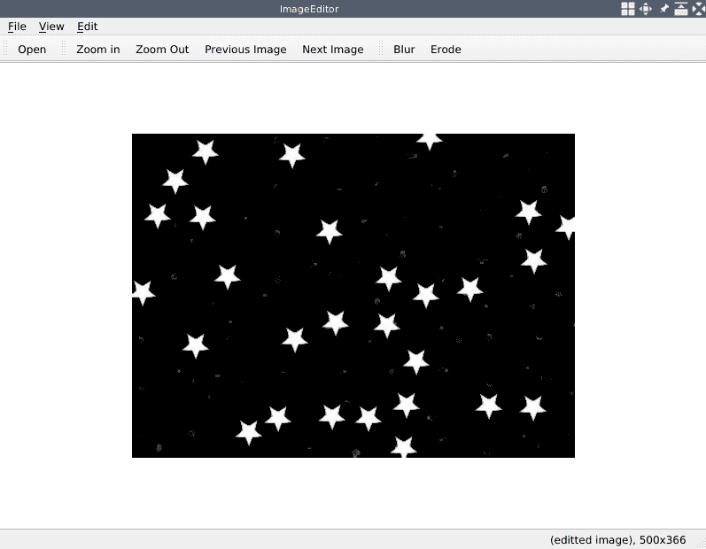

如您所见，单击“腐蚀”操作后，图像的暗部被放大，白色对象缩小。 这是因为 OpenCV 将图像的深色部分视为背景，并且侵蚀了图像中的对象（浅色部分）。

我们已经使用 Qt 库提供的插件机制成功添加了新的编辑功能。 本节的重点是介绍该插件机制，而不是图像编辑功能，因此我们仅使用`erode`函数来实现编辑功能，以简化图像编辑。 现在已经介绍了插件机制，我们可以继续使用 OpenCV 库和使用该库的图像编辑功能。

# 像专业人士一样编辑图像

在上一节中，我们研究了如何为应用程序添加图像编辑功能作为插件。 这样，我们就不需要照顾用户界面，打开和关闭图像以及热键。 相反，我们必须添加一个新的编辑功能，即编写`EditorPluginInterface`接口的子类并实现其纯虚拟功能，然后将其编译为插件文件（共享库文件）并将其复制到 我们应用程序的插件目录。 在本节中，我们将讨论使用 OpenCV 进行图像编辑。

首先，让我们从锐化图像开始。

# 锐化影像

图像锐化是由许多著名的图​​像编辑软件（例如 GIMP 和 Photoshop）实现的常见功能。 锐化图像的原理是我们从原始版本中减去图像的平滑版本，以得到这两个版本之间的差异，然后将该差异添加到原始图像中。 我们可以通过对图像的副本应用高斯平滑过滤器来获得平滑版本。 稍后我们将看到如何使用 OpenCV 进行此操作，但是第一步是创建一个新的 Qt 插件项目。

由于我们在上一节中创建了一个名为`ErodePlugin`的 Qt 插件项目，因此创建类似的其他项目并不难。

首先，我们在终端中创建目录和必要的文件：

```cpp
 $ ls
 ErodePlugin ImageEditor
 $ mkdir SharpenPlugin
 $ ls
 ErodePlugin ImageEditor SharpenPlugin
 $ cd SharpenPlugin
 $ touch sharpen_plugin.h sharpen_plugin.cpp
 $ qmake -project
 $ ls
 sharpen_plugin.h sharpen_plugin.cpp SharpenPlugin.pro
```

然后，我们编辑`SharpenPlugin.pro`项目文件并设置其配置：

```cpp
     TEMPLATE = lib
     TARGET = SharpenPlugin
     COPNFIG += plugin
     INCLUDEPATH += . ../ImageEditor
     unix: !mac {
         INCLUDEPATH += /home/kdr2/programs/opencv/include/opencv4
         LIBS += -L/home/kdr2/programs/opencv/lib -lopencv_core -l opencv_imgproc
     }

     unix: mac {
         INCLUDEPATH += /path/to/opencv/include/opencv4
         LIBS += -L/path/to/opencv/lib -lopencv_world
     }

     win32 {
         INCLUDEPATH += c:/path/to/opencv/include/opencv4
         LIBS += -lc:/path/to/opencv/lib/opencv_world
     }

     HEADERS += sharpen_plugin.h
     SOURCES += sharpen_plugin.cpp
```

该项目文件的大部分内容与`ErodePlugin`插件项目的项目文件相同，除了`TARGET`，`HEADERS`和`SOURCES`的设置。 这三个设置的更改就其键和值而言很容易且不言自明。

现在，让我们看一下源文件。 第一个是头文件`sharpen_plugin.h`：

```cpp
     #include <QObject>
     #include <QtPlugin>

     #include "editor_plugin_interface.h"

     class SharpenPlugin: public QObject, public EditorPluginInterface
     {
         Q_OBJECT
         Q_PLUGIN_METADATA(IID EDIT_PLUGIN_INTERFACE_IID);
         Q_INTERFACES(EditorPluginInterface);
     public:
         QString name();
         void edit(const cv::Mat &input, cv::Mat &output);
     };
```

该文件与我们在 ErodePlugin 项目中编写的`erode_plugin.h`头文件相同，只不过我们在此处使用了不同的类名`SharpenPlugin`。 我们使该类成为`QObject`和`EditorPluginInterface`的后代。 在该类的主体中，我们使用多个 Qt 宏向 Qt 库的元对象和插件系统提供必要的信息，然后声明必须实现的两个方法才能满足`EditorPluginInterface`接口。

我们完成了项目文件和头文件。 如您所见，它们的大多数内容与我们在 ErodePlugin 项目中的内容相同，除了一些名称更改，包括项目名称，目标名称和文件名。

现在，该看看`sharpen_plugin.cpp`中方法的实现了。 毫不奇怪，对其所做的唯一更改就是名称的更改以及方法主体的更改。 首先让我们看一下`name`方法：

```cpp
     QString SharpenPlugin::name()
     {
         return "Sharpen";
     }
```

在这里，我们在第一行中将类名称更改为`SharpenPlugin`，然后返回`Sharpen`字符串作为其名称和标签。 那很简单。 现在，让我们继续进行`edit`方法：

```cpp
     void SharpenPlugin::edit(const cv::Mat &input, cv::Mat &output)
     {
         int intensity = 2;
         cv::Mat smoothed;
         GaussianBlur(input, smoothed, cv::Size(9, 9), 0);
         output = input + (input - smoothed) * intensity;
     }
```

虽然仅在第一行中更改了类名，但我们在此方法的主体中进行了很多更改以进行锐化工作。 首先，我们定义两个变量。 `intensity`变量是一个整数，它将指示我们将锐化图像的强度，而`smoothed`是`cv::Mat`的实例，将用于保存图像的平滑版本。 然后，我们调用`GaussianBlur`函数对作为`cv::Mat`实例传递到我们的方法的图像进行平滑处理，并将平滑后的版本存储在`smoothed`变量中。

在图像处理中，高斯模糊是一种被广泛采用的算法，尤其是当您要减少图像的噪点或细节时。 它以出色的数学家和科学家卡尔·弗里德里希·高斯（Carl Friedrich Gauss）的名字命名，因为它使用高斯函数来模糊图像。 有时也称为高斯平滑。

您可以在[这个页面](http://homepages.inf.ed.ac.uk/rbf/HIPR2/gsmooth.htm)中找到有关此算法的更多信息。 在 OpenCV 中，我们使用`GaussianBlur`函数来实现此效果。 与大多数 OpenCV 函数一样，此函数接受许多参数。 第一个和第二个是输入和输出图像。 第三个参数是`cv::Size`对象，代表内核的大小。 第四个是 double 类型的变量，它表示 X 方向上的高斯核标准偏差。 它还有两个带有默认值的额外参数。 我们在代码中使用其默认值以使该方法易于理解，但是您可以在[这个页面](https://docs.opencv.org/4.0.0/d4/d86/group__imgproc__filter.html)上参考`GaussianBlur`函数的文档，了解更多信息。

在获得原始图像的平滑版本之后，可以通过从原始版本中减去平滑版本`input - smoothed`来找到原始版本和平滑版本之间的良好区别。 此表达式中的减法运算在 OpenCV 中称为按元素矩阵运算。 逐元素矩阵运算是计算机视觉中的数学函数和算法，可对矩阵的各个元素（即图像的像素）起作用。 重要的是要注意，可以逐个元素并行化操作，这从根本上意味着矩阵元素的处理顺序并不重要。 通过执行此减法，我们得到了区别-它也是`cv::Mat`实例，因此如果您要查看它，可以在应用程序中显示它。 由于这种区别很小，因此即使显示出来，您也会看到黑色图像，尽管它不是完全黑色的-其中有一些无块像素。 为了锐化原始图像，我们可以通过使用附加的逐元素运算将这个区分矩阵叠加到原始图像上一次或多次。 在我们的代码中，次数是我们定义的`intensity`变量。 首先，我们将`intensity`标量乘以区分矩阵（这也是标量和矩阵之间的元素操作），然后将结果添加到原始图像矩阵中：

```cpp
     input + (input - smoothed) * intensity
```

最后，我们将结果矩阵分配给输出变量`cv::Mat`的引用，以 out 参数的方式返回锐化的图像。

所有代码已准备就绪，因此让我们在终端中编译我们的插件：

```cpp
 $ qmake -makefile
 $ make
 g++ -c -pipe -O2 ...
 # output truncated
 $ ls -l *so*
 lrwxrwxrwx 1 kdr2 kdr2 25 Dec 20 11:24 libSharpenPlugin.so -> libSharpenPlugin.so.1.0.0
 lrwxrwxrwx 1 kdr2 kdr2 25 Dec 20 11:24 libSharpenPlugin.so.1 -> libSharpenPlugin.so.1.0.0
 lrwxrwxrwx 1 kdr2 kdr2 25 Dec 20 11:24 libSharpenPlugin.so.1.0 -> libSharpenPlugin.so.1.0.0
 -rwxr-xr-x 1 kdr2 kdr2 78880 Dec 20 11:24 libSharpenPlugin.so.1.0.0
 $ cp libSharpenPlugin.so.1.0.0 ../ImageEditor/plugins/libSharpenPlugin.so
 $
```

编译好插件并将其复制到`ImageEditor`应用程序的插件目录之后，我们可以运行该应用程序以测试我们的新插件：

```cpp
 $ cd ../ImageEditor/
 $ export LD_LIBRARY_PATH=/home/kdr2/programs/opencv/lib/
 $ ./ImageEditor
```

如果一切顺利，您将在“编辑”菜单和“编辑”工具栏下看到“锐化”操作。 让我们看看打开图像后的样子：

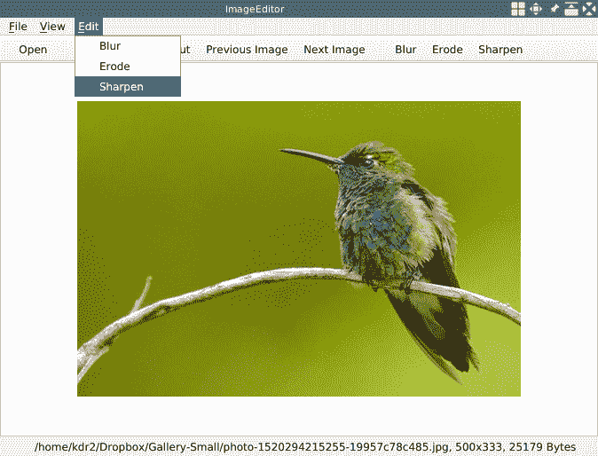

现在，让我们通过单击新插件提供的“锐化”操作来锐化图像后，看看图像是什么样子：


我们可以看到它们之间明显的区别。 请随意使用`intensity`变量和`GaussianBlur`函数的参数来获得自己喜欢的结果。

# 卡通效果

在上一节中，我们添加了新的编辑功能，以便可以在应用程序中锐化图像。 在本节中，我们将添加一个新的编辑功能，以便为图像创建有趣的卡通效果。 为了获得这种卡通效果，我们需要做两件事：首先，我们需要使图像具有卡通外观，因此我们需要找到一种减少其调色板的方法。 然后，我们将检测图像中的边缘并与它们一起产生粗体轮廓。 之后，我们将合并这些步骤的结果图像，然后获得实现了卡通效果的新图像。

幸运的是，所有这些都可以通过使用 OpenCV 库来完成。 因此，让我们开始新的插件项目，我们将其称为`CartoonPlugin`。 创建插件项目的步骤和项目的目录结构与我们之前所做的非常相似，因此，为了使本章简洁明了，在此我们不会向您展示如何逐步创建项目。

要创建项目，我们将创建一个名为`CartoonPlugin`的新目录，然后在该目录中创建项目文件和源文件。 该目录应如下所示：

```cpp
 $ ls
 cartoon_plugin.cpp cartoon_plugin.h CartoonPlugin.pro
 $
```

您可以从我们以前的插件项目之一复制项目文件，然后将`TARGET`，`HEADERS`和`SOURCES`设置的值更改为此项目的正确值。 由于源文件的内容也与先前项目中的内容非常相似，因此您可以将任何已完成的插件项目中的源文件用作模板来简化开发过程-只需复制文件，更改文件名， 其中的插件类名称，以及`name`和`eidt`方法的实现。

在此项目中，我们使用`CartoonPlugin`作为插件类名称，并在`CartoonPlugin::name`方法中使用`return "Cartoon";`作为插件类名称。 现在，我们要做的就是实现`CartoonPlugin::edit`方法。 现在让我们继续进行这一关键部分。

第一项任务是减少调色板。 为此，我们可以使用 OpenCV 库提供的双边过滤器。 尽管双边滤镜效果很好，并通过平滑平坦区域并保持锐利边缘为普通的 RGB 图像提供了卡通外观，但是它比其他平滑算法（例如，我们之前使用的高斯模糊算法）慢得多 部分）。 但是，在我们的应用程序中，速度很重要-为了使代码易于理解，我们不会创建单独的辅助线程来进行编辑工作。 如果编辑过程太慢，它将冻结我们应用程序的用户界面-也就是说，在编辑时，我们的应用程序将不是交互式的，用户界面也不会被更新。

幸运的是，我们有两种方法可以加快这一过程，从而缩短冻结时间：

1.  缩小原始图像，然后将滤镜应用于该缩小的版本。
2.  代替一次对图像应用大的双边过滤器，我们可以多次应用小双边的过滤器。

让我们看看如何做到这一点：

```cpp
         int num_down = 2;
         int num_bilateral = 7;

         cv::Mat copy1, copy2;

         copy1 = input.clone();
         for(int i = 0; i < num_down; i++) {
             cv::pyrDown(copy1, copy2);
             copy1 = copy2.clone();
         }

         for(int i = 0; i < num_bilateral; i++) {
             cv::bilateralFilter(copy1, copy2, 9, 9, 7);
             copy1 = copy2.clone();
         }

         for(int i = 0; i < num_down; i++) {
             cv::pyrUp(copy1, copy2);
             copy1 = copy2.clone();
         }
```

首先，我们定义两个`Mat`类对象`copy1`和`copy2`，然后将`input`的副本分配给`copy1`。

然后，我们使用`cv::pyrDown`重复缩小`copy1`的大小（两次通过`int num_down = 2;`）。 在此循环中，我们对两个定义的矩阵`copy1`和`copy2`进行操作。 由于`cv::pyrDown`函数不支持就地操作，因此对于输出，我们必须使用与输入矩阵不同的矩阵。 为了实现重复操作，我们应在每次操作后将所得矩阵的`copy2`克隆为`copy1`。

缩小操作后，我们在`copy1`中获得了原始图像的降采样版本。 现在，就像缩小过程一样，我们反复对`copy1`应用一个小的双边过滤器（通过`int num_bilateral = 7;`进行七次）。 此功能也不支持就地，因此我们将`copy1`用作其输入图像，并将`copy2`用作其输出图像。 我们传递给`cv::bilateralFilter`函数的最后三个参数指定像素邻域的直径，其值为`9`，色彩空间中的滤镜 sigma，其值也为`9`，以及坐标中的滤镜 sigma 空间，其值分别为`7`。 您可以参考[这里](http://homepages.inf.ed.ac.uk/rbf/CVonline/LOCAL_COPIES/MANDUCHI1/Bilateral_Filtering.html)了解如何在过滤器中使用这些值。

缩小调色板后，我们应该将向下采样的图像放大到其原始大小。 这是通过在`copy1`上调用`cv::pyrUp`的次数与在其上调用`cv::pyrDown`相同的次数来完成的。

因为在缩小时将结果图像的大小计算为`Size((input.cols + 1) / 2, (input.rows + 1) / 2)`，而在放大时将结果图像的大小计算为`Size(input.cols * 2, (input.rows * 2)`，所以`copy1`矩阵的大小可能与原始图像不同。 它可能等于或大于原始像素几个像素。 在此，如果`copy1`在尺寸上与原始图片不同，则应将`copy1`调整为原始图片的尺寸：

```cpp
         if (input.cols != copy1.cols || input.rows != copy1.rows) {
             cv::Rect rect(0, 0, input.cols, input.rows);
             copy1(rect).copyTo(copy2);
             copy1 = copy2;
         }
```

至此，我们得到了原始图像的副本，该副本的调色板减小且尺寸不变。 现在，让我们继续前进，检测边缘并生成一些大胆的轮廓。 OpenCV 提供了许多检测边缘的功能。 在这里，我们选择`cv::adaptiveThreshold`函数并以`cv::THRESH_BINARY`作为其阈值类型进行调用以执行边缘检测。 在自适应阈值算法中，不是使用全局值作为阈值，而是使用动态阈值，该阈值由当前像素周围较小区域中的像素确定。 这样，我们可以检测每个小区域中最显着的特征，并据此计算阈值。 这些功能正是我们应该在图像中的对象周围绘制粗体和黑色轮廓的地方。 同时，自适应算法也有其弱点-容易受到噪声的影响。 因此，最好在检测边缘之前对图像应用中值过滤器，因为中值过滤器会将每个像素的值设置为周围所有像素的中值，这样可以减少噪声。 让我们看看如何做到这一点：

```cpp
         cv::Mat image_gray, image_edge;

         cv::cvtColor(input, image_gray, cv::COLOR_RGB2GRAY);
         cv::medianBlur(image_gray, image_gray, 5);

         cv::adaptiveThreshold(image_gray, image_gray, 255,
             cv::ADAPTIVE_THRESH_MEAN_C, cv::THRESH_BINARY, 9, 2);

         cv::cvtColor(image_gray, image_edge, cv::COLOR_GRAY2RGB);
```

首先，我们通过调用`cvtColor`函数将输入图像转换为灰度图像，然后将`cv::COLOR_RGB2GRAY`作为颜色空间转换代码作为其第三个参数。 此函数也不能就地工作，因此我们使用另一个与输入矩阵不同的矩阵`image_gray`作为输出矩阵。 此后，我们在`image_gray`矩阵中获得原始图像的灰度版本。 然后，我们调用`cv::medianBlur`将中值滤镜应用于灰度图像。 如您所见，在此函数调用中，我们将`image_gray`矩阵用作其输入和输出矩阵。 这是因为此功能支持就地操作。 它可以就地处理输入矩阵的数据； 也就是说，它从输入读取数据，进行计算，然后将结果写入输入矩阵，而不会干扰图像。

应用中值过滤器后，我们在灰度图像上调用`cv::adaptiveThreshold`以检测图像中的边缘。 我们在灰度图像上进行此操作，因此，在执行此操作后，灰度图像将变为仅包含边缘的二进制图像。 然后，我们将二进制边缘转换为 RGB 图像，并通过调用`cvtColor`将其存储在`image_edge`矩阵中。

现在，调色板已缩小并且边缘图像已准备就绪，让我们通过按位`and`操作合并它们并将其分配给`output`矩阵以返回它们：

```cpp
         output = copy1 & image_edge;
```

至此，所有开发工作已经完成。 现在，该编译并测试我们的插件了：

```cpp
 $ make
 g++ -c -pipe -O2 -Wall ...
 # output truncated
 $ cp libCartoonPlugin.so.1.0.0 ../ImageEditor/plugins/libCartoonPlugin.so
 $ ls ../ImageEditor/plugins/
 libCartoonPlugin.so libErodePlugin.so libSharpenPlugin.so
 $ export LD_LIBRARY_PATH=/home/kdr2/programs/opencv/lib/
 $ ../ImageEditor/ImageEditor
```

启动我们的应用程序并使用它打开图像后，我们得到以下输出：

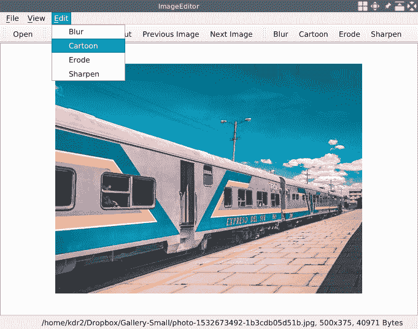

让我们单击卡通动作，看看会发生什么：

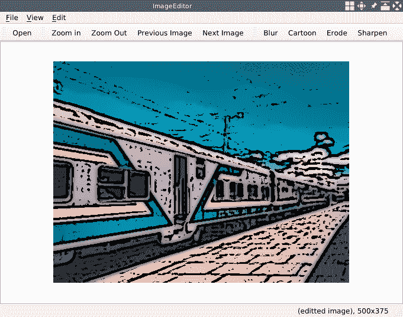

这还不错，您可以随意使用所有滤镜功能的参数来自己调整卡通效果。

在本节中，我们使用了 OpenCV 提供的许多过滤器功能。 在调用这些函数时，我指出了`medianBlur`函数支持就地操作，而`bilateralFilter`函数则不支持。 这是什么意思，我们如何知道某个函数是否支持就地操作？

如前所述，如果一个函数支持就地操作，则意味着该函数可以从输入图像读取，进行计算，然后将结果写入矩阵，该矩阵可以是我们用作输入的矩阵 矩阵或与输入矩阵不同的矩阵。 当我们使用一个矩阵作为其输入和输出时，该函数仍然可以正常工作，并将结果放入输入矩阵中而不会破坏数据。 如果某个函数不支持就地运算，则必须使用与输入矩阵不同的矩阵作为其输出，否则数据可能会损坏。 实际上，在 OpenCV 的实现中，它会断言以确保在不支持就地操作的函数中，输入和输出不是同一矩阵，或者是共享同一数据缓冲区的不同矩阵。 如果某个函数支持就地操作，则可以使用它来提高程序的性能，因为这种方式可以节省内存。 由于 OpenCV 有充分的文档说明，因此可以参考文档以了解功能是否支持就地操作。 让我们看一下我们刚刚使用的`medianBlur`函数的文档：

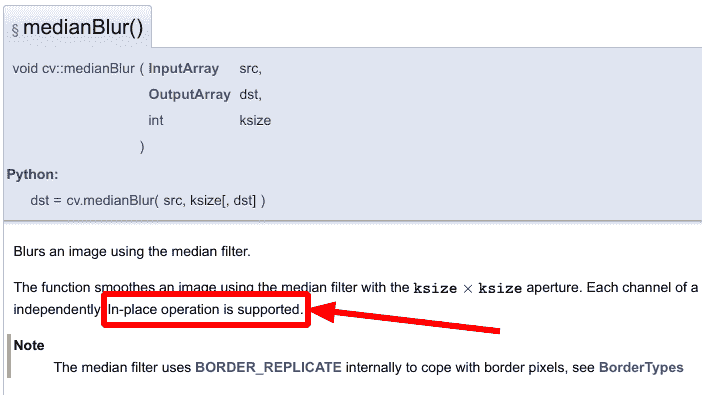

在前面的屏幕快照中，我突出显示了该函数支持就地操作的行。 一些（但不是全部）不支持就地操作的功能也有一条声明明确指出。 例如`bilateralFilter()`函数，我们在本节中也使用了该函数：

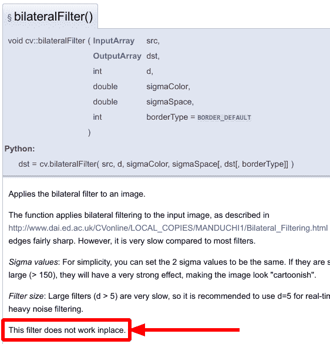

值得注意的是，如果文档中说某个功能支持就地操作，那么它将支持。 如果文档没有说明某个函数是否支持就地操作，则最好假定它不支持就地操作。

# 旋转影像

在前面的部分中，我们已将许多编辑功能作为插件添加，所有这些功能都利用了 OpenCV 提供的图像过滤器。 从本节开始，我们将添加一些利用 OpenCV 库的转换功能的功能。

根据 OpenCV 库的文档，OpenCV 中有两个图像转换类别：

*   几何变换
*   杂项变换（除几何变换外的所有变换）

在本节和下一部分中，我们将研究几何变换。 我们可以从它们的名称猜测得出，几何变换主要处理图像的几何属性，例如图像的大小，方向和形状。 它们不更改图像的内容，而是根据几何变换的性质，通过在周围移动图像的像素来更改图像的形式和形状。

让我们首先从简单的几何变换开始-旋转图像。 使用 OpenCV 旋转图像有多种方法。 例如，我们可以在矩阵上应用转置和翻转的复合操作，也可以使用适当的变换矩阵进行仿射变换。 在本节中，我们将使用后一种方法。

现在是时候开始一个新的动手项目来开发旋转插件了。 我们可以通过使用以前的插件项目作为模板来做到这一点。 以下是此过程的重点列表：

1.  使用`RotatePlugin`作为项目名称。
2.  创建项目文件和源文件（`.h`文件和`.cpp`文件）。
3.  更改项目文件中的相关设置。
4.  使用`RotatePlugin`作为插件类名称。
5.  在`name`方法中返回`Rotate`作为插件名称。
6.  更改`edit`方法的实现。

除了最后一步，每个步骤都非常简单明了。 因此，让我们跳过前五个步骤，直接进入最后一步-这是我们在此插件中实现`edit`方法的方式：

```cpp
     void RotatePlugin::edit(const cv::Mat &input, cv::Mat &output)
     {
         double angle = 45.0;
         double scale = 1.0;
         cv::Point2f center = cv::Point(input.cols/2, input.rows/2);
         cv::Mat rotateMatrix = cv::getRotationMatrix2D(center, angle, scale);

         cv::Mat result;
         cv::warpAffine(input, result,
             rotateMatrix, input.size(),
             cv::INTER_LINEAR, cv::BORDER_CONSTANT);
         output = result;
     }
```

如前所述，我们使用仿射变换来进行旋转，这是通过调用 OpenCV 库提供的`cv::warpAffine`函数来实现的。 此函数不支持就地操作，因此我们将定义一个新的临时矩阵`result`来存储输出。

当我们在 ImageEditor 应用程序中调用每个插件的`edit`方法时，我们使用一个矩阵作为输入和输出参数，即`plugin_ptr->edit(mat, mat);`，因此，在插件的 edit 方法的实现中，参数 input 和 输出实际上是相同的矩阵。 这意味着我们不能将它们传递给不支持就地操作的函数。

`warpAffine`函数将称为转换矩阵的矩阵作为其第三个参数。 该变换矩阵包含描述仿射变换应如何完成的数据。 手工编写此转换矩阵有点复杂，因此 OpenCV 提供了生成该转换矩阵的功能。 为了生成旋转的变换矩阵，我们可以使用`cv::getRotationMatrix2D`函数，为其指定一个点作为轴点，一个角度和一个缩放比例。

在我们的代码中，我们将输入图像的中心点用作旋转的轴点，并使用正数 45 表示旋转将逆时针旋转 45 度这一事实。 由于我们只想旋转图像，因此我们使用 1.0 作为缩放比例。 准备好这些参数后，我们通过调用`cv::getRotationMatrix2D`函数获得`rotateMatrix`，然后将其传递给第三位置的`cv::warpAffine`。

`cv::warpAffine`的第四个参数是输出图像的大小。 我们在这里使用输入图像的大小来确保图像的大小在编辑过程中不会改变。 第五个参数是插值方法，因此在这里我们只使用`cv::INTER_LINEAR`。 第六个参数是输出图像边界的像素外推方法。 我们在这里使用`cv::BORDER_CONSTANT`，以便在旋转后，如果某些区域未被原始图像覆盖，则将用恒定的颜色填充它们。 我们可以将此颜色指定为第七个参数，否则默认使用黑色。

既然代码已经清晰了，让我们编译和测试插件：

```cpp
 $ make
 g++ -c -pipe -O2 -Wall ...
 # output truncated
 $ cp libRotatePlugin.so.1.0.0 ../ImageEditor/plugins/libRotatePlugin.so
 $ ls ../ImageEditor/plugins/
 libCartoonPlugin.so libErodePlugin.so libRotatePlugin.so libSharpenPlugin.so
 $ export LD_LIBRARY_PATH=/home/kdr2/programs/opencv/lib/
 $ ../ImageEditor/ImageEditor
```

打开图像后，我们应该获得以下输出：

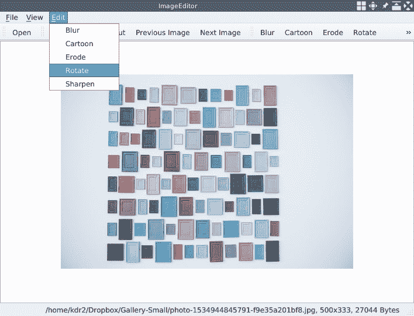

让我们单击“旋转”操作，看看会发生什么：

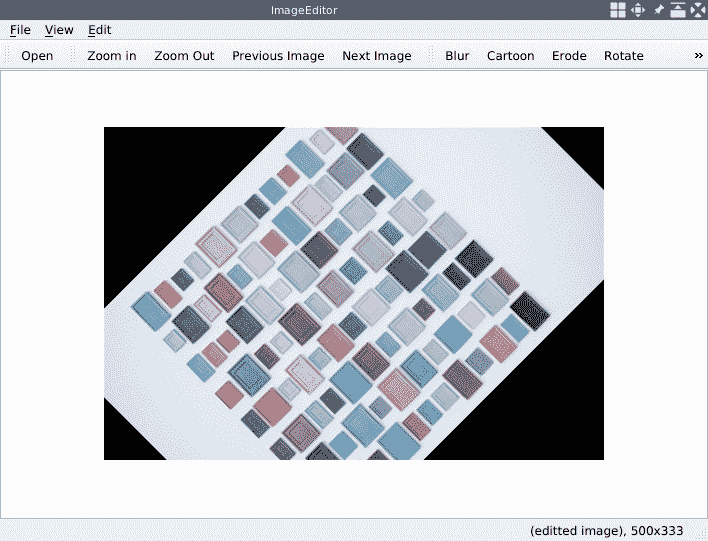

如我们所见，图像正如我们预期的那样逆时针旋转 45 度。 随意更改中心点，角度和比例的值以查看会发生什么。

# 仿射变换

在上一节中，我们使用`warpAffine`成功旋转了图像。 在本节中，我们将尝试使用相同的函数执行仿射变换。

首先，我们将创建一个新的编辑插件项目，并使用`AffinePlugin`作为项目名称和插件类名称，然后使用`Affine`作为操作名称（即，我们将在`name`方法中返回此字符串） ）。

这次，在`edit`方法中，我们将使用另一种方法来获取`warpAffine`函数的转换矩阵。 首先，我们准备两个三角形-一个用于输入图像，另一个用于输出图像。 在我们的代码中，我们使用下图中显示的三角形：

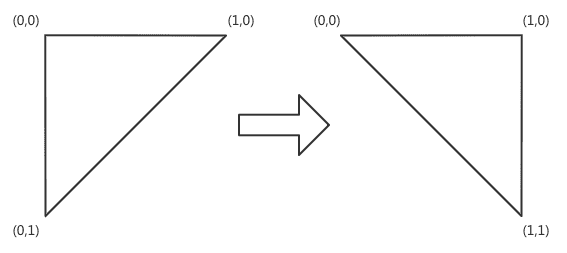

左边的一个用于输入，而右边的一个用于输出。 我们可以很容易地看到，在此变换中，图像的顶部将保持不变，而图像的底部将向右移动与图像宽度相同的距离。

在代码中，我们将使用三个`Point2f`类的数组表示每个三角形，然后将它们传递给`getAffineTransform`函数以获得转换矩阵。 一旦获得了转换矩阵，就可以调用`warpAffine`函数，就像在`RotatePlugin`项目中所做的那样。 这是我们在代码中执行此操作的方式：

```cpp
     void AffinePlugin::edit(const cv::Mat &input, cv::Mat &output)
     {

         cv::Point2f triangleA[3];
         cv::Point2f triangleB[3];

         triangleA[0] = cv::Point2f(0 , 0);
         triangleA[1] = cv::Point2f(1 , 0);
         triangleA[2] = cv::Point2f(0 , 1);

         triangleB[0] = cv::Point2f(0, 0);
         triangleB[1] = cv::Point2f(1, 0);
         triangleB[2] = cv::Point2f(1, 1);

         cv::Mat affineMatrix = cv::getAffineTransform(triangleA, triangleB);
         cv::Mat result;
         cv::warpAffine(
             input, result,
             affineMatrix, input.size(), // output image size, same as input
             cv::INTER_CUBIC, // Interpolation method
             cv::BORDER_CONSTANT // Extrapolation method
             //BORDER_WRAP // Extrapolation method
         );

         output = result;
     }
```

现在我们已经完成了开发，让我们编译项目，复制插件，然后运行`ImageEditor`应用程序：

```cpp
 $ make
 g++ -c -pipe -O2 -Wall ...
 # output truncated
 $ cp libAffinePlugin.so.1.0.0 ../ImageEditor/plugins/libAffinePlugin.so
 $ ls ../ImageEditor/plugins/
 libAffinePlugin.so libCartoonPlugin.so libErodePlugin.so
 libRotatePlugin.so libSharpenPlugin.so
 $ export LD_LIBRARY_PATH=/home/kdr2/programs/opencv/lib/
 $ ../ImageEditor/ImageEditor
```

这是打开图像后我们的应用程序的外观：

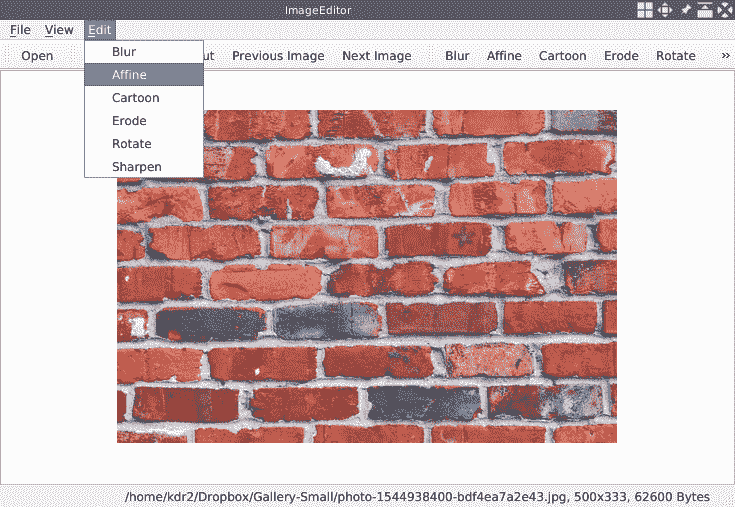

这是我们在触发仿射操作后获得的效果：

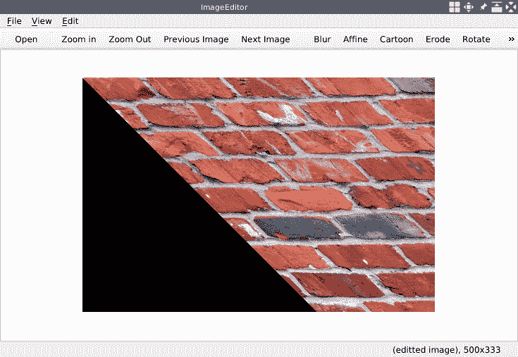

万岁！ 图像以与上图中所示相同的方式进行转换。

您可能会注意到，在此代码中，我们也使用`BORDER_CONSTANT`作为边框类型，因此，在图像倾斜移动后，其左下角将被恒定的颜色填充，默认情况下为黑色。 除了用恒定的颜色填充边界外，还有许多其他方法可以对边界进行插值。 以下列表显示了 OpenCV 文档中的所有方法：

*   `BORDER_CONSTANT`：以指定的`i`插值为`iiiiii|abcdefgh|iiiiiii`
*   `BORDER_REPLICATE`：内插为`aaaaaa|abcdefgh|hhhhhhh`
*   `BORDER_REFLECT`：内插为`fedcba|abcdefgh|hgfedcb`
*   `BORDER_WRAP`：内插为`cdefgh|abcdefgh|abcdefg`
*   `BORDER_REFLECT_101`：内插为``gfedcb|abcdefgh|gfedcba``
*   `BORDER_TRANSPARENT`：内插为`uvwxyz|abcdefgh|ijklmno`
*   `BORDER_REFLECT101`：与`BORDER_REFLECT_101`相同
*   `BORDER_DEFAULT`：与`BORDER_REFLECT_101`相同
*   `BORDER_ISOLATED`：不要在 ROI 之外看

在此列表的解释性条款中，`|abcdefgh|`表示原始图像，并且其周围的字母表示将如何进行插值。 例如，如果我们使用`BORDER_WRAP`值，则插值将为`cdefgh|abcdefgh|abcdefg`； 也就是说，它将使用图像的右侧填充左侧边框，并使用图像的左侧填充右侧边框。 作为一种特殊情况，`BORDER_TRANSPARENT`保持目标矩阵中的相应像素不变，并且不使用输入图像中的颜色。

如果我们在`AffinePlugin`插件中使用`BORDER_WRAP`，则转换后的图像将如下所示：

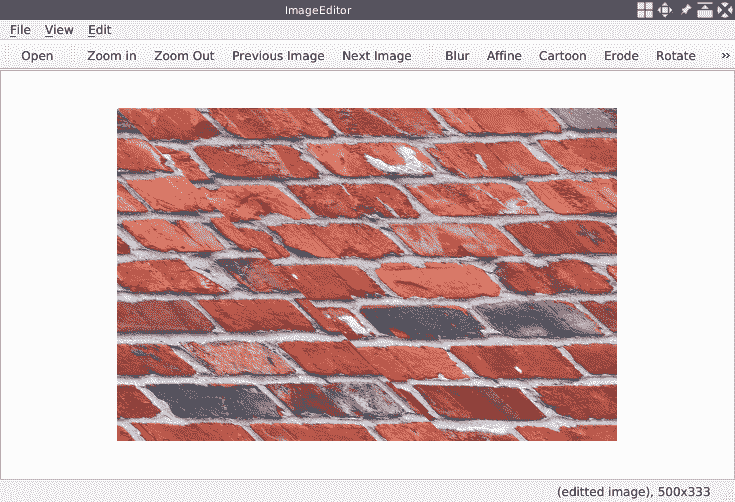

这里没有展示所有边界插值类型的效果，因此，如果您有兴趣，请自己尝试。

在本节和上一节中，我们了解了如何使用仿射变换来变换图像。 除了这种变换图像的方法之外，还有许多方法可以进行几何变换。 所有这些方法都是 OpenCV 提供的，包括调整大小，透视图转换，重新映射以及许多其他转换，例如色彩空间转换。 这些几何变换是可查看的，您可以在[这个页面](https://docs.opencv.org/4.0.0/da/d54/group__imgproc__transform.html)中找到其文档。 在其他转换方面，我们在`CartoonPlugin`插件中使用了其中之一`cv::adaptiveThreshold`。 可以在[这个页面](https://docs.opencv.org/4.0.0/d7/d1b/group__imgproc__misc.html)上找到有关此类转换的完整文档。 您可以在我们的插件项目或您自己的插件中摆弄所有这些转换，以了解有关它们的更多信息。

# 总结

在本章中，我们重新制作了在第 1 章，“构建图像查看器”中构建的用于图像查看的桌面应用程序，以制作图像编辑器应用程序。 然后，我们添加了一个简单的编辑功能来模糊图像。 同时，我们了解了如何为 Qt 应用程序安装和设置 OpenCV，与 Qt 和 OpenCV 中的图像处理相关的数据结构，以及如何使用 OpenCV 处理图像。

之后，我们了解了 Qt 库的插件机制，并抽象出了一种以更灵活，更便捷的方式向我们的应用程序添加编辑功能的方法，即作为插件。 例如，我们编写了第一个插件来腐蚀图像。

然后，我们将注意力转移到 OpenCV 库上，讨论如何像 pro 一样编辑图像-我们制作了许多插件来编辑图像，锐化图像，制作卡通效果，旋转，执行仿射变换等。

在下一章中，我们将学习如何使用 OpenCV 和 Qt 处理视频，并且将在运动分析技术的帮助下在家中构建一个简单的安全应用程序。

# 问题

尝试这些问题，以测试您对本章的了解：

1.  我们如何知道 OpenCV 函数是否支持就地操作？
2.  我们如何为作为插件添加的每个动作添加一个热键？
3.  我们如何添加一个新动作来丢弃应用程序中当前图像的所有更改？
4.  我们如何使用 OpenCV 调整图像大小？