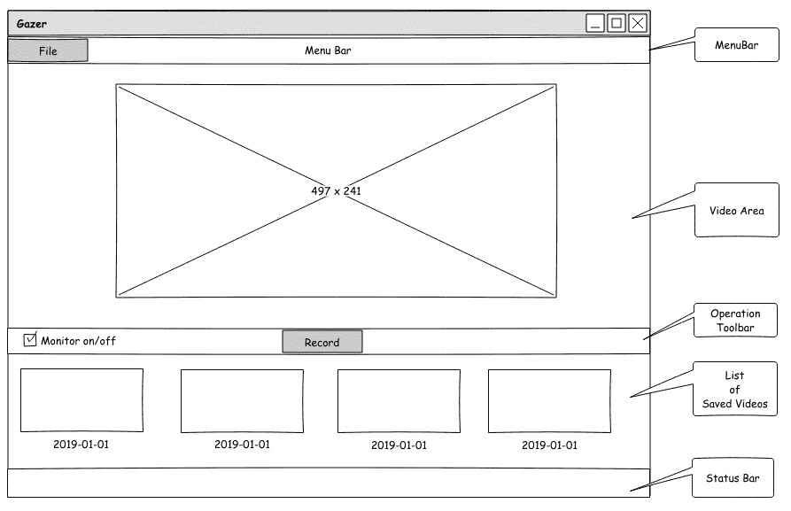
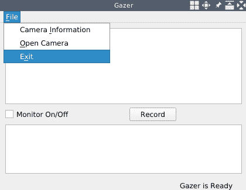
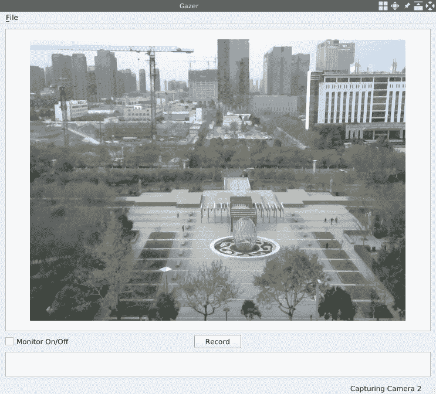
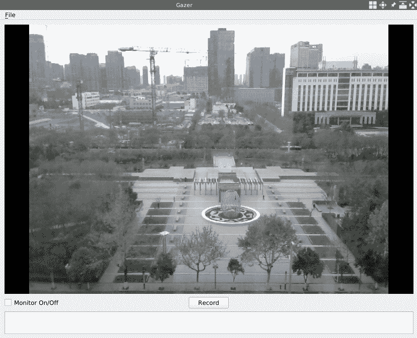
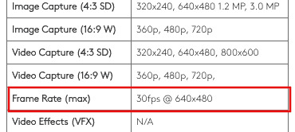
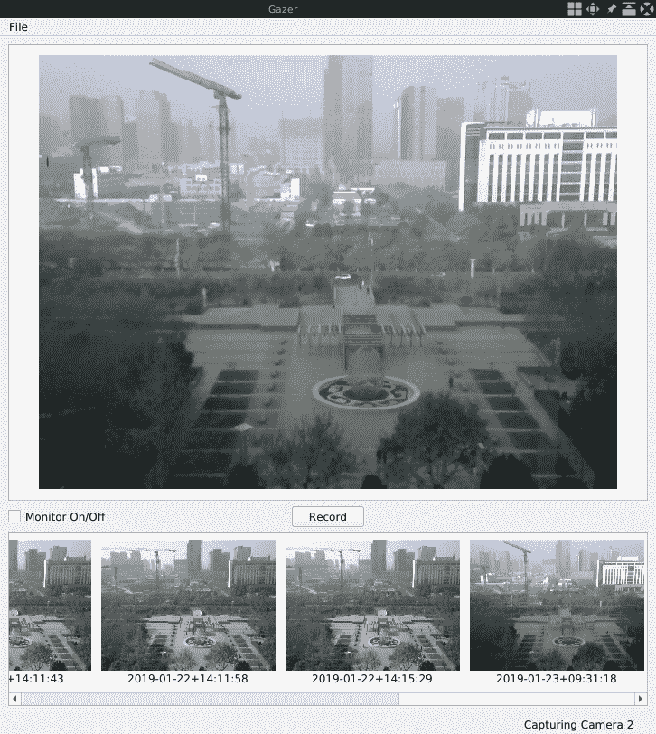
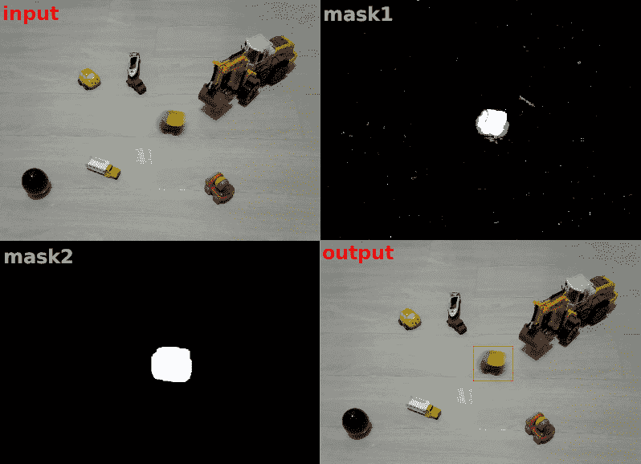
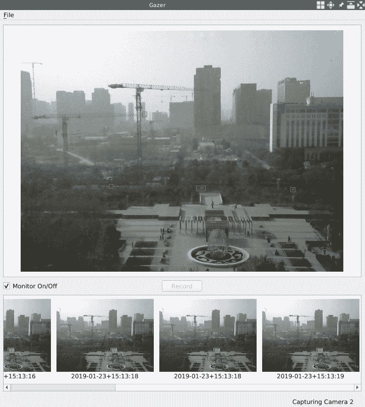
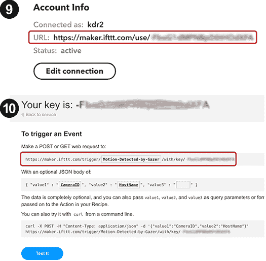
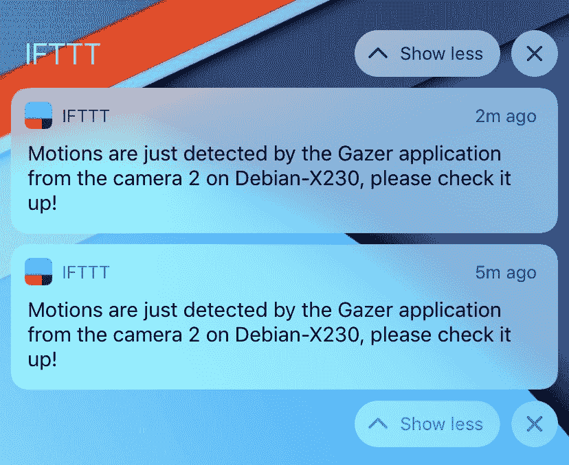

# 家庭安全应用

在第 2 章，“像专家一样编辑图像”，我们通过构建自己的图像编辑器应用程序，了解了 Qt 库的插件机制以及来自 OpenCV 库的许多图像过滤器和转换。 在本章中，我们将从处理图像转到处理视频。 我们将构建一个新的应用程序，通过该应用程序，我们可以使用 PC 的网络摄像头执行许多操作，例如播放从其实时捕获的视频，记录其视频提要中的部分视频，计算其**每秒帧**（**FPS**），通过对其视频馈送进行实时运动分析来检测运动，等等。

本章将涵盖以下主题：

*   设计和创建**用户界面**（**UI**）
*   处理相机和视频
*   录制影片
*   实时计算 FPS
*   运动分析和运动检测
*   在桌面应用程序中向手机发送通知

# 技术要求

正如我们在前几章中所看到的，您必须安装 Qt 版本 5（至少），并且具有 C++ 和 Qt 编程的基本知识。 另外，应正确安装最新版本的 OpenCV（4.0）。 除了核心和`imgproc`模块外，本章还将使用 OpenCV 的视频和`videoio`模块。 在前面的章节之后，必须已经满足这些要求。

在本章中，我们将向您展示如何处理摄像头，因此您需要一个网络摄像头，它既可以是内置的也可以是外部的，可以从计算机上访问。

本章还要求具备多线程的基本知识。

[本章的所有代码都可以在本书的 GitHub 存储库中找到](https://github.com/PacktPublishing/Qt-5-and-OpenCV-4-Computer-Vision-Projects/tree/master/Chapter-03)。

[观看以下视频，查看运行中的代码](http://bit.ly/2Fj4BJ8)

# Gazer 应用程序

为了深入研究相机处理，视频处理和运动分析，我们将开发一个全新的应用程序。 除了学习这些主题之外，我们还将获得一个具有许多实用功能的应用程序：能够通过网络摄像头录制视频，监控我们的家庭安全，并在检测到可疑动作时通过移动设备通知我们。 让我们阐明其功能，如下所示：

*   打开网络摄像头并实时播放从中捕获的视频
*   通过单击开始/停止按钮从网络摄像头录制视频
*   显示已保存视频的列表
*   检测到动作，保存视频并在检测到可疑动作时向我们的手机发送通知
*   显示有关摄像机和应用程序状态的一些信息

在澄清了这些功能之后，我们可以设计 UI。 再次，我们将使用在第 1 章，“构建图像查看器”，Pencil 中使用的开源 GUI 原型工具绘制应用程序原型的线框，如下图所示：



如上图所示，我们将整个窗口分为五个部分：菜单栏，将要播放视频的主要区域，操作按钮所在的操作区域，其中包含已保存视频缩略图的水平列表。 将被放置，以及状态栏。

[您可以从 GitHub 上的代码库中](https://github.com/PacktPublishing/Qt-5-and-OpenCV-4-Computer-Vision-Projects)找到此设计的源文件。 该文件位于存储库的根目录中，称为`WireFrames.epgz`。 不要忘记应该使用 Pencil 应用程序将其打开。 线框位于此文件的“第 2 页”上。

# 启动项目并设置 UI

好的，我们现在知道了应用程序的外观，所以让我们袖手旁观并使用 Qt 设置 UI！

命名项目和`Gazer`应用程序。 现在，让我们在终端中创建项目：

```cpp
 $ mkdir Gazer/
 $ cd Gazer/
 $ touch main.cpp
 $ ls
 main.cpp
 $ qmake -project
 $ ls
 Gazer.pro main.cpp
 $
```

接下来，让我们编辑`Gazer.pro`项目文件。 首先，我们需要从将使用的 Qt 库中设置应用程序信息和模块：

```cpp
     TEMPLATE = app
     TARGET = Gazer
     INCLUDEPATH += .

     QT += core gui multimedia
     greaterThan(QT_MAJOR_VERSION, 4): QT += widgets
```

现在，我们对`qmake`和 Qt 项目的项目文件非常熟悉，因此，我无需在此处逐行解释这段代码。 我们应该注意的唯一一点是，我们包括 Qt 库的多媒体模块，稍后我们将使用它。

然后，我们将设置 OpenCV 库的配置：

```cpp
     unix: !mac {
         INCLUDEPATH += /home/kdr2/programs/opencv/include/opencv4
         LIBS += -L/home/kdr2/programs/opencv/lib -lopencv_core -lopencv_imgproc -lopencv_video -lopencv_videoio
     }

     unix: mac {
         INCLUDEPATH += /path/to/opencv/include/opencv4
         LIBS += -L/path/to/opencv/lib -lopencv_world
     }

     win32 {
         INCLUDEPATH += c:/path/to/opencv/include/opencv4
         LIBS += -lc:/path/to/opencv/lib/opencv_world
     }
```

我们将 OpenCV 库的`video`和`videoio`模块附加到`LIBS`键的值的末尾，因为我们将使用这些模块来处理项目中的视频。 您应该注意的另一点是，您应该将这段代码中的路径更改为实际的 OpenCV 安装路径。

最后，让我们设置标题和源：

```cpp
     HEADERS += mainwindow.h
     SOURCES += main.cpp mainwindow.cpp
```

在此处设置三个源文件（包括头文件）时，现在只有一个空的`main.cpp`文件。 不用担心，在之前的项目中我们已经做过很多此类工作，所以让我们进行一些复制，粘贴和更改：

1.  将`main.cpp`文件从我们之前的任何项目复制到我们的`Gazer`项目中，例如，第 1 章，“构建图像查看器”中的`ImageViewer`项目。 内容不变。
2.  从先前的项目之一将`mainwindown.h`文件复制到我们的`Gazer`项目，打开文件，然后删除类正文中除`Q_OBJECT`宏的行，构造器和析构函数之外的所有行。 更改后，类主体应如下所示：

```cpp
       class MainWindow : public QMainWindow
       {
           Q_OBJECT

       public:
           explicit MainWindow(QWidget *parent=nullptr);
           ~MainWindow();
       }
```

3.  将`mainwindow.cpp`源文件创建为一个空文件，并向其添加构造器和析构函数的实现：

```cpp
       MainWindow::MainWindow(QWidget *parent) :
           QMainWindow(parent)
       {
       }

       MainWindow::~MainWindow()
       {
       }
```

您现在可以编译并运行我们的应用程序，但是运行时将看到一个空白窗口。

要按照我们的设计设置完整的 UI，我们应该在空白窗口中添加几个 Qt 小部件。 首先，我们将在`MainWindow`类的主体的私有部分中为该菜单声明一个`QMenu`方法和三个`QAction`方法：

```cpp
     private:
         QMenu *fileMenu;

         QAction *cameraInfoAction;
         QAction *openCameraAction;
         QAction *exitAction;
```

接下来是我们将显示视频的主要区域。 将使用 OpenCV 库逐帧捕获视频，并且每一帧都是图像本身。 要播放视频，我们可以在捕获到特定区域后立即显示该框架。 因此，我们仍然使用`QGraphicsSence`和`QGraphicsView`逐帧显示帧，以达到播放视频的效果：

```cpp
         QGraphicsScene *imageScene;
         QGraphicsView *imageView;
```

然后，在操作区域上有按钮，已保存视频的水平列表和状态栏：

```cpp
         QCheckBox *monitorCheckBox;
         QPushButton *recordButton;

         QListView *saved_list;

         QStatusBar *mainStatusBar;
         QLabel *mainStatusLabel;
```

我们声明的第一行中的复选框将用于告诉我们安全监视器的状态是否已打开。 如果选中，我们的应用程序将执行运动检测并在发生某些情况时发送通知； 否则，该应用程序将只能用作摄像机播放器。 该按钮将用于开始或停止录制视频。

在头文件中，我们只是声明了这些小部件，但是如我们在原型线框中所设计的那样，为了将这些小部件布置在正确的位置，我们应该采用 Qt 布局系统。 借助 Qt 布局系统，可以自动排列父窗口小部件的子窗口小部件，以便所有可用空间将被子窗口小部件正确使用。 布局系统还将照顾所有窗口小部件的排列，并确保在托管窗口小部件的父窗口小部件的大小或位置发生更改时，或者在托管窗口小部件本身的大小或位置发生变化时对其进行管理。

对于此布局系统，Qt 提供了许多类，它们都是从`QLayout`类派生的。 让我们看一些例子：

*   `QHBoxLayout`类在水平行中从左到右排列窗口小部件。
*   `QVBoxLayout`类在垂直列中按从上到下的顺序排列小部件。
*   `QGridLayout`类安排可占据二维网格中多个单元的窗口小部件。
*   `QFormLayout`类在两列网格中排列小部件，每行有两个小部件排列在描述性标签字段中。

对于我们的应用程序`Gazer`的设计，我们可以使用`QGridLayout`类，该类具有多行和仅一列。 根据我的粗略估计，这三个部分（主要区域，操作区域和保存的视频列表）的高度比例约为 12:1:4。 因此，我们可以创建一个`17 x 1`的`QGridLayout`类来安排我们设计和声明的小部件。

借助介绍的布局系统知识，让我们设置我们设计的完整 UI。 首先，我们在`MainWindow`类的主体中声明两个私有方法`initUI`和`createActions`：

```cpp
     private:
         void initUI();
         void createActions();
```

然后，我们转到`mainwindow.cpp`源文件以实现它们。 让我们先来看`void MainWindow::initUI()`。 在此方法中，我们将应用程序的主窗口设置为适当的大小，并在开头创建文件菜单：

```cpp
         this->resize(1000, 800);
         // setup menubar
         fileMenu = menuBar()->addMenu("&File");
```

然后，我们设置窗口的中心区域：

```cpp
         QGridLayout *main_layout = new QGridLayout();
         imageScene = new QGraphicsScene(this);
         imageView = new QGraphicsView(imageScene);
         main_layout->addWidget(imageView, 0, 0, 12, 1);
```

在这段代码中，我们将创建一个`QGridLayout`类的新实例，其大小将为`17 x 1`，这是我们之前计划的。 然后，我们创建`QGraphicsSence`和`QGraphicsView`的实例，这些实例将用于显示图像并播放视频。 最后一行对我们来说很新，它显示了如何向布局添加小部件。 我们用五个参数调用`QGridLayout`实例的`addWidget`方法：第一个是要添加到布局中的小部件，接下来的四个数字描述一个矩形（开始行，开始列， 它跨越的行数，以及跨越的列数）所添加的小部件将占据的行数。 在我们的代码中，`QGraphicsView`将占据网格布局的前 12 行。

以下视频播放区域是操作区域。 在此区域中，我们有两个小部件，一个复选框和一个按钮。 因此，我们需要一种新的布局来安排它们。 我们还将在此处选择`QGridLayout`进行排列。 这意味着我们将在主网格布局中嵌套另一个网格布局：

```cpp
         QGridLayout *tools_layout = new QGridLayout();
         main_layout->addLayout(tools_layout, 12, 0, 1, 1);

         monitorCheckBox = new QCheckBox(this);
         monitorCheckBox->setText("Monitor On/Off");
         tools_layout->addWidget(monitorCheckBox, 0, 0);

         recordButton = new QPushButton(this);
         recordButton->setText("Record");
         tools_layout->addWidget(recordButton, 0, 1, Qt::AlignHCenter);
         tools_layout->addWidget(new QLabel(this), 0, 2);
```

在前面的代码的前两行中，我们创建一个名为`tools_layout`的新网格布局，然后将其添加到主网格布局中。 以`12, 0, 1, 1`作为其位置矩形，此子布局仅占据主网格布局中的一行，即第 13 行。 子布局放置到位后，让我们创建子窗口小部件并将其添加到其中。这些窗口小部件应水平排列在一行中，因此布局的大小将为`1xN`。 如前所述，我们有两个小部件将放置在操作区域中，但是按照我们的设计，我们希望将最重要的小部件（记录按钮）在水平方向上居中对齐。 为此，我们在`tools_layout`后面添加一个占位符，即空白的`QLable`方法。 现在，我们在布局中有三个小部件。 记录按钮是第二个按钮，即中间的按钮。

在前面的代码中，很明显，我们创建了小部件，设置了它们的文本，然后将它们添加到布局中。 值得注意的是，当我们调用网格布局对象的`addWidget`方法时，我们仅使用三个参数，而不是使用五个参数，就像在主布局对象上调用它一样。 这是因为在此布局中，任何小部件都没有行跨度或列跨度-仅提供行索引和列索引就足以为该小部件定位单个单元格。 另外，当我们添加按钮时，我们使用额外的对齐参数`Qt::AlignHCenter`，以确保该按钮不仅位于中间单元格中，而且位于该单元格的中央。

在操作区域下方是已保存视频的列表。 Qt 提供了一个名为`QListView`的小部件，我们可以在此处直接使用它，因此我们只需创建对象并将其添加到主布局即可：

```cpp
         // list of saved videos
         saved_list = new QListView(this);
         main_layout->addWidget(saved_list, 13, 0, 4, 1);
```

还记得 12:1:4 的比例吗？ 在这里，我们使列表小部件在主网格布局中占据四行，从第 14 行开始。

到现在为止，主布局中的所有小部件都处于其位置。 现在是时候
将主布局添加到我们的主窗口了。 在这里，我们不能直接调用`this->setLayout(main_layout);`，因为主窗口具有自己的方式来管理其内容。 您可能还记得在前几章中完成的项目中，您会意识到我们在主窗口中调用了`setCentralWidget`来设置这些项目中的内容。 在这里，我们可以创建一个新的小部件，该小部件将以主网格布局作为其布局，然后将该小部件设置为主窗口的中央小部件：

```cpp
         QWidget *widget = new QWidget();
         widget->setLayout(main_layout);
         setCentralWidget(widget);
```

接下来需要查看的是状态栏和操作：

```cpp
         // setup status bar
         mainStatusBar = statusBar();
         mainStatusLabel = new QLabel(mainStatusBar);
         mainStatusBar->addPermanentWidget(mainStatusLabel);
         mainStatusLabel->setText("Gazer is Ready");

         createActions();
```

如您在前面的代码中看到的，除了状态栏之外，在`initUI`方法的末尾，我们调用`MainWindow::createActions`在“文件”菜单中创建操作。 `createActions`方法的实现很简单-在其中创建`QActions`的实例，然后将它们添加到“文件”菜单中。 我没有在这里逐行解释代码，因为我们在以前的项目中已经做了很多次这样的事情。 对于退出操作，我们将应用程序的`quit`插槽连接到其`triggered`信号； 对于其他操作，我们目前没有空位，但在以下各节中将提供一个空位。

现在，我们在`MainWindow`类的构造器中调用`initUI`方法。 最后，我们具有完整的 UI 设置，因此让我们编译并运行该应用程序以查看其外观：



如您所见，借助 Qt 提供的布局系统，我们可以完美地实现设计好的 UI。 如果要了解有关此功能强大的布局系统的更多信息，可以在[这个页面](https://doc.qt.io/qt-5/layout.html)上参考其文档。

# 存取相机

在上一节中，我们设置了应用程序的 UI。 在本节中，我们将播放由个人计算机的摄像头提供的视频提要。

在访问摄像机之前，我们应该了解有关它的一些信息-如果我们使用 OpenCV，则需要我们要从中捕获视频的摄像机的索引。 如果使用 Qt，则需要它的设备名称。 对于典型的笔记本电脑，它通常具有一个默认的内置网络摄像头，其索引为`0`，但其名称取决于平台或环境。 如果我们有一台计算机的多个网络摄像头，通常它们的索引和名称都取决于平台或环境。 要确定此信息，我们可以从 Qt 库中转到`QCameraInfo`类。

# 使用 Qt 列出相机

通过使用 Qt 库中的`QCameraInfo`类，我们可以轻松地获得当前计算机上的可用摄像机。 它有一个名为`availableCameras`的静态方法，该方法返回`QCameraInfo`对象的列表。

现在，我们将为`cameraInfoAction`添加一个插槽以完成此工作。 首先，我们在`mainwindow.h`文件的`MainWindow`类的主体中声明一个专用插槽：

```cpp
     private slots:
         void showCameraInfo();
```

然后，我们给出其实现，如下所示：

```cpp
     void MainWindow::showCameraInfo()
     {
         QList<QCameraInfo> cameras = QCameraInfo::availableCameras();
         QString info = QString("Available Cameras: \n");

         foreach (const QCameraInfo &cameraInfo, cameras) {
             info += " - " + cameraInfo.deviceName() + ": ";
             info += cameraInfo.description() + "\n";
         }
         QMessageBox::information(this, "Cameras", info);
     }
```

在这段代码中，我们获得了照相机信息列表，使用列表中的所有照相机构建了一个人类可读的字符串，并在提示消息框中显示了它。

最后，我们以`MainWindow::createActions`方法将此插槽连接到`cameraInfoAction`的`triggered`信号：

```cpp
         connect(cameraInfoAction, SIGNAL(triggered(bool)), this, SLOT(showCameraInfo()));
```

好的，让我们编译并运行`Gazer`应用程序。 现在，单击“文件”菜单下的“相机信息”项，然后查看提供的信息：


我的笔记本电脑有一个内置的网络摄像头和一个连接到 USB 端口的外部网络摄像头，因此该应用程序在计算机上运行时会显示两个摄像头：`/dev/video0`和`/dev/video2`。 我在笔记本电脑上使用 GNU/Linux，在此平台上，设备名称采用`/dev/video<N>`的模式，其中`<N>`是摄像机的索引。 如果您使用的是其他操作系统，则看到的信息可能与我的不同。

在这种情况下，“可用摄像头”短语中的“**可用**”一词表示已在计算机上正确连接并驱动了摄像头，并且该摄像头必须不忙，即未被任何应用程序使用。 如果任何应用程序正在使用相机，则该相机将不会包含在`QCameraInfo::availableCameras`方法的返回列表中。

# 捕捉和播放

我们已经在上一节中获得了网络摄像头的信息，因此让我们使用 OpenCV 捕获并播放来自选定网络摄像头的视频提要。

使用 OpenCV 捕获视频非常容易。 以下是一个示例：

```cpp
     #include <iostream>
     #include "opencv2/opencv.hpp"

     using namespace std;
     using namespace cv;

     int main() {
         VideoCapture cap(0);
         if(!cap.isOpened()) {
             return -1;
         }

         while(1) {
             Mat frame;
             cap >> frame;

             if (frame.empty())
                 break;

             imshow( "Frame", frame );

             char c = (char)waitKey(25);
             if(c==27) // ESC
                 break;
         }

         cap.release();
         destroyAllWindows();

         return 0;
     }
```

在前面的代码中，首先，我们使用默认摄像头的索引创建`VideoCapture`的实例，然后测试摄像头是否成功打开。 如果打开，则进入无限循环。 在循环中，我们从`VideoCapture`实例读取图像到`Mat`实例。 随着循环的进行，将从网络摄像头读取连续的图像并将它们组成视频。 在视频处理方面，这些连续图像中的每一个通常称为帧。 这就是为什么我们在前面的代码中使用名称`frame`的原因。 读取一帧后，我们检查它是否为空。 如果为`true`，则打破无限循环； 否则，我们通过调用`imshow`函数来显示它。 然后，我们等待长达 25 毫秒的按键。 如果在等待期间按下`Esc`键，我们将中断循环。 否则，无限循环将继续下去。 循环结束后，我们释放分配的资源，例如释放相机，破坏用于显示图像的窗口等。

如您所见，使用 OpenCV 捕获视频非常简单。 但是，当我们开始将此功能集成到实际的 GUI 应用程序中时，事情会变得有些复杂。 您还记得我们在第 2 章，“像高手一样编辑图像”的“卡通效果”部分中构建了生成图像卡通效果的功能吗？ 为了实现该功能，我们采用了一些慢得多的算法。 在 GUI 线程中运行缓慢的任务将在任务运行期间冻结 UI。 为了避免应用程序过于复杂，在这种情况下，我们采用优化算法的方式来缩短任务的运行时间，从而缩短了 GUI 的冻结时间。 但是在当前捕获视频的情况下，只要用户打开相机，我们就必须一直保持捕获帧，因为我们无法在时间维度上对此进行优化。 如果我们在 GUI 线程中捕获视频，则 UI 将一直冻结。 因此，为了保持应用程序界面的响应性，我们必须在不同于 GUI 线程的另一个线程中捕获视频。

Qt 库提供了许多不同的技术来处理应用程序中的多线程。 `QThread`类是最直接和最基本的工具。 它简单，但功能强大且灵活。 在本节中，我们将主要使用此类将捕获任务分成一个新线程。

要在另一个线程中进行视频捕获，我们需要做的第一件事是定义一个从`QThread`类派生的新类。 我们将此类命名为`CaptureThread`，并在`capture_thread.h`文件中对其进行声明。

让我们看一下头文件。 该文件的开头和结尾分别是一次包含宏定义和包含指令的头文件：

```cpp
     #ifndef CAPTURE_THREAD_H
     #define CAPTURE_THREAD_H

     #include <QString>
     #include <QThread>
     #include <QMutex>

     #include "opencv2/opencv.hpp"

     // ... the class declaration goes here.

     #endif // CAPTURE_THREAD_H
```

中间是类声明：

```cpp
     class CaptureThread : public QThread
     {
         Q_OBJECT
     public:
         CaptureThread(int camera, QMutex *lock);
         CaptureThread(QString videoPath, QMutex *lock);
         ~CaptureThread();
         void setRunning(bool run) {running = run; };

     protected:
         void run() override;

     signals:
         void frameCaptured(cv::Mat *data);

     private:
         bool running;
         int cameraID;
         QString videoPath;
         QMutex *data_lock;
         cv::Mat frame;
     };
```

如前所述，该类是从`QThread`类派生的，并且在其主体的第一行中，我们使用`Q_OBJECT`宏告诉 Qt 库的元对象系统负责该类。

然后，在公共部分声明两个构造器和一个析构函数。 第一个构造器接受整数（即目标网络摄像头的索引）和`QMutex`指针，该指针将用于在竞争条件下保护数据。 第二个构造器接受一个字符串，该字符串将被视为视频文件和`QMutex`指针的路径。 使用此构造器，我们可以使用视频文件来模拟网络摄像头。 还有一个称为`setRunning`的公共方法，该方法用于设置捕获线程的运行状态。

接下来是受保护的部分。 在本节中，我们声明一个名为`run`的方法。 `override`关键字指示此方法是一个虚拟方法，并且它正在覆盖与其基类的方法之一同名的方法。 `QThread`的`run`方法是线程的起点。 当我们调用线程的`start`方法时，将在创建新线程后调用其`run`方法。 稍后我们将以这种方法进行捕获工作。

然后，我们声明一个名称为`frameCapture`的信号，该信号将指向`Mat`对象的指针作为其唯一参数。 每次从网络摄像头捕获帧时，都会发出此信号。 如果您对此信号感兴趣，可以将一个插槽连接到它。

最后，在私有部分中，我们声明了许多成员字段：

*   `running`用于线程状态
*   `cameraID`用于摄像机索引
*   `videoPath`用于模拟网络摄像头的视频的路径
*   `data_lock`用于在竞争条件下保护数据
*   `frame`用于存储当前捕获的帧

就类声明而言就是这样。 现在，让我们继续进行`capture_thread.cpp`文件中的方法实现。 首先是构造器和析构函数。 它们都很简单，仅提供有关诸如字段初始化之类的信息：

```cpp
     CaptureThread::CaptureThread(int camera, QMutex *lock):
         running(false), cameraID(camera), videoPath(""), data_lock(lock)
     {
     }

     CaptureThread::CaptureThread(QString videoPath, QMutex *lock):
         running(false), cameraID(-1), videoPath(videoPath), data_lock(lock)
     {
     }

     CaptureThread::~CaptureThread() {
     }
```

接下来是最重要的部分-`run`方法的实现：

```cpp
     void CaptureThread::run() {
         running = true;
         cv::VideoCapture cap(cameraID);
         cv::Mat tmp_frame;
         while(running) {
             cap >> tmp_frame;
             if (tmp_frame.empty()) {
                 break;
             }
             cvtColor(tmp_frame, tmp_frame, cv::COLOR_BGR2RGB);
             data_lock->lock();
             frame = tmp_frame;
             data_lock->unlock();
             emit frameCaptured(&frame);
         }
         cap.release();
         running = false;
     }
```

创建线程后立即调用此方法，当它返回时，线程的寿命将结束。 因此，我们在进入此方法时将运行状态设置为`true`，并在从该方法返回之前将运行状态设置为`false`。 然后，就像本节开始时给出的示例一样，我们使用相机索引创建`VideoCapture`类的实例，并创建`Mat`的实例以保存捕获的帧。 之后是无限循环。 在循环中，我们捕获一帧并检查它是否为空。 我们正在使用 OpenCV 捕获帧，因此捕获帧的颜色顺序是 BGR 而不是 RGB。 考虑到我们将使用 Qt 显示帧，我们应该将帧转换为以 RGB 为颜色顺序的新帧。 这就是对`cvtColor`函数的调用。

准备好捕获的帧后，将其分配给`frame`类成员，然后使用指向刚刚修改的`frame`成员字段的指针发出`frameCapture`信号。 如果您对此信号感兴趣，可以将一个插槽连接到它。 在连接的插槽中，将具有指向此`frame`成员的指针作为其参数。 换句话说，您可以在连接的插槽中自由读取或写入此`frame`对象。 考虑到连接的插槽将在与捕获线程完全不同的另一个线程中运行，`frame`成员很可能同时被两个不同的线程修改，并且此行为可能会破坏其中的数据。 为了防止这种情况的发生，我们使用`QMutex`来确保在任何时候都只有一个线程正在访问`frame`成员字段。 我们在这里使用的`QMutex`实例是`QMutex *data_lock`成员字段。 在将其分配给`frame`成员之前，请先调用其`lock`方法，并在分配后调用其`unlock`方法。

如果有人将`running`状态设置为`false`（通常在另一个线程中），则无限
循环将中断，然后我们进行一些清理工作，例如释放`VideoCapture`实例并确保运行标志设置为`false`。

至此，捕获线程的所有工作都已完成。 接下来，我们需要将其与主窗口集成。 因此，让我们开始吧。

首先，我们在`mainwindow.h`头文件的`MainWindow`类中添加一些私有成员字段：

```cpp
         cv::Mat currentFrame;

         // for capture thread
         QMutex *data_lock;
         CaptureThread *capturer;
```

`currentFrame`成员用于存储捕获线程捕获的帧。 `capturer`是捕获线程的句柄，当用户打开摄像机时，我们将使用它来进行视频捕获。 `QMutext`对象`data_lock`用于在竞争条件下保护`CaptureThread.frame`的数据。 它将在 GUI 线程和捕获线程中使用。 然后，在`MainWindow`类的构造器中，我们在调用`initUI`方法之后初始化`data_lock`字段：

```cpp
         initUI();
         data_lock = new QMutex();
```

接下来，让我们回到`mainwindow.h`头文件，并在类声明中添加另外两个私有插槽：

```cpp
         void openCamera();
         void updateFrame(cv::Mat*);
```

`openCamera`插槽用于创建新的捕获线程，并在触发文件菜单中的“打开相机”操作时调用。 首先，我们将该插槽连接到`createActions`方法中“打开摄像机”动作的`triggered`信号：

```cpp
         connect(openCameraAction, SIGNAL(triggered(bool)), this, SLOT(openCamera()));
```

然后，我们转到`openCamera`插槽的实现：

```cpp
         int camID = 2;
         capturer = new CaptureThread(camID, data_lock);
         connect(capturer, &CaptureThread::frameCaptured, this, &MainWindow::updateFrame);
         capturer->start();
         mainStatusLabel->setText(QString("Capturing Camera %1").arg(camID));
```

在前面的代码中，我们使用给定的摄像机索引和在`MainWindow`类的构造器中创建的`QMutex`对象创建`CaptureThread`类的新实例，然后将其分配给`capturer`成员字段 。

然后，我们将`capturer`的`frameCaptured`信号连接到主窗口的`updateFrame`插槽，以便在发出`CaptureThread::frameCaptured`信号时，将使用相同的参数调用`MainWindow::updateFrame`插槽（方法） 当信号发出时使用。

现在准备工作已经完成，我们可以通过调用`CaptureThread`实例的`start`方法（称为`capturer`）来启动捕获线程。 顺便说一句，我们通过在状态栏中显示一些文本来告诉用户某个摄像机已打开。

正如我已经提到的，我的笔记本电脑上有两个网络摄像头，而我正在使用第二个网络摄像头，其索引为`2`。 您应该根据自己的选择将`camID`变量的值更改为正确的摄像机索引。 在通常情况下，默认摄像头应使用值 0。

现在，捕获线程已启动，它将继续从相机捕获帧并发出`frameCaptured`信号。 让我们填充主窗口的`updateFrame`插槽以响应发出的信号：

```cpp
     void MainWindow::updateFrame(cv::Mat *mat)
     {
         data_lock->lock();
         currentFrame = *mat;
         data_lock->unlock();

         QImage frame(
             currentFrame.data,
             currentFrame.cols,
             currentFrame.rows,
             currentFrame.step,
             QImage::Format_RGB888);
         QPixmap image = QPixmap::fromImage(frame);

         imageScene->clear();
         imageView->resetMatrix();
         imageScene->addPixmap(image);
         imageScene->update();
         imageView->setSceneRect(image.rect());
     }
```

如前所述，在此插槽中，我们有一个指向`CaptureThread`捕获的帧的指针作为参数。 在插槽主体中，我们将捕获的帧分配给主窗口类的`currentFrame`字段。 在此分配表达式中，我们从捕获的帧中读取内容，然后进行分配。 因此，为了避免损坏数据，我们使用`data_lock`互斥锁来确保在捕获线程向其`frame`字段写入数据时不会发生读取。

在获取捕获的帧之后，我们将其与图形场景一起显示，就像在第 2 章，“像高手一样编辑图像”那样构建的图像编辑器应用程序中所做的一样。

现在所有的点都连接在一起了-用户单击“打开摄像机”操作； 然后发出该动作的`triggered`信号； `openCamera`插槽被调用； 创建捕获线程，并开始从相机捕获帧； 随着帧被连续捕获，`frameCaptured`信号被连续发射。 然后为每个捕获的帧调用主窗口的`updateFrame`插槽； 这样一来，我们主窗口主区域中的图形视图将迅速地一幅接一幅显示捕获的连续帧，最终用户将看到正在播放的视频。

但是我们的代码中仍然存在一个小故障：如果用户多次单击“打开摄像机”操作，则会创建多个捕获线程，并且它们将同时运行。 这不是我们想要的情况。 因此，在启动新线程之前，我们必须检查是否已经在运行一个线程，如果存在，则应该在启动新线程之前将其停止。 为此，让我们在`openCamera`插槽的开头添加以下代码：

```cpp
         if(capturer != nullptr) {
             // if a thread is already running, stop it
             capturer->setRunning(false);
             disconnect(capturer, &CaptureThread::frameCaptured, this, &MainWindow::updateFrame);
             connect(capturer, &CaptureThread::finished, capturer, &CaptureThread::deleteLater);
         }
```

在前面的代码中，我们将`CaptureThread`实例的运行状态（即`capturer`）设置为`false`，以破坏其无限循环（如果发现它不为`null`）。 然后，我们断开连接的信号和它的插槽，并将其自身的新插槽`deleteLater`连接到其`finished`信号。 在无限循环结束并返回`run`方法之后，线程将进入其生命周期的尽头，并且将发出其`finished`信号。 由于从`finished`信号到`deleteLater`插槽的连接，线程结束后将调用`deleteLater`插槽。 结果，当程序的控制流返回到 Qt 库的事件循环时，Qt 库将删除该线程实例。

现在，让我们更新`Gazer.pro`项目文件，以便可以将新的头文件和源文件添加到我们的应用程序中：

```cpp
     HEADERS += mainwindow.h capture_thread.h
     SOURCES += main.cpp mainwindow.cpp capture_thread.cpp
```

然后，我们将需要编译并运行该应用程序：

```cpp
 $ qmake -makefile
 $ make
 g++ -c -pipe -O2 -Wall -W...
 # output truncated
 $ echo $LD_LIBRARY_PATH
 /home/kdr2/programs/opencv/lib/
 $ ./Gazer
 # the application is running now.
```

应用程序启动后，单击“文件”菜单中的“打开相机”操作以从相机的角度查看视图。 以下是我的网络摄像头在办公室外的视图：



# 线程和实时视频处理的性能

在本节中，我们将在我们的应用程序中涉及多线程技术。 这是出于以下两个目的：

*   为了避免主线程（GUI 线程）被冻结
*   为了避免视频处理中潜在的性能下降

首先，如前所述，在 GUI 线程中运行缓慢的任务会在任务运行期间冻结 UI。 从摄像机捕获视频并对其进行处理是一个持续的过程； 它是无止境的，它将永久冻结 GUI，直到我们关闭相机。 因此，我们必须将主线程和视频捕获线程分开。

另一方面，视频处理工作，特别是实时视频处理，是一项占用大量 CPU 且对时间敏感的任务。 捕获帧，处理它并显示它-所有工作必须尽快完成。

其中一个关键点是我们用来处理每一帧的算法。 他们必须有足够的表现。 如果它们太慢，则在相机生成新帧的同时，程序仍在忙于处理先前捕获的帧，因此它没有机会读取新帧。 这将导致新帧丢失。

另一个关键点是，如果有多个线程正在共享帧的数据，并且同时使用锁来保持数据安全，则锁不得将线程阻塞得太久。 例如，在我们的应用程序的捕获线程中，假设我们使用以下锁：

```cpp
              while(running) {
                  data_lock->lock(); // notice here,
                  cap >> tmp_frame;
                  if (tmp_frame.empty()) {
                      data_lock->unlock(); // and here,
                      break;
                  }
                  cvtColor(tmp_frame, tmp_frame, cv::COLOR_BGR2RGB);
                  frame = tmp_frame;
                  data_lock->unlock(); // and here.
                  emit frameCaptured(&frame);
              }
```

如果我们将更多行移到该锁保护的范围内，然后重新编译并运行该应用程序，您会感到帧滞后或帧丢失。 这是因为，通过此更改，UI 线程应在`updateFrame`插槽中等待很长时间。

# 捕捉和玩转 Qt

在上一节中，我们向您展示了如何使用 OpenCV 从网络摄像头捕获视频。 Qt 库还在其 Qt 多媒体模块中提供了许多用于播放多媒体的功能，其中包括一些使我们能够从网络摄像头捕获视频的功能。 在本节中，我们将尝试使用这些功能从网络摄像头捕获视频，而不是使用 OpenCV。

要使用 Qt 捕获视频，我们可以简单地使用带有`QCameraViewfinder`对象而不是`QGraphicsSence`和`QGraphicsView`对象的`QCamera`类实例。 让我们在`mainwindow.h`头文件中查看它们的声明：

```cpp
     #ifdef GAZER_USE_QT_CAMERA
         QCamera *camera;
         QCameraViewfinder *viewfinder;
     #endif
```

如您所见，变量声明在我们的代码中被`ifdef/endif`块包围。 这样可以确保仅在编译应用程序时定义`GAZER_USE_QT_CAMERA`宏时，才会使用有关使用 Qt 捕获视频的代码。 否则，我们的应用程序仍会使用 OpenCV 捕获视频。

然后，在`mainwindow.cpp`文件中实现`initUI`方法的过程中，我们创建并配置我们刚刚声明的`QCamera`和`QCameraViewfinder`对象：

```cpp
     #ifdef GAZER_USE_QT_CAMERA
         QList<QCameraInfo> cameras = QCameraInfo::availableCameras();
         // I have two cameras and use the second one here
         camera = new QCamera(cameras[1]);
         viewfinder = new QCameraViewfinder(this);
         QCameraViewfinderSettings settings;
         // the size must be compatible with the camera
         settings.setResolution(QSize(800, 600));
         camera->setViewfinder(viewfinder);
         camera->setViewfinderSettings(settings);
         main_layout->addWidget(viewfinder, 0, 0, 12, 1);
     #else
         imageScene = new QGraphicsScene(this);
         imageView = new QGraphicsView(imageScene);
         main_layout->addWidget(imageView, 0, 0, 12, 1);
     #endif
```

在前面的代码中，我们首先测试在编译时是否定义了`GAZER_USE_QT_CAMERA`宏。 如果已定义，我们将使用 Qt 从摄像机捕获视频—首先，我们获取所有可用摄像机的信息，然后选择其中一个以创建`QCamera`对象。

然后，我们创建`QCameraViewfinder`和`QCameraViewfinderSettings`。 该对象用于配置取景器对象。 在我们的代码中，我们使用它来设置取景器的分辨率。 此处的分辨率值必须与相机兼容。 我的相机是 Logitech C270，[从其规格页面](https://support.logitech.com/en_us/product/hd-webcam-c270/specs)中，我们可以看到它支持`320 x 240`、`640 x 480`和`800 x 600`的分辨率。我在代码中使用`800 x 600`。 设置和取景器准备就绪后，我们通过调用`setViewfinder`和`setViewfinderSettings`方法将它们设置为相机对象。 然后，将取景器添加到主窗口的主网格布局中，并使其占据前 12 行。

如果未定义`GAZER_USE_QT_CAMERA`宏，则将使用`#else`分支中的代码，也就是说，我们仍将使用图形场景和图形视图来播放网络摄像头捕获的视频。

现在已经完成了小部件中的更改，我们将更改`openCamera`插槽：

```cpp
     #ifdef GAZER_USE_QT_CAMERA
     void MainWindow::openCamera()
     {
         camera->setCaptureMode(QCamera::CaptureVideo);
         camera->start();
     }
     #else
     // The original implementation which uses QThread and OpenCV
     #endif
```

如果定义了`GAZER_USE_QT_CAMERA`宏，则将定义使用 Qt 的`openCamera`的版本。 这个版本很简单-设置相机的拍摄模式，然后调用相机的`start`方法。 由于`QCamera`类将为我们处理线程，因此无需处理任何有关线程的明确内容。

最后，我们更新`Gazer.pro`项目文件，并在其中添加以下几行：

```cpp
     # Using OpenCV or QCamera
     DEFINES += GAZER_USE_QT_CAMERA=1
     QT += multimediawidgets
```

`DEFINES += GAZER_USE_QT_CAMERA=1`行将在编译时将`GAZER_USE_QT_CAMERA`宏定义为`1`，而下一行`QT += multimediawidgets`将在我们的项目中包含`multimediawidgets` Qt 模块。 项目文件更新后，我们可以编译并运行我们的应用程序。 对其进行编译，启动，然后单击“打开摄像机”操作-您将在我们应用程序的主要区域中看到视频。 以下是该应用程序在计算机上运行时的屏幕截图：



如您在前面的屏幕快照中所见，它几乎与我们使用 OpenCV 时具有相同的效果，除了`QCameraViewfinder`具有黑色背景。 如您所见，使用 Qt 捕获视频比使用 OpenCV 容易得多。 但是，我们仍将在项目中使用 OpenCV 而不是 Qt，因为我们应用程序的功能之一，即运动检测，超出了 Qt 库的范围。 Qt 主要是一个 GUI 库或框架，而 OpenCV 专门用于计算机视觉领域，包括图像和视频处理。 我们必须使用正确的工具在开发中做正确的事情，因此我们将利用这两个库来构建我们的应用程序。

在本章的其余部分，我们将刚添加到项目文件中的行注释掉，我们将继续使用 OpenCV 来处理视频处理工作：

```cpp
     # Using OpenCV or QCamera
     # DEFINES += GAZER_USE_QT_CAMERA=1
     # QT += multimediawidgets
```

编译应用程序时，如果未更改源文件，则仅更新项目文件，因此不会发生任何事情。 您应该运行`make clean`命令清理项目，然后运行`make`命令进行编译。

# 计算 FPS

在前面的部分中，我们学习了如何使用 OpenCV 的视频和`videoio`模块以及 Qt 提供的多媒体功能来捕获和播放视频。 如前所述，在本章的其余部分中，我们将使用 OpenCV 库而不是 Qt 库的多媒体模块来处理视频。 Qt 库将仅用于 UI。

保存从网络摄像头捕获的视频之前，让我们讨论视频和摄像机的重要指标 FPS，尽管有时将其称为**帧频**或**每秒帧**。 对于相机而言，其 FPS 表示我们在一秒钟内可以从其中捕获多少帧。 如果此数字太小，则用户将单独感知每个帧，而不是像运动一样感知连续的帧。 另一方面，如果此数字太大，则意味着在短时间内大量帧会泛滥，如果该程序的性能不足，则可能会使我们的视频处理程序爆炸。 通常，对于电影或动画，FPS 为`24`。 这是一个公平的数字，适合人眼将帧感知为运动，并且对于常见的视频处理程序也足够友好。

借助先前的 FPS，我们可以轻松计算给定摄像机的 FPS，从中读取一定数量的帧并测量该捕获过程所用的时间。 然后，可以通过将帧数除以使用的时间来计算 FPS。 这听起来不容易吗？ 现在在我们的应用程序中执行此操作。

为了避免 UI 冻结，我们将在视频捕获线程中进行计算，并在计算完成后向信号通知主线程。 因此，我们打开`capture_thread.h`头文件，并向`CaptureThread`类添加一些字段和方法。 首先，我们将两个字段添加到私有部分：

```cpp
         // FPS calculating
         bool fps_calculating;
         float fps;
```

`bool`类型的`fps_calculating`字段用于指示捕获线程是否正在执行或应该执行 FPS 计算。 另一个名为`fps`的字段用于保存计算的 FPS。 我们在`capture_thread.cpp`源文件的构造器中将它们初始化为`false`和`0.0`：

```cpp
         fps_calculating = false;
         fps = 0.0;
```

然后，我们添加一些方法：

*   `startCalcFPS`方法用于触发 FPS 计算。 当用户想要计算其摄像机的 FPS 时，将在 UI 线程中直接调用此方法。 在此方法中，我们只需将`fps_calculating`字段设置为`true`。 由于此方法是一种简单的内联方法，因此我们不需要在`.cpp`文件中提供实现。
*   `void fpsChanged(float fps)`方法位于信号部分，因此它是一个信号。 完成 FPS 计算后，该信号将与 FPS 的计算值一起发射。 由于此方法是一种信号，因此`moc`将负责其实现。
*   称为`void calculateFPS(cv::VideoCapture &cap)`的私有方法，用于计算 FPS。

第三种方法`calculateFPS`是唯一需要在`.cpp`文件中实现的方法。 让我们在`capture_thread.cpp`文件中查看其方法主体：

```cpp
     void CaptureThread::calculateFPS(cv::VideoCapture &cap)
     {
         const int count_to_read = 100;
         cv::Mat tmp_frame;
         QTime timer;
         timer.start();
         for(int i = 0; i < count_to_read; i++) {
                 cap >> tmp_frame;
         }
         int elapsed_ms = timer.elapsed();
         fps = count_to_read / (elapsed_ms / 1000.0);
         fps_calculating = false;
         emit fpsChanged(fps);
     }
```

在机身上，我们决定从相机读取 100 帧，这是唯一的参数。 在开始读取之前，我们创建`QTimer`的实例，并启动它以定时读取过程。 当执行`for`循环时，读取过程完成，我们使用`timer.elapsed()`表达式获取经过的时间（以毫秒为单位）。 然后，通过将帧计数除以以秒为单位的经过时间来计算 FPS。 最后，我们将`fps_calculating`标志设置为`false`，并使用计算出的 FPS 发出`fpsChanged`信号。

当`fps_calculating`字段设置为`true`时，捕获线程的最后一件事是在`run`方法的无限循环中调用`calculateFPS`方法。 让我们将以下代码添加到该无限循环的末尾：

```cpp
             if(fps_calculating) {
                 calculateFPS(cap);
             }
```

好的，捕获线程的工作已经完成，因此让我们转到 UI 线程提供一个动作，该动作将用于触发 FPS 计算并在计算完成后在主窗口的状态栏上显示计算出的 FPS。

在`mainwindow.h`头文件中，我们将添加一个新的`QAction`方法和两个插槽：

```cpp
     private slots:
         // ....
         void calculateFPS();
         void updateFPS(float);
     //...
     private:
         //...
         QAction *calcFPSAction;
```

该操作将添加到文件菜单。 单击后，将调用新添加的`calculateFPS`插槽。 这是通过`createActions`方法中的以下代码完成的：

```cpp
         calcFPSAction = new QAction("&Calculate FPS", this);
         fileMenu->addAction(calcFPSAction);
         // ...
         connect(calcFPSAction, SIGNAL(triggered(bool)), this, SLOT(calculateFPS()));
```

现在，让我们看一下触发动作时的`calculateFPS`插槽：

```cpp
     void MainWindow::calculateFPS()
     {
         if(capturer != nullptr) {
             capturer->startCalcFPS();
         }
     }
```

这很简单-如果捕获线程对象不为`null`，则调用其`startCalcFPS`方法，以使其在`run`方法的无限循环中计算 FPS。 如果计算完成，将发出捕获线程对象的`fpsChanged`信号。 为了接收发射的信号，我们必须将其连接到插槽。 这是通过`MainWindow::openCamera`方法中的代码完成的，我们在其中创建了捕获线程。 创建捕获线程后，我们立即将信号连接到插槽：

```cpp
         if(capturer != nullptr) {
             // ...
             disconnect(capturer, &CaptureThread::fpsChanged, this, &MainWindow::updateFPS);
         }
         // ...
         connect(capturer, &CaptureThread::fpsChanged, this, &MainWindow::updateFPS);
         capturer->start();
         // ...
```

如您所见，除了连接信号和插槽外，当我们停止捕获线程时，我们还断开了它们的连接。 连接的插槽也是本节中新添加的插槽。 让我们看一下它的实现：

```cpp
     void MainWindow::updateFPS(float fps)
     {
         mainStatusLabel->setText(QString("FPS of current camera is %1").arg(fps));
     }
```

这很简单; 在这里，我们构造`QString`并将其设置在状态栏上。

所有工作都已完成，因此我们现在可以编译我们的应用程序并运行它来计算网络摄像头的 FPS。 这是我的外部网络摄像头 **Logitech C270** 的结果：


结果表明，当前相机的 FPS 为 29.80。 让我们在[主页](https://support.logitech.com/en_us/product/hd-webcam-c270/specs)上进行检查：



供应商在该网页上说其 FPS 为 30。我们的结果非常接近。

在计算其帧速率之前，我们必须打开网络摄像头。 因此，在我们的应用程序中，请先单击“打开相机”操作，然后再单击“计算 FPS”操作。 另一点值得注意的是，在帧率计算过程中捕获的所有帧均被丢弃，因此我们可以看到在此期间在 UI 上冻结计算之前捕获的最后一帧。

以这种方式计算的 FPS 是理论上限-它是我们的硬件，而不是我们的应用程序（软件）。 如果您想获得我们应用程序的 FPS，则可以使用`run`方法计算循环中的帧数和时间，然后使用该数据计算出 FPS。

# 保存视频

在上一节中，我们学习了如何访问连接到计算机的摄像机，以及如何获取所有摄像机的信息，实时播放从摄像机捕获的视频以及如何计算摄像机的帧频。 在本节中，我们将学习如何从摄像机录制视频。

录制视频的原理很简单：当我们从摄像机捕获帧时，我们以某种方式压缩每个帧并将其写入视频文件。 OpenCV 库的`videoio`模块中的`VideoWriter`类提供了一种方便的方法，我们将在本节中使用它来记录视频。

在开始录制视频之前，我们应该为应用程序做一些准备工作，例如，将视频保存在何处以及如何命名每个视频文件。 为了解决这些先决条件，我们将在名为`utilities.h`的新头文件中创建名为`Utilities`的助手类：

```cpp
    class Utilities
    {
     public:
        static QString getDataPath();
        static QString newSavedVideoName();
        static QString getSavedVideoPath(QString name, QString postfix);
    };
```

由于我省略了`ifndef/define`习惯用语和`#include`指令的行，因此类声明非常清晰； 我们有三种静态方法：

*   `QString getDataPath()`方法返回我们将在其中保存视频文件的目录。
*   `QString newSavedVideoName()`方法为将保存的视频生成一个新名称。
*   `QString getSavedVideoPath(QString name, QString postfix)`方法接受名称和后缀（扩展名），并返回具有给定名称的视频文件的绝对路径。

让我们在`utilities.cpp`源文件中查看它们的实现。

在`getDataPath`方法中，我们使用 Qt 提供的`QStandardPaths`类来获取标准位置，该位置用于通过使用`QStandardPaths::MoviesLocation`调用`QStandardPaths::standardLocations`静态方法并拾取其中的第一个元素来保存视频和电影。 返回清单。 在我的笔记本电脑上，一个 Linux 机器上，此路径为`/home/<USERNAME>/Videos/`。 如果使用其他操作系统，则路径在 MacOS 上为`/Users/<USERNAME>/Movies`，在 Windows 上为`C:\Users\<USERNAME>\Videos`。 然后，我们在该视频目录中创建一个名为`Gazer`的子目录，并返回新目录的绝对路径。 这是代码：

```cpp
    QString Utilities::getDataPath()
    {
        QString user_movie_path = QStandardPaths::standardLocations(QStandardPaths::MoviesLocation)[0];
        QDir movie_dir(user_movie_path);
        movie_dir.mkpath("Gazer");
        return movie_dir.absoluteFilePath("Gazer");
    }
```

在`newSavedVideoName`方法中，我们使用调用该方法的日期和时间来生成新名称。 时间以`yyyy-MM-dd+HH:mm:ss`模式格式化，该模式包含从日期到秒的大多数日期和时间字段：

```cpp
    QString Utilities::newSavedVideoName()
    {
        QDateTime time = QDateTime::currentDateTime();
        return time.toString("yyyy-MM-dd+HH:mm:ss");
    }
```

在`QString getSavedVideoPath(QString name, QString postfix)`方法中，我们只是简单地返回一个新字符串，该字符串是通过将给定名称和后缀与一个圆点连接在一起，然后将连接的字符串和一个前斜杠附加到`getDataPath`返回的字符串上而构成的：

```cpp
        return QString("%1/%2.%3").arg(Utilities::getDataPath(), name, postfix);
```

好了，视频保存位置的准备工作已经完成，让我们继续进行`CaptureThread`类并开始视频保存工作。

首先，我们在`CaptureThread`类的`public`部分中添加一个枚举类型：

```cpp
        enum VideoSavingStatus {
                                STARTING,
                                STARTED,
                                STOPPING,
                                STOPPED
        };
```

我们将在捕获线程中保存视频。 此枚举类型将用于指示该线程中视频保存工作的状态。 我将在稍后介绍该枚举的值。

然后，我们在`CaptureThread`类的私有部分中添加一些成员字段：

```cpp
        // video saving
        int frame_width, frame_height;
        VideoSavingStatus video_saving_status;
        QString saved_video_name;
        cv::VideoWriter *video_writer;
```

`frame_width`和`frame_height`变量在名称上非常不言自明，在创建视频编写器时将使用它们。 虽然`video_saving_status`字段是我们提到的视频保存状态的指示符，但是`saved_video_name`字段将保存正在保存的视频的名称。 最后一个`cv::VideoWriter *video_writer`是视频写入器，我们将在其中写入捕获的帧。 这将帮助我们将帧保存到目标视频文件。 这些成员应在构造器中初始化：

```cpp
        frame_width = frame_height = 0;
        video_saving_status = STOPPED;
        saved_video_name = "";
        video_writer = nullptr;
```

接下来是新方法，信号和插槽的声明：

```cpp
    public:
        // ...
        void setVideoSavingStatus(VideoSavingStatus status) {video_saving_status = status; };
        // ...
    signals:
        // ...
        void videoSaved(QString name);
        // ...
    private:
        // ...
        void startSavingVideo(cv::Mat &firstFrame);
        void stopSavingVideo();
```

`setVideoSavingStatus`内联方法用于设置视频保存状态。 一旦停止录制并且完全保存了视频文件，将以保存的视频文件的名称发出`videoSaved`信号。 由于它是头文件中定义的内联方法或信号方法，由 Qt 元对象系统处理，因此我们不需要在`.cpp`文件中为两种方法提供实现。 当视频保存工作即将开始或停止时，将调用`startSavingVideo`和`stopSavingVideo`方法。 让我们看看它们在`capture_thread.cpp`源文件中的实现：

```cpp
    void CaptureThread::startSavingVideo(cv::Mat &firstFrame)
    {
        saved_video_name = Utilities::newSavedVideoName();

        QString cover = Utilities::getSavedVideoPath(saved_video_name, "jpg");
        cv::imwrite(cover.toStdString(), firstFrame);

        video_writer = new cv::VideoWriter(
            Utilities::getSavedVideoPath(saved_video_name, "avi").toStdString(),
            cv::VideoWriter::fourcc('M','J','P','G'),
            fps? fps: 30,
            cv::Size(frame_width,frame_height));
        video_saving_status = STARTED;
    }
```

如您所见，`startSavingVideo`方法接受对框架的引用作为其参数。 该帧是我们将保存在视频中的第一帧。 在方法主体中，首先，我们为视频生成一个新名称，然后获取具有该名称和`jpg`字符串作为后缀的路径。 显然，使用`jpg`作为扩展名，该路径用于图像而不是视频文件。 是的，我们首先通过调用`imwrite`函数将视频的第一帧保存到图像中，并且该图像将用作 UI 中保存的当前视频的封面。 保存封面图像后，我们将使用`Utilities`类生成的正确视频文件路径来创建`VideoWriter`类的实例。 除了文件路径，我们还需要几个参数来创建视频编写器：

*   一个 4 字符的编解码器，用于压缩帧。 在这里，我们使用`VideoWriter::fourcc('M','J','P','G')`获得 motion-jpeg 编解码器，然后将其传递给编写器的构造器。
*   视频文件的帧频。 它应该与摄像机相同。 如果有相机，我们将使用相机的 FPS 计算； 否则，我们使用默认值`30`，它来自相机的规格。
*   视频帧的大小。 稍后，我们将在`CaptureThread`类的`run`方法中初始化用于构造`size`参数的变量。

创建视频编写器后，我们将`video_saving_status`设置为`STARTED`。

在执行`stopSavingVideo`方法的实现之前，我们应该转到`CaptureThread`类的`run`方法进行一些更新。 首先，在打开相机之后，进入无限循环之前，我们先获取视频帧的宽度和高度，并将其分配给相应的类成员：

```cpp
        frame_width = cap.get(cv::CAP_PROP_FRAME_WIDTH);
        frame_height = cap.get(cv::CAP_PROP_FRAME_HEIGHT);
```

然后，在无限循环中，我们在捕获帧之后以及将捕获的帧转换为 RGB 颜色顺序图像之前添加以下代码：

```cpp
            if(video_saving_status == STARTING) {
                startSavingVideo(tmp_frame);
            }
            if(video_saving_status == STARTED) {
                video_writer->write(tmp_frame);
            }
            if(video_saving_status == STOPPING) {
                stopSavingVideo();
            }
```

在这段代码中，我们检查`video_saving_status`字段的值：

*   如果将其设置为`STARTING`，我们将调用`startSavingVideo`方法。 在该方法中，我们将当前帧保存为封面图像，创建视频编写器，然后将`video_saving_status`设置为`STARTED`。
*   如果将其设置为`STARTED`，我们将捕获的帧写入视频文件。
*   如果将其设置为`STOPPING`，我们将调用`stopSavingVideo`方法进行一些清洁工作。

现在，让我们回到`stopSavingVideo`，看一下清洁工作：

```cpp
    void CaptureThread::stopSavingVideo()
    {
        video_saving_status = STOPPED;
        video_writer->release();
        delete video_writer;
        video_writer = nullptr;
        emit videoSaved(saved_video_name);
    }
```

清理工作非常简单：我们将`video_saving_status`设置为`STOPPED`，释放和删除视频写入器，将视频写入器设置为`null`，然后发出`VideoSaved`信号。

到目前为止，我们已经完成了捕获线程中的所有视频保存工作。 现在，我们将其与 UI 集成。 因此，我们打开`mainwindow.h`文件并添加一些插槽和字段：

```cpp
    private slots:
        // ...
        void recordingStartStop();
        void appendSavedVideo(QString name);
        //...
    private:
        // ...
        QStandardItemModel *list_model;
```

`list_model`字段用于为`QListView`对象`saved_list`提供数据。 `QListView`类旨在遵循模型/视图模式。 在这种模式下，将保存数据的模型从视图中分离出来，而视图则负责表示数据。 因此，我们需要一个模型来为其提供数据。 在`MainWindow::initUI()`方法的主体中，创建`saved_list`后，我们添加了一些代码来设置列表以显示保存的视频：

```cpp
        // list of saved videos
        saved_list = new QListView(this);
        saved_list->setViewMode(QListView::IconMode);
        saved_list->setResizeMode(QListView::Adjust);
        saved_list->setSpacing(5);
        saved_list->setWrapping(false);
        list_model = new QStandardItemModel(this);
        saved_list->setModel(list_model);
        main_layout->addWidget(saved_list, 13, 0, 4, 1);
```

我们将其查看模式设置为`QListView::IconMode`，以确保将使用大尺寸的`LeftToRight`流来布局其项目。 然后，我们将其调整大小模式设置为`QListView::Adjust`，以确保每次调整视图大小时都会布局其项目。 间距和包装的设置是为了确保项目之间有适当的间距，并且无论有多少项目，所有项目都将放置在一行中。 设置列表视图后，我们创建模型并将其设置为视图。

列表视图已设置完毕，让我们继续到插槽。 `recordingStartStop`插槽用于`recordButton`按钮。 它的实现如下：

```cpp
    void MainWindow::recordingStartStop() {
        QString text = recordButton->text();
        if(text == "Record" && capturer != nullptr) {
            capturer->setVideoSavingStatus(CaptureThread::STARTING);
            recordButton->setText("Stop Recording");
        } else if(text == "Stop Recording" && capturer != nullptr) {
            capturer->setVideoSavingStatus(CaptureThread::STOPPING);
            recordButton->setText("Record");
        }
    }
```

我们检查`recordButton`按钮和捕获线程对象的文本。 如果文本为“记录”，且捕获线程不为空​​，则将捕获线程的视频保存状态设置为`CaptureThread::STARTING`以告知其开始录制，并将`recordButton`的文本设置为`Stop Recording`； 如果文本为`Stop Recording`且捕获线程不为空​​，则将捕获线程的视频保存状态设置为`CaptureThread::STOPPING`以告知其停止录制，并将`recordButton`的文本设置回`Record` 。 在给出此实现后，一旦在`MainWindow::initUI`方法中创建了按钮，我们就可以将此插槽连接到`recordButton`的`clicked`信号：

```cpp
        connect(recordButton, SIGNAL(clicked(bool)), this, SLOT(recordingStartStop()));
```

现在，通过单击“录制”按钮，我们可以开始或停止录制视频。 但是在主线程中，我们如何知道录制已完成？ 是的，当视频文件完全保存时，我们会发出一个信号-`CaptureThread::videoSaved`信号。 新的`MainWindow::appendSavedVideo`插槽用于此信号。 让我们看一下该插槽的实现：

```cpp
    void MainWindow::appendSavedVideo(QString name)
    {
        QString cover = Utilities::getSavedVideoPath(name, "jpg");
        QStandardItem *item = new QStandardItem();
        list_model->appendRow(item);
        QModelIndex index = list_model->indexFromItem(item);
        list_model->setData(index, QPixmap(cover).scaledToHeight(145), Qt::DecorationRole);
        list_model->setData(index, name, Qt::DisplayRole);
        saved_list->scrollTo(index);
    }
```

用视频名称调用该插槽，该视频名称在​​发出`CaptureThread::videoSaved`信号时显示。 在方法主体中，我们使用`Utilities`类为保存的视频生成封面图像的路径。 然后，我们创建一个新的`QStandardItem`对象，并将其附加到列表视图`list_model`的模型中。 `QStandarditem`项目是带有标准图标图像和字符串的项目。 对于我们的 UI 设计，其图标太小，因此我们将一个空项目用作占位符，然后在其位置将大图像设置为装饰数据。 为此，在添加了空项目之后，我们在模型中找到其索引，然后调用模型的`setData`方法来设置`QPixmap`对象，该对象由封面图像构造并按比例缩放至适当大小，位置由找到的`Qt::DecorationRole`角色索引所指定。 同样，我们将视频名称设置为`Qt::DisplayRole`角色在相同位置的显示数据。 最后，我们告诉列表视图滚动到新添加项目的索引。

`MainWindow::appendSavedVideo`插槽已完成，因此在创建线程之后，让我们使用`MainWindow::openCamera`方法将其连接到捕获线程的`videoSaved`信号：

```cpp
        connect(capturer, &CaptureThread::videoSaved, this, &MainWindow::appendSavedVideo);
```

使用相同的方法停止现有的捕获线程时，请不要忘记断开它们的连接：

```cpp
            disconnect(capturer, &CaptureThread::videoSaved, this, &MainWindow::appendSavedVideo);
```

好吧，除了一件事情外，几乎所有事情都完成了：当我们启动我们的应用程序时，我们的应用程序上次运行时可能保存了许多视频文件。 因此，我们需要填充这些文件，并在底部列表视图中显示它们。 我创建了一个名为`MainWindow::populateSavedList`的新方法来执行此操作，其实现没有新知识，如您从以下列表中可以看到的：

*   列出视频目录并找到所有封面文件，这些文件是我们在第 2 章，“像专家一样编辑图像”在加载插件时所做的工作
*   将每个封面图像追加到底部列表视图，这就是我们刚刚编写的`MainWindow::appendSavedVideo`方法

我不会在这里粘贴并解释此方法的代码； 尝试自己实现。 如果需要帮助，请随时参考我们随附的 GitHub 存储库中的代码。

现在，有关代码的所有工作都已完成。 在编译我们的应用程序之前，我们需要更新我们的项目文件：

*   添加新的源文件。
*   将`opencv_imgcodecs` OpenCV 模块添加到`LIBS`设置中，因为该模块提供了我们用来保存封面图像的`imwrite`功能。

以下代码是项目文件的更改后的行，如下所示：

```cpp
    # ...
        LIBS += -L/home/kdr2/programs/opencv/lib -lopencv_core -lopencv_imgproc -lopencv_imgcodecs -lopencv_video -lopencv_videoio
    # ...
    # Input
    HEADERS += mainwindow.h capture_thread.h utilities.h
    SOURCES += main.cpp mainwindow.cpp capture_thread.cpp utilities.cpp
```

最后，是时候编译并运行我们的应用程序了！ 以下屏幕截图显示了录制多个视频文件后应用程序的外观：



为了使本章，项目简洁明了，我们未提供在应用程序中播放保存的视频的功能。 如果要播放它们，只需使用您喜欢的视频播放器。

# OpenCV 运动分析

在前面的部分中，我们构建了一个完整的应用程序，用于使用相机播放和保存视频。 但是对于**家庭安全应用**来说，这还不够。 我们必须了解家里发生的事情时的情况。 这将通过使用 OpenCV 提供的运动检测功能来完成。

# OpenCV 运动检测

通常，运动检测是通过分割图像中的背景和前景内容来完成的。 因此，在检测运动时，我们通常假定出现在摄像机中的给定场景的背景部分是静态的，并且不会在视频的连续帧中变化。 通过分析这些连续的帧，我们可以以某种方式提取该场景的背景，因此也可以提取前景。 如果在前景中发现了一些物体，我们可以假定检测到运动。

但是，这种假设在现实世界中并不总是正确的-太阳升起，落下，灯光开和关，阴影出现，移动和消失。 这些变化可能会改变背景，因此我们的算法取决于该假设。 因此，使用固定安装的摄像机和受控的照明条件始终是构建准确的背景/前景分割系统的先决条件。

为了简化应用程序的实现，我们还假设网络摄像头是固定的或安装在负责稳定房屋安全的照明条件稳定的地方。

在计算机视觉领域，术语背景/前景提取，背景减法和背景/前景分割指的是我们正在讨论的相同技术。 在本书中，我将互换使用它们。

在 OpenCV 中，提供了许多算法来进行背景分割。 它们中的大多数实现为视频模块中`BackgroundSubtractor`类的子类。 我们可以在[这个页面](https://docs.opencv.org/4.0.0/d7/df6/classcv_1_1BackgroundSubtractor.html)中找到类层次结构。 该网页的以下屏幕截图显示了相关的类：


如我们所见，有 10 个类，其中 2 个在 OpenCV 主模块（视频模块）中。 `cv::bgsegm`命名空间中的类位于`bgsegm`附加模块中，而`cv::cuda`命名空间中的类位于`cudabgsegm`附加模块中。 如果要使用其他模块中的算法，则必须在构建 OpenCV 库时确保正确配置了这些模块。 为此，您应该从[这里](https://github.com/opencv/opencv_contrib)准备附加模块的源目录，然后在构建 OpenCV 时将带有`-DOPENCV_EXTRA_MODULES_PATH`选项的目录传递给 CMake。 在本节中，我们将使用主要 OpenCV 模块中的`BackgroundSubtractorMOG2`类使内容易于学习。 但是，您可以自己尝试任何其他算法实现。

让我们开始工作。 首先，我们将打开`capture_thread.h`头文件并添加一些新的字段和方法：

```cpp
     public:
         // ...
         void setMotionDetectingStatus(bool status) {
             motion_detecting_status = status;
             motion_detected = false;
             if(video_saving_status != STOPPED) video_saving_status = STOPPING;
         };
         // ...
     private:
         void motionDetect(cv::Mat &frame);
         // ...
     private:
         // ...
         // motion analysis
         bool motion_detecting_status;
         bool motion_detected;
         cv::Ptr<cv::BackgroundSubtractorMOG2> segmentor;
```

首先让我们看一下三个字段：

*   `bool motion_detecting_status`用于指示我们的应用程序是否负责家庭的安全。 如果为`true`，则将启用运动功能；否则，将打开运动功能。 否则，我们的应用程序只是一个摄像机视频播放器。
*   `bool motion_detected`用于保存是否在网络摄像头捕获的最后一帧中检测到运动的状态。
*   `cv::Ptr<cv::BackgroundSubtractorMOG2> segmentor`显然是用于检测视频中运动的减法器实例。

现在，让我们看一下新方法：

*   `setMotionDetectingStatus`方法用于打开和关闭
    运动检测功能。 除了设置`motion_detecting_status`功能开关的值之外，我们还重置`motion_detected`标志并在有视频标志的情况下停止视频记录工作。 请注意，这是一个内联方法，因此我们不需要在其他文件中实现。
*   如果打开了运动检测功能开关，则会在每帧的视频捕获无限循环中调用`motionDetect`方法以检测运动。

现在，让我们转到源文件`capture_thread.cpp`，看看应该在此处进行哪些更改。 首先，我们在构造器中将功能开关初始化为`false`：

```cpp
         motion_detecting_status = false;
```

然后，在`CaptureThread::run`方法中，我们在打开相机后创建减法器实例：

```cpp
         segmentor = cv::createBackgroundSubtractorMOG2(500, 16, true);
```

使用三个参数创建减法器：

*   该算法使用跨像素历史的采样技术来创建采样的背景图像。 第一个参数称为`history`，我们将`500`作为其值传递。 这用于定义用于采样背景图像的先前帧数。
*   第二个是`dist2Threshold`，它是采样的背景图像中像素的当前值与其对应的像素值之间的平方距离的阈值。
*   第三个`detectShadows`用于确定在背景分割期间是否要检测阴影。

创建减法器后，我们在无限循环中调用新的`motionDetect`方法：

```cpp
             if(motion_detecting_status) {
                 motionDetect(tmp_frame);
             }
```

此方法调用必须放在视频记录工作的代码之前，因为一旦我们检测到运动，就将打开视频记录。 当前帧应在录制的视频中。

对于此类，最后一件事是`motionDetect`方法的实现。 这是运动检测功能的关键部分，因此让我们详细了解一下：

```cpp
         cv::Mat fgmask;
         segmentor->apply(frame, fgmask);
         if (fgmask.empty()) {
                 return;
         }
```

在方法的开头，在前面的代码中，我们创建一个新的`Mat`实例以保存前景遮罩。 然后，我们使用捕获的帧和前景遮罩调用`segmentor`减法器的`apply`方法。 由于在每个捕获的帧上调用此方法，因此减法器将了解场景并提取背景和前景。 之后，`fgmask`将是灰度图像，背景填充为黑色，前景部分填充为非块像素。

现在我们有了一个灰度前景遮罩，让我们对其进行一些图像处理以消除噪声并强调我们感兴趣的对象：

```cpp
         cv::threshold(fgmask, fgmask, 25, 255, cv::THRESH_BINARY);

         int noise_size = 9;
         cv::Mat kernel = cv::getStructuringElement(cv::MORPH_RECT, cv::Size(noise_size, noise_size));
         cv::erode(fgmask, fgmask, kernel);
         kernel = cv::getStructuringElement(cv::MORPH_RECT, cv::Size(noise_size, noise_size));
         cv::dilate(fgmask, fgmask, kernel, cv::Point(-1,-1), 3);
```

在前面的代码中，我们使用`threshold`函数过滤出值太小的像素。 此步骤将消除前景掩膜中的暗噪声。 然后，我们执行一个通常称为图像打开的操作，该操作会侵蚀，然后以一定的内核大小扩展遮罩。 此步骤将消除大小小于内核大小的噪声。 我们可以调整`noise_size`的值以应对不同的情况； 例如，对于远距离运动检测使用较小的值，对于近距离运动检测使用较大的值。

除去噪声后，我们可以通过调用`findContours`方法在前景遮罩中找到对象的轮廓：

```cpp
         vector<vector<cv::Point> > contours;
         cv::findContours(fgmask, contours, cv::RETR_TREE, cv::CHAIN_APPROX_SIMPLE);
```

可以找到多个轮廓，每个轮廓由一系列要点描述。 一旦在遮罩中找到一个或多个轮廓，就可以假定检测到运动：

```cpp
         bool has_motion = contours.size() > 0;
         if(!motion_detected && has_motion) {
             motion_detected = true;
             setVideoSavingStatus(STARTING);
             qDebug() << "new motion detected, should send a notification.";
         } else if (motion_detected && !has_motion) {
             motion_detected = false;
             setVideoSavingStatus(STOPPING);
             qDebug() << "detected motion disappeared.";
         }
```

在前面的代码中，如果在最后一帧中未检测到运动，但在当前帧中检测到一个或多个，则可以说检测到新的运动； 然后，我们可以开始从摄像机录制视频，并告诉某人正在发生事情。 另一方面，当在当前帧中未检测到运动但在最后一帧中检测到一个或多个运动时，可以说运动已经消失，因此停止录像。

最后，我们为在遮罩中找到的每个轮廓找到一个边界矩形，然后将其绘制在捕获帧上以强调我们发现的内容：

```cpp
         cv::Scalar color = cv::Scalar(0, 0, 255); // red
         for(size_t i = 0; i < contours.size(); i++) {
             cv::Rect rect = cv::boundingRect(contours[i]);
             cv::rectangle(frame, rect, color, 1);
         }
```

好的，运动检测工作已经完成。 考虑到此过程有点抽象，我们可以保存捕获的帧，提取的前景遮罩，去除噪声的遮罩以及带有矩形的帧作为图像绘制到硬盘上。 下图显示了一个小型垃圾箱在几辆车之间通过时我保存的图像：



上图包含与我们提到的阶段相对应的四个标记图像：

*   输入是原始捕获帧。
*   `mask1`是我们的减法器提取的前景遮罩。
*   `mask2`是已除去噪声的前景遮罩。
*   输出是绘制矩形的帧。

希望借助这些图像，您可以轻松了解运动检测的工作原理。

捕获线程中的工作已完成，因此让我们继续 UI。 还记得我们放在主窗口操作区域中的复选框吗？ 是时候为其添加一个插槽了。 在`mainwindow.h`头文件中，我们在专用插槽部分为其声明一个新插槽：

```cpp
     private slots:
         // ...
         void updateMonitorStatus(int status);
```

然后，我们在`mainwindow.cpp`源文件中实现它：

```cpp
     void MainWindow::updateMonitorStatus(int status)
     {
         if(capturer == nullptr) {
             return;
         }
         if(status) {
             capturer->setMotionDetectingStatus(true);
             recordButton->setEnabled(false);
         } else {
             capturer->setMotionDetectingStatus(false);
             recordButton->setEnabled(true);
         }
     }
```

在此插槽中，如果捕获线程为`null`，我们将立即从方法返回；否则，返回`false`。 否则，我们将根据复选框的新状态将捕获线程的运动检测状态设置为打开或关闭。 另外，如果打开了动作检测功能，我们将禁用录制按钮，以避免在检测到动作时使手动启动的录制过程干扰自动启动的录制过程。 准备好该插槽后，我们可以在`initUI`方法中创建该复选框后，将其连接到该复选框：

```cpp
         connect(monitorCheckBox, SIGNAL(stateChanged(int)), this, SLOT(updateMonitorStatus(int)));
```

除了此插槽外，还有其他一些琐碎的事情要做，这些内容与监视器状态复选框和录制按钮的状态有关：

*   在`MainWindow::recordingStartStop`方法中，在录制按钮的插槽中，我们应该在开始录制视频时禁用该复选框，并在录制过程停止时启用它。 这也是为了避免在检测到运动时手动开始的录制过程干扰自动开始的录制过程。
*   在`MainWindow::openCamera`方法中，创建新的捕获线程后，我们应确保未选中该复选框，并且已启用“文本”为“`Record`”的“记录”按钮。

我没有在此处粘贴这些更改的代码，因为它们非常简单-您应该可以自己进行更改，或者在需要帮助时直接引用我们代码存储区中的代码。

现在，运动检测功能已经完成，因此我们可以编译应用程序并进行尝试。 以下屏幕截图显示了它在玩具车场景中如何工作：


玩具车是近景。 对于我来说不在办公室之外的长距离场景，我将`noise_size`更改为`4`。 我得到以下输出：



您会看到在公园散步的人周围以及在公园道路上行驶的汽车周围的许多矩形。

# 发送通知到我们的手机

在上一节中，我们完成了运动检测功能。 但是，当它检测到运动时，除了保存该运动的视频外，它仅打印一条消息。 作为家庭安全应用程序，这还不够。 无论我们身在何处或在做什么，我们都需要知道何时检测到运动。 在本节中，我们将通过 IFTTT 服务将通知发送到我们的手机来实现。

IFTTT 是连接许多有用服务的平台。 您可以通过创建一个 IFTTT 小程序来连接两个选定的服务，一个名为`this`，另一个名为`that`。 如果`this`发生事件，则将触发该服务。 这就是 **IFTTT** 的意思：`if this then that`。

要使用 IFTTT 发送通知，我们需要一个 IFTTT 帐户，该帐户可以在[这个页面](https://ifttt.com)上创建。 通过一个帐户，我们可以创建一个带有 Webhook 的小程序作为`this`服务，并将手机通知服务作为`that`服务。 让我们逐步创建小程序。 创建一个小程序总共需要八个步骤。 以下屏幕截图显示了前四个：


这是最后四个步骤：


我们需要在每个步骤中采取一些措施：

1.  登录，单击右上角的用户名，然后在下拉菜单中单击“新建小程序”。
2.  点击蓝色的`+`链接。
3.  在“选择服务”页面上，在文本框中键入`webhooks`，然后单击 Webhooks 方框。 然后，在下一页上选择“接收 Web 请求”。
4.  在“完成触发器字段”页面上，键入`Motion-Detected-by-Gazer`作为事件名称，然后单击“创建触发器”按钮。
5.  点击新页面上的`+ that`链接。
6.  在“选择操作服务”页面上，在文本框中键入`notifi`，然后选择“通知”方框，然后在下一页上选择“从 IFTTT 应用发送通知”。

7.  在“完成操作字段”页面上，您将找到一个文本区域。 在文本区域中键入`Motions are just detected by the Gazer application from the camera {{Value1}} on {{Value2}}, please check it up!`，然后单击创建动作按钮。
8.  在“审阅并完成”页面上，为小程序命名，然后单击“完成”按钮。 我将其命名为`Gazer Notification`，但您可以选择任何名称。

现在已经创建了 Applet，让我们在 IFTTT 上找到 webhook 的端点：



转到 IFTTT 上的 Webhook 服务的设置页面。 您可以通过在浏览器中访问[这个页面](https://ifttt.com/services/maker_webhooks/settings)来找到该页面。 在此页面上，您会找到信息“步骤 9”，如先前的屏幕截图所示。 复制该页面上的 URL 并访问它-您将被导航到类似“步骤 10”的页面。 该页面向我们展示了如何触发网络挂钩。 您可能会注意到此页面上 URL 中有一个文本框。 在其中创建小程序`Motion-Detected-by-Gazer`时，输入我们使用的事件名称。 这样，您将获得完整的 URL（即 Webhook 的端点）。 看起来像`https://maker.ifttt.com/trigger/Motion-Detected-by-Gazer/with/key/-YOUR_KEY`。 请记住该端点，因为我们将很快对其发出 Web 请求。

现在，我们已经在 IFTTT 上创建了帐户，我们需要在手机上安装 IFTTT 应用程序。 我们可以使用`IFTTT`关键字在 Apple App Store 或 Google Play 上进行搜索以找到该应用。 安装该应用程序后，我们应该使用刚刚创建的帐户登录并在手机上启用其通知，以便我们可以接收它们。

现在，让我们回到我们的应用程序，以便我们可以学习如何向该端点发出请求。 我们将在我们的`Utilities`类中执行此操作。 在`utilities.h`头文件中，我们添加了一个新的静态方法：

```cpp
         static void notifyMobile(int cameraID);
```

然后，我们将在`utilities.cpp`源文件中实现它，如下所示：

```cpp
     void Utilities::notifyMobile(int cameraID)
     {
         // CHANGE endpoint TO YOURS HERE:
         QString endpoint = "https://maker.ifttt.com/trigger/...";
         QNetworkRequest request = QNetworkRequest(QUrl(endpoint));
         request.setHeader(QNetworkRequest::ContentTypeHeader, "application/json");
         QJsonObject json;
         json.insert("value1", QString("%1").arg(cameraID));
         json.insert("value2", QHostInfo::localHostName());
         QNetworkAccessManager nam;
         QNetworkReply *rep = nam.post(request, QJsonDocument(json).toJson());
         while(!rep->isFinished()) {
             QApplication::processEvents();
         }
         rep->deleteLater();
     }
```

在此方法中，我们创建了`QNetworkRequest`对象，并根据 IFTTT 的要求将其内容类型标头设置为`"application/json"`。 然后，我们构造将发布到 Webhook 的 JSON。 还记得我们在创建小程序时在“步骤 7”中键入的消息吗？ 在该消息中，`{{Value1}}`和`{{Value2}}`字符串是占位符，它们将被我们发布的 JSON 中的`value1`和`value2`字段替换。 在这里，我们将摄像机索引用作`value1`的值，并将主机名用作`value2`的值。 然后，我们创建一个网络访问管理器，并通过使用请求对象和 JSON 对象调用其`post`方法来触发 POST 请求。 我们需要做的最后一件事是等待请求完成。 完成后，我们告诉 Qt 通过调用其`deleteLater`方法在事件循环的下一轮中删除回复对象。

当检测到运动时，我们将其称为此方法。 触发 Web 请求并等待其完成是一个非常缓慢的过程，因此我们无法在捕获线程中完成它。 如果这样做，它将阻止视频帧被处理。 幸运的是，Qt 提供了一种运行函数的方法是另一个线程：

```cpp
         if(!motion_detected && has_motion) {
             motion_detected = true;
             setVideoSavingStatus(STARTING);
             qDebug() << "new motion detected, should send a notification.";
             QtConcurrent::run(Utilities::notifyMobile, cameraID);
         } else if (motion_detected && !has_motion) {
             // ...
```

如您所见，通过使用`QtConcurrent::run`函数，我们可以轻松地在从 Qt 库提供的线程池中拾取的线程中运行函数。

为此，我们将两个新的 Qt 模块导入到我们的项目中：网络模块和并发模块。 在编译项目之前，我们必须在项目文件中告知生成系统：

```cpp
     QT += core gui multimedia network concurrent
```

现在，我们将编译我们的项目并运行该应用程序，然后在手机上安装 IFTTT 应用程序。 当检测到运动时，将会在我们的手机上收到通知。 我的看起来像这样：



不要忘记在手机上安装 IFTTT 应用并为其启用通知，然后使用您的 IFTTT 帐户登录。 否则，将不会收到通知。

# 总结

在本章中，我们创建了一个新的桌面应用程序 Gazer，用于捕获，播放和保存摄像机中的视频。 为了家庭安全，我们还添加了运动检测功能。 我们使用 Qt 构建了 UI，并使用 OpenCV 开发了视频处理功能。 这两个部分有机地集成到了我们的应用程序中。 在此应用程序的开发中，我们了解了如何使用 Qt 布局系统在 UI 上排列小部件，如何使用多线程技术在与主 UI 线程不同的线程中进行慢速工作，如何使用来检测运动。 OpenCV，以及如何通过触发 HTTP 请求通过 IFTTT 向我们的手机发送通知。

在下一章中，我们将学习如何实时识别图像或视频中的面部，并且我们将构建一个有趣的应用程序，以便可以在检测到的面部上放置有趣的遮罩。

# 问题

尝试以下问题，以测试您对本章的了解：

1.  我们可以从视频文件而不是摄像机中检测运动吗？ 我们该怎么做？
2.  我们可以在不同于视频捕获线程的线程中进行运动检测吗？ 为什么或者为什么不？
3.  IFTTT 允许您在发送的通知中包括图像-当通过 IFTTT 的此功能向您的手机发送通知时，我们如何发送检测到的运动图像？