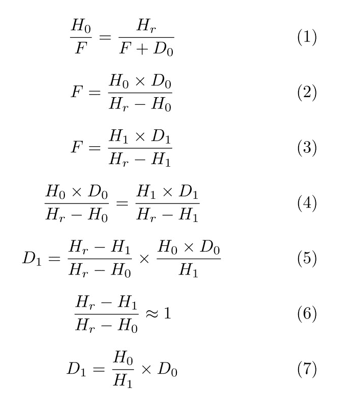
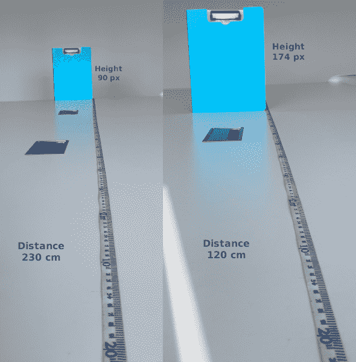
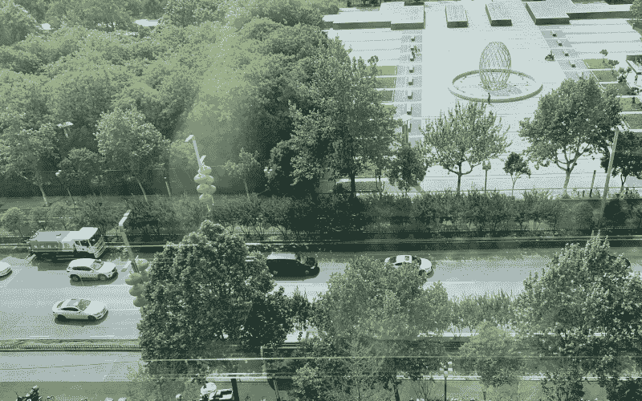
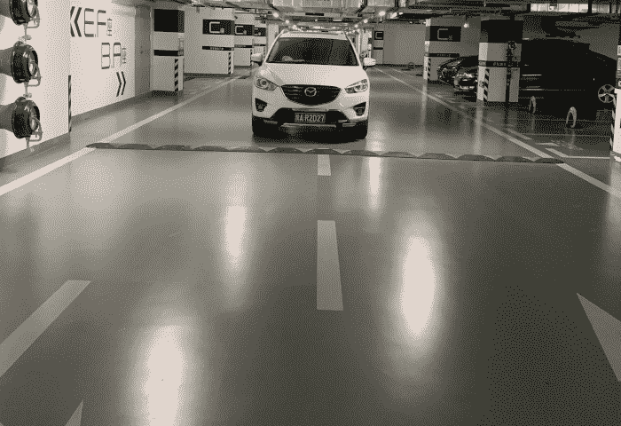
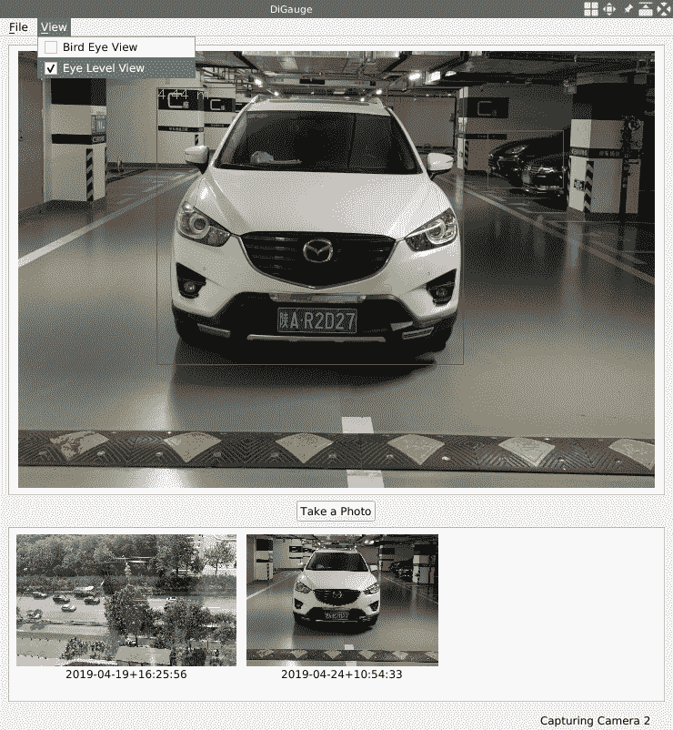

# 实时汽车检测和距离测量

在上一章中，我们通过级联分类器方法和深度学习方法学习了如何使用 OpenCV 库检测对象。 在本章中，我们将讨论如何测量检测到的物体之间或感兴趣的物体与相机之间的距离。 我们将在新的应用程序中检测汽车，并测量汽车之间的距离以及汽车与摄像机之间的距离。

本章将涵盖以下主题：

*   使用带有 OpenCV 的 YOLOv3 模型检测汽车
*   测量不同视角距离的方法
*   在鸟瞰图中测量汽车之间的距离
*   在眼睛水平视图中测量汽车与摄像头之间的距离

# 技术要求

像前面的章节一样，您至少需要安装 Qt 版本 5 并安装 OpenCV 4.0.0。 也必须具有 C++ 和 Qt 编程的基本知识。

我们将使用深度学习模型 YOLOv3 来检测汽车，因此拥有深度学习知识也将有很大帮助。 由于我们在第 6 章，“实时对象检测”中介绍了深度学习模型，因此建议您先阅读本章之前的内容。

[本章的所有代码都可以在本书的代码存储库中找到](https://github.com/PacktPublishing/Qt-5-and-OpenCV-4-Computer-Vision-Projects/tree/master/Chapter-07)。

[观看以下视频，查看运行中的代码](http://bit.ly/2FdC0VF)

# 实时汽车检测

在测量物体之间的距离之前，我们必须检测出感兴趣的物体以找出它们的位置。 在本章中，我们决定测量汽车之间的距离，因此我们应该从检测汽车开始。 在上一章，第 6 章，“实时对象检测”中，我们学习了如何以多种方式检测对象，我们看到 YOLOv3 模型在准确性方面具有良好的性能， 幸运的是，`car`对象类在可可数据集（即`coco.names`文件）的类别列表中。 因此，我们将遵循该方法，并使用 YOLOv3 模型来检测汽车。

与前面几章一样，我们将通过复制我们已经完成的项目之一来创建本章的新项目。 这次，让我们复制上一章完成的 Detective 应用程序，作为本章的新项目。 我们将新项目命名为`DiGauge`，以表明该项目用于衡量检测到的对象之间的距离。 让我们直接进行复制：

```cpp
$ pwd
/home/kdr2/Work/Books/Qt-5-and-OpenCV-4-Computer-Vision-Projects
$ mkdir Chapter-07
# !!! you should copy it to a different dir
$ cp -r Chapter-06/Detective Chapter-07/DiGauge
$ ls Chapter-07
DiGauge
$ cd Chapter-07/DiGauge/
```

如果您一直在进行，则应该将项目复制到`Chapter-07`以外的其他目录，因为`DiGauge`目录已经存在于我们代码存储库中的该文件夹中。

现在我们已经完成了复制，让我们进行一些重命名：

1.  将`Detective.pro`项目文件重命名为`DiGauge.pro`。
2.  在该项目文件中将目标值从`Detective`重命名为`DiGauge`。
3.  在对`main.cpp`源文件中的`window.setWindowTitle`的调用中，将`Detective`窗口标题更改为`DiGauge`。
4.  将`mainwindow.cpp`源文件中位于`MainWindow::initUI`方法中对`mainStatusLabel->setText`的调用中的状态栏上的文本从`Detective is Ready`更改为`DiGauge is Ready`。
5.  在`utilities.cpp`源文件中的`Utilities::getDataPath`方法中，对`pictures_dir.mkpath`和`pictures_dir.absoluteFilePath`的调用中，将`Detective`字符串更改为`DiGauge`。

至此，我们有了一个与侦探应用程序相同的新应用程序，除了名称和相对路径中的单词`Detective`。 UI 上的文本也已更改为`DiGauge`。 要看到这一点，我们可以编译并运行它。

[可在以下提交中找到重命名中的更改集](https://github.com/PacktPublishing/Qt-5-and-OpenCV-4-Computer-Vision-Projects/commit/a0777b515129788bc93768ec813f2f1fe77796b6)。 如果您对此完全感到困惑，请参考提交。

由于我们决定使用 YOLOv3 深度学习模型来检测汽车，因此，我们最好删除所有与级联分类器方法有关的代码，以使我们的项目代码简洁明了。 此步骤也非常简单：

1.  在`DiGauge.pro`项目文件中，我们在`LIBS`配置中删除了`opencv_objdetect`模块，因为在删除了使用级联分类器的代码之后，将不再使用该模块。 也可以删除`DEFINES`配置中定义的宏，因为我们也不会使用它们。

2.  在`capture_thread.h`文件中，我们从`CaptureThread`类中删除了`void detectObjects(cv::Mat &frame)`私有方法和`cv::CascadeClassifier *classifier;`字段。
3.  最后，我们对`capture_thread.cpp`源文件进行一些更改：

至此，我们有了一个仅使用 YOLOv3 模型检测对象的干净项目。 可以在[这里](https://github.com/PacktPublishing/Qt-5-and-OpenCV-4-Computer-Vision-Projects/commit/d0f47d13979a1aae7a1a98f1f54c694383f107a9)找到该变更集。

现在，通过使用 YOLOv3 模型，我们的应用程序可以检测视频或图像中的所有 80 类对象。 但是，对于此应用程序，我们对所有这些类都不感兴趣-我们仅对汽车感兴趣。 让我们在`coco.names`文件中找到`car`类：

```cpp
$ grep -Hn car data/coco.names
data/coco.names:3:car
data/coco.names:52:carrot
$
```

如我们所见，`car`类是`coco.names`文件中的第三行，因此它的类 ID 是`2`（具有从 0 开始的索引）。 让我们重写`capture_thread.cpp`源文件中的`decodeOutLayers`函数，以过滤掉除 ID 为`2`的类之外的所有类：

```cpp
    void decodeOutLayers(
        cv::Mat &frame, const vector<cv::Mat> &outs,
        vector<cv::Rect> &outBoxes
    )
    {
        float confThreshold = 0.65; // confidence threshold
        float nmsThreshold = 0.4; // non-maximum suppression threshold

        // vector<int> classIds; // this line is removed!
        // ...
    }
```

让我们看一下我们在前面的代码中所做的更改：

*   对功能签名的更改：
    *   `outClassIds`参数将不再有用，因为我们将仅检测一类对象，因此我们将其删除。
    *   `outConfidences`参数也将被删除，因为我们不在乎每个检测到的汽车的置信度。

*   对功能主体的更改：
    *   `confThreshold`变量从`0.5`更改为`0.65`，以提高准确性。
    *   出于与删除`outClassIds`参数相同的原因，还删除了用于存储检测到的对象的类 ID 的`classIds`局部变量。

然后，在通过调用`cv::minMaxLoc`函数获得类 ID 之后，在第二级`for`循环中处理检测到的对象的边界框时，我们检查类 ID 是否为`2`。 如果不是`2`，我们将忽略当前的边界框并转到下一个边界框：

```cpp
                cv::minMaxLoc(scores, 0, &confidence, 0, &classIdPoint);
                if (classIdPoint.x != 2) // not a car!
                    continue;
```

最后，我们删除所有试图更新已删除的`classIds`，`outClassIds`和`outConfidences`变量的行。 现在，对`decodeOutLayers`函数的更改已完成，因此让我们继续调用`decodeOutLayers`的函数，即`CaptureThread::detectObjectsDNN`方法。

对于`CaptureThread::detectObjectsDNN`方法，我们只需要更新其主体的末端部分：

```cpp
        // remove the bounding boxes with low confidence

        // vector<int> outClassIds; // removed!
        // vector<float> outConfidences; // removed!

        vector<cv::Rect> outBoxes;
        // decodeOutLayers(frame, outs, outClassIds, outConfidences, outBoxes); // changed!
        decodeOutLayers(frame, outs, outBoxes);

        for(size_t i = 0; i < outBoxes.size(); i ++) {
            cv::rectangle(frame, outBoxes[i], cv::Scalar(0, 0, 255));
        }
```

如您所见，我们删除了类 ID 和与置信度相关的变量，并使用`outBoxes`变量作为其唯一的`out`参数调用了`decodeOutLayers`函数。 然后，我们遍历检测到的边界框并将其绘制为红色。

最后，我们已经完成了对 Detective 应用程序的重建，以便它是一个名为 DiGauge 的新应用程序，它可以使用 YOLOv3 深度学习模型来检测汽车。 让我们编译并运行它：

```cpp
$ qmake
$ make
g++ -c -pipe -O2 -Wall #...
# output trucated
$ export LD_LIBRARY_PATH=/home/kdr2/programs/opencv/lib
$ ./DiGauge
```

不要忘记将与 YOLOV3 模型相关的文件（`coco.names`，`yolov3.cfg`和`yolov3.weights`）复制到我们项目的`data`子目录中，否则将无法成功加载模型。 如果您对如何获取这些文件有疑问，则应阅读第 6 章，“实时对象检测”。

应用程序启动后，如果您在其中有汽车的某些场景上对其进行测试，则会发现每个检测到的汽车都有一个红色边框：


现在我们可以检测到汽车了，让我们在下一部分中讨论如何测量它们之间的距离。

# 距离测量

在不同情况下，有许多方法可以测量或估计对象之间或对象与相机之间的距离。 例如，如果我们感兴趣的物体或我们的相机以已知且固定的速度运动，则通过运动检测和物体检测技术，我们可以轻松地在相机视图中估计物体之间的距离。 另外，如果我们使用立体声相机，则可以遵循[这里](https://www.ijert.org/research/distance-measurement-system-using-binocular-stereo-vision-approach-IJERTV2IS121134.pdf)来测量距离。

但是，对于我们的情况，我们只有一个固定位置的普通网络摄像头，那么如何测量与之的距离呢？ 好吧，可以满足一些先决条件。

让我们先谈谈测量物体之间的距离。 这种情况下的先决条件是，我们应该将摄像机安装到固定位置，以便可以鸟瞰鸟瞰对象，并且必须有一个已知大小固定的对象，它将用作参考 在相机的视线中。 让我们来看看用我的相机拍摄的照片：


在上一张照片中，我的桌子上有两个硬币。 硬币的直径为 25 毫米，该长度在照片中占据 128 个像素。 利用这些信息，我们可以测量两个硬币的距离（以像素为单位），即照片中的距离为 282 像素。 好吧，照片中 128 像素的长度在我的桌子上代表 25 毫米，那么 282 像素的长度代表多长时间？ 非常简单：`25 / 128 * 282 = 55.07`毫米。 因此，在这种情况下，一旦检测到参考对象和要测量的距离的顶点，便可以通过简单的计算获得距离。 在下一部分的应用中，我们将使用这种简洁的方法来测量汽车之间的距离。

现在，让我们继续讨论测量目标物体和相机之间的距离的主题。 在这种情况下，先决条件是我们应该将摄像机安装到固定位置，以便可以在眼平视图中拍摄对象的视频，并且也必须有参考。 但是，这里的参考与鸟瞰情况有很大不同。 让我们看看为什么：


上图演示了我们在拍照时对象与相机之间的位置关系。 此处，`F`是相机的焦距，`D0`是相机与物体之间的距离。`Hr`是物体的高度，`H0`是相机镜头上物体图像的高度（以米为单位，而不是以像素为单位）。

由于图片中有两个明显相似的三角形，因此我们可以得到一些方程式：



上图中有很多方程式，所以让我们一一看一下：

1.  第一个方程式来自三角形相似度。
2.  从等式`(1)`，我们知道焦点`F`可以计算为等式`(2)`。
3.  然后，如果将对象移动到另一个位置，并将距离标记为`D1`，并将镜头上图像的高度标记为`H1`，则考虑到相机的焦距是固定的 值，我们将得到方程`(3)`。
4.  如果我们将方程`(2)`和方程`(3)`结合起来，我们将得到方程`(4)`。
5.  从等式`(4)`，经过一些变换，我们可以得出距离`D1`，可以将其计算为等式`(5)`。
6.  由于我们已经将`Hr`的高度与实际物体进行了比较，因此`H0`和`H1`的值非常小，因此我们可以推测出这些值`Hr-H0`和`Hr-H1`的比值几乎相同。 这就是方程`(6)`所说的。
7.  利用等式`(6)`，我们可以将等式`(4)`简化为等式`(7)`。

因此，无论以镜头上的米为单位还是照片上的像素为单位，`H0/H1`的值始终相同，我们可以更改`H0`和`H1`可以计算它们所占据的像素数，以便我们可以在数码照片中对其进行测量。

在这里，我们将以`D0`（以米为单位）和`H0`（以像素为单位）作为参考，这意味着在测量相机与物体之间的距离之前，必须先放置 将其放在相机之前的某个位置，然后将其测量为`D0`并拍照。 然后，我们可以将照片中物体的高度记为`H0`，并将这些值用作参考值。 让我们看一个例子：



在上一张照片的左侧，我在离相机 230 厘米的桌子上放了一个文件夹，并拍摄了照片。 在此，它在垂直方向上占据 90 个像素。 然后，我将其移至距相机几厘米的位置，然后再次拍照。 这次，其高度为 174 像素。 我们可以将左侧的值用作参考值，即：

*   `D0`是 230 厘米
*   `H0`是 90 像素
*   `H1`为 174 像素

根据方程`(7)`，我们可以将`D1`计算为`H0 / H1 * D0 = 90 / 174 * 230 = 118.96 cm`。 结果非常接近我从桌子上的直尺获得的值，即 120 厘米。

现在我们知道了如何测量物体之间或物体与相机之间距离的原理，让我们将其应用于 DiGauge 应用程序中。

# 测量汽车之间或汽车与相机之间的距离

有了我们在上一节中讨论的原理，让我们利用它们来测量应用程序中的距离。

正如我们之前提到的，我们将从两种不同的角度进行衡量。 首先，让我们看一下鸟瞰图。

# 鸟瞰汽车之间的距离

为了能够鸟瞰汽车，我将相机固定在办公室八层的窗户上，使其面向地面。 这是我从相机中获得的图片之一：



您会看到道路上的汽车从图片的左侧向右侧行驶。 这不是绝对的鸟瞰图，但是我们可以使用上一节中讨论的方法来估算汽车之间的距离。 让我们在我们的代码中做到这一点。

在`capture_thread.cpp`源文件中，我们将添加一个名为`distanceBirdEye`的新函数：

```cpp
     void distanceBirdEye(cv::Mat &frame, vector<cv::Rect> &cars)
     {
         // ...
     }
```

它有两个参数：

*   视频中`cv::Mat`类型的帧
*   给定帧中检测到的汽车的边界框的向量

我们将首先计算水平方向上边界框的距离（以像素为单位）。 但是，这些盒子在水平方向上可能部分重叠。 例如，在上一张照片中，左侧的两辆白色汽车在水平方向上几乎处于同一位置，显然，我们感兴趣的水平方向上它们之间的距离为零， 并且我们没有必要对其进行衡量。 因此，在计算任何两个给定框的每个距离之前，我们应该将在水平方向上重叠的框合并为一个框。

这是我们合并框的方法：

```cpp
         vector<int> length_of_cars;
         vector<pair<int, int>> endpoints;
         vector<pair<int, int>> cars_merged;
```

首先，在前面的代码中，我们声明变量：

*   `length_of_cars`变量是整数向量，将保留汽车的长度（以像素为单位），即边界框的宽度。
*   `endpoints`变量将保留汽车两端的位置。 此变量是整数对的向量。 其中的每一对都是汽车的一端（前端或后端）。 如果是后端，则对为`(X, 1)`，否则为`(X, -1)`，其中`X`是端点的`x`坐标。
*   `cars_merged`变量用于合并汽车后的汽车位置信息。 我们只关心它们在水平方向上的位置，因此我们使用对代替矩形来表示位置。 一对中的第一个元素是汽车的后端（在左侧），第二个元素是汽车的前端（在右侧）。

然后，我们遍历检测到的汽车的边界框以填充这三个向量：

```cpp
         for (auto car: cars) {
             length_of_cars.push_back(car.width);
             endpoints.push_back(make_pair(car.x, 1));
             endpoints.push_back(make_pair(car.x + car.width, -1));
         }
```

填充向量后，我们对长度的向量进行排序，并找到中位数作为`int length`变量。 稍后我们将使用该中值作为参考值之一：

```cpp
         sort(length_of_cars.begin(), length_of_cars.end());
         int length = length_of_cars[cars.size() / 2];
```

现在，我们执行最后一步：

```cpp
         sort(
             endpoints.begin(), endpoints.end(),
             [](pair<int, int> a, pair<int, int> b) {
                 return a.first < b.first;
             }
         );

         int flag = 0, start = 0;
         for (auto ep: endpoints) {
             flag += ep.second;
             if (flag == 1 && start == 0) { // a start
                 start = ep.first;
             } else if (flag == 0) { // an end
                 cars_merged.push_back(make_pair(start, ep.first));
                 start = 0;
             }
         }
```

在前面的代码中，我们按其中每个对的第一个元素对`endpoints`向量进行排序。 排序后，我们遍历已排序的`endpoints`以进行合并。 在迭代中，我们将对中的第二个整数添加到初始值为零的标志中，然后检查标志的值。 如果它是 1，并且我们还没有开始合并范围，则这是一个起点。 当标志减少到零时，我们得到范围的终点。 换句话说，我们从左到右遍历了汽车的所有端点。 当我们遇到汽车的后端点时，将其添加到标志中，当我们遇到汽车的前端点时，将其从标志中移开。 当标志从零变为 1 时，它是合并范围的起点；当标志从非零变为零时，它是合并范围的端点。

下图更详细地描述了该算法：


通过将起点和终点成对地推到`cars_merged`向量，我们将得到所有合并的框或合并的范围，因为我们只关心水平方向。

当我们谈到在鸟瞰图中测量距离时，我们说必须有一个固定且已知大小的参考物体，例如硬币。 但是在这种情况下，我们没有满足此条件的对象。 要解决此问题，我们将选择检测到的汽车长度的中位数，并假设其在现实世界中的长度为 5 米，并将其用作参考对象。 让我们看看如何使用此参考车计算合并范围之间的距离：

```cpp
         for (size_t i = 1; i < cars_merged.size(); i++) {
             // head of car, start of spacing
             int x1 = cars_merged[i - 1].second;
             // end of another car, end of spacing 
             int x2 = cars_merged[i].first; 
             cv::line(frame, cv::Point(x1, 0), cv::Point(x1, frame.rows),
                 cv::Scalar(0, 255, 0), 2);
             cv::line(frame, cv::Point(x2, 0), cv::Point(x2, frame.rows),
                 cv::Scalar(0, 0, 255), 2);
             float distance = (x2 - x1) * (5.0 / length);

             // TODO: show the distance ...
         }
```

在前面的代码中，我们遍历合并的范围，找到范围的头部（车）和下一个范围的后端（车），然后在找到的两个点绘制绿色垂直线和红色垂直线 ， 分别。

然后，我们使用`(x2 - x1) * (5.0 / length)`表达式计算两条垂直线之间的距离，其中`5.0`是常识上汽车的近似平均长度，`length`是我们在其中检测到的汽车长度的中位数 视频。

现在，让我们在框架上显示计算出的距离：

```cpp
             // display the label at the top of the bounding box
             string label = cv::format("%.2f m", distance);
             int baseLine;
             cv::Size labelSize = cv::getTextSize(
                 label, cv::FONT_HERSHEY_SIMPLEX, 0.5, 1, &baseLine);
             int label_x = (x1 + x2) / 2 - (labelSize.width / 2);
             cv::putText(
                 frame, label, cv::Point(label_x, 20),
                 cv::FONT_HERSHEY_SIMPLEX, 0.5, cv::Scalar(255, 255, 255));
```

前面的代码也位于`for`循环中。 在这里，我们格式化`distance`变量（它是字符串的浮点数）的格式，并用`cv::getTextSize`测量的文本大小将其绘制在框架的顶部和两行的中间。 功能。

至此，可以鸟瞰鸟瞰汽车之间的距离。 让我们在`CaptureThread::detectObjectsDNN`方法中调用它：

```cpp
         for(size_t i = 0; i < outBoxes.size(); i ++) {
             cv::rectangle(frame, outBoxes[i], cv::Scalar(0, 0, 255));
         }
         distanceBirdEye(frame, outBoxes);
```

如您所见，在`CaptureThread::detectObjectsDNN`方法中绘制检测到的汽车的边界框后，我们直接使用边界框的框架和向量调用新添加的函数。 现在，让我们编译并启动我们的应用程序，然后打开相机以查看外观：


不出所料，我们在视频中发现了许多绿线和红线对，它们表示距离，并且距离的大约长度标记在视频的两线之间。

这种方法的重点是在鸟瞰图中查看感兴趣的对象并找到固定大小的参考对象。 在这里，我们使用经验值作为参考值，因为我们在现实世界中并不总是获得合适的参考对象。 我们使用汽车长度的中位数，因为可能有一半的汽​​车正在驶入或驶出摄像机的视线，这使得使用平均值不太合适。

我们已经成功地测量了鸟瞰视野中的汽车距离，因此让我们继续看一下如何应对眼高视野。

# 在眼睛水平视图中测量汽车与摄像头之间的距离

在前面的小节中，我们在鸟瞰图中测量了汽车之间的距离。 在本小节中，我们将测量汽车与摄像头之间的距离。

在这种情况下谈论距离测量时，我们了解到，在测量距离之前，必须将摄像机安装在固定位置，然后从中拍摄照片以获得两个参考值：

*   照片中对象的高度或宽度，以像素为单位。 我们将此值称为`H0`或`W0`。
*   拍摄照片时相机与物体之间的距离。 我们将此值称为`D0`。

下面的照片是从我的相机上拍摄的-这是我的车的照片：



这张照片的两个参考值如下：

*   `W0 = 150 pixels`
*   `D0 = 10 meters`

现在已经有了参考值，让我们开始在代码中进行距离测量。 首先，我们将添加一个名为`distanceEyeLevel`的新函数：

```cpp
     void distanceEyeLevel(cv::Mat &frame, vector<cv::Rect> &cars)
     {
         const float d0 = 1000.0f; // cm
         const float w0 = 150.0f; // px

         // ...
     }
```

像`distanceBirdEye`功能一样，此功能也将视频帧和检测到的汽车的边界框作为其自变量。 在其主体的开头，我们定义了两个参考值。 然后，我们尝试找到感兴趣的汽车：

```cpp
         // find the target car: the most middle and biggest one
         vector<cv::Rect> cars_in_middle;
         vector<int> cars_area;
         size_t target_idx = 0;

         for (auto car: cars) {
             if(car.x < frame.cols / 2 && (car.x + car.width) > frame.cols / 2) {
                 cars_in_middle.push_back(car);
                 int area = car.width * car.height;
                 cars_area.push_back(area);
                 if (area > cars_area[target_idx]) {
                     target_idx = cars_area.size() - 1;
                 }
             }
         }

         if(cars_in_middle.size() <= target_idx) return;
```

考虑到视频中可能检测到不止一辆汽车，我们必须找出一种选择一辆汽车作为目标的方法。 在这里，我们选择了视图中间最大的视图。 为此，我们必须声明三个变量：

*   `cars_in_middle`是矩形的向量，该向量将容纳位于视图中间的汽车的边界框。
*   `cars_area`是一个整数向量，用于将矩形的区域保存在`cars_in_middle`向量中。
*   `target_idx`将是我们找到的目标汽车的索引。

我们遍历边界框并检查每个边界框。 如果它的左上角在视频的左侧，而它的右上角在视频的右侧，则说它在视频的中间。 然后，将其及其区域分别推入`cars_in_middle`向量和`cars_area`向量。 完成此操作后，我们检查我们刚刚按下的区域是否大于当前目标的区域。 如果为真，则将当前索引设置为目标索引。 迭代完成后，我们将在`target_idx`变量中获得目标汽车的索引。 然后，我们得到目标汽车的矩形以测量距离：

```cpp
         cv::Rect car = cars_in_middle[target_idx];
         float distance = (w0 / car.width) * d0; // (w0 / w1) * d0
         // display the label at the top-left corner of the bounding box
         string label = cv::format("%.2f m", distance / 100);
         int baseLine;
         cv::Size labelSize = cv::getTextSize(
             label, cv::FONT_HERSHEY_SIMPLEX, 0.5, 1, &baseLine);
         cv::putText(frame, label, cv::Point(car.x, car.y + labelSize.height),
             cv::FONT_HERSHEY_SIMPLEX, 0.5, cv::Scalar(0, 255, 255));
```

在前面的代码中，我们根据公式`(7)`找到矩形并使用`(w0 / car.width) * d0`表达式计算距离。 然后，将`distance`变量格式化为字符串，然后将其绘制在目标汽车左上角的边界框中。

最后，我们将对`distanceBirdEye`函数的调用更改为对`CaptureThread::detectObjectsDNN`方法中新添加的`distanceEyeLevel`函数的调用，然后再次编译并运行我们的应用程序。 看起来是这样的：


如您所见，我们在视频中检测到了多于一辆汽车，但是仅测量了中间一辆与摄像机之间的距离。 距离的长度以黄色文本标记在目标汽车边界框的左上角。

# 在查看模式之间切换

在前面的两个小节中，我们以两种模式测量距离：鸟瞰图和视平线图。 但是，在我们的 DiGauge 应用程序中，在这些模式之间切换的唯一方法是更改​​代码并重新编译应用程序。 显然，最终用户无法执行此操作。 为了向最终用户介绍此功能，我们将在应用程序中添加一个新菜单，使用户有机会在两种模式之间进行切换。 让我们开始编码。

首先，让我们在`capture_thread.h`文件中添加一些行：

```cpp
     class CaptureThread : public QThread
     {
         // ...
     public:
         // ...
         enum ViewMode { BIRDEYE, EYELEVEL, };
         void setViewMode(ViewMode m) {viewMode = m; };

         // ...
     private:
         // ...
         ViewMode viewMode;
     };
```

在前面的代码中，我们定义了一个名为`ViewMode`的公共枚举，它具有两个值来表示两种视图模式，而该类型的私有成员字段则用于指示当前模式。 还有一个公共内联设置器来更新当前模式。

然后，在`CaptureThread`类的构造函数中，在`capture_thread.cpp`文件中，我们初始化新添加的字段：

```cpp
     CaptureThread::CaptureThread(int camera, QMutex *lock):
         running(false), cameraID(camera), videoPath(""), data_lock(lock)
     {
         frame_width = frame_height = 0;
         taking_photo = false;
         viewMode = BIRDEYE; // here
     }

     CaptureThread::CaptureThread(QString videoPath, QMutex *lock):
         running(false), cameraID(-1), videoPath(videoPath), data_lock(lock)
     {
         frame_width = frame_height = 0;
         taking_photo = false;
         viewMode = BIRDEYE; // and here
     }
```

在`CaptureThread::detectObjectsDNN`方法中，我们根据`viewMode`成员字段的值调用`distanceBirdEye`或`distanceEyeLevel`：

```cpp
         if (viewMode == BIRDEYE) {
             distanceBirdEye(frame, outBoxes);
         } else {
             distanceEyeLevel(frame, outBoxes);
         }
```

现在，让我们转到`mainwindow.h`头文件，向`MainWindow`类添加一些方法和字段：

```cpp
     class MainWindow : public QMainWindow
     {
         // ...
     private slots:
         // ...
         void changeViewMode();

     private:
         // ...
         QMenu *viewMenu;

         QAction *birdEyeAction;
         QAction *eyeLevelAction;
         // ...
     };
```

在此变更集中，我们向`MainWindow`类添加了`QMenu`和两个`QAction`，以及用于新添加动作的名为`changeViewMode`的插槽。 现在，让我们实例化`mainwindow.cpp`源文件中的菜单和操作。

在`MainWindow::initUI()`方法中，我们创建菜单：

```cpp
         // setup menubar
         fileMenu = menuBar()->addMenu("&File");
         viewMenu = menuBar()->addMenu("&View");
```

然后，在`MainWindow::createActions`方法中，我们实例化动作并将其添加到视图菜单中：

```cpp
         birdEyeAction = new QAction("Bird Eye View");
         birdEyeAction->setCheckable(true);
         viewMenu->addAction(birdEyeAction);
         eyeLevelAction = new QAction("Eye Level View");
         eyeLevelAction->setCheckable(true);
         viewMenu->addAction(eyeLevelAction);

         birdEyeAction->setChecked(true);
```

如您所见，这次与我们之前创建动作的时候有些不同。 创建动作实例后，我们将它们称为`true`的`setCheckable`方法。 这样可以检查动作，并且动作文本左侧的复选框将出现。 最后一行将动作状态`birdEyeAction`设置为选中。 然后，将动作的`triggered`信号连接到我们在同一方法中刚刚声明的广告位：

```cpp
         connect(birdEyeAction, SIGNAL(triggered(bool)), this, SLOT(changeViewMode()));
         connect(eyeLevelAction, SIGNAL(triggered(bool)), this, SLOT(changeViewMode()));
```

现在，让我们看看该插槽是如何实现的：

```cpp
     void MainWindow::changeViewMode()
     {
         CaptureThread::ViewMode mode = CaptureThread::BIRDEYE;
         QAction *active_action = qobject_cast<QAction*>(sender());
         if(active_action == birdEyeAction) {
             birdEyeAction->setChecked(true);
             eyeLevelAction->setChecked(false);
             mode = CaptureThread::BIRDEYE;
         } else if (active_action == eyeLevelAction) {
             eyeLevelAction->setChecked(true);
             birdEyeAction->setChecked(false);
             mode = CaptureThread::EYELEVEL;
         }
         if(capturer != nullptr) {
             capturer->setViewMode(mode);
         }
     }
```

在此插槽中，我们获得了信号发送器，该信号发送器必须是两个新添加的动作之一，将发送器设置为选中状态，将另一个设置为未选中，然后根据选中的动作保存查看模式。 之后，我们检查捕获线程是否为空； 如果不是，我们通过调用`setViewMode`方法设置其查看模式。

我们需要做的最后一件事是在创建并启动新的捕获线程时重置这些操作的状态。 在`MainWindow::openCamera`方法主体的末尾，我们需要添加几行：

```cpp
         birdEyeAction->setChecked(true);
         eyeLevelAction->setChecked(false);
```

现在，一切都已完成。 让我们编译并运行应用程序以测试新功能：



从前面的屏幕快照中可以看到，我们可以通过“视图”菜单切换视图模式，我们的 DiGauge 应用程序终于完成了。

# 总结

在本章中，我们计划使用 OpenCV 测量汽车之间或汽车与摄像机之间的距离。 首先，我们创建了一个名为 **DiGauge** 的新应用程序，通过取消在上一章中开发的 **Detective** 应用程序来从摄像机检测汽车。 然后，我们以两种视图模式（鸟瞰图和水平视图）讨论了计算机视觉域中距离测量的原理。 之后，我们在应用程序中的这两种视图模式中实现了距离测量功能，并在 UI 上添加了一个菜单，以在两种视图模式之间切换。

在下一章中，我们将介绍一种称为 OpenGL 的新技术，并了解如何在 Qt 中使用它以及如何在计算机视觉领域为我们提供帮助。

# 问题

尝试回答以下问题，以测试您对本章的了解：

1.  在测量汽车之间的距离时，是否可以使用更好的参考对象？