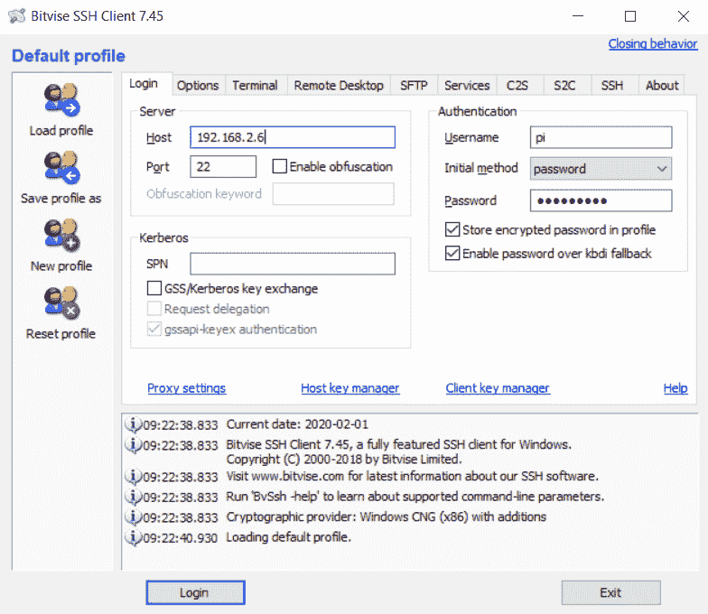
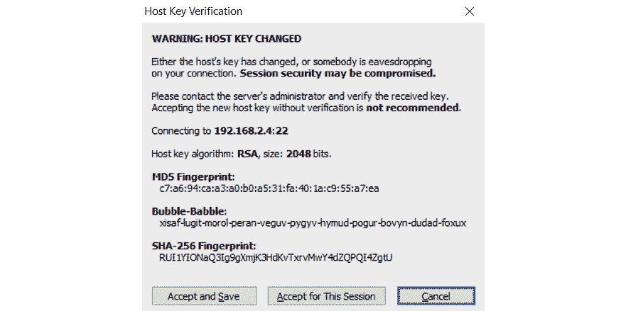
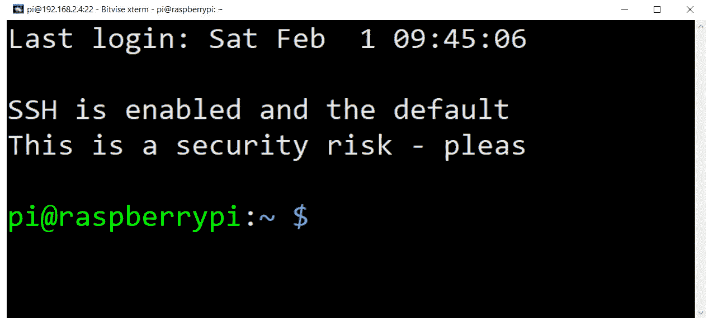
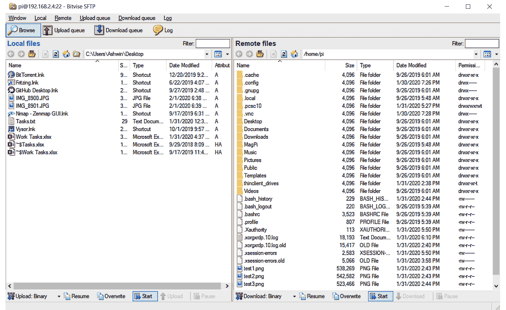
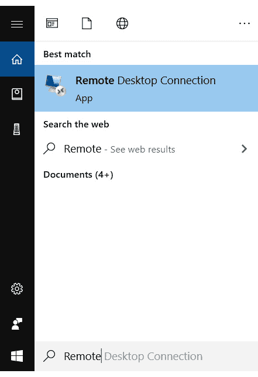
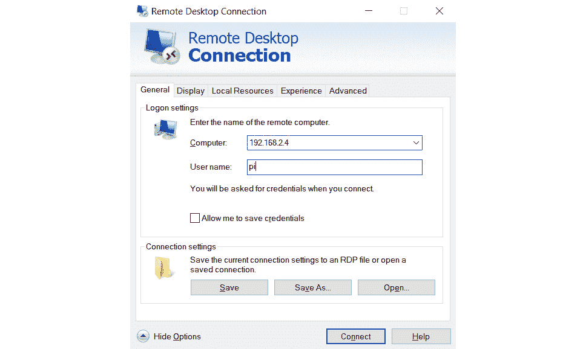
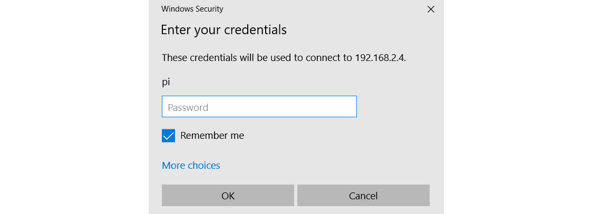
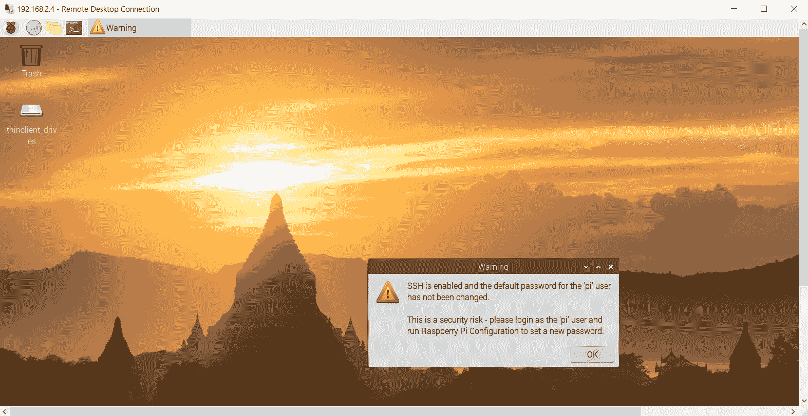
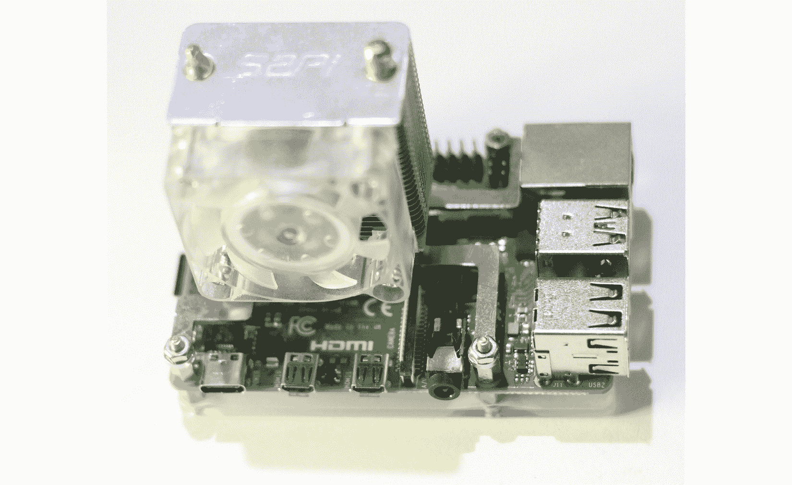

# *第 2 章*：为计算机视觉准备 Raspberry Pi

在上一章中，我们学习了单板计算机，计算机视觉和 OpenCV 的基础知识。 我们了解了 **Raspberry Pi** （ **RPi** ）4B 和 RPi Zero W 的详细规格。我们还详细了解了如何在所有 RPi 主板型号上设置 Raspbian OS。

在本章中，我们将学习如何为计算机视觉准备 RPi 板。 从上一章的结尾处开始，我们将开始安装用于计算机视觉的 OpenCV 库和用于远程访问桌面以及命令提示符的其他必要软件。 我们将学习如何在 RPi 和 Windows PC 之间传输文件。 我们还将学习如何通过超频 RPi 并在其上安装散热器以降低处理器温度来利用 RPi 的计算能力。

我们将在本章中介绍的主题如下：

*   使用 SSH 远程登录 RPi
*   远程桌面访问
*   在 RPi 板上安装 OpenCV
*   散热器和 RPi 4B 超频

# 使用 SSH 远程登录 RPi

我们可以使用 Windows 上的各种软件来远程访问 RPi 板的命令提示符。 我们可以从 Windows 远程运行所有不涉及的 Linux 命令。 您可能还记得，我们在 第 1 章 *，* *《计算机视觉和 Raspberry Pi 简介》中讨论了如何使用 Raspberry Pi 配置工具启用 SSH。* 。 它启用通过 SSH 的远程登录。

为了开始，请按照下列步骤操作：

1.  首先，我们需要免费安装任何可用的 SSH 软件。 [最受欢迎的是 PUTTY](https://www.putty.org/)。 我更喜欢使用 SFTP 附带的另一个流行的 SSH 客户端，称为 Bitvise SSH 客户端。 [您可以从以下位置下载 Windows 的安装文件](https://www.bitvise.com/ssh-client-download)并安装它。 之后，打开 Bitvise SSH 客户端。 将出现以下窗口：

    

    图 2.1 –按位连接窗口

    输入主机名，用户名和密码。 主机名不过是我们 RPi 板的 IPv4 地址，我们在 第 1 章 *，计算机视觉和 Raspberry Pi* 中了解了如何找到它。

2.  After entering all the necessary information, click the **Login** button. This will start the RSA key exchange and display the following message box:

    

    图 2.2 –首次连接的消息窗口

3.  Click the **Accept and Save** button. This will save the exchanged RSA keys. Note that this message box won't be displayed if we try to connect to Raspberry Pi again with the same Windows computer. After that, two separate windows will appear. The first is the Command Prompt of the Raspberry Pi. Just like **LXTerminal**, we can run Linux commands from here too:

    

    图 2.3 –按位 SSH 窗口

4.  我们可以通过更改属性来更改此处显示的字体和文本的大小，这些属性可以通过右键单击标题栏来找到。 以下是文件传输窗口：



图 2.4 –按位 FTP 文件传输窗口

在左侧窗格中，我们具有 Windows 桌面，在右侧窗格中，我们具有 **/ home / pi** ，即 **pi** 用户的主目录。 我们只需在 Windows 和 RPi 之间在这些窗格之间拖放文件即可。

注意

我们可以使用 **sudo raspi-config** 命令从命令提示符访问 Raspberry Pi 配置工具。 此是该工具的命令行版本。

这是我们可以远程连接到 Raspbian OS 的命令提示符并传输文件的方式。 接下来，我们将学习如何远程访问 Raspbian OS 桌面。

# 远程桌面访问

Bitvise SSH 客户端非常适合进行文件传输和访问 RPi 的命令提示符终端。 但是，我们需要使用另一软件来远程访问 RPi 的桌面。 我们可以采用两种方法。 第一个是 VNC（我们在 第 1 章 *，* *《计算机视觉和 Raspberry Pi* 》中介绍了如何启用它） Raspberry Pi 配置工具），而另一个则使用 Windows 内置的**远程桌面连接**实用程序。 我们可以在 Windows 搜索栏中找到它，如下所示：



图 2.5 – Windows 搜索栏中的“远程桌面连接”选项

但是在使用它之前，我们需要在 RPi 上安装 **xrdp** 。 安装非常简单。 我们只需要在 RPi 的 **LXTerminal** 上运行以下命令：

```py
sudo apt-get install xrdp -y
```

信息

您可能想在[这个页面](http://xrdp.org/)上阅读有关 **xrdp** 的更多信息。

在 RPi 上安装 **xrdp** 后，您需要执行以下步骤：

1.  Open the **Remote Desktop Connection** application on your Windows PC:

    

    图 2.6 –远程桌面连接

2.  Enter the IP address and **pi** in the textboxes labeled **Computer** and **User name**. You might want to check the checkbox for **Allow me to save credentials** and save the connection settings too. Once we click the **Connect** button, the following window will appear:

    

    图 2.7 – Raspbian OS 的远程桌面连接凭据

3.  输入密码，如果要保存此连接的密码，请选中该复选框。 点击 **OK** 按钮； 稍后，将显示 RPi 远程桌面窗口。 如果 LAN 上的流量较少，则远程桌面的工作将很顺利。 以下是“远程桌面”窗口的屏幕截图：



图 2.8 – Raspbian OS 远程桌面

我们可以从这里执行与 GUI 相关的所有任务。 表示如果使用远程桌面，则不需要为 RPi 板单独显示。

# 在 RPi 板上安装 OpenCV

请按照这些步骤在 RPi 上安装 OpenCV：

1.  首先，我们需要安装一些依赖项。 运行以下命令以安装所有这些依赖项：

    ```py
    sudo apt-get install -y libhdf5-dev libhdf5-serial-dev libatlas-base-dev libjasper-dev libqtgui4 libqt4-test
    ```

2.  安装成功后，我们可以在 RPi 上安装 OpenCV：

    ```py
    pip3 install opencv-python==4.0.1.24
    ```

3.  Once the installation of OpenCV is successful, we can verify it by running the following command:

    ```py
    python3 -c "import cv2; print(cv2.__version__)"
    ```

    以下应该是输出：

    ```py
    4.0.1
    ```

这意味着安装已完成，并且我们可以在 Python 3 程序中导入 OpenCV。

接下来，我们将学习如何对 RPi 4B 超频以及如何在其上安装散热器。

# 散热器和超频 RPi 4B

超频意味着以比预期更高的速度运行处理器。 当我们对处理器进行超频时，它们的温度趋于升高，并且会散发更多的热量。 Raspberry Pi 主板型号不附带任何内置散热器。 您可以从许多在线商店（例如 Amazon）购买无源散热器。 以下是带有风扇的散热器的示例：


图 2.9 – RPi 的小散热器

散热器风扇可以通过将其连接到 5V 或 3.3V 电源来供电。 风扇的速度取决于电压，我们可以将其连接到 RPi 电源引脚。 在下一章中，我们将详细了解 RPi 的 GPIO 和电源引脚。 我发现最好，最有效的散热器是 RPi 4B 的 [ICE Tower 风扇](https://www.seeedstudio.com/ICE-Tower-CPU-Cooling-Fan-for-Raspberry-pi-Support-Pi-4-p-4097.html)。

以下是我自己的安装有 ICE Tower 的 Pi：



图 2.10 – Raspberry Pi 上安装的 ICE Tower

它附带一本小册子，其中包含易于安装的说明。

注意：

有必要在 RPi 的处理器上安装主动冷却的散热器和风扇以使其超频。 对任何处理器进行超频而没有足够的冷却可能会损坏它。

我们可以对 RPi 板的 CPU，GPU 和 RAM 超频。 在本节中，我们将讨论如何对 RPi 4B 板进行超频。

确保使用以下命令更新固件：

```py
sudo rpi-update
```

对 Pi 超频之前，必须先更新固件。 完成此操作后，运行以下命令：

```py
sudo nano /boot/config.txt
```

这将使用 **nano** 文本编辑器打开 **/boot/config.txt** 。 在文件末尾，添加以下行：

```py
over_voltage=6
arm_freq=2147 
```

在第一行中，我们设置过电压，因为超频需要额外的功率。 在下一行中，我们将覆盖 CPU 的默认时钟频率。 保存更改并重新启动 RPi。

通常，RPi 可能无法启动备份。 在这种情况下，您可能想要将超频的 **/boot/config.txt** 设置（使用 Windows PC）更改为 **over_voltage = 2** 和 **arm_freq = 1750** ， 分别，

如果这些设置也无法启动 RPi，请在这两行中都加上注释，然后 RPi 将启动。 超频并非在每个处理器上都稳定运行。

当我们在 RPi 板上运行计算繁重的过程时，所有这些额外的兆​​赫兹都会显现出来。 我们可以使用以下命令实时监视时钟：

```py
watch -n1 vcgencmd measure_clock arm
```

一旦我们在 RPi 上启动任何繁重的程序，输出的速度将超过 20 亿（2 GHz）。

我们通过对 RPi 板进行超频获得的所有这些额外处理能力将有助于我们进行计算机视觉实验。

# 摘要

在本章中，我们学习了如何远程登录 RPi 以及如何使用 RDP 远程访问 RPi 桌面。 我们还学习了如何安装 OpenCV 以及如何对其进行验证。 另外，我们学习了如何对 RPi 板进行超频。

在整本书中，我们将使用在本章中学到的所有技能，在编写用于计算机视觉的程序时远程访问 Raspbian OS 的命令提示符和桌面。 我们还将多次使用文件传输，以及大多数程序中的 OpenCV 库。

在下一章中，我们将学习 Python，NumPy，matplotlib 和 RPi GPIO 库的基础知识。 我们还将了解 SciPy 生态系统。