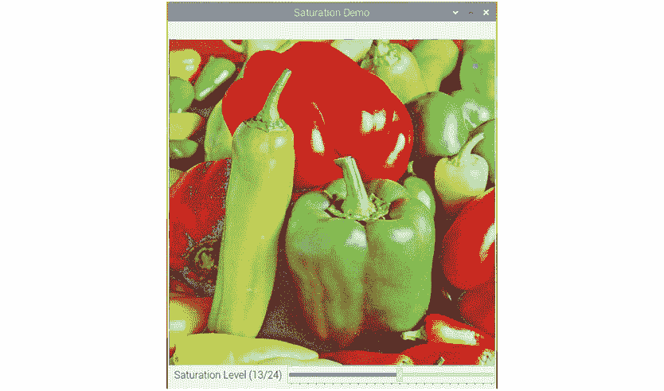
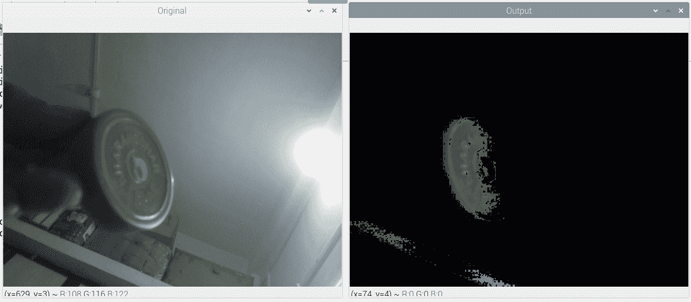
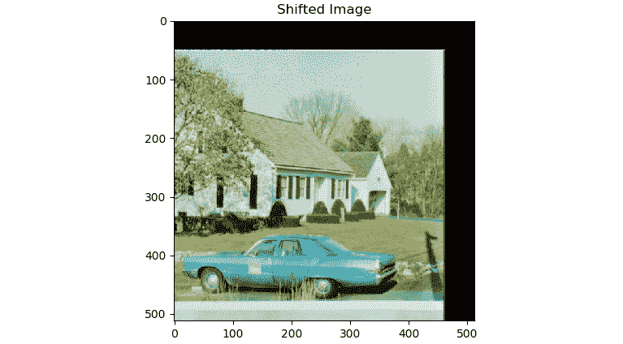
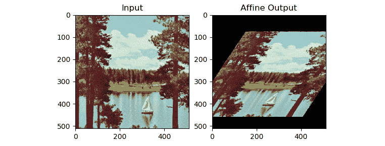
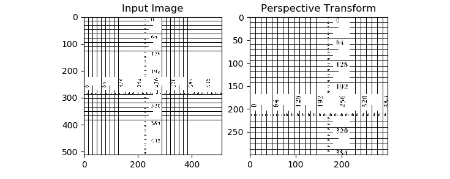
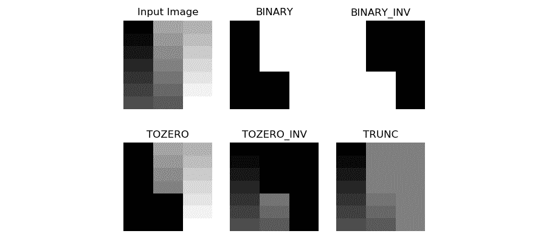

# 第 6 章：色彩空间，变换和阈值

在上一章中，我们学习了如何对图像执行基本的数学和逻辑运算。 在本章中，我们将继续探索计算机视觉及其在现实世界中的应用领域中一些更有趣的概念。 就像本书前面的章节一样，我们将在 Python 3 上进行大量动手练习，并创建许多实际的应用程序。 我们将涵盖计算机视觉领域的许多高级主题。 我们将学习的主要主题与色彩空间，变换和阈值图像有关。 完成本章后，您将能够为一些基本的实际应用程序编写程序，例如跟踪特定颜色的对象。 您还可以将几何和透视变换应用于图像和实时 USB 网络摄像头。

在本章中，我们将探讨以下主题：

*   色彩空间并将其转换
*   对图像执行变换操作
*   图像的透视变换
*   阈值图像

# 技术要求

可以在 [GitHub](https://github.com/PacktPublishing/raspberry-pi-computer-vision-programming/tree/master/Chapter06/programs) 上找到本章的代码文件。

观看以下视频，以查看[这个页面](https://bit.ly/384oYqM)上的“正在执行的代码”。

# 色彩空间并将其转换

让我们了解色彩空间的概念。 **颜色空间**是用于表示一组颜色的数学模型。 使用色彩空间，我们可以用数字表示颜色。 如果您曾经使用过 Web 编程，那么您必须遇到各种颜色代码，因为颜色在 HTML 中以*十六进制数字*表示。 这是一个用颜色空间表示颜色的好例子，并允许我们使用它们执行数值和逻辑计算。 用色彩空间表示颜色还使我们能够轻松地以模拟和数字形式复制颜色。

在本书中，我们将经常使用 **BGR**，**RGB**，**HSV** 和**灰度**色彩空间。 在 BGR 和 RGB 中，B 代表蓝色，G 代表绿色，R 代表红色。 OpenCV 读取彩色图像并将其存储在 BGR 色彩空间中。 HSV 色彩空间表示一组颜色，其中包含用于色相的成分，用于饱和度的成分和用于值的成分。 它是计算机图形学和计算机视觉领域中非常常用的色彩空间。 OpenCV 具有`cv2.cvtColor(img, conv_flag)`函数，该函数更改作为参数传递给它的图像的色彩空间。 源和目标色彩空间由传递给`conv_flag`参数的参数表示。 此函数使用用于色彩空间转换的数学公式将色彩的数值从源色彩空间转换为目标色彩空间。

注意：

[您可以通过以下 URL 阅读有关色彩空间和转换的更多信息](http://colorizer.org)。

您可能还记得，在第 4 章“计算机视觉入门”中，我们讨论了 OpenCV 以 BGR 格式加载图像，而 Matplotlib 使用 RGB 图片格式。 因此，当我们以 BGR 格式显示 OpenCV 读取的图像，而以 RGB 格式显示 Matplotlib 时，在可视化中红色和蓝色通道会互换，并且图像看起来很有趣。 在使用 Matplotlib 显示图像之前，我们应该将图像从 BGR 转换为 RGB。 有两种方法可以做到这一点。

让我们看看第一种方法。 我们可以将图像分为 B，G 和 R 通道，并使用`split()`和`merge()`函数将它们合并为 RGB 图像，如下所示：

```py
import cv2
import matplotlib.pyplot as plt
img = cv2.imread('/home/pi/book/dataset/4.2.07.tiff', 1)
b,g,r = cv2.split (img)
img = cv2.merge((r, g, b))
plt.imshow (img)
plt.title ('COLOR IMAGE')
plt.axis('off')
plt.show()
```

但是，**拆分**和**合并**操作的计算量很大。 更好的方法是使用`cv2.cvtColor()`函数将图像的色彩空间从 BGR 更改为 RGB，如以下代码所示：

```py
import cv2
import matplotlib.pyplot as plt
img = cv2.imread('/home/pi/book/dataset/4.2.07.tiff', 1)
img = cv2.cvtColor (img, cv2.COLOR_BGR2RGB)
plt.imshow (img)
plt.title ('COLOR IMAGE')
plt.axis('off')
plt.show()
```

在前面的代码中，我们使用`cv2.COLOR_BGR2RGB`标志进行颜色转换。 OpenCV 有很多这样的颜色转换标志。 我们可以运行以下程序来查看整个列表：

```py
import cv2
j=0
for filename in dir(cv2):
    if filename.startswith('COLOR_'):
        print(filename)
        j = j + 1
print('There are ' + str(j) +
      ' Colorspace Conversion flags in OpenCV '
      + cv2.__version__ + '.')
```

输出的最后几行显示在以下代码块中（由于空间限制，我不包括整个输出）：

```py
.
.
.
.
.
COLOR_YUV420p2RGBA
COLOR_YUV420sp2BGR
COLOR_YUV420sp2BGRA
COLOR_YUV420sp2GRAY
COLOR_YUV420sp2RGB
COLOR_YUV420sp2RGBA
COLOR_mRGBA2RGBA
```

OpenCV 4.0.1 中有 274 个色彩空间转换标志。

## HSV 色彩空间

术语 **HSV** 代表**色相，饱和度和值**。 在此颜色空间或颜色模型中，颜色为，由色相（也称为**色调**），阴影（其为饱和度标度或表示的灰色量）表示 ]两端的白色和黑色）以及亮度（值或发光度）。 红色，黄色，绿色，青色，蓝色和品红色的强度由色相表示。 术语饱和度是指颜色中存在的灰色成分的数量。 颜色的亮度或强度由值分量表示。

以下代码将颜色从 BGR 转换为 HSV 并进行打印：

```py
import cv2
import numpy as np
c = cv2.cvtColor(np.array([[[255, 0, 0]]],
                          dtype=np.uint8),
                 cv2.COLOR_BGR2HSV)
print(c)
```

前面的代码段将打印以 BGR 表示的蓝色的 HSV 值。 以下是输出：

```py
[[[120 255 255]]]
```

在本书中，我们将大量使用 HSV 色彩空间。 在继续进行之前，让我们创建一个带有跟踪栏的小应用程序，当跟踪器移动时，它会调整颜色的饱和度：

```py
import cv2
def emptyFunction():
    pass
img = cv2.imread('/home/pi/book/dataset/4.2.07.tiff', 1)
windowName = "Saturation Demo"
cv2.namedWindow(windowName)
cv2.createTrackbar('Saturation Level',
                   windowName, 0,
                   24, emptyFunction)
while(True):
    hsv = cv2.cvtColor( img, cv2.COLOR_BGR2HSV)
    h, s, v = cv2.split(hsv)
    saturation = cv2.getTrackbarPos('Saturation Level', windowName)
    s = s + saturation
    v = v + saturation
    img1 = cv2.cvtColor(cv2.merge((h, s, v)), cv2.COLOR_HSV2BGR)
    cv2.imshow(windowName, img1)
    if cv2.waitKey(1) == 27:
        break
cv2.destroyAllWindows()
```

在前面的代码中，我们首先将图像从 BGR 转换为 HSV，然后将其拆分为 H，S 和 V 分量。 然后，根据跟踪器在跟踪栏中的位置，为饱和度（`s`）加上值（`v`）。 然后，我们合并所有通道以创建 HSV 图像，然后将其转换回 BGR 以使用`cv2.imshow()`函数显示。 以下是输出窗口的屏幕截图：



图 6.1 –用于调整图像饱和度的应用

## 基于颜色的实时跟踪

现在，让我们学习如何演示转换色彩空间以实现实际迷你项目的概念。 HSV 色彩空间使我们可以轻松处理一定范围的色彩。 要跟踪可以在特定范围内具有颜色的对象，我们需要将图像的色彩空间转换为 HSV，并检查图像的任何部分是否在我们感兴趣的颜色的特定范围内。OpenCV 具有功能`cv2.inRange()`，它提供了定义颜色范围的功能。

此函数接受图像以及颜色范围的上限和下限作为参数。 然后，它检查给定图像的任何像素是否落在颜色范围内（上限和下限）。 如果图像中的像素值在颜色的给定范围内，则将输出图像中的相应像素设置为`0`值； 否则，将其设置为`255`值。 这将创建一个二进制图像，该图像可以用作计算我们将用于跟踪应用程序的逻辑操作的掩码。

下面的示例演示了此概念。 我们使用逻辑`bitwise_and()`函数提取我们感兴趣的颜色范围：

```py
import numpy as np
import cv2
cap = cv2.VideoCapture(0)
while ( True ):
    ret, frame = cap.read()
    hsv = cv2.cvtColor(frame, cv2.COLOR_BGR2HSV)
    image_mask = cv2.inRange(hsv, np.array([40, 50, 50]),
    np.array([80, 255, 255]))
    output = cv2.bitwise_and(frame, frame, mask=image_mask)
    cv2.imshow('Original', frame)
    cv2.imshow('Output', output)
    if cv2.waitKey(1) == 27:
        break
cv2.destroyAllWindows()
cap.release()
```

在此程序中，我们正在跟踪绿色对象。 输出结果应类似于以下屏幕截图所示。 在这里，我使用了容器的盖子（盖子），它是绿色的：



图 6.2 –通过颜色实时跟踪对象

墙壁的各个部分也带有绿色。 因此，它们在输出中也可见。

我没有包括我们在前面的输出中计算出的中间遮罩图像。 通过将以下代码行添加到我们先前编写的代码中，我们可以在单独的输出窗口中查看它：

```py
cv2.imshow('Image Mask', image_mask)
```

该遮罩是纯黑色的，而是白色的，也称为**二进制图像**。 如果我们对前面的代码进行修改，我们可以跟踪具有不同颜色的对象。 我们必须为感兴趣的颜色范围创建另一个遮罩。然后，可以将两个遮罩组合起来，如下所示：

```py
blue = cv2.inRange(hsv, np.array([100, 50, 50]), np.array([140, 255, 255]))
green = cv2.inRange(hsv, np.array([40, 50, 50]), np.array([80, 255, 255]))
image_mask = cv2.add(blue, green)
output = cv2.bitwise_and(frame, frame, mask=image_mask)
```

运行此代码，然后自己检查输出。 我们可以在此代码中添加一个跟踪栏，以选择蓝色或绿色的范围。 以下是执行此操作的步骤：

1.  首先，导入所有必需的库：

    ```py
    import numpy as np
    ```

    ```py
    import cv2
    ```

2.  然后，我们定义一个空函数：

    ```py
    def emptyFunction():
    ```

    ```py
        pass
    ```

3.  让我们初始化所有必需的对象和变量：

    ```py
    cap = cv2.VideoCapture(0)
    ```

    ```py
    windowName = 'Object Tracker'
    ```

    ```py
    trackbarName = 'Color Chooser'
    ```

    ```py
    cv2.namedWindow(windowName)
    ```

    ```py
    cv2.createTrackbar(trackbarName,
    ```

    ```py
                       windowName, 0, 1,
    ```

    ```py
                       emptyFunction)
    ```

    ```py
    color = 0
    ```

4.  在这里，我们有一个主循环：

    ```py
    while (True):
    ```

    ```py
        ret, frame = cap.read()
    ```

    ```py
        hsv = cv2.cvtColor(frame, cv2.COLOR_BGR2HSV)
    ```

    ```py
        color = cv2.getTrackbarPos(trackbarName, windowName)
    ```

    ```py
        if color == 0:
    ```

    ```py
            image_mask = cv2.inRange(hsv, np.array([40, 50, 50]),
    ```

    ```py
                                     np.array([80, 255, 255]))
    ```

    ```py
        else:
    ```

    ```py
            image_mask = cv2.inRange(hsv, np.array([100, 50, 50]),
    ```

    ```py
                                     np.array([140, 255, 255]))
    ```

    ```py
        output = cv2.bitwise_and(frame, frame, mask=image_mask)
    ```

    ```py
        cv2.imshow(windowName, output)
    ```

    ```py
        if cv2.waitKey(1) == 27:
    ```

    ```py
            break
    ```

5.  最后，我们摧毁了所有窗户并释放了摄像头：

    ```py
    cv2.destroyAllWindows()
    ```

    ```py
    cap.release()
    ```

运行前面的代码，然后自己查看输出。 到目前为止，我们已经知道了 GPIO 接口和按钮。 作为练习，请尝试使用按钮实现相同的功能，以便有单独的按钮来跟踪蓝色和绿色。

# 对图像执行变换操作

在本节中，我们将学习如何使用 OpenCV 和 Python 3 对图像执行各种数学转换操作。

## 缩放

缩放意味着调整图像大小。 这是一个几何运算。 OpenCV 提供用于执行此操作的函数`cv2.resize()`。 它接受图像，用于像素插值的方法以及比例因子作为参数，并返回比例图像。 下列方法用于对输出中的像素进行插值：

*   `cv2.INTER_LANCZOS4`：这涉及在`8x8`像素附近的 Lanczos 插值方法。
*   `cv2.INTER_CUBIC`：这涉及在`4x4`像素邻域上的双三次插值方法，并且首选用于对图像执行缩放操作。
*   `cv2.INTER_AREA`：这意味着使用像素面积关系进行重采样。 这对于在图像上执行缩小操作是优选的。
*   `cv2.INTER_NEAREST`：这表示最近邻插值的方法。
*   `cv2.INTER_LINEAR`：这表示双线性插值方法。 这是参数的默认参数。

以下示例演示了对图像执行放大和缩小的操作：

```py
import cv2
img = cv2.imread('/home/pi/book/dataset/house.tiff', 1)
upscale = cv2.resize(img, None, fx=1.5, fy=1.5,
                     interpolation=cv2.INTER_CUBIC)
downscale = cv2.resize(img, None, fx=0.5, fy=0.5,
                       interpolation=cv2.INTER_AREA)
cv2.imshow('upscale', upscale)
cv2.imshow('downscale', downscale)
cv2.waitKey(0)
cv2.destroyAllWindows()
```

在前面的代码中，我们首先在两个轴上放大，然后在两个轴上分别缩小`1.5`和`0.5`。 运行前面的代码以查看输出。 另外，作为练习，请尝试传递不同的数字作为缩放因子。

## 图像的平移，旋转和仿射变换

`cv2.warpAffine()`函数用于计算输入图像上的平移，旋转和仿射仿射等运算。 它接受输入图像，转换矩阵和输出图像的大小作为参数，然后返回转换后的图像。

注意：

您可以在[这个页面](http://mathworld.wolfram.com/AffineTransformation.html)上找到有关仿射变换的数学方面的更多信息。

以下示例演示了可用于具有`cv2.warpAffine()`函数的图像的不同类型的数学转换。 平移操作意味着在 XY 参考平面中更改（更准确地说，是移动）图像的位置。`x`和`y`轴上的移位因子可以用二维变换矩阵`T`表示，如下所示：


以下代码将图像在 XY 平面中的位置移位`(-50, 50)`：

```py
import numpy as np
import cv2
import matplotlib.pyplot as plt
img = cv2.imread('/home/pi/book/dataset/house.tiff', 1)
input=cv2.cvtColor(img, cv2.COLOR_BGR2RGB)
rows, cols, channel = img.shape
T = np.float32([[1, 0, -50], [0, 1, 50]])
output = cv2.warpAffine(input, T, (cols, rows))
plt.imshow(output)
plt.title('Shifted Image')
plt.show()
```

前面的代码的的输出如下：



图 6.3 –翻译操作的输出

如前面的输出所示，由于输出窗口的大小与输入窗口的相同，因此输出中的一部分图像被裁剪（或截断了），并且原始图像已移出 XY 平面的第一象限。 类似地，我们可以使用`cv2.warpAffine()`函数将缩放比例的旋转操作应用于输入图像。 对于此演示，我们必须使用`cv2.getRotationMatrix2D()`函数定义旋转矩阵。

这接受以度为单位的逆时针旋转角度，旋转中心和缩放比例作为参数。 然后，它创建旋转操作的矩阵，该矩阵可以作为参数传递给`cv2.warpAffine()`函数的调用。 下面的示例将旋转操作应用于输入图像，旋转角度为 45 度，图像中心作为旋转操作的中心，并且还将输出图像缩小到一半（50%） 原始输入图像：

```py
import cv2
import matplotlib.pyplot as plt
img = cv2.imread('/home/pi/book/dataset/house.tiff', 1)
input = cv2.cvtColor(img, cv2.COLOR_BGR2RGB)
rows, cols, channel = img.shape
R = cv2.getRotationMatrix2D((cols/2, rows/2), 45, 0.5)
output = cv2.warpAffine(input, R, (cols, rows))
plt.imshow(output)
plt.title('Rotated and Downscaled Image')
plt.show()
```

输出将为如下：


图 6.4 –旋转操作的输出

我们还可以通过修改前面的程序来创建一个非常漂亮的动画。 这里的技巧是，在，循环中，必须以规则的间隔更改旋转角度，并连续显示这些帧以在静止图像上产生旋转效果。 下面的代码示例演示了这一点：

```py
import cv2
from time import sleep
image = cv2.imread('/home/pi/book/dataset/house.tiff',1)
rows, cols, channels = image.shape
angle = 0
while(1):
    if angle == 360:
        angle = 0
    M = cv2.getRotationMatrix2D((cols/2, rows/2), angle, 1)
    rotated = cv2.warpAffine(image, M, (cols, rows))
    cv2.imshow('Rotating Image', rotated)
    angle = angle +1
    sleep(0.2)
    if cv2.waitKey(1) == 27 :
        break
cv2.destroyAllWindows()
```

运行前面的代码，然后亲自检查的输出。 现在，让我们尝试在实时网络摄像头上实现此技巧。 使用以下代码执行此操作：

```py
import cv2
from time import sleep
cap = cv2.VideoCapture(0)
ret, frame = cap.read()
rows, cols, channels = frame.shape
angle = 0
while(1):
    ret, frame = cap.read()
    if angle == 360:
        angle = 0
    M = cv2.getRotationMatrix2D((cols/2, rows/2), angle, 1)
    rotated = cv2.warpAffine(frame, M, (cols, rows))
    cv2.imshow('Rotating Image', rotated)
    angle = angle +1
    sleep(0.2)
    if cv2.waitKey(1) == 27 :
        break
cv2.destroyAllWindows()
```

运行前面的代码，看看它的作用。

现在，让我们了解仿射数学变换的概念，并使用 OpenCV 和 Python 3 进行演示。仿射变换是一种几何数学变换，可确保原始输入图像中的平行线在输出图像中保持平行。 仿射变换操作的通常输入是输入图像中不在同一行中的三个点的集合，以及输出图像中不在同一行中的三个点的相应集合。 这些点集将传递给`cv2.getAffineTransform()`函数以计算转换矩阵，然后将计算出的转换矩阵传递给`cv2.warpAffine()`调用作为参数。 下面的示例很好地说明了这一概念：

```py
import cv2
import numpy as np
from matplotlib import pyplot as plt
image = cv2.imread('/home/pi/book/dataset/4.2.06.tiff', 1)
input = cv2.cvtColor(image, cv2.COLOR_BGR2RGB )
rows, cols, channels = input.shape
points1 = np.float32([[100, 100], [300, 100], [100, 300]])
points2 = np.float32([[200, 150], [400, 150], [100, 300]])
A = cv2.getAffineTransform(points1, points2)
output = cv2.warpAffine(input, A, (cols, rows))
plt.subplot(121)
plt.imshow(input)
plt.title('Input')
plt.subplot(122)
plt.imshow(output)
plt.title('Affine Output')
plt.show()
```

之后的是输出：



图 6.5 –仿射变换

如我们所见，前面的代码在输入图像上创建了类似剪切的效果。

# 影像的透视变换

在透视变换的数学运算中，将输入图像中的四个点的集合映射到输出图像中的四个点的集合。 在输入和输出图像中选择四个点的集合的标准是，任何三个点（在输入和输出图像中）不得位于同一行。 与仿射数学变换一样，在透视变换中，输入图像中的直线保持直线。 但是，不能保证输入图像中的平行线在输出图像中保持平行。

这种数学运算的最现实的例子之一是图像编辑和查看软件工具中的缩放和成角度的缩放功能。 缩放的数量和缩放的角度取决于我们前面讨论的两组点所计算出的变换矩阵。 OpenCV 提供`cv2.getPerspectiveTransform()`函数，该函数从输入图像和输出图像接受两组四个点，并计算转换矩阵。 `cv2.warpPerspective()`函数接受计算出的矩阵作为参数，并将其应用于输入图像以计算输入图像的透视变换。 以下代码恰当地演示了这一点：

```py
import cv2
import numpy as np
from matplotlib import pyplot as plt
image = cv2.imread('/home/pi/book/dataset/ruler.512.tiff', 1)
input = cv2.cvtColor(image, cv2.COLOR_BGR2RGB )
rows, cols, channels = input.shape
points1 = np.float32([[0, 0], [400, 0], [0, 400], [400, 400]])
points2 = np.float32([[0,0], [300, 0], [0, 300], [300, 300]])
P = cv2.getPerspectiveTransform(points1, points2)
output = cv2.warpPerspective(input, P, (300, 300))
plt.subplot(121)
plt.imshow(input)
plt.title('Input Image')
plt.subplot(122)
plt.imshow(output)
plt.title('Perspective Transform')
plt.show()
```

输出将显示为，如下所示：



图 6.6 –带有透视变换的缩放操作

作为本节的练习（并加深您对透视变换操作的理解），请将输入和输出图像中点集的各种组合传递给程序，以查看更改输入后输出如何变化。 从我们刚刚讨论的示例中，您可能会得到以下印象：保留了输入图像和输出图像中的线之间的并行性，但这是因为我们为输入图像和输出图像中的点选择了组。 如果我们选择不同的点集，那么输出将明显不同。

这些都是我们可以使用 OpenCV 对图像执行的所有转换操作。 接下来，我们将看到如何使用 OpenCV 对图像进行阈值处理。

# 阈值图像

**阈值**是将图像划分为各个部分的最简单方法，这些部分称为**段**。 阈值化是最简单的分段操作形式。 如果我们将阈值操作应用于灰度图像，通常（但并非始终）将其转换为二进制图像。 二进制图像是严格的黑白图像，像素的值可以为 0（黑色）或 255（白色）。 许多分割算法，高级图像处理操作和计算机视觉应用程序都将阈值用作处理图像的第一步。

阈值处理可能是最简单的图像处理操作。 首先，我们必须为阈值定义一个值。 如果一个像素的值大于阈值，则将`255`（白色）分配给该像素； 否则，我们为像素分配`0`（黑色）。 这是我们可以对图像执行阈值运算的最简单方法。 还有其他阈值处理技术，我们将在本节中学习和演示它们。

OpenCV `cv2.threshold()`函数将阈值应用于图像。 它接受图像，阈值，最大值和阈值处理技术作为参​​数，并返回阈值图像作为输出。 如果最大值大于阈值，则此函数将最大值分配给像素。 正如我们前面提到的，此方法存在多种变化。 让我们详细了解所有阈值技术。

假设（`x`，`y`）是输入像素。 在这里，我们可以通过以下方式对图像进行阈值处理：

*   `cv2.THRESH_BINARY`：如果强度（`x`，`y`）>脱粒，则设置强度`(x, y) = maxVal`； 否则，设置强度`(x, y) = 0`。
*   `cv2.THRESH_BINARY_INV`：如果强度（`x`，`y`）>脱粒，则设置强度`(x, y) = 0`; 否则，设置强度`(x, y) = maxVal`。
*   `cv2.THRESH_TRUNC`：如果强度（`x`，`y`）>脱粒，然后设置强度（`x`，`y`）=阈值； 否则保持强度`(x, y)`不变。
*   `cv2.THRESH_TOZERO`：如果强度（`x`，`y`）>脱粒； 然后保持强度`(x, y)`不变； 否则，设置强度`(x, y) = 0`。
*   `cv2.THRESH_TOZERO_INV`：如果强度（`x`，`y`）>脱粒，则设置强度`(x, y) = 0`; 否则，保持强度`(x, y)`不变。

带有渐变的灰度图像是阈值算法的出色输入，因为我们可以直观地看到实际的阈值。 在以下示例中，我们使用灰度梯度图像作为输入来演示阈值操作。 我们将阈值设置为`127`，因此根据像素强度的值和我们使用的阈值技术，将图像分为两部分或更多部分：

```py
import cv2
import matplotlib.pyplot as plt
import numpy as np
img = cv2.imread('/home/pi/book/dataset/gray21.512.tiff', 1)
th = 127
max_val = 255
ret, o1 = cv2.threshold(img, th, max_val,
                        cv2.THRESH_BINARY)
print(o1)
ret, o2 = cv2.threshold(img, th, max_val,
                        cv2.THRESH_BINARY_INV)
ret, o3 = cv2.threshold(img, th, max_val,
                        cv2.THRESH_TOZERO)
ret, o4 = cv2.threshold(img, th, max_val,
                        cv2.THRESH_TOZERO_INV)
ret, o5 = cv2.threshold(img, th, max_val,
                        cv2.THRESH_TRUNC)
titles = ['Input Image', 'BINARY', 'BINARY_INV',
          'TOZERO', 'TOZERO_INV', 'TRUNC']
output = [img, o1, o2, o3, o4, o5]
for i in range(6):
    plt.subplot(2, 3, i+1)
    plt.imshow(output[i], cmap='gray')
    plt.title(titles[i])
    plt.axis('off')
plt.show()
```

以下是的输出：



图 6.7 –阈值运算的输出

您可能要创建一个带有跟踪栏的应用程序。 我们还可以在上拉配置中连接两个按钮，并通过这两个按钮编写一些代码来调整实时视频的阈值：

```py
import RPi.GPIO as GPIO
import cv2
thresh = 127
cap = cv2.VideoCapture(0)
GPIO.setmode(GPIO.BOARD)
GPIO.setwarnings(False)
button1 = 7
button2 = 11
GPIO.setup(button1, GPIO.IN, GPIO.PUD_UP)
GPIO.setup(button2, GPIO.IN, GPIO.PUD_UP)
while True:
    ret, frame = cap.read()
    button1_state = GPIO.input(button1)
    if button1_state == GPIO.LOW and thresh < 256:
        thresh = thresh + 1
    button2_state = GPIO.input(button2)
    if button2_state == GPIO.LOW and thresh > -1:
        thresh = thresh - 1
    ret1, output = cv2.threshold(frame, thresh, 255,
                           cv2.THRESH_BINARY)
    print(thresh)
    cv2.imshow('Thresholding App', output)
    if cv2.waitKey(1) == 27:
        break
cv2.destroyAllWindows()
```

通过将两个按钮连接到引脚 7 和 11 来准备电路。将网络摄像头连接到 USB 或 Pi 摄像头模块连接到 CSI 端口。 然后，运行前面的代码。 以下将是输出：


图 6.8 –实时 USB 网络摄像头提要的阈值

输出看起来像这样，因为我们将阈值应用于实时供稿和彩色图像。 OpenCV 将阈值应用于所有通道。 作为练习，将输入帧转换为灰度，然后对其应用不同类型的阈值。

## 大津的二值化方法

在前面的阈值示例中，我们选择了阈值参数的值。 但是，输入图像阈值的值是通过大津的二值化方法自动确定的。 但是，此方法不适用于所有图像。 前提条件是输入图像在直方图中必须有两个峰。 这样的图像被称为**双峰直方图图像**。 我们将在本书的后面部分学习有关此概念的更多信息，并演示如何使用直方图和图像的直方图。 双峰直方图通常意味着图像具有背景和前景。大津的二值化最适合此类图像。

除了具有双峰直方图的图像外，不建议使用此方法，因为它会产生不正确的结果。 此方法始终与其他阈值方法结合使用。 在调用`cv2.threshold()`函数时，我们必须将`0`作为参数传递给`threshold`参数，如以下代码片段所示：

```py
ret, output = cv2.threshold(image, 0, 255, cv2.THRESH_BINARY + cv2.THRESH_OTSU )
```

运行前面的代码，然后查看输出。

## 自适应阈值

在较早的示例（包括大津的二值化）中，整个图像中的所有像素的阈值均相同。 这就是为什么那些技术被称为全局阈值技术。 但是，它们不能对所有类型的图像产生良好的结果。 对于照明不均匀的图像，全局阈值方法不是最佳方法。 我们可以使用根据附近像素的值在本地计算阈值的算法。 这样的技术被称为局部或自适应阈值化技术。

`cv2.adaptiveThreshold()`方法接受源图像，最大值，自适应阈值方法，阈值算法，块大小和常数作为输入，并生成阈值图像作为输出。 下面显示了如何使用均值和高斯方法确定邻域以确定阈值值：

```py
import cv2
import matplotlib.pyplot as plt
img = cv2.imread('/home/pi/book/dataset/4.1.05.tiff', 0)
block_size = 123
constant = 6
th1 = cv2.adaptiveThreshold(img, 255,
                            cv2.ADAPTIVE_THRESH_MEAN_C,
                            cv2.THRESH_BINARY,
                            block_size, constant)
th2 = cv2.adaptiveThreshold (img, 255,
                             cv2.ADAPTIVE_THRESH_GAUSSIAN_C,
                             cv2.THRESH_BINARY,
                             block_size, constant)
output = [img, th1, th2]
titles = ['Original', 'Mean Adaptive', 'Gaussian Adaptive']
for i in range(3):
    plt.subplot(1, 3, i+1)
    plt.imshow(output[i], cmap='gray')
    plt.title(titles[i])
    plt.xticks([])
    plt.yticks([])
plt.show()
```

以下是上述代码的输出：


图 6.9 –均值和高斯自适应阈值方法

正如我们在前面的输出图像中看到的那样，平均值和高斯自适应阈值产生的输出是不同的。 我们必须根据输入图像选择适当的阈值算法，以获得所需的结果。 通常，尝试和错误方法是选择阈值算法和阈值的最佳方法。

# 摘要

这是有趣的一章。 我们首先查看色彩空间及其用于按颜色跟踪对​​象的应用程序。 然后，我们了解了转换和阈值设置。 我们还学习了如何使用按钮创建实时阈值的小型应用程序。 我们展示的所有概念，特别是阈值技术，对于本书稍后将要学习的高级图像处理应用程序将非常有用。

在下一章中，我们将学习一些信号处理概念和图像噪声。 我们将学习过滤图像和消除图像中噪声的技术。 我们还将这些概念与 RPi 的 GPIO 结合在一起，并创建一些不错的实时图像处理应用程序。