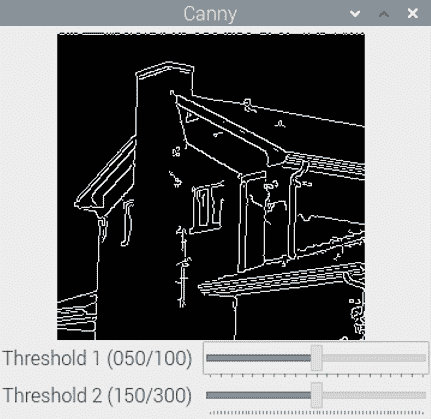
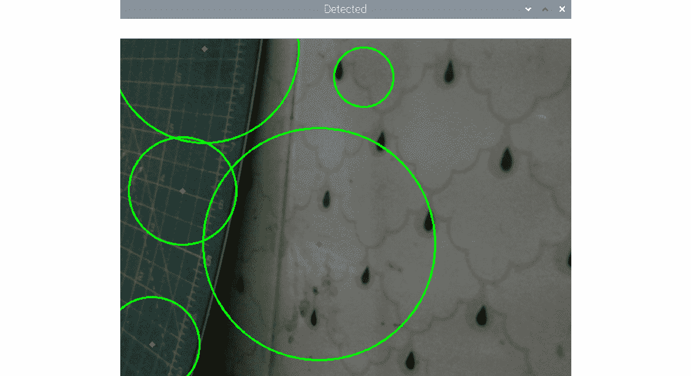
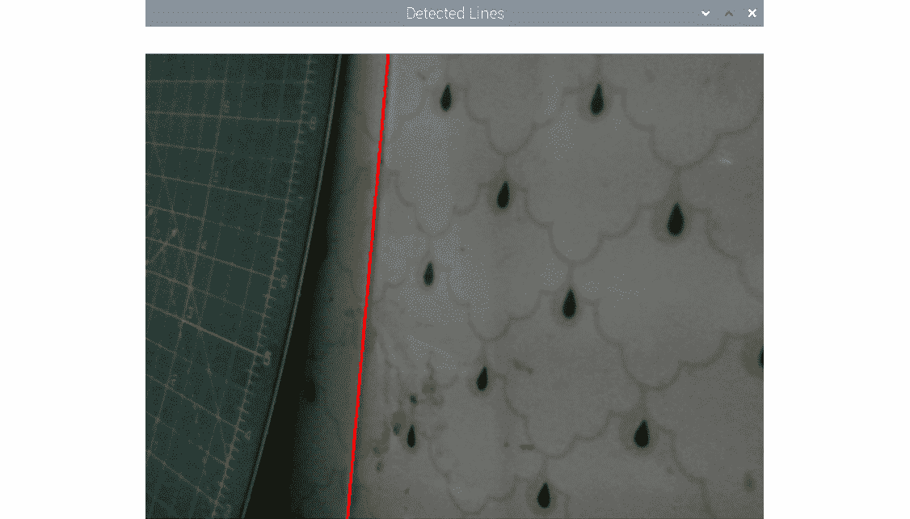
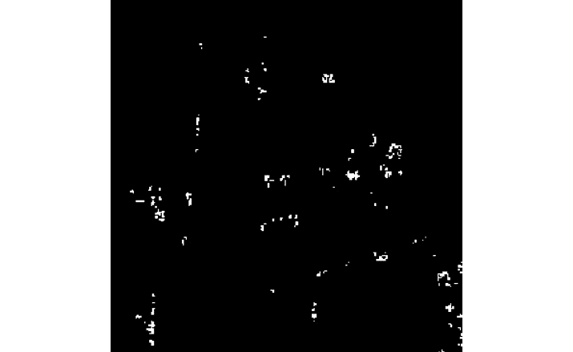

# *第 8 章*：高通滤波器和特征检测

在上一章中，我们了解了内核和低通滤波器及其应用。 我们了解并演示了如何在模糊，平滑和消噪图像中使用低通滤波器。

在本章中，我们将学习并演示高通滤波器的用法。 这包括它们在图像处理和计算机视觉中的应用。 首先，我们将探讨拉普拉斯滤波器，沙尔滤波器和 Sobel 高通滤波器。 然后，我们将学习 Canny 边缘检测算法。 我们还将演示圆和直线的霍夫变换。 我们将通过使用 Harris 算法检测角点检测来得出结论。

以下是我们将在本章中介绍的主题的列表：

*   探索高通滤波器
*   使用 Canny 边缘检测器
*   使用霍夫变换查找圆和直线
*   哈里斯角点检测

在遵循了本章之后，您将能够使用高通滤波器来检测输入图像中的特征，例如边缘，拐角，直线和圆。

# 技术要求

可以在 [GitHub](https://github.com/PacktPublishing/raspberry-pi-computer-vision-programming/tree/master/Chapter08/programs) 上找到本章的代码文件。

观看以下视频，以查看[这个页面](https://bit.ly/2CFnpnD)上的“有效代码”。

# 探索高通滤波器

高通滤波器的概念与低通滤波器完全相反。 高通滤波器允许信息的高频分量（例如信号和图像）通过它们。 这就是为什么将它们称为**高通滤波器**的原因。 在图像中，边缘是高频分量。 我们在高通滤波器中使用的内核会增强图像中的强烈分量。 这就是为什么当我们对图像应用高通滤波器时，会在输出中得到边缘。

注意：

您可以通过[这个页面](https://diffractionlimited.com/help/maximdl/High-Pass_Filtering.htm)了解更多有关高通滤波器的信息。 信号滤波器的另一种类型是带通滤波器，它可以使一个频率范围（或频带）内的信号通过。 这些滤镜使我们可以突出显示图像的边缘并通过同时使用模糊来减少噪点。 您可以在[这个页面](https://homepages.inf.ed.ac.uk/rbf/HIPR2/freqfilt.htm)上阅读有关它们的更多信息。

OpenCV 有许多库函数，可实现高通滤波器。 我们将研究如何使用 **Laplacian（）**， **Sobel（）**和 **Scharr（）**函数。

注意：

您可以通过参考以下网页来详细了解高通滤波的数学方面：

<https://www.tutorialspoint.com/dip/Sobel_operator.htm>

<https://www.tutorialspoint.com/dip/Laplacian_Operator.htm>

以下是所有高通滤波功能常用的参数列表及其含义：

*   **src**：这是要在其中检测边缘的源图像的参数。
*   **ddepth**：这是用于确定目标图像深度的参数。 **-1** 表示源图像和目标图像具有相同的深度。 OpenCV 提供的高通滤波功能支持源图像和目标图像深度的以下组合：


图 8.1 – OpenCV 支持的过滤器功能列表

*   **dx**：这是`X`的导数的顺序（**Laplacian（）**不需要）。
*   **dy**：这是`Y`的导数的顺序（**Laplacian（）**不需要）。
*   **ksize**：这是内核矩阵的大小（可以是`1`，`3`，`5`或 **7 **Sobel（）**函数的**或 **Laplacian（）**函数的正奇数， **Scharr（）**不需要 功能）。
*   **标度**：这是标度，是可选的。 这是计算的拉普拉斯算子值的可选比例的因素。 默认情况下不应用缩放。
*   **增量**：这是增量的值。 这是一个可选常数，并添加到最终输出中。
*   **borderType**：这是用于对位于边界处的像素进行像素外推的方法。

让我们编写一些代码来演示 **Sobel（）**， **Laplacian（）**和 **Scarr（）**函数的功能。 在下面的代码中，我们使用 **Scarr（）**和 **Sobel（）**函数计算输入图像的`X`的拉普拉斯算式和一阶导数 ：

```py
import cv2
import matplotlib.pyplot as plt
img = cv2.imread('/home/pi/book/dataset/4.1.05.tiff', 0)
laplacian = cv2.Laplacian(img, ddepth=cv2.CV_32F, ksize=17,
                          scale=1, delta=0,
                          borderType=cv2.BORDER_DEFAULT)
sobel = cv2.Sobel(img, ddepth=cv2.CV_32F, dx=1, dy=0,
                  ksize=11, scale=1, delta=0,
                  borderType=cv2.BORDER_DEFAULT)
scharr = cv2.Scharr(img, ddepth=cv2.CV_32F, dx=1, dy=0,
                    scale=1, delta=0,
                    borderType=cv2.BORDER_DEFAULT)
images=[img, laplacian, sobel, scharr]
titles=['Original', 'Laplacian', 'Sobel', 'Scharr']
for i in range(4):
    plt.subplot(2, 2, i+1)s
    plt.imshow(images[i], cmap = 'gray')
    plt.title(titles[i])
    plt.axis('off')
plt.show()
```

具有 **Laplacian（）**， **Scharr（）**和 **Sobel（）**函数的图像`X`的导数的计算[ 返回输入图像中的垂直边缘。 以下屏幕截图显示了上述代码的输出：


图 8.2 –使用高通滤波器的 x 导数

我们可以将两个按钮连接到上拉配置的`7`和 **11** GPIO 引脚，并对它们进行编程以调整 **dx** 和 **dy** 。 以下是执行此操作的代码：

```py
import RPi.GPIO as GPIO
import cv2
x = 0
y = 1
cap = cv2.VideoCapture(0)
GPIO.setmode(GPIO.BOARD)
GPIO.setwarnings(False)
button1 = 7
button2 = 11
GPIO.setup(button1, GPIO.IN, GPIO.PUD_UP)
GPIO.setup(button2, GPIO.IN, GPIO.PUD_UP)
while True:
    print(x, y)
    ret, frame = cap.read()
    button1_state = GPIO.input(button1)
    if button1_state == GPIO.LOW:
        x = 0
        y = 1
    button2_state = GPIO.input(button2)
    if button2_state == GPIO.LOW:
        x = 1
        y = 0
```

现在，让我们使用`cv2.Scharr()`函数来计算输出图像：

```py
    output = cv2.Scharr(frame, ddepth=cv2.CV_32F,
                        dx=x, dy=y,
                        scale=1, delta=0,
                        borderType=cv2.BORDER_DEFAULT)
    cv2.imshow('Salt and pepper Noise App', output)
    if cv2.waitKey(1) == 27:
        break
cap.release()
cv2.destroyAllWindows()
```

运行前面的程序，并从连接到 Raspberry Pi 板上的 USB 网络摄像头观察实时视频源上的边缘检测。 我们还可以将`X`衍生物添加到同一实时视频供稿的`Y`衍生物（用 Scharr 计算）中，如下所示：

```py
import cv2
cap = cv2.VideoCapture(0)
while True:
    ret, frame = cap.read()
    output1 = cv2.Scharr(frame, ddepth=cv2.CV_32F,
                        dx=0, dy=1,
                        scale=1, delta=0,
                        borderType=cv2.BORDER_DEFAULT)
```

前一个代码段计算`Y`轴的 Scharr 导数。 现在，让我们编写`X`轴的 Scharr 导数的代码，如下所示：

```py
    output2 = cv2.Scharr(frame, ddepth=cv2.CV_32F,
                        dx=1, dy=0,
                        scale=1, delta=0,
                        borderType=cv2.BORDER_DEFAULT)
    cv2.imshow('Addition of Vertical and Horizontal',
               cv2.add(output1, output2))
    if cv2.waitKey(1) == 27:
        break
cap.release()
cv2.destroyAllWindows()
```

运行前面的程序，观察添加的`X`和`Y`Scharr 衍生物。 您可以使用 Sobel 衍生工具实施类似的程序。 所有这些滤镜都用于检测图像中的边缘。

在下一节中，我们将看到如何使用高通滤波器通过 Canny 边缘检测算法来检测图像中的边缘。

# 使用 Canny 边缘检测器

Canny 边缘检测算法由 John Canny 开发。 Canny 的算法大量使用高通滤波器的概念。 它具有多个步骤。

注意：

您可以在[这个页面](http://homepages.inf.ed.ac.uk/rbf/HIPR2/canny.htm.)上了解有关 Canny 边缘检测算法的更多信息。

OpenCV 具有`cv2.Canny()`函数，提供了 Canny 算法。 以下是该算法的步骤：

1.  将具有 5 x 5 像素大小的高斯核应用于输入图像以消除任何噪声。
2.  然后，我们计算滤波图像强度的梯度。 我们可以在此步骤中使用 L1 或 L2 范数。
3.  然后，我们应用非最大抑制，并为可能的边缘集确定候选者。
4.  The final step is the operation of hysteresis. We finalize the edges depending on the thresholds passed to the images.

    注意：

    您可以在[这个页面](http://www.chioka.in/differences-between-the-l1-norm-and-the-l2-norm-least-absolute-deviations-and-least-squares/)和[这个页面](https://towardsdatascience.com/non-maximum-suppression-nms-93ce178e177c)上详细了解 L1 和 L2 规范以及非最大抑制。

以下是`cv2.Canny()`函数的参数列表：

*   **img**：我们需要检测边缘的输入源图像。
*   **threshold1**：阈值的下限。
*   **threshold2**：阈值的上限。
*   **L2gradient**：如果此值为 **True** ，则该函数使用 L2 范数来计算边集，这更精确，但计算量大。 如果**为 False** ，则使用 L1 范数来计算边集，这需要较少的计算，但准确性较低。

此函数计算并返回源输入图像中检测到的边缘集。 以下代码很好地演示了此概念：

```py
import cv2
import matplotlib.pyplot as plt
img = cv2.imread('/home/pi/book/dataset/4.1.05.tiff', 0)
edges1 = cv2.Canny(img, 50, 300, L2gradient=False)
edges2 = cv2.Canny(img, 100, 150, L2gradient=True)
images = [img, edges1, edges2]
titles = ['Original', 'L1 Gradient', 'L2 Gradient']
for i in range(3):
        plt.subplot(1, 3, i+1)
        plt.imshow(images[i], cmap = 'gray')
        plt.title(titles[i])
        plt.axis('off')
plt.show()
```

先前代码的输出如下：


图 8.3 – Canny 边缘检测的输出

通过实时计算边缘，我们可以使前面的程序更有趣，从而可以通过 OpenCV 的跟踪栏来调整阈值：

```py
import cv2
cv2.namedWindow('Canny')
img = cv2.imread('/home/pi/book/dataset/4.1.05.tiff', 0)
def empty(z):
    pass
cv2.createTrackbar('Threshold 1', 'Canny', 50, 100, empty)
cv2.createTrackbar('Threshold 2', 'Canny', 150, 300, empty)
while(True):
    l1 = cv2.getTrackbarPos('Threshold 1', 'Canny')
    l2 = cv2.getTrackbarPos('Threshold 2', 'Canny')
    output = cv2.Canny(img, l1, l2, L2gradient=False)
    cv2.imshow('Canny', output)
    if cv2.waitKey(1) == 27:
        break
cv2.destroyAllWindows()
```

在前面的代码中，我们为 Canny 算法的上下阈值创建了两个跟踪条。 我们使用 L1 范数来计算边缘。 输出如下：



图 8.4 –带轨迹条的 Canny 边缘检测算法的输出

我们可以将此算法应用于实际图像，例如来自网络摄像头的实时视频。 在下一节中，我们将学习如何使用霍夫变换来检测圆和直线。

## 使用 Hough 变换查找圆和直线

OpenCV 提供了`cv2.HoughCircles()`函数，用于使用 Hough 方法检测图像中的圆。 这将返回检测到的圆的中心和半径。 它接受图像，（**cv2.HOUGH_GRADIENT**）检测方法，分辨率的反比，要检测的圆心之间的最小距离，内部使用的 Canny 方法的最高阈值 ，累加器的阈值以及要检测的圆的最大和最小距离。

注意：

您可以在[这个页面](https://www.cis.rit.edu/class/simg782/lectures/lecture_10/lec782_05_10.pdf)上找到有关圆的 Hough 变换的数学方面的更多详细信息。

在以下代码中，我们接受来自 USB 网络摄像头的实时视频提要作为输入。 然后，我们通过模糊输入帧消除噪声，然后将模糊帧传递给`cv2.HoughCircles()`函数的调用。 然后，我们使用`cv2.Circle()`函数可视化检测到的圆，如下所示：

```py
import cv2
cap = cv2.VideoCapture(0)
while (True):
    ret , frame = cap.read()
    grey = cv2.cvtColor(frame, cv2.COLOR_BGR2GRAY)
    blur = cv2.blur(grey, (5, 5))
    circles = cv2.HoughCircles(blur,
                               method=cv2.HOUGH_GRADIENT,
                               dp=1, minDist=200,
                               param1=50, param2=13,
                               minRadius=30, maxRadius=175)
    if circles is not None:
        for i in circles [0,:]:
            cv2.circle(frame, (i[0], i[1]), i[2], (0, 255, 0), 2)
            cv2.circle(frame, (i[0], i[1]), 2, (0, 0, 255), 3)
    cv2.imshow('Detected', frame)
    if cv2.waitKey(1) == 27:
        break
cv2.destroyAllWindows()
cap.release()
```

运行前面的程序并观察输出。 它应如下所示：



图 8.5 –检测到的圆圈

OpenCV `cv2.HoughLines()`函数检测图像中的线。 它接受灰度图像，rho 值（累加器的距离精度），θ（累加器的角度精度）和累加器阈值参数作为参数。 我们将通过实时 USB 网络摄像头视频提要进行演示。 返回的输出为极坐标格式，必须在可视化之前将其转换为`X`/`Y`坐标系：

```py
import numpy as np
import cv2
cap = cv2.VideoCapture(0)
while True:
    ret, img = cap.read()
    gray = cv2.cvtColor(img, cv2.COLOR_BGR2GRAY)
    edges = cv2.Canny(gray, 50, 250, apertureSize=5,
                      L2gradient=True)
    lines = cv2.HoughLines(edges, 1, np.pi/180, 200)
    if lines is not None:
        for rho,theta in lines[0]:
            a = np.cos(theta)
            b = np.sin(theta)
            x0 = a*rho
            y0 = b*rho
            pts1 = (int(x0 + 1000*(-b)), int(y0 + 1000*(a)))
            pts2 = (int(x0 - 1000*(-b)), int(y0 - 1000*(a)))
            cv2.line(img, pts1, pts2, (0, 0, 255), 2)
    cv2.imshow('Detected Lines', img)
    if cv2.waitKey(1) == 27:
        break
cv2.destroyAllWindows()
cap.release()
```

运行前面的代码，然后观察其输出。 输出如下：



图 8.6 –检测到的线

对于给定的输入，必须对进行精细调整。 这意味着，如果在正确的位置看不到任何线或圆，则可以尝试调整传递给这些 Hough 变换函数的参数的值。 有时，它可能会产生错误的结果，因为即使输入框中没有任何内容，也可以看到直线和圆圈。 同样，为了获得正确的结果，我们必须调整传递给这些函数的参数的值。

# 哈里斯角点检测

OpenCV 具有`cv2.cornerHarris()`函数，用于检测角。 其参数如下：

*   **img**：输入图像，必须为灰度并且具有 **float32** 类型。
*   **blockSize**：这是考虑进行角点检测的邻域的大小。
*   **ksize**：使用的 Sobel 导数的光圈参数。
*   `k`：等式中使用的自由哈里斯检测器参数。

以下是实现哈里斯角点检测的示例程序：

```py
import cv2
import numpy as np
import matplotlib.pyplot as plt
img = cv2.imread('/home/pi/book/dataset/4.1.05.tiff', 0)
img = np.float32(img)
dst = cv2.cornerHarris(img, 2, 3, 0.04)
ret, dst = cv2.threshold(dst, 0.01*dst.max(), 255, 0)
dst = np.uint8(dst)
plt.imshow(dst, cmap='gray')
plt.axis('off')
plt.show()
```

在前面的程序中，我们将图像转换为 32 位浮点格式，然后将其提供给角点检测功能。 然后，我们将图像阈值化。 我们使用 **0.01 * dst.max（）**作为阈值来计算二进制图像。 然后，我们将输出转换为 8 位整数格式，以便可以使用 **matplotlib** 显示输出图像，如下所示：



图 8.7 –检测到的角

我们可以在工业和机器人应用中使用这种角检测方法来检测规则和可预测对象的角。 它在现实世界的自动化中非常有用。

# 锻炼

要实践本章所学内容，请在 OpenCV 中探索 **HoughLinesP（）**， **goodFeaturesToTrack（）**和 **FastFeatureDetector（）**函数以检测各种功能。 使用这些函数编写程序，以使用概率霍夫变换和其他功能检测行。

# 摘要

在本章中，我们学习了高通滤波器的概念和演示。 我们对图像应用了高通滤波器，以获得各种结果。 我们还演示了各种检测特征的技术，例如角，线，边和圆。 所有这些特征检测算法都依赖于高通滤波。 Canny 的边缘检测算法使用高斯高通滤波器。 哈里斯角点检测算法使用 Sobel 空间导数。 所有这些几何特征检测算法通常在工业自动化，智能车辆和机器人技术的现实生活中使用。

在本书的下一章中，我们将学习概念并演示降级图像的恢复。 图像分割； 一维，二维和多维数据的 k 均值聚类； 使用 k 均值聚类的图像量化； 并详细估算深度图。