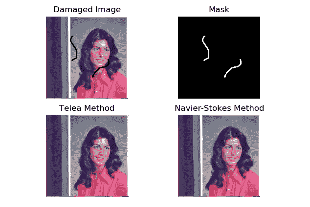
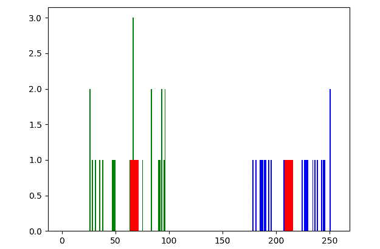

# 第 9 章：图像还原，分割和深度图

在上一章中，我们演示了如何在算法中使用高通过滤器及其应用来检测边缘。

在本章中，我们将学习一些有关图像的高级处理技术。 首先，我们将开始恢复损坏或降级的图像。 然后，我们将探讨各种类型的分割技术的基础。 我们已经看到阈值化是分割的基本形式。 我们将在本章中更详细地探讨这个概念。 最后，我们将计算视差图并估计图像中对象的深度。

在本章中，我们将介绍以下主题：

*   使用修复还原损坏的图像
*   分割图像
*   视差图和深度估计

到本章末，我们将能够还原损坏的图像，对图像应用各种分割算法，并使用视差图估计对象的深度。

# 技术要求

可以在 [GitHub](https://github.com/PacktPublishing/raspberry-pi-computer-vision-programming/tree/master/Chapter09/programs) 上找到本章的代码文件。

观看下面的视频，以查看[这个页面](https://bit.ly/2NsIzXY)上的“有效代码”。

# 使用修复功能恢复损坏的图像

图像的**恢复是从图像的现有部分重建受损部分的计算过程。 如果我们用照相相机在胶片上拍摄图像并将其显影在纸上，则相纸会随着时间的流逝而退化，从而导致照片质量下降。 传感器故障以及相机镜头上的灰尘和污垢等瑕疵会在拍摄的图像中引入错误。 发送和接收的过程还会在数字图像中引入错误。 图像修复技术可以还原退化和损坏的图像。 许多算法可用于修复图像。 OpenCV 库使用`cv2.inpaint()`函数实现了两种修复方法。**

此函数接受降级或损坏的源图像，图像修复的遮罩，修复邻域的大小以及修复方法作为参数。 修补遮罩是由灰度图像表示的损坏区域，其中白色像素是指要修复或修补的区域。 下面的代码演示了我们上面讨论的两种方法。 两种方法产生的输出几乎相同。 我们可以使用免费的图像编辑软件（例如 GIMP）来创建损坏的遮罩。 看下面的代码：

```py
import cv2
import matplotlib.pyplot as plt
image = cv2.imread('/home/pi/book/dataset/Damaged.tiff')
mask = cv2.imread('/home/pi/book/dataset/Mask.tiff', 0)
input = cv2.cvtColor(image, cv2.COLOR_BGR2RGB)
output_TELEA = cv2.inpaint(input, mask, 5, cv2.INPAINT_TELEA)
output_NS = cv2.inpaint(input, mask, 5, cv2.INPAINT_NS)
plt.subplot(221)
plt.imshow(input)
plt.title('Damaged Image')
plt.axis('off')
plt.subplot(222)
plt.imshow(mask, cmap='gray'),
plt.title('Mask')
plt.axis('off')
plt.subplot(223),
plt.imshow(output_TELEA)
plt.title('Telea Method')
plt.axis('off')
plt.subplot(224)
plt.imshow(output_NS)
plt.title('Navier Stokes Method')
plt.axis('off')
plt.show()
```

在前面的代码中，我们使用了两种技术。`cv2.INPAINT_TELEA`标志基于*论文中描述的技术，该论文是基于 Alexandru 编写并于 2004 年出版的的基于快速行进方法*的图像修复技术。 Telea。

`cv2.INPAINT_NS`标志基于 *Navier-Stokes，流体动力学以及图像和视频修补*中描述的技术，该论文由 Bertalmio Marcelo 于 2001 年撰写和发布， Andrea L. Bertozzi 和 Guillermo Sapiro。

以下是输出：



图 9.1 –恢复降级的图像

在前面的输出中，第一张图像是损坏的图像。 第二个图像是对应于损坏的二进制掩码。 第二行中的图像是使用，**Telea** 方法和 **Navier-Stokes** 方法还原的图像。

注意

您可以在[这个页面](https://www.math.ucla.edu/~imagers/htmls/inp.html)上找到有关图像修复的更多信息。

# 分割图像

图像的分割是将图像分为许多部分或部分（也称为段）的过程。 此过程使用特定条件执行。 我们可以将图像划分为段的最简单方法是通过阈值化。 我们已经在 第 6 章 ，*颜色空间，变换和阈值*中了解并演示了阈值化技术。 在本章中，我们将演示另外两种分割方法。 这些方法是**均值漂移**算法和 **k-means 聚类**。

## 均值漂移算法分割

Bogdan Georgescu 和 Chris M. Christoudias 开发了均值漂移算法，并用 C++ 实现。 相同算法的 Python 实现称为 **PyMeanShift**。 PyMeanShift 使用 ndarrays 和 NumPy 来存储和处理图像。 这就是为什么它与基于 NumPy 的图像处理库（如 OpenCV，Mahotas 和 scikit-image）兼容的原因。

注意

您可以在项目 [GitHub 页面](https://github.com/fjean/pymeanshift)上找到有关此内容的更多信息。

没有二进制软件包可以在 Linux，Unix 和其他基于它们的操作系统上安装 PyMeanShift。 我们必须构建它并从源代码安装它。 [从以下 URL 下载最新版本的源代码](https://github.com/fjean/pymeanshift)。 下载将是一个 ZIP 文件。 将其复制到`pi`用户的**主目录**，**/ pi / home**，然后提取它。 导航到我们将其解压缩到的目录，并在`lxterminal`上依次运行以下命令：

```py
cd ~
cd pymeanshift-master/
sudo python3 setup.py build
sudo python3 setup.py install
```

安装完成后，在命令提示符上运行以下命令以检查安装是否成功：

```py
python3 -c "import pymeanshift as pms"
```

**pymeanshift** 库提供`pms.segment()`函数，该函数可分割由 NumPy ndarray 表示的图像。 它接受要分割的源输入图像，空间半径，范围半径和最小密度作为参数。 然后，它返回一个分割的图像，一个标记的彩色图像和一组区域。 以下是用于演示功能的代码示例：

```py
import cv2
import pymeanshift as pms
from matplotlib import pyplot as plt
img = cv2.imread('/home/pi/book/dataset/house.tiff', 1)
input = cv2.cvtColor(img, cv2.COLOR_BGR2RGB )
(segmented_image, labels_image, number_regions) = pms.segment(
    input, spatial_radius=2, range_radius=2, min_density=300)
plt.subplot(131)
plt.imshow(input)
plt.title('Input')
plt.axis('off')
plt.subplot(132)
plt.imshow(segmented_image)
plt.title('Segmented Output')
plt.axis('off')
plt.subplot(133)
plt.imshow(labels_image)
plt.title('Labeled Output')
plt.axis('off')
plt.show()
```

先前代码的输出如下：


图 9.2 –使用 PyMeanShift 进行细分

作为练习，将不同的参数值传递给函数参数并比较输出。 我们可以将其应用于来自网络摄像头的实时 Feed 视频，如下所示：

```py
import cv2
import pymeanshift as pms
cap = cv2.VideoCapture(0)
while True:
    ret, frame = cap.read()
    (segmented_image, labels_image, number_regions) = pms.segment(
        frame, spatial_radius=2, range_radius=2, min_density=50)
    cv2.imshow('Segmented', segmented_image)
    if cv2.waitKey(1) == 27:
        break
cv2.destroyAllWindows()
cap.release()
```

通常，分段是在计算上非常昂贵的操作，因此，实时视频的每秒**帧**（**FPS**）非常低。 该的输出将类似于前一个（*图 2* ）的输出。

## K 均值聚类和图像量化

k 均值聚类算法是一种分类算法。 假设算法的输入是大小为`n`的集合，然后输出将该集合划分为`k`个分区数。 这就是为什么它被称为 k-means 算法的原因。 本质上，基于特定标准，我们将数据划分或分类为`k`个类或分区。 将其应用于具有两个或多个维度的数据（即多维数据）时，称为聚类。 OpenCV 具有`cv2.kmeans()`函数，该函数实现了针对一维和多维数据的 k 均值聚类算法。 它接受以下参数的参数：

*   **数据**：这是 k 均值聚类算法的输入数据。 此数据必须为浮点数字格式。
*   `K`：算法输出中的分区总数。 必须事先知道（如果输入是彩色图像，这将意味着输出分割图像中的颜色数量）。
*   **条件**：算法的终止条件。
*   **尝试**：使用不同的初始标签运行算法的次数。
*   **标志**：表示簇的初始中心的位置，这些簇以下列任何一个值作为参数传递：

    ```py
    cv2.KMEANS_RANDOM_CENTERS 
    ```

    ```py
    cv2.KMEANS_PP_CENTERS 
    ```

    ```py
    cv2.KMEANS_USE_INITIAL_LABELS
    ```

让我们尝试首先演示用于一维数据的程序。 我们将为此创建自己的随机数据。 让我们创建和可视化数据：

```py
import numpy as np
import cv2
from matplotlib import pyplot as plt
x = np.random.randint(25, 100, 25)
y = np.random.randint(175, 255, 25)
z = np.hstack((x, y))
z = z.reshape((50, 1))
z = np.float32(z)
plt.hist(z, 256, [0, 256])
plt.show()
```

样本随机数据将类似于以下输出：


图 9.3 –一维数据

我们可以清楚地看到数据分为两组。 现在，让 Raspberry Pi 对它进行分类，并突出显示组及其中心。 删除或注释掉前面代码的最后两行，并添加以下行：

```py
criteria = (cv2.TERM_CRITERIA_EPS +
            cv2.TERM_CRITERIA_MAX_ITER, 10, 1.0)
flags = cv2.KMEANS_RANDOM_CENTERS
compactness, labels, centers = cv2.kmeans(z, 2,
                                          None,
                                          criteria,
                                          10, flags)
A = z[labels==0]
B = z[labels==1]
plt.hist(A, 256, [0, 256], color = 'g')
plt.hist(B, 256, [0, 256], color = 'b')
plt.hist(centers, 32, [0, 256], color = 'r')
plt.show()
```

让我们运行前面的程序。 请注意，我们正在重新运行对`np.random.randint()`函数的调用，因此数据集将略有不同。 但是，它将具有两个不同的组，突出显示如下：



图 9.4 –适用于一维数据的 K-均值

我们可以在二维数据中实现此方法，如下所示：

```py
import numpy as np
import cv2
from matplotlib import pyplot as plt
X = np.random.randint(25, 50, (25, 2))
Y = np.random.randint(60, 85, (25, 2))
Z = np.vstack((X, Y))
Z = np.float32(Z)
criteria = (cv2.TERM_CRITERIA_EPS +
            cv2.TERM_CRITERIA_MAX_ITER, 10, 1.0)
ret,label,center=cv2.kmeans(Z, 2, None, criteria,
                            10, cv2.KMEANS_RANDOM_CENTERS)
A = Z[label.ravel()==0]
B = Z[label.ravel()==1]
plt.scatter(A[:,0], A[:,1])
plt.scatter(B[:,0], B[:,1], c = 'g')
plt.scatter(center[:,0], center[:,1],
            s = 80, c = 'r', marker = 's')
plt.xlabel('X - Axis')
plt.ylabel('Y - Axis')
plt.show()
```

输出如下：


图 9.5 –二维数据的 K 均值

在前面的输出中，我们可以清楚地看到我们的数据分为两组。 让我们编写将 k-means 聚类算法应用于彩色图像的代码，其中`k`的大小值为`2`，`4`和`12`：

```py
import cv2
import matplotlib.pyplot as plt
import numpy as np
img = cv2.imread('/home/pi/book/dataset/4.2.03.tiff', 1)
img = cv2.cvtColor(img, cv2.COLOR_BGR2RGB)
Z = img.reshape((-1, 3))
Z = np.float32(Z)
criteria = (cv2.TERM_CRITERIA_EPS +
            cv2.TERM_CRITERIA_MAX_ITER,
            10, 1.0)
```

在前面的代码中，我们正在彩色模式下读取图像并对其进行重塑。 我们还将其转换为 32 位浮点格式。 然后，我们在最后一行设置聚类标准。

让我们以`k`的值计算为`2`的量化图像，如下所示：

```py
k = 2
ret, label1, center1 = cv2.kmeans(Z, k, None, criteria, 10,
                                 cv2.KMEANS_RANDOM_CENTERS)
center1=np.uint8(center1)
res1 = center1[label1.flatten()]
output1 = res1.reshape((img.shape))
```

在前面的代码中，我们正在使用`cv2.kmeans()`函数计算群集，然后在将数据转换为 8 位整数格式后对其进行展平和整形。

现在，我们以`k`的值为`4`的方式计算量化图像：

```py
k = 4
ret, label1, center1 = cv2.kmeans(Z, k, None, criteria, 10,
                                 cv2.KMEANS_RANDOM_CENTERS)
center1=np.uint8(center1)
res1 = center1[label1.flatten()]
output2 = res1.reshape((img.shape))
```

现在让我们以`k`的值作为`12`来计算量化的图像，如下所示：

```py
k = 12
ret, label1, center1 = cv2.kmeans(Z, k, None, criteria, 10,
                                 cv2.KMEANS_RANDOM_CENTERS)
center1=np.uint8(center1)
res1 = center1[label1.flatten()]
output3 = res1.reshape((img.shape))
```

最后，让我们使用 matplotlib 在网格中显示所有图像：

```py
output = [img, output1, output2, output3]
titles = ['Original Image', 'K=2', 'K=4', 'K=12']
for i in range(4):
    plt.subplot(2, 2, i+1)
    plt.imshow(output[i])
    plt.title(titles[i])
    plt.xticks([])
    plt.yticks([])
plt.show()
```

首先，在前面的代码中，我们使用`cv2.KMEANS_RANDOM_CENTERS`标志为所有集群分配随机中心。 我们编写的程序的以下输出具有 2、4 和 12 种颜色的原始图像和使用量化的分割图像。 以下是输出：


图 9.6 – K 均值聚类和图像量化

作为练习，使用函数的自变量的不同值运行前面的程序，然后比较输出。 在网络摄像头的实时视频中实现此功能将很有趣。 不要期望高帧速率，因为它在计算上非常昂贵。

## k 均值和均值漂移算法的比较

k 均值算法的时间复杂度为 O（n）。 均值漂移分割算法的时间复杂度为 O（n2）。 这种复杂性的差异是因为 k-means 算法在运行时通过参数提供了簇数。 均值漂移分割算法必须在执行时自行计算簇数。 在我们不知道簇数的应用中，必须使用均值漂移算法。 但是，当我们已经知道簇的数目时，建议您使用 k-means 算法，因为如果事先知道簇的数目，它的运行速度会大大提高。

# 视差图和深度估计

视差是指在由左眼和右眼或相机拍摄的图像中，对象位置的不同。 这种差异或视差是由视差引起的。 我们的大脑使用有关视差的信息来估计物体的深度（即它们与我们的距离）。 通过将此原理应用于网络摄像头捕获的图像对中的每个像素，我们可以计算两个图像之间的视差。 此视差信息可用于计算估计深度，从而模仿灵长类动物大脑的功能。

在生物学方面，这被称为，即**立体视觉**，这使我们能够从三个维度进行观察。 OpenCV 提供了`cv2.StereoBM.compute()`函数，该函数接受左图像和右图像作为参数，并返回该图像对的视差图。`StereoBM_create()`函数初始化立体声状态。 它可以有许多差异和块大小作为参数。 默认情况下，它们分别是 0 和 21。 在下面的示例中，我们使用默认参数进行调用。 此立体声状态用于通过`cv2.StereoBM.compute()`函数来计算视差图。 我们需要两个图像作为输入。 这些图像之一对应于右相机的输入，另一图像对应于左相机的输入。 以下代码使用这两个函数演示了此概念：

```py
import cv2
import matplotlib.pyplot as plt
Right= cv2.imread('/home/pi/book/dataset/imRsmall.jpg', 0)
Left = cv2.imread('/home/pi/book/dataset/imLsmall.jpg', 0)
stereo_BM_state=cv2.StereoBM_create()
output_map=stereo_BM_state.compute(Left, Right)
titles=['Left', 'Right', 'Depth Map']
output=[Left, Right, output_map]
for i in range(3):
    plt.subplot(1, 3, i+1)
    plt.imshow(output[i], cmap='gray')
    plt.title(titles[i])
    plt.axis('off')
plt.show()
```

前面的代码的输出如下：


图 9.7 –从视差图估计深度

在前面的输出中，输出视差图中的较亮区域表示更多视差。 这意味着源输入图像中与视差输出图中的较亮区域相对应的对象更靠近相机。 类似地，视差输出图中的较暗颜色表示与源输入图像中那些区域相对应的对象距离相机更远。

# 摘要

在本章中，我们了解了图像修复的概念以及受损和退化图像的恢复。 然后，我们展示了许多图像分割方法，包括均值漂移算法和 k-均值聚类。 最后，我们研究了如何使用视差图估计图像中对象的深度。 所有这些技术在许多现实应用中都是有用的。 例如，每当我们要通过网络发送图像时，我们都可以使用图像量化，从而减少带宽消耗。

在下一章中，我们将学习一些更高级的概念，例如直方图，灰度和彩色图像的直方图，图像轮廓的检测以及数学形态学运算。