# 第 11 章：计算机视觉的实际应用

在上一章中，我们研究了计算机视觉中的各种高级概念，例如形态运算和轮廓。

本章是我们在前面各章中学习和展示的所有计算机视觉概念的最终总结。 在本章中，我们将使用我们较早学习的计算机视觉操作来实现一些实际项目。 我们还将学习一些新概念，例如背景减法和光流计算，然后在小型应用中进行演示。 本章包含许多动手的编程示例，以及有关代码和新功能的详细说明。

在本章中，我们将学习和演示以下主题的代码：

*   实现最大 RGB 滤镜
*   实施背景扣除
*   计算光流
*   检测并跟踪运动
*   检测图像中的条形码
*   实施色度键效果

完成本章后，您将能够实现所学到的概念，以使用 **Raspberry Pi**（RPi）和一些相机传感器来创建现实应用，例如安全系统和运动检测系统。

# 技术要求

可以在 [GitHub](https://github.com/PacktPublishing/raspberry-pi-computer-vision-programming/tree/master/Chapter11/programs) 上找到本章的代码文件。

观看以下视频，以查看[这个页面](https://bit.ly/2Z43syb)上的“正在执行的代码”。

# 实现最大 RGB 滤镜

我们知道，过滤器允许并根据某些标准阻止信号或数据。 让我们根据像素颜色的强度值手动编写用于实现特殊滤镜的代码。 这称为**最大 RGB 滤镜**。 在 Max RGB 滤镜中，我们比较每个像素的彩色图像的所有颜色通道的强度。

然后，我们将通道的强度保持为最大强度，并将所有其他通道的强度降低为零。 对于图像中的每个像素都会发生这种情况。 假设对于一个像素，强度为（30，200，120）。 然后，在应用最大 RGB 滤镜后，它将为（0，200，0）。 让我们看一个将使用 NumPy 和 OpenCV 函数实现此功能的程序：

```py
import cv2
import numpy as np
def maxRGB(img):
    b = img[:, :, 0]
    g = img[:, :, 1]
    r = img[:, :, 2]
    M = np.maximum(np.maximum(b, g), r)
    b[b < M] = 0
    g[g < M] = 0
    r[r < M] = 0
    return(cv2.merge((b, g, r)))
cap = cv2.VideoCapture(0)
while True:
    ret, frame = cap.read()
    cv2.imshow('Max RGB Filter', maxRGB(frame))
    if cv2.waitKey(1) == 27:
        break
cv2.destroyAllWindows()
cap.release()
```

运行前面的程序并查看输出。 看到过滤后的实时供稿很有趣。 输出如下：


图 11.1 –最大 RGB 滤镜的输出

在下一节中，我们将学习并演示背景扣除的概念。

# 实施背景扣除

静态摄像机用于的许多应用中，例如安全性和监视。 我们可以通过应用称为背景减法的过程来分离背景和运动对象。 通常返回二进制图像，背景图像（场景的静态部分）以黑色像素为单位，而运动部分（变化或动态）以白色像素为单位。 OpenCV 可以通过两种算法来实现。 第一个是`createBackgroundSubtractorKNN()`。 这将创建 **K 最近邻**（**KNN**）背景减法器对象。 然后，我们可以使用对象调用`apply()`函数以获得前景遮罩。 我们可以直接实时显示前景遮罩。

以下是如何使用它的演示：

```py
import cv2
import numpy as np
cap = cv2.VideoCapture(0)
fgbg = cv2.createBackgroundSubtractorKNN()
while(True):
    ret, frame = cap.read()
    fgmask = fgbg.apply(frame)
    cv2.imshow('frame', fgmask)
    if cv2.waitKey(30) == 27:
        break
cap.release()
cv2.destroyAllWindows()
```

输出为二进制视频流，如以下屏幕截图所示。 我挥舞着我的手，该手以白色像素突出显示：


图 10.2 –使用 KNN 进行背景减法

请注意，如果您不动手一段时间，OpenCV 会将其视为背景的一部分，并将其慢慢溶解在输出中。

另一个类似的函数是`cv2.createBackgroundSubtractorMOG2()`。 这还会使用`apply()`函数生成前景遮罩。 以下是使用它的示例程序：

```py
import cv2
import numpy as np
cap = cv2.VideoCapture(0)
fgbg = cv2.createBackgroundSubtractorMOG2()
while(True):
    ret, frame = cap.read()
    fgmask = fgbg.apply(frame)
    cv2.imshow('frame', fgmask)
    if cv2.waitKey(30) == 27:
        break
cap.release()
cv2.destroyAllWindows()
```

运行前面的程序并查看输出。 在这两个程序中，我们都将创建`fgbg`对象，并使用`apply()`函数来计算前景遮罩，即`fgmask`。 然后，我们只是使用`imshow()`函数实时显示前景遮罩。 可以在前面的屏幕快照中看到此代码的预期输出。 运行程序并自己查看输出。

# 计算光流

光流（也称为，称为光流）是视频（实时或录制）中对象运动时出现的模式。 注意前一句中的*外观*一词。 这意味着，如果观察者（在我们的示例中为摄像机）处于运动中，则场景中的对象即使在静止时也被视为正在移动。 这称为相对运动。 简而言之，光流突出显示了视频中的相对运动。 OpenCV 具有许多可以计算光流的功能的实现。 `cv2.calcOpticalFlowFarneback()`函数使用**密集**方法计算光流。 这意味着它将计算所有点的流量。 此函数实现 Gunner Farneback 算法。

注意：

您可以通过以下 URL 阅读有关 Gunner Farneback 参数的更多信息：

http://www.diva-portal.org/smash/get/diva2:273847/FULLTEXT01.pdfTwo-Frame

让我们看看如何使用以下代码使用 OpenCV 和 Python 3 计算光流：

```py
import cv2
import numpy as np
cap = cv2.VideoCapture(0)
ret, frame1 = cap.read()
prvs = cv2.cvtColor(frame1,
                    cv2.COLOR_BGR2GRAY)
hsv = np.zeros_like(frame1)
hsv[..., 1] = 255
while(cap):
    ret, frame2 = cap.read()
    next = cv2.cvtColor(frame2,
                        cv2.COLOR_BGR2GRAY)
    flow = cv2.calcOpticalFlowFarneback(prvs,
                                       next,
                                       None, 0.5,
                                       3, 15,
                                       3, 5,
                                       1.2, 0)
    mag, ang = cv2.cartToPolar(flow[..., 0],
                               flow[..., 1])
    hsv[..., 0] = ang * 180/np.pi/2
    hsv[..., 2] = cv2.normalize(mag, None, 0,
                                255, cv2.NORM_MINMAX)
    rgb = cv2.cvtColor(hsv, cv2.COLOR_HSV2BGR)
    cv2.imshow('Optical Flow', rgb)
    if cv2.waitKey(1) == 27:
        break
    prvs = next
cap.release()
cv2.destroyAllWindows()
```

在前面的程序中， `cv2.calcOpticalFlowFarneback()`返回 XY（笛卡尔）系统中的流坐标。 然后，使用`cv2.cartToPolar()`函数将其转换为极性。 然后，色相显示运动的角度，而值显示最终 HSV 帧中运动的强度，该强度将转换为 BGR 并显示为输出。 输出看起来就像前面的屏幕快照所示。 唯一的区别是光流将由各种颜色表示。

光流的概念在以下领域具有应用：

*   目标检测与追踪
*   运动检测和跟踪
*   机器人导航

# 检测并跟踪运动

让我们构建一个用于使用 RPi，OpenCV 和 Python 实时检测和跟踪运动的系统。 我们将使用非常简单的技术来检测运动。 基本上，我们将计算视频源（视频文件或 USB 网络摄像头的实时源）的连续帧之间的差异。 然后，我们将在希望检测连续帧之间差异的像素区域周围绘制轮廓：

1.  我们将从导入 OpenCV 和 NumPy 开始。 另外，初始化对应于 USB 网络摄像头的对象：

    ```py
    import cv2
    ```

    ```py
    import numpy as np
    ```

    ```py
    cap = cv2.VideoCapture(0)
    ```

2.  我们将对视频中的帧应用扩散操作。 为此，我们需要一个内核。 我们将在视频循环之前定义它。 让我们定义如下：

    ```py
    k = np.ones((3, 3), np.uint8)
    ```

3.  以下代码捕获并存储连续帧中的单独变量：

    ```py
    t0 = cap.read()[1]
    ```

    ```py
    t1 = cap.read()[1]
    ```

4.  现在，让我们为`while`循环编写该块。 在此块中，我们计算之前捕获的帧之间的绝对差。 我们将为此使用`cv2.absdiff()`函数。 然后，我们将计算出的绝对差转换为灰度以进行进一步处理：

    ```py
    while(True):
    ```

    ```py
    d=cv2.absdiff(t1, t0)
    ```

    ```py
    grey = cv2.cvtColor(d, cv2.COLOR_BGR2GRAY)
    ```

    以下是前面代码的输出。 它显示了连续捕获的帧之间的绝对差的灰度：

    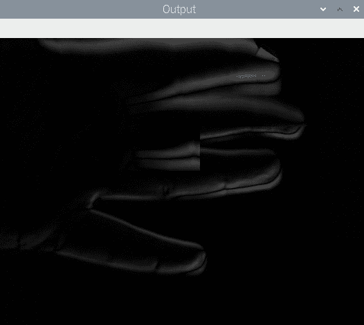

    图 11.3 –连续帧之间的绝对差

5.  我们在上一步中计算的输出有一些噪声。 因此，我们必须首先使用高斯模糊技术对其进行模糊处理以消除噪声：

    ```py
    blur = cv2.GaussianBlur(grey, (3, 3), 0)
    ```

6.  我们使用二进制阈值化技术将上一步的模糊输出转换为二进制图像，并通过以下代码进行进一步处理：

    ```py
    ret, th = cv2.threshold(blur, 15, 255, cv2.THRESH_BINARY)
    ```

7.  现在，让我们将膨胀形态学运算应用于该二进制图像。 这使检测阈值图像中的边界变得容易：

    ```py
    dilated = cv2.dilate(th, k, iterations=2)
    ```

    以下是膨胀操作的输出：

    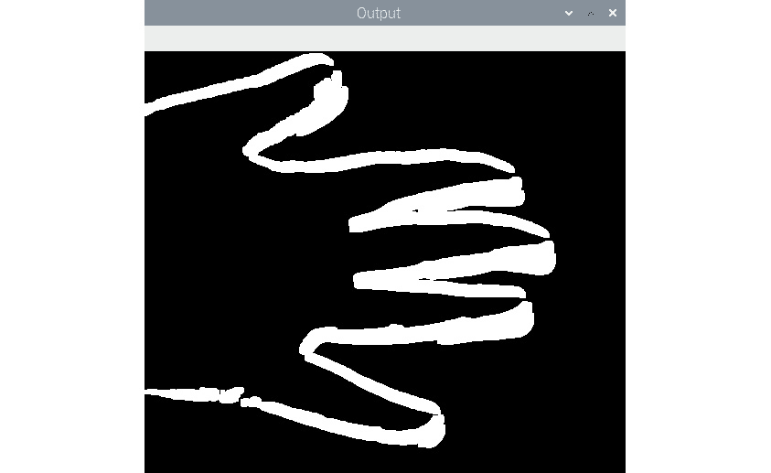

    图 11.4 –扩展输出

8.  让我们继续在膨胀图像中查找轮廓：

    ```py
    contours, hierarchy = cv2.findContour(dilated,
    ```

    ```py
    cv2.RETR_TREE,
    ```

    ```py
    cv2.CHAIN_APPROX_SIMPLE)
    ```

    ```py
    t2=t0
    ```

    ```py
    cv2.drawContours(t2, contours, -1, (0, 255, 0), 2)
    ```

    ```py
    cv2.imshow('Output', t2)
    ```

9.  现在，让我们将最新的帧复制到保存较旧帧的变量，然后使用网络摄像头捕获下一帧：

    ```py
    t0=t1
    ```

    ```py
    t1=cap.read()[1]
    ```

    当按下键盘上的`Esc`键时，我们结束`while`循环：

    ```py
    if cv2.waitKey(5) == 27 :
    ```

    ```py
    break
    ```

    循环结束后，我们将执行通常的清理任务，例如释放相机捕获对象并破坏显示窗口：

    ```py
    cap.release()
    ```

    ```py
    cv2.destroyAllWindows()
    ```

    以下是执行程序的输出：

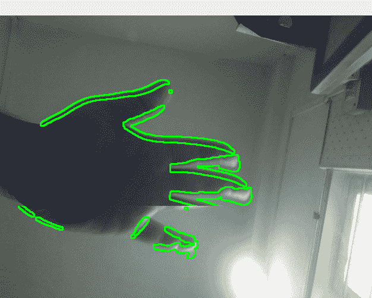

图 11.5 –检测到并突出显示的移动

请记住，此代码在计算上是昂贵的。 不要期望 RPi 的较老型号和非超频型号具有很高的帧率。 作为练习，绘制不同颜色的轮廓。 我们还可以借助`cv2.moments()`函数来计算质心，并用小圆圈表示它们。 这将使输出更有趣。

# 检测图像中的条形码

条形码是一种信息，可以直观地表示信息，对于特定用途的机器而言，易于理解。 条码格式很多。 常用格式具有不同厚度的平行垂直线，并且它们之间的间距不同。

在本节中，我们将演示如何从静止图像中检测简单的平行线格式的条形码。 我们将使用以下汽水罐图像：

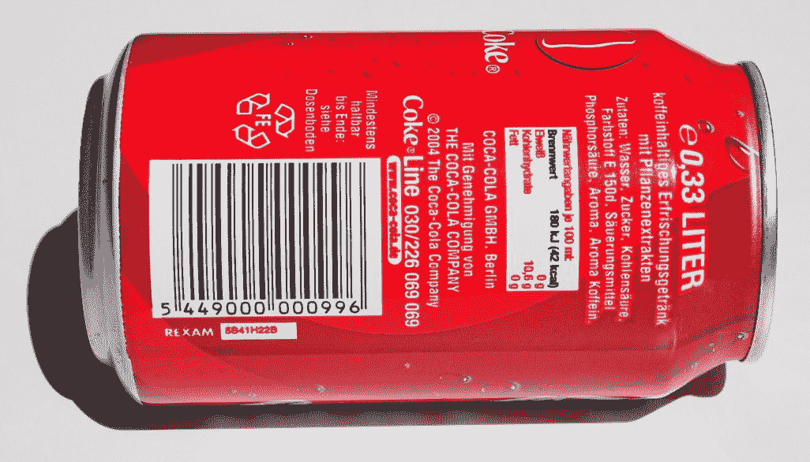

图 11.6 –原始源图像

1.  让我们使用以下代码阅读汽水罐的原始图像：

    ```py
    import numpy as np
    ```

    ```py
    import cv2
    ```

    ```py
    image=cv2.imread('/home/pi/book/dataset/barcode.jpeg', 1)
    ```

    ```py
    input = cv2.cvtColor(image, cv2.COLOR_BGR2GRAY)
    ```

2.  条形码的水平图像具有低和高的垂直梯度。 因此，候选图像必须具有适合该标准的区域。 我们将使用`cv2.Sobel()`函数来计算水平和垂直导数，然后计算差值以找出符合条件的区域。 让我们看看如何做到这一点：

    ```py
    hor_der = cv2.Sobel(input, ddepth=-1, dx=1, dy=0, ksize = 5)
    ```

    ```py
    ver_der = cv2.Sobel(input, ddepth=-1, dx=0, dy=1, ksize=5)
    ```

    ```py
    diff = cv2.subtract(hor_der, ver_der)
    ```

3.  OpenCV 提供`cv2.convertScaleAbs()`函数。 它将任何数字数组转换为 **8 位无符号整数**的数组。 让我们使用它，如下所示：

    ```py
    diff = cv2.convertScaleAbs(diff)
    ```

    输出如下：

    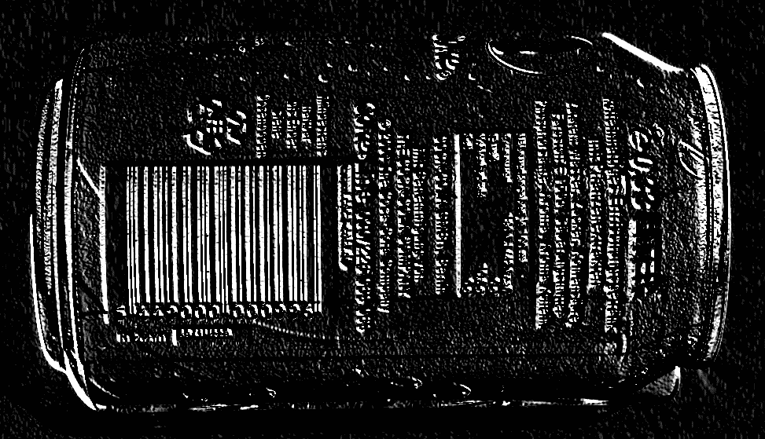

    图 11.7 –水平和垂直 Sobel 导数之间的差异

4.  前面的输出显示了具有非常水平和非常低的垂直渐变的区域。 让我们应用高斯模糊来消除前面输出的噪声。 使用以下代码执行此操作：

    ```py
    blur = cv2.GaussianBlur(diff, (3, 3), 0)
    ```

    以下是上述代码的输出：

    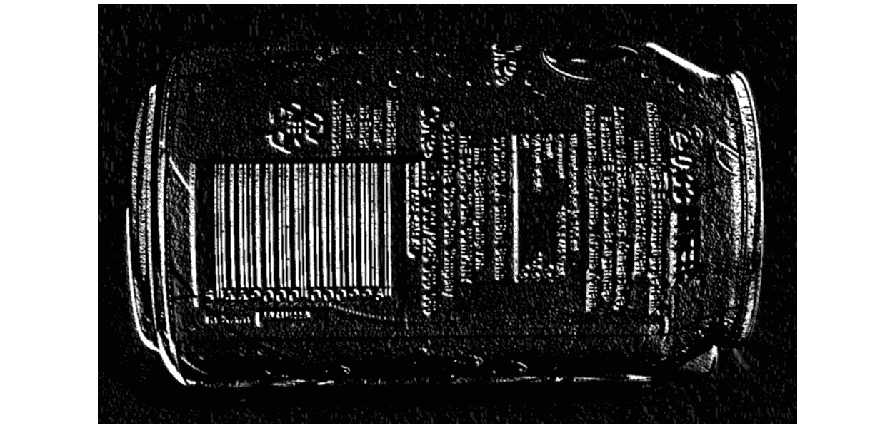

    图 11.8 –应用高斯模糊之后

5.  现在，让我们通过对其应用阈值将其转换为二进制图像。 以下是执行此操作的代码：

    ```py
    ret, th = cv2.threshold(blur, 225, 255, cv2.THRESH_BINARY)
    ```

    以下是输出二进制图像：

    

    图 11.9 –二进制输出

6.  如上图所示，它是二进制图像，突出显示了条形码和其他高垂直渐变区域。 我们可以扩大图像以进行进一步处理。 它填补了垂直线之间的空隙：

    ```py
    dilated = cv2.dilate(th, None, iterations = 10)
    ```

    前面代码的输出包含许多与原始图像中的条形码和其他区域相对应的矩形框。 我们对包含条形码的区域感兴趣，而不对其他区域感兴趣：

    

    图 11.10 –扩展的二进制输出

7.  形态腐蚀操作将消除与条形码不对应的其他大部分区域：

    ```py
    eroded = cv2.erode(dilated, None, iterations = 15)
    ```

    以下是上述代码的输出：

    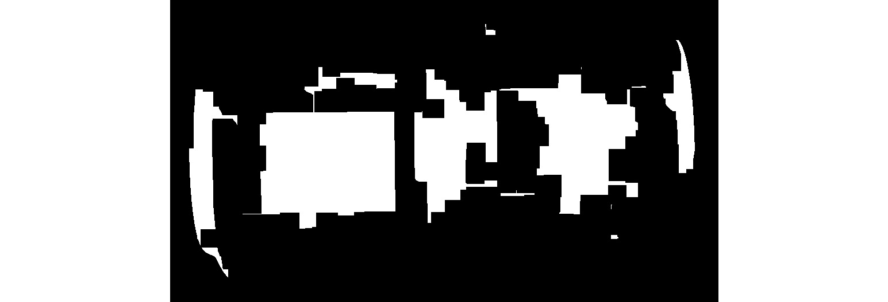

    图 11.11 –腐蚀图像

8.  让我们在此计算出的二进制图像中找到所有轮廓的列表。 使用以下代码来执行此操作：

    ```py
    (contours, hierarchy) = cv2.findContours(eroded, cv2.RETR_TREE, cv2.CHAIN_APPROX_SIMPLE)
    ```

9.  二值图像中最大的轮廓是与条形码区域相对应的轮廓。 以下代码在图像中找到最大轮廓：

    ```py
    areas = [cv2.contourArea(temp) for temp in contours]
    ```

    ```py
    max_index = np.argmax(areas)
    ```

    ```py
    largest_contour = contours[max_index]
    ```

10.  让我们使用 OpenCV `cv2.boundingRect()`函数检索最大轮廓的边界矩形的坐标，然后在图像中绘制该矩形：

    ```py
    x, y, width, height = cv2.boundingRect(largest_contour)
    ```

    ```py
    cv2.rectangle(image, (x, y), (x+width, y+height),(0,255,0), 2)
    ```

    ```py
    cv2.imshow('Detected Barcode',image)
    ```

    ```py
    cv2.waitKey(0)
    ```

    ```py
    cv2.destroyAllWindows()
    ```

    前面的代码在与图像中最大轮廓（条形码的区域）相对应的区域上绘制边界矩形，如以下输出所示：

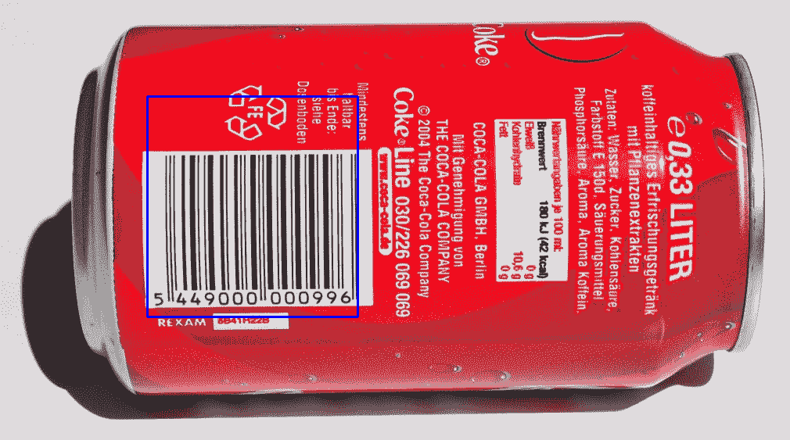

图 11.12 –检测到的条形码

如先前的屏幕截图所示，条形码的大致区域以蓝色矩形勾勒出轮廓。 相同的代码可能不适用于许多图像，但适用于大多数图像。 我们可能需要调整代码以检测其他图像中带有条形码的区域。 您可能需要为特定输入更改以下代码行：

```py
blur = cv2.GaussianBlur(diff, (3, 3), 0)
dilated = cv2.dilate(th, None, iterations = 10)
eroded = cv2.erode(dilated, None, iterations = 15)
```

基于此程序，我们可以创建许多实际应用程序。 第一个应用是条形码区域检测器，用于检测来自 USB 网络摄像头的实时视频。 我们可以创建的另一个应用程序是检测条形码的通用程序。 为了调整传递给函数的参数，我们可以使用跟踪栏。

在下一节中，我们将学习如何使用 RPi 和 USB 网络摄像头通过 OpenCV 和 Python 3 应用胶片风格的色度键控。

# 实现色度键效果

色度键控也称为色度键合成。 由于我们在创建绿色或蓝色效果时会使用绿色或蓝色背景，因此俗称它为绿色或蓝色屏幕效果。 它是后期制作技术，也可以用于静止图像和实时视频。 在色度键效果中，我们将一个对象或一个人放在前景中并捕获图像或镜头。 背景通常是绿色或蓝色的织物或墙壁。 然后，我们将捕获的图像或素材中的绿色或蓝色替换为另一个视频或图像。 这使观看者感到前景中的人物或物体与他们拍摄的摄影棚不在同一个位置。 此效果是新闻广播中电影制作和实时天气预报中最常用的效果之一：

1.  首先，导入所有需要的库并启动视频捕获对象：

    ```py
    import numpy as np
    ```

    ```py
    import cv2
    ```

    ```py
    cap = cv2.VideoCapture(0)
    ```

2.  为了获得更好的帧频或**每秒帧**（**FPS**）速率，我们将 USB 网络摄像头的分辨率设置为`640x480`像素。 这样会产生更好的帧速率，并且绿屏效果看起来很自然：

    ```py
    cap.set(3, 640)
    ```

    ```py
    cap.set(4, 480)
    ```** 
3.  在下一步中，我们读取将用作背景的图像。 用作背景的图像必须具有与网络摄像头设置的分辨率相同的分辨率。 在这种情况下，我们将其设置为 640x480。 我们知道，我们将在 NumPy 数组上执行的所有算术和逻辑运算（在这种情况下，背景图像和来自连接到 RPi 的 USB 网络摄像头的实时馈送的帧）都需要操作数数组具有相同的尺寸 ; 否则，Python 3 解释器将引发错误。 以下是此代码：

    ```py
    bg = cv2.imread('/home/pi/book/dataset/bg.jpg', 1)
    ```

4.  让我们为循环编写熟悉的逻辑，并从 USB 网络摄像头读取实时供稿的帧，如下所示：

    ```py
    while True:
    ```

    ```py
    ret, frame = cap.read()
    ```

    我们可以使用绿色的布（例如窗帘）或纸作为本演示的背景。 我们还将 RPi 摄像机模块的框用作前景中的对象。 以下是原始场景的照片：

    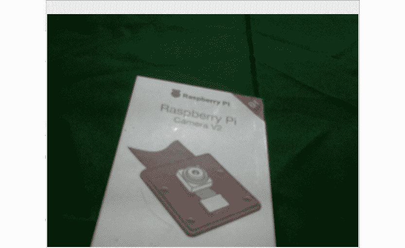

    图 11.13 –输入视频

5.  正如我们在第 6 章，“颜色空间，变换和阈值”中所讨论的那样，当我们需要使用颜色范围时，HSV 颜色空间是表示颜色的最佳方法。 让我们将图像转换为 HSV 色彩空间，然后使用以下代码为背景中的绿色屏幕计算遮罩：

    ```py
    hsv=cv2.cvtColor(frame, cv2.COLOR_BGR2HSV)
    ```

    ```py
    image_mask=cv2.inRange(hsv, np.array([40, 50, 50]),
    ```

    ```py
    np.array([80, 255, 255]))
    ```

    这将计算图像的遮罩。 绿色（或其任何阴影）的像素被替换为颜色，其余像素被替换为黑色：

    

    图 11.14 –计算遮罩

6.  在计算出与背景图像相对应的遮罩之后，我们可以将该遮罩应用于背景中的图像，以便将具有黑色像素的对象隐藏在前景中，如下所示：

    ```py
    bg_mask=cv2.bitwise_and(bg, bg, mask=image_mask)
    ```

    前面的代码将白色像素替换为我们选择作为背景的图像像素。 另外，与前景相对应的像素为黑色，如以下输出所示：

    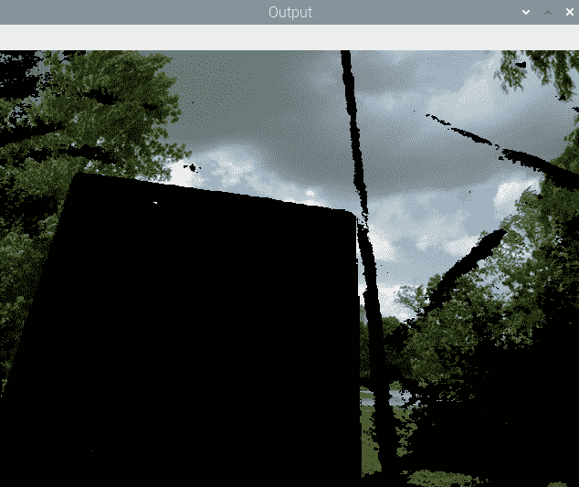

    图 11.15 –遮罩中的白色像素替换为背景

7.  现在，我们必须从 USB 网络摄像头的实时供稿中提取前景。 我们可以使用以下代码来做到这一点：

    ```py
    fg_mask=cv2.bitwise_and(frame, frame, mask=cv2.bitwise_not(image_mask))
    ```

    前面的代码提取所有非绿色（或其阴影）的像素。 还将黑色分配给与背景（绿色屏幕）相对应的像素：

    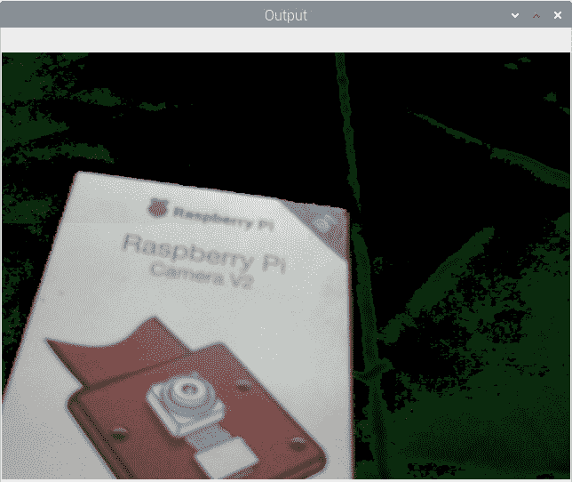

    图 11.16 –遮罩中的黑色像素替换为前景

8.  现在，是时候添加我们计算的最后两个输出了。 这将用自定义图像替换绿色背景，并产生色度键效果：

    ```py
    cv2.imshow('Output', cv2.add(bg_mask, fg_mask))
    ```

    ```py
    if cv2.waitKey(1) == 27:
    ```

    ```py
    break
    ```

    ```py
    cv2.destroyAllWindows()
    ```

    ```py
    cap.release()
    ```

    以下是最终输出：

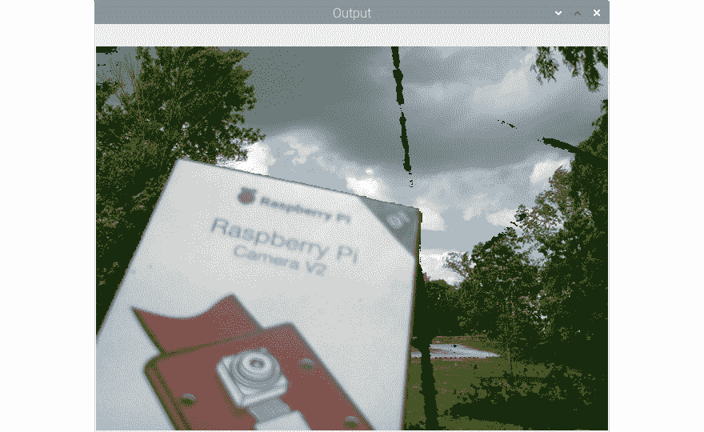

图 11.17 –最终输出

恭喜你！ 我们已经通过我们的 RPi 相机模块盒和一块绿色抹布实现了胶片风格的色度键效果。 我们可以看到效果并不完美。 这是由于照明效果不理想。 网络摄像头没有将几个像素注册为绿色像素，而是将其他颜色的像素注册。 对此的补救措施是使绿色背景和前景对象具有良好且均匀的照明。

实施色度键效果时，遵循的简单规则是，我们要进行色度键操作的对象的颜色不得与背景屏幕的颜色相同。 因此，如果我们使用的是绿色背景，则该对象或其任何部分都不能为绿色。 蓝色背景屏幕也是如此。

# 摘要

在本章中，已经学习了如何使用我们在本书前几章中学到的计算机视觉中的概念和技术来演示实际应用。 利用我们在本章中学到的概念，我们可以编写一个用于创建简单安全应用程序的程序。

从现在开始，利用从本书实验中获得的知识，我们可以更详细地探索 OpenCV 的图像处理和计算机视觉领域。 我们围绕 OpenCV 库的旅程到此结束。

在下一章中，我们将学习如何为 Python 使用另一个功能强大但非常易于使用的计算机视觉库 Mahotas。 我们还将学习并演示如何使用 Jupyter Notebook 进行 Python 3 的科学编程。