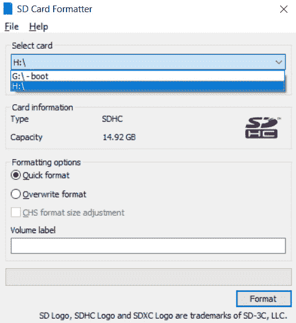
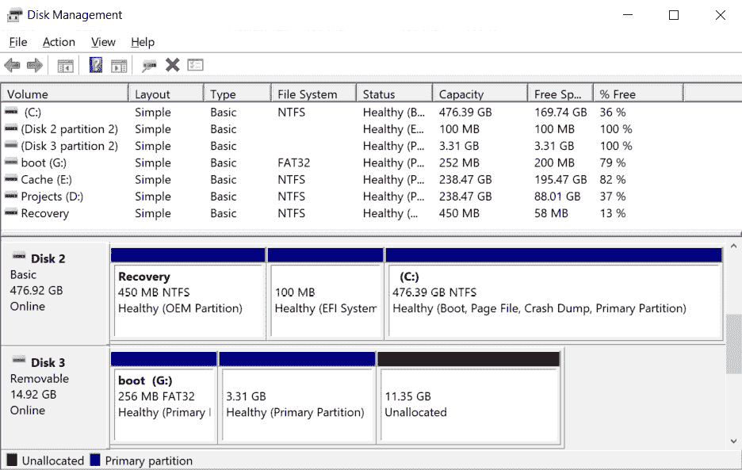
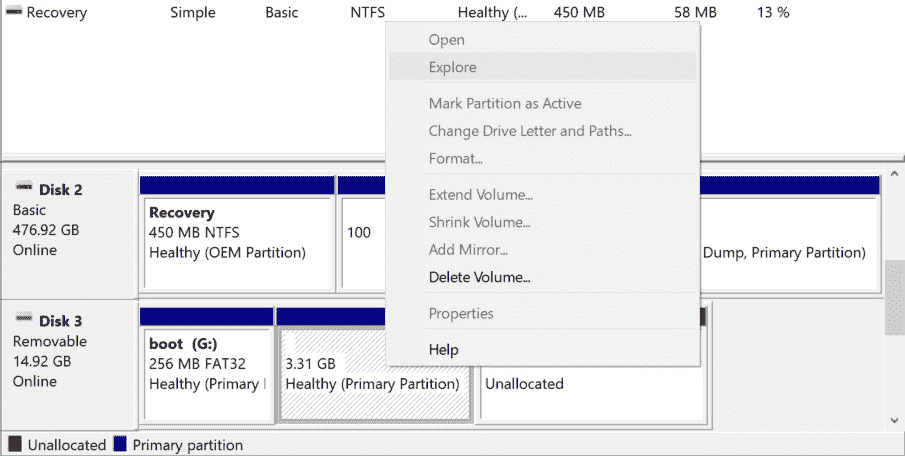
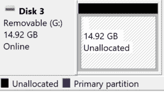
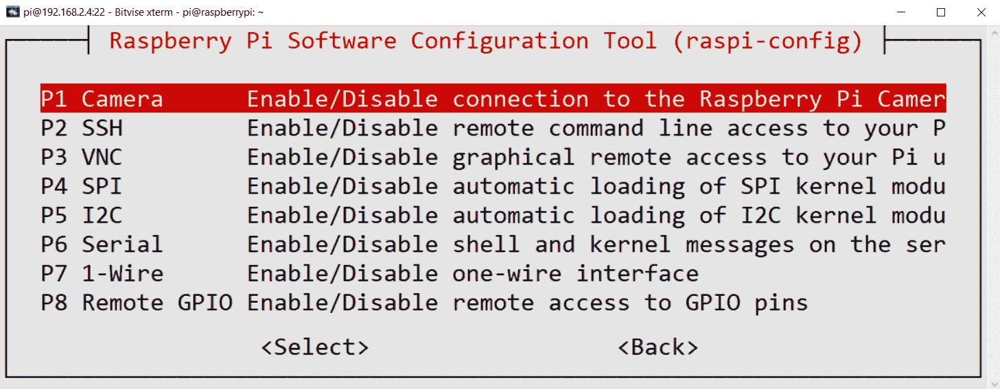
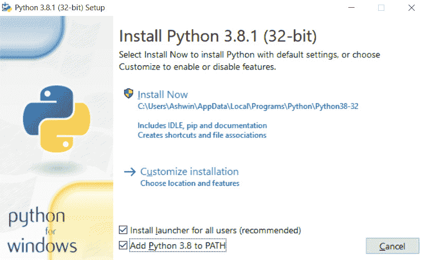
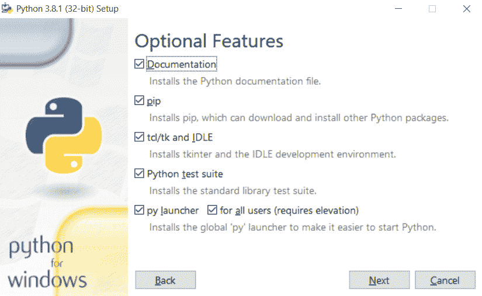

# 第 13 章：附录

本书主要章节中未涵盖的所有主题都将在此进行介绍。 本附录主要是有用的主题的集合，包括提示和技巧。 因此，让我们看一些与 Raspberry Pi，Python 3 和 OpenCV 有关的技巧。

# 技术要求

可以在 [GitHub](https://github.com/PacktPublishing/raspberry-pi-computer-vision-programming/tree/master/Appendix/programs) 上找到本章的代码文件。

观看以下视频，以查看[这个页面](https://bit.ly/3ewQwHs) 上的“正在执行的代码”。

# 性能评估和 OpenCV 的管理

OpenCV 有很多优化和未优化的代码。 优化的代码使用了现代微处理器的功能，例如指令流水线和 AVX。

我们可以检查是否正在使用`cv2.useOptimized()`函数在当前使用的计算机上启用 OpenCV 优化。 我们还可以使用`cv2.setUseOptimized()`函数来切换优化。 `cv2.getTickCount()`函数返回自打开计算机后开始的时钟滴答数（也称为**时钟周期**）。 在执行我们感兴趣的代码段之前和之后调用此函数。

然后，我们计算时钟周期之间的差，并返回执行代码段所需的时钟周期数。 `cv2.getTickFrequency()`函数返回时钟周期的频率。 然后，我们可以将时钟周期之间的差除以时钟周期的频率，以获得执行代码段所需的时间：

```py
import cv2
cv2.setUseOptimized(True)
print(cv2.useOptimized())
img = cv2.imread('/home/pi/book/dataset/4.1.01.tiff', 0)
e1 = cv2.getTickCount()
img1 = cv2.medianBlur(img, 23)
e2 = cv2.getTickCount()
t = (e2 - e1)/cv2.getTickFrequency()
print(t)
```

前面代码的输出如下：

```py
True
0.004361807
```

我们还可以使用 Python 3 `time`库中的函数来确定运行任何代码段所需的时间。 试试看作为练习。 接下来，我们将看到如何重用 Raspbian OS microSD 卡。

# 复用 Raspbian OS microSD 卡

我们已经学会了使用 **Win32 Disk Imager** 将 Raspbian 操作系统写入 microSD 卡。 现在，我们将了解如何将 microSD 卡重用于其他用途。 将 microSD 卡插入 microSD 卡读取器，然后将其连接到 Windows PC。 它将显示两个分区。 其中只有一个是可读的，并且将其标记为**启动**。 它还应具有`config.txt`文件，其大小约为 250 MB。 另一个分区不可读。 我们无法将此 microSD 卡用于其他目的。 因此，我们需要使用一些工具来格式化该卡，然后才能将其再次用于任何其他目的。

## 使用 SD 卡格式化器格式化 SD 卡

有免费工具，用于格式化 SD 卡。 我们可以从[这个页面](https://www.sdcard.org/downloads/formatter/)下载。 安装此工具并打开它，它将显示以下窗口。 根据计算机上驱动器的数量，驱动器号可能会不同。 以下是该应用程序的屏幕截图：



图 13.1 – SD 卡格式化程序

选择任何驱动器（它将始终格式化整个卡），然后单击**格式化**按钮上的。 这将显示以下确认框：


图 13.2 –确认对话框

单击**是**按钮，它将格式化卡。 格式化后，与该卡相对应的只有一个驱动器号。 该卡现在已完全格式化为，我们可以将其当作新的一样使用。

## Windows 中的磁盘管理实用程序

我们甚至可以在 Windows 中使用**磁盘管理**实用程序来格式化 microSD 卡。 在搜索栏中，键入**磁盘**，您将找到**创建并格式化磁盘分区**选项。 您也可以从 Windows 控制面板找到此实用程序。 再次将您要重复使用的 Raspbian OS microSD 卡插入 SD 卡读取器，并将其连接到 Windows 计算机。 打开**磁盘管理**工具，您将看到以下屏幕快照：



图 13.3 –“磁盘管理”实用程序窗口

此列表列出了连接到系统的所有磁盘（可移动磁盘和不可移动磁盘）。 其中，可移动的（具有 256 MB 的启动分区）是 microSD 卡。 如您在前面的屏幕快照中所见，我在不扩展文件系统的情况下插入了 Raspbian OS microSD 卡（我的意思是，我为其编写了 Raspbian OS，但没有使用它来启动 Raspberry Pi 板）。 这就是为什么显示两个已分配分区和一个未分配分区的原因。 如果您使用该卡来启动 Raspberry Pi 板，则它将扩展文件系统，并且第二大分区占用未分配的部分。 因此，使用过的 Raspbian OS microSD 卡仅显示两个分区。 无论如何，我们可以右键单击分配的分区，然后选择**删除卷**选项。 对两个分配的分区执行此操作：



图 13.4 –删除 SD 卡的分区

删除所有分配的部分后，磁盘将如下所示：



图 13.5 –在 SD 卡上创建新分区

只需右键单击与 microSD 卡相对应的磁盘，然后单击**新建简单卷**。 这将启动向导到新卷。 使用所有默认选项完成向导向导，然后单击，您将获得新的磁盘以供重复使用。 您可以重写 Raspbian OS 或使用它存储您喜欢的 MP3 歌曲。 **磁盘管理**工具使我们可以更好地控制磁盘格式化和分区的各个方面。

# 浏览`raspi-config`命令行实用程序

我们可以通过以下三种方法之一使用来配置 Raspberry Pi：

*   Raspbian OS 菜单中的 Raspberry Pi 配置工具
*   通过更改`/boot/config.txt`的内容
*   使用`raspi-config`命令行实用程序

我们将在本节中详细介绍`raspi-config`工具的。 打开 Raspberry Pi 命令提示符并运行以下命令：

```py
sudo raspi-config
```

这将在命令提示符中打开 Raspberry Pi 配置工具，如以下屏幕截图所示：


图 13.6 – `raspi-config`实用程序的主菜单

第一个选项用于更改`pi`用户的密码。 主菜单中的第二个选项**网络选项**可以更改 Raspberry Pi 板连接到网络的方式：


图 13.7 –网络选项

主菜单中的第三个选项（**引导选项**）详细说明了引导选项，如下所示：


图 13.8 –引导选项

主菜单中的第四个选项（**本地化选项**）使您可以如下设置区域设置，时区，键盘布局和 Wi-Fi 国家/地区：


图 13.9 –本地化选项

主菜单中的第五个选项是**接口选项**，显示如下：



图 13.10 –接口选项

在前面的选项中，我们已经为演示启用了 **P1 摄像机**，**P2 SSH** 和 **P3 VNC**。

主菜单中的第六个选项用于对 Raspberry Pi 1 和 Raspberry Pi 2 超频。其他型号必须手动超频。

主菜单中的第七个选项是**高级选项**，如下所示：


图 13.11 –高级选项

在前面的屏幕截图中，**A1 扩展文件系统**扩展文件系统以确保 microSD 卡在中的所有空间均可用。 **A3 内存分割**用于为图形分配内存。

第八个选项更新`raspi-config`工具。 如果要访问 Raspberry Pi 板的命令提示符，则这是配置 Raspberry Pi 的最佳方法。

# Windows，Debian 和 Ubuntu 上的安装和环境设置

我们可以在和 Windows 和 Linux OS 上展示在其他台式计算机上学到的所有领域。 由于与台式机主板通常通常没有 DSI 端口，因此只有与 Raspberry Pi 摄像头模块相关的部件不能与其他计算机一起使用。 我们还可以在运行 Debian 或 Ubuntu 的其他单板计算机上运行代码示例。

在 Ubuntu，Debian 及其衍生产品上，安装软件包的过程是相同的。 所有现代 Linux 发行版均随附 Python3。我们只需要使用`apt`和`pip3`工具进行安装。

对于 Windows PC，我们需要从头开始安装所有内容。 让我们开始通过以下步骤来了解如何安装 Python 3：

1.  访问 [www.python.org](http://www.python.org) 并下载最新 Python 3 版本的安装文件：

    

    图 13.12 – Python Foundation 主页

    运行下载的安装文件。 它将打开一个安装向导，如下所示：

    

    图 13.13 – Python 3 安装选项

    确保选中“将 Python 3.8 添加到`PATH`”复选框。

2.  然后，点击“自定义安装”。 将出现以下窗口：

    

    图 13.14 –安装的可选功能

    选中所有复选框，然后单击**下一个**按钮。 在下一个窗口中，将所有选项保持为，并完成安装。

3.  安装完成后，我们可以通过在 Windows 搜索栏中搜索`IDLE`来进行验证。 另外，在`cmd`（Windows 的命令提示符）中，我们可以验证`python`和`pip3`命令是否正常运行。

Python 3 解释器以 Windows 二进制可执行文件`python.exe`文件的形式出现，如果我们在安装过程中检查了适当的选项，则可以直接在命令提示符下调用它，如前所述。 我们可以通过命令提示符上的`pip3`实用程序安装本书前面各章中使用的所有软件包。

# Python 实现和 Python 发行版

Python 实现是充当 Python 编程语言解释器的程序。 [这个页面](https://www.python.org/)提供的解释器和 Linux 附带的是，称为 **CPython**。 其他流行的实现包括（但不限于）以下：

*   MicroPython
*   IronPython
*   Stackless Python
*   Jython
*   PyPy
*   CircuitPython

我们可以在[这个页面](https://www.python.org/download/alternatives/)找到替代的实现及其项目 URL 的列表。

Python 发行版是 Python 解释器的实现，还有一组捆绑在一起的其他软件包。 一些 Python 实现本身就是发行版。 实际上，术语*实现*与分发之间没有明确的区别。 我们可以在[这个页面](https://wiki.python.org/moin/PythonDistributions)上找到有关发行版的更多信息。