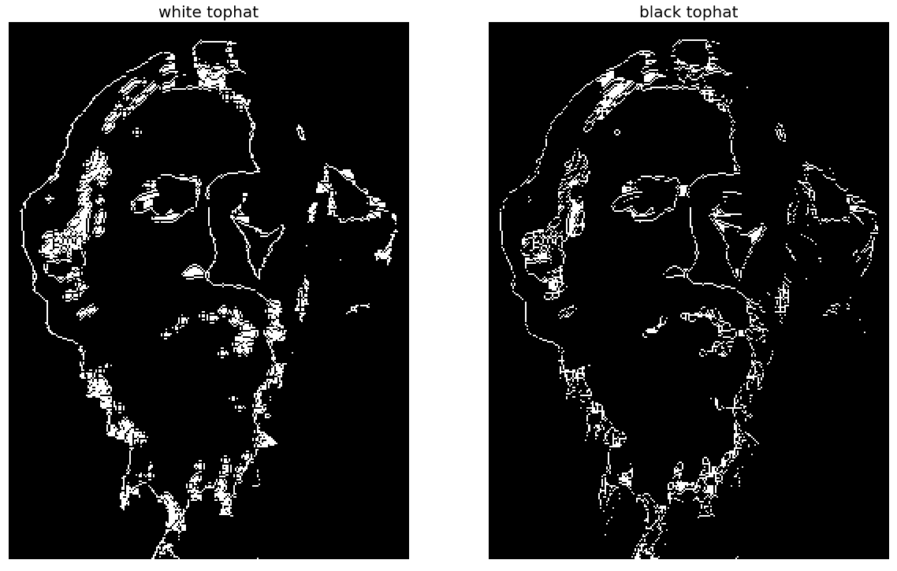
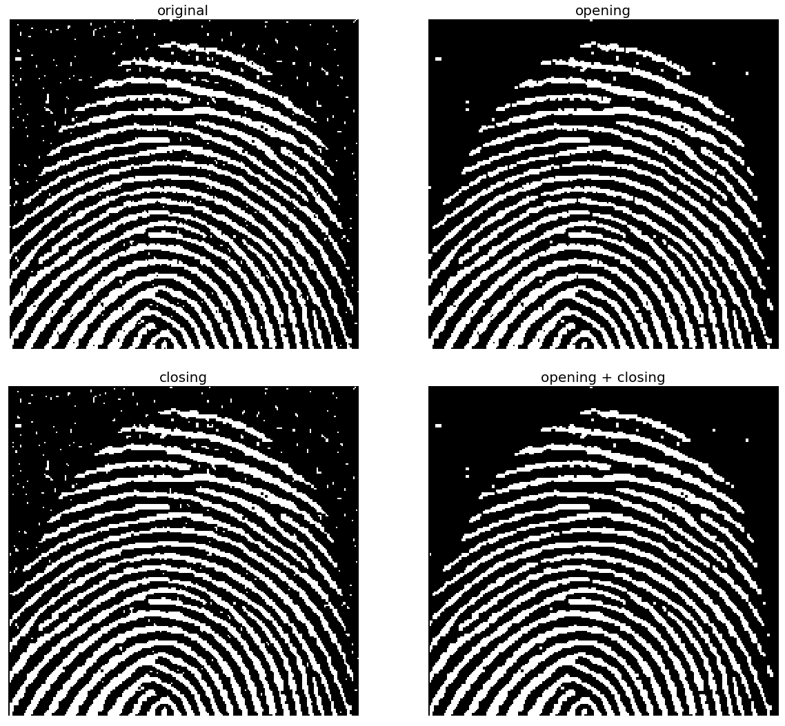
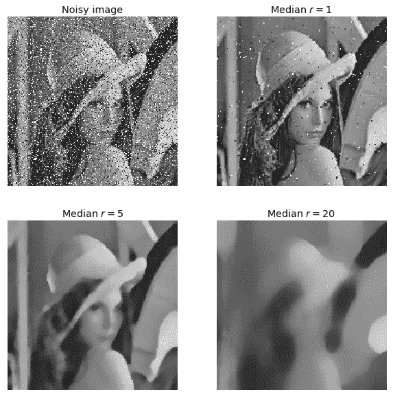
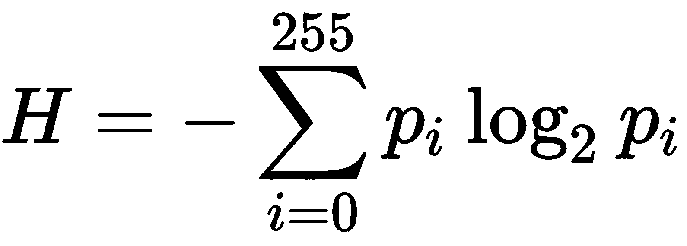
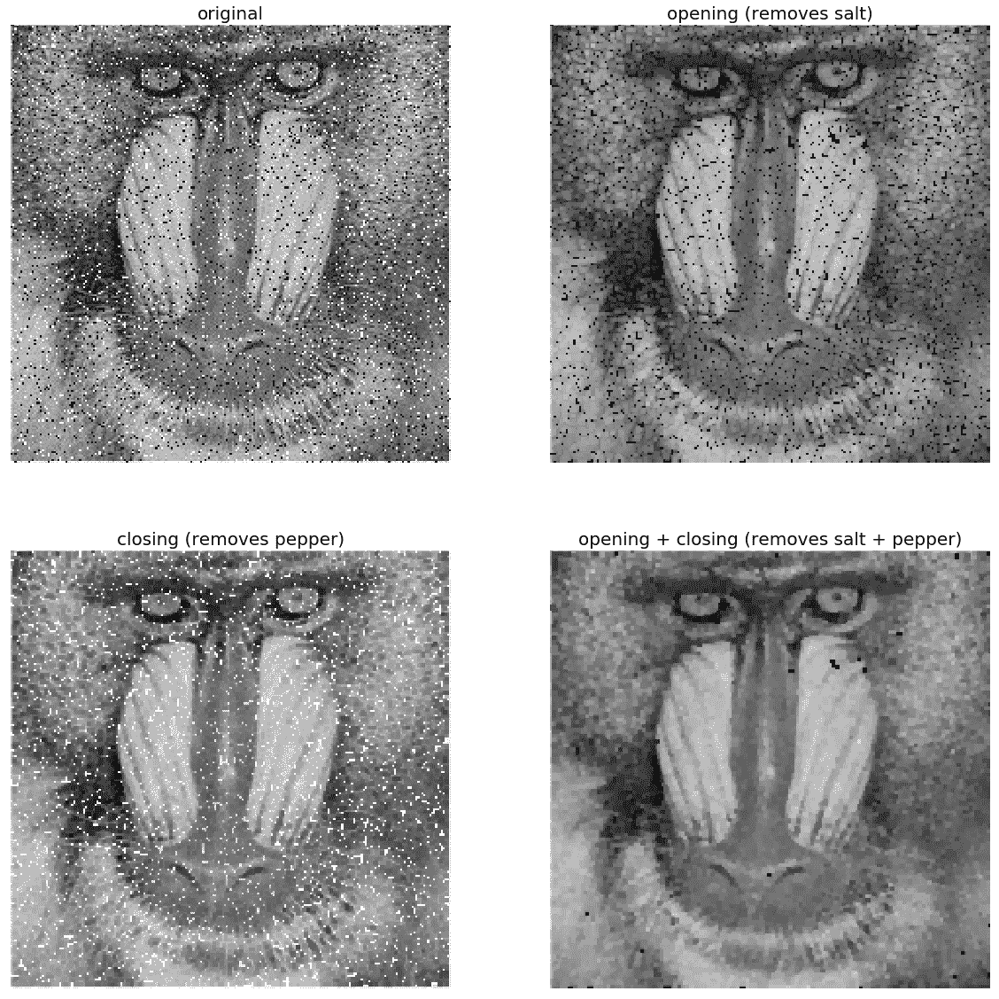
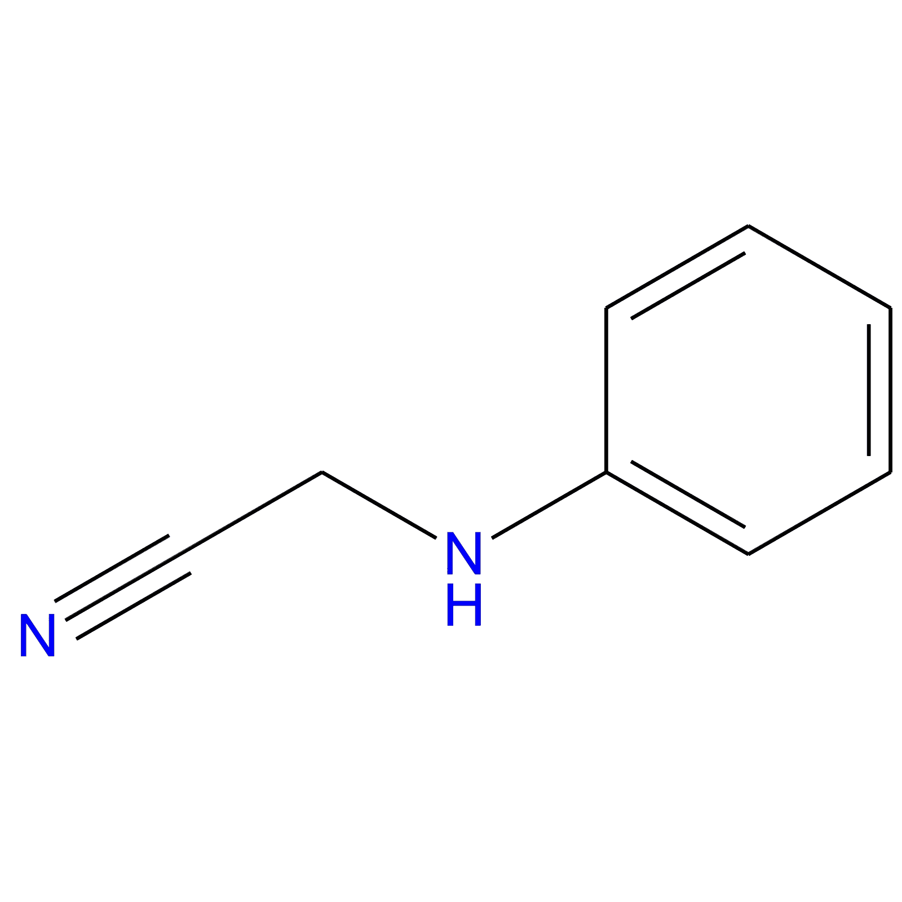
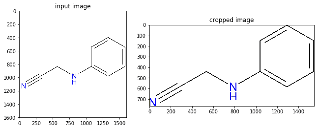

# 形态图像处理

在本章中，我们将讨论数学形态学和形态学图像处理。形态图像处理是与图像中特征的形状或形态相关的非线性操作的集合。这些操作特别适合于二值图像的处理（其中像素表示为 0 或 1，并且根据惯例，对象的前景=1 或白色，背景=0 或黑色），尽管它可以扩展到灰度图像。

在形态学运算中，使用结构元素（小模板图像）探测输入图像。该算法的工作原理是将结构元素定位在输入图像中所有可能的位置，并将其与输入图像进行比较。。。

# scikit 图像形态学模块

在本节中，我们将演示如何使用 scikit image 的形态学模块中的函数来实现一些形态学操作，首先对二值图像进行形态学操作，然后对灰度图像进行形态学操作。

# 二进制运算

让我们从二值图像的形态学操作开始。在调用函数之前，我们需要创建一个二进制输入图像（例如，使用具有固定阈值的简单阈值）。

# 腐蚀

**侵蚀**是一种基本的形态学操作，可缩小前景对象的大小，平滑对象边界，并移除半岛、手指和小对象。以下代码块显示了如何使用`binary_erosion()`函数计算二值图像的快速二值形态学侵蚀：

```py
from skimage.io import imread
from skimage.color import rgb2gray
import matplotlib.pylab as pylab
from skimage.morphology import binary_erosion, rectangle

def plot_image(image, title=''):
    pylab.title(title, size=20), pylab.imshow(image)
    pylab.axis('off') # comment this line if you want axis ticks

im = rgb2gray(imread('../images/clock2.jpg'))
im[im <= 0.5] = 0 # create binary image with fixed threshold 0.5
im[im > 0.5] = 1
pylab.gray()
pylab.figure(figsize=(20,10))
pylab.subplot(1,3,1), plot_image(im, 'original')
im1 = binary_erosion(im, rectangle(1,5))
pylab.subplot(1,3,2), plot_image(im1, 'erosion with rectangle size (1,5)')
im1 = binary_erosion(im, rectangle(1,15))
pylab.subplot(1,3,3), plot_image(im1, 'erosion with rectangle size (1,15)')
pylab.show()
```

下面的屏幕截图显示了前面代码的输出。可以看出，将结构元素作为一个薄的、小的、垂直的矩形使用时，首先会删除二进制时钟图像中的小刻度。接下来，一个更高的垂直矩形也被用来腐蚀时钟指针：


# 扩张

**膨胀**是另一种基本的形态学操作，它扩展前景对象的大小，平滑对象边界，并关闭二值图像中的孔和间隙。这是侵蚀的双重作用。下面的代码片段展示了如何在泰戈尔的二进制图像上使用`binary_dilation()`函数，并使用不同大小的磁盘结构元素：

```py
from skimage.morphology import binary_dilation, diskfrom skimage import img_as_floatim = img_as_float(imread('../images/tagore.png'))im = 1 - im[...,3]im[im <= 0.5] = 0im[im > 0.5] = 1pylab.gray()pylab.figure(figsize=(18,9))pylab.subplot(131)pylab.imshow(im)pylab.title('original', size=20)pylab.axis('off')for d in range(1,3):    pylab.subplot(1,3,d+1) im1 = binary_dilation(im, disk(2*d)) ...
```

# 开合

**开放**是一种形态学操作，可以表示为先侵蚀后扩张操作的组合；它从二值图像中移除小对象。**关闭**相反，是另一种形态学操作，可以表示为先膨胀然后腐蚀操作的组合；它从二值图像中去除小孔。这两个是双重操作。下面的代码片段显示了如何使用 scikit image`morphology`模块的相应函数分别从二进制图像中移除小对象和小孔：

```py
from skimage.morphology import binary_opening, binary_closing, binary_erosion, binary_dilation, disk
im = rgb2gray(imread('../images/circles.jpg'))
im[im <= 0.5] = 0
im[im > 0.5] = 1
pylab.gray()
pylab.figure(figsize=(20,10))
pylab.subplot(1,3,1), plot_image(im, 'original')
im1 = binary_opening(im, disk(12))
pylab.subplot(1,3,2), plot_image(im1, 'opening with disk size ' + str(12))
im1 = binary_closing(im, disk(6))
pylab.subplot(1,3,3), plot_image(im1, 'closing with disk size ' + str(6))
pylab.show()
```

下面的屏幕截图显示了前面代码块的输出，即使用不同大小的磁盘结构元素进行二进制打开和关闭操作生成的模式。正如预期的那样，打开操作仅保留较大的圆：


现在让我们比较一下打开和腐蚀，关闭和膨胀（分别用`binary_erosion()`替换`binary_opening()`，用`binary_dilation()`替换`binary_closing()`，结构元素与上一个代码块相同。下面的屏幕截图显示了用腐蚀和膨胀获得的输出图像：


# 骨骼化

在该操作中，使用形态学细化操作将二值图像中的每个连接分量缩减为单个像素宽的骨架。以下代码块显示了如何对恐龙的二值图像进行骨架化：

```py
def plot_images_horizontally(original, filtered, filter_name, sz=(18,7)):    pylab.gray()    pylab.figure(figsize = sz)    pylab.subplot(1,2,1), plot_image(original, 'original')    pylab.subplot(1,2,2), plot_image(filtered, filter_name)    pylab.show()from skimage.morphology import skeletonizeim = img_as_float(imread('../images/dynasaur.png')[...,3])threshold = 0.5im[im <= threshold] = 0im[im > threshold] = 1skeleton = skeletonize(im)plot_images_horizontally(im, skeleton, 'skeleton',sz=(18,9))
```

下面的屏幕截图。。。

# 凸壳的计算

**凸包**由包围输入图像中所有前景（白色像素）的最小凸面多边形定义。下面的代码块演示如何计算二值图像的`convex hull`：

```py
from skimage.morphology import convex_hull_image
im = rgb2gray(imread('../images/horse-dog.jpg'))
threshold = 0.5
im[im < threshold] = 0 # convert to binary image
im[im >= threshold] = 1
chull = convex_hull_image(im)
plot_images_horizontally(im, chull, 'convex hull', sz=(18,9))
```

以下屏幕截图显示了输出：


以下代码块绘制原始二值图像和计算的凸包图像的差异图像：

```py
im = im.astype(np.bool)
chull_diff = img_as_float(chull.copy())
chull_diff[im] = 2
pylab.figure(figsize=(20,10))
pylab.imshow(chull_diff, cmap=pylab.cm.gray, interpolation='nearest')
pylab.title('Difference Image', size=20)
pylab.show()
```

以下屏幕截图显示了前面代码的输出：


# 移除小对象

以下代码块显示了如何使用`remove_small_objects()`功能删除小于指定最小大小阈值的对象指定阈值越高，删除的对象越多：

```py
from skimage.morphology import remove_small_objectsim = rgb2gray(imread('../images/circles.jpg'))im[im > 0.5] = 1 # create binary image by thresholding with fixed threshold0.5im[im <= 0.5] = 0im = im.astype(np.bool)pylab.figure(figsize=(20,20))pylab.subplot(2,2,1), plot_image(im, 'original')i = 2for osz in [50, 200, 500]:    im1 = remove_small_objects(im, osz, connectivity=1)    pylab.subplot(2,2,i), plot_image(im1, 'removing small objects below size ' + str(osz))    i += 1pylab.show()
```

下面的屏幕截图显示。。。

# 黑白顶帽

图像的**白色顶帽**计算出比结构元素小的亮点。它被定义为原始图像及其形态开口的差分图像。类似地，图像的**黑顶帽**计算出比结构元素小的黑点。定义为原始图像形态闭合图像的差分图像。原始图像中的黑点在黑顶帽操作后变为亮点。以下代码块演示如何使用 scikit image`morphology`模块函数对泰戈尔的输入二进制图像使用这两种形态学操作：

```py
from skimage.morphology import white_tophat, black_tophat, square
im = imread('../images/tagore.png')[...,3]
im[im <= 0.5] = 0
im[im > 0.5] = 1
im1 = white_tophat(im, square(5))
im2 = black_tophat(im, square(5))
pylab.figure(figsize=(20,15))
pylab.subplot(1,2,1), plot_image(im1, 'white tophat')
pylab.subplot(1,2,2), plot_image(im2, 'black tophat')
pylab.show()
```

以下屏幕截图显示了白色和黑色礼帽的输出：



# 边界提取

侵蚀操作可用于提取二值图像的边界，我们只需从输入的二值图像中减去侵蚀图像即可提取边界。以下代码块实现了这一点：

```py
from skimage.morphology import binary_erosionim = rgb2gray(imread('../images/horse-dog.jpg'))threshold = 0.5im[im < threshold] = 0im[im >= threshold] = 1boundary = im - binary_erosion(im)plot_images_horizontally(im, boundary, 'boundary',sz=(18,9))
```

以下屏幕截图显示了上一个代码块的输出：


# 打开和关闭指纹清洗

打开和关闭可顺序用于从二值图像中去除噪声（前景小对象）。这可以作为预处理步骤用于清洁指纹图像。下面的代码块演示了如何实现它：

```py
im = rgb2gray(imread('../images/fingerprint.jpg'))
im[im <= 0.5] = 0 # binarize
im[im > 0.5] = 1
im_o = binary_opening(im, square(2))
im_c = binary_closing(im, square(2))
im_oc = binary_closing(binary_opening(im, square(2)), square(2))
pylab.figure(figsize=(20,20))
pylab.subplot(221), plot_image(im, 'original')
pylab.subplot(222), plot_image(im_o, 'opening')
pylab.subplot(223), plot_image(im_c, 'closing')
pylab.subplot(224), plot_image(im_oc, 'opening + closing')
pylab.show()
```

下面的屏幕截图显示了前面代码的输出。可以看出，连续应用打开和关闭可清除噪声二值指纹图像：



# 灰度运算

下面几个代码块展示了如何在灰度图像上应用形态学操作。首先，让我们从灰度侵蚀开始：

```py
from skimage.morphology import dilation, erosion, closing, opening, squareim = imread('../images/zebras.jpg')im = rgb2gray(im)struct_elem = square(5) eroded = erosion(im, struct_elem)plot_images_horizontally(im, eroded, 'erosion')
```

下面的屏幕截图显示了上一个代码块的输出。可以看出，黑色条纹因侵蚀而加宽：


下面的代码块显示了如何在相同的输入灰度图像上应用`dilation`：

```py
dilated = dilation(im, struct_elem) ...
```

# scikit image filter.rank 模块

scikit 图像的`filter.rank`模块提供了实现形态滤波器的功能；例如，形态学中值滤波器和形态学对比度增强滤波器。以下各节将演示其中的几个过滤器。

# 形态对比增强

形态学对比度增强滤波器通过仅考虑由结构元素定义的邻域中的像素对每个像素进行操作。它用邻域中的局部最小或局部最大像素替换中心像素，具体取决于原始像素最接近的像素。以下代码块显示了使用形态对比度增强滤波器和曝光模块的自适应直方图均衡化获得的输出的比较，两个滤波器均为局部滤波器：

```py
from skimage.filters.rank import enhance_contrastdef plot_gray_image(ax, image, title):    ax.imshow(image, vmin=0, vmax=255, cmap=pylab.cm.gray), ax.set_title(title), ax.axis('off') ax.set_adjustable('box-forced') ...
```

# 用中值滤波去除噪声

下面的代码块显示了如何使用 scikit 图像`filters.rank`模块的形态`median`过滤器。通过将 10%的像素随机设置为`255`（salt），将另外 10%的像素随机设置为`0`（胡椒），将一些脉冲噪声添加到输入灰度`Lena`图像中。所使用的结构元素是不同尺寸的圆盘，以便通过`median`过滤器消除噪音：

```py
from skimage.filters.rank import median
from skimage.morphology import disk
noisy_image = (rgb2gray(imread('../images/lena.jpg'))*255).astype(np.uint8)
noise = np.random.random(noisy_image.shape)
noisy_image[noise > 0.9] = 255
noisy_image[noise < 0.1] = 0
fig, axes = pylab.subplots(2, 2, figsize=(10, 10), sharex=True, sharey=True)
axes1, axes2, axes3, axes4 = axes.ravel()
plot_gray_image(axes1, noisy_image, 'Noisy image')
plot_gray_image(axes2, median(noisy_image, disk(1)), 'Median $r=1$')
plot_gray_image(axes3, median(noisy_image, disk(5)), 'Median $r=5$')
plot_gray_image(axes4, median(noisy_image, disk(20)), 'Median $r=20$')
```

下面的屏幕截图显示了上一个代码块的输出。可以看出，随着磁盘半径的增加，输出变得更加模糊，尽管同时会消除更多的噪声：



# 计算局部熵

**熵**是图像中不确定性或随机性的度量。其数学定义如下：



在前面的公式中，*p<sub>i</sub>*是与灰度*i*相关联的概率（从图像的归一化直方图中获得）。此公式计算图像的全局熵。以类似的方式，我们也可以定义局部熵来定义局部图像复杂度，它可以从局部直方图中计算出来。

`skimage.rank.entropy()`函数计算给定结构元素上图像的局部熵（编码局部灰度分布所需的最小位数）。。。

# SciPy ndimage.MOTHORMATION 模块

SciPy`ndimage.morphology`模块还提供了前面讨论的用于对二值图像和灰度图像进行形态学操作的函数，其中一些函数将在以下部分中演示。

# 填充二进制对象中的漏洞

此函数用于填充二进制对象中的漏洞。以下代码块演示了在输入二进制图像上使用不同结构元素大小的函数的应用：

```py
from scipy.ndimage.morphology import binary_fill_holesim = rgb2gray(imread('../images/text1.png'))im[im <= 0.5] = 0im[im > 0.5] = 1pylab.figure(figsize=(20,15))pylab.subplot(221), pylab.imshow(im), pylab.title('original', size=20),pylab.axis('off')i = 2for n in [3,5,7]:    pylab.subplot(2, 2, i)    im1 = binary_fill_holes(im, structure=np.ones((n,n)))    pylab.imshow(im1), pylab.title('binary_fill_holes with structure square side ' + str(n), size=20)    pylab.axis('off')    i += 1pylab.show()
```

下面的屏幕截图显示了。。。

# 使用开关消除噪音

以下代码块显示了灰度打开和关闭如何从灰度图像中去除椒盐噪声，以及连续应用打开和关闭如何从带噪的山楂灰度图像输入中去除椒盐（脉冲）噪声：

```py
from scipy import ndimage
im = rgb2gray(imread('../images/mandrill_spnoise_0.1.jpg'))
im_o = ndimage.grey_opening(im, size=(2,2))
im_c = ndimage.grey_closing(im, size=(2,2))
im_oc = ndimage.grey_closing(ndimage.grey_opening(im, size=(2,2)), size=(2,2))
pylab.figure(figsize=(20,20))
pylab.subplot(221), pylab.imshow(im), pylab.title('original', size=20), pylab.axis('off')
pylab.subplot(222), pylab.imshow(im_o), pylab.title('opening (removes salt)', size=20), pylab.axis('off')
pylab.subplot(223), pylab.imshow(im_c), pylab.title('closing (removes pepper)', size=20),pylab.axis('off')
pylab.subplot(224), pylab.imshow(im_oc), pylab.title('opening + closing (removes salt + pepper)', size=20)
pylab.axis('off')
pylab.show()
```

下面显示了前面代码的输出，说明了打开和关闭如何从带有噪波的曼陀罗灰度图像中移除椒盐噪声：



# 形态 Beucher 梯度的计算

形态 Beucher 梯度可以计算为输入灰度图像的放大版和腐蚀版的差分图像。SciPy`ndimage`提供了计算灰度图像形态梯度的功能。下面的代码块显示了这两个函数如何为爱因斯坦图像生成相同的输出：

```py
from scipy import ndimageim = rgb2gray(imread('../images/einstein.jpg'))im_d = ndimage.grey_dilation(im, size=(3,3))im_e = ndimage.grey_erosion(im, size=(3,3))im_bg = im_d - im_eim_g = ndimage.morphological_gradient(im, size=(3,3))pylab.gray()pylab.figure(figsize=(20,18))pylab.subplot(231), pylab.imshow(im), pylab.title('original', size=20),pylab.axis('off')pylab.subplot(232), ...
```

# 形态拉普拉斯的计算

下面的代码块演示了如何使用泰戈尔二值图像的相应`ndimage`函数计算形态拉普拉斯，并将其与具有不同大小结构元素的形态梯度进行比较，尽管可以看出，对于该图像，具有梯度的较小结构元素和具有拉普拉斯的较大结构元素在提取的边缘方面产生更好的输出图像：

```py
im = imread('../images/tagore.png')[...,3]
im_g = ndimage.morphological_gradient(im, size=(3,3))
im_l = ndimage.morphological_laplace(im, size=(5,5))
pylab.figure(figsize=(15,10))
pylab.subplot(121), pylab.title('ndimage morphological laplace', size=20), pylab.imshow(im_l)
pylab.axis('off')
pylab.subplot(122), pylab.title('ndimage morphological gradient', size=20),
pylab.imshow(im_g)
pylab.axis('off')
pylab.show()
```

以下屏幕截图显示了前面代码的输出：


# 总结

在本章中，我们讨论了基于数学形态学的不同图像处理技术。我们讨论了形态学上的二元操作，如腐蚀、膨胀、打开、关闭、骨骼化以及黑白顶帽。然后，我们讨论了一些应用，如计算凸包、去除小对象、提取边界、打开和关闭指纹清洗、填充二元对象中的孔洞以及使用打开和关闭去除噪声。然后，我们讨论了形态学运算到灰度运算的扩展，以及形态学对比度增强、中值滤波去噪和计算局部熵的应用。此外，我们还讨论了如何计算形态学参数。。。

# 问题

1.  用二值图像显示形态打开和关闭是双重操作。（提示：在具有相同结构元素的图像前景上应用打开，在图像背景上应用关闭）
2.  使用图像中对象的凸包自动裁剪图像（问题取自[https://stackoverflow.com/questions/14211340/automatically-cropping-an-image-with-python-pil/51703287#51703287](https://stackoverflow.com/questions/14211340/automatically-cropping-an-image-with-python-pil/51703287#51703287) ）。使用以下图像并裁剪白色背景：



所需的输出图像如下所示。将自动找到裁剪图像的边框：



3.  使用`skimage.filters.rank`中的`maximum()`和`minimum()`功能，实现灰度图像的形态打开和关闭。

# 进一步阅读

*   [https://www.idi.ntnu.no/emner/tdt4265/lectures/lecture3b.pdf](https://www.idi.ntnu.no/emner/tdt4265/lectures/lecture3b.pdf)
*   [https://www.uio.no/studier/emner/matnat/ifi/INF4300/h11/undervisningsmateriale/morfologi2011.pdf](https://www.uio.no/studier/emner/matnat/ifi/INF4300/h11/undervisningsmateriale/morfologi2011.pdf)
*   [https://www.cis.rit.edu/class/simg782/lectures/lecture_03/lec782_05_03.pdf](https://www.cis.rit.edu/class/simg782/lectures/lecture_03/lec782_05_03.pdf)
*   [http://www.math.tau.ac.il/~turkel/notes/segmentation_morphology.pdf](http://www.math.tau.ac.il/~turkel/notes/segmentation_morphology.pdf)
*   [https://courses.cs.washington.edu/courses/cse576/book/ch3.pdf](https://courses.cs.washington.edu/courses/cse576/book/ch3.pdf)
*   [http://www.cse.iitd.ernet.in/~pkalra/csl783/morphical.pdf](http://www.cse.iitd.ernet.in/~pkalra/csl783/Morphological.pdf)